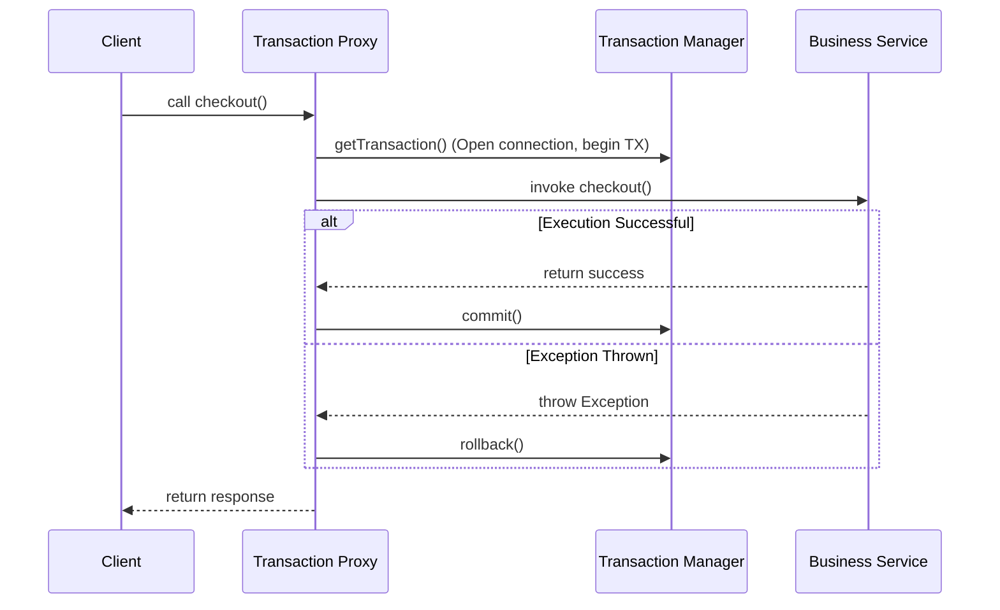

# 3.4.10. Spring Transaction Management and Propagation

> [!info] Orientation
> Managing database transactions manually leads to verbose boilerplate code and risks resource leaks. Spring Boot provides declarative transaction management using the `@Transactional` annotation. This note explores how Spring handles transactions under the hood using AOP proxies, explains transaction propagation and isolation behaviors, and details key transaction rollback rules.

---

## 1. How Declarative Transactions Work (AOP Proxy Wrapping)

When you decorate a class or method with `@Transactional`, Spring does not compile transaction logic directly into your code. Instead, it relies on **Aspect-Oriented Programming (AOP)** to wrap your bean in a dynamic proxy class at runtime.

When an application invokes your transactional method:
1. The proxy intercepts the call.
2. The proxy delegates to a `PlatformTransactionManager` to open a database connection and begin a new transaction.
3. The proxy invokes your actual business logic method.
4. **If your method completes successfully:** The proxy automatically commits the transaction.
5. **If your method throws an exception:** The proxy rolls back the transaction, keeping the database consistent.



---

## 2. Transaction Propagation Behaviors

What happens if an active transactional method invokes *another* transactional method? Spring handles this using **Propagation Behaviors**, which define how transactions are shared or isolated across method calls.

We configure propagation using the propagation property: `@Transactional(propagation = Propagation.REQUIRED)`

### Core Propagation Modes:

* **`REQUIRED` (Default):**
  Join the active transaction if one exists. If no transaction is active, create a new one. This is the standard, safe choice for most business operations.
* **`REQUIRES_NEW`:**
  Always suspend the current transaction and create a brand-new, independent database transaction. The new transaction commits or rolls back independently of the parent transaction.
* **`MANDATORY`:**
  Must run within an active transaction. If no transaction is active, Spring throws an exception immediately. Useful for helper methods that should never execute outside a transaction context.
* **`NEVER`:**
  Must run without an active transaction. If a transaction is active, Spring throws an exception.

---

## 3. The Self-Invocation Gotcha

Because Spring relies on runtime AOP proxies to manage transactions, calling a transactional method from within the same class (Self-Invocation) will bypass the proxy, **meaning the transaction will not start, and your data will be saved with no transaction tracking!**

```java
// ❌ Buggy Code
@Service
public class OrderService {

    public void processOrder(Order order) {
        // Self-invocation of a transactional method!
        // Calling this.saveOrder() directly bypasses the AOP proxy wrapper, 
        // meaning saveOrder runs without starting a transaction!
        saveOrder(order);
    }

    @Transactional
    public void saveOrder(Order order) {
        orderRepository.save(order);
    }
}
```

### How to Resolve Self-Invocation:
1. **Move the Method:** Extract the transactional method into a separate Spring Bean (such as a Repository or helper Service).
2. **Inject the Bean Self-Reference:** Inject the bean into itself lazily (using constructor injection with `@Lazy` or setter injection) and call the method using the injected proxy reference.

---

## 4. Rollback Rules (Checked vs. Unchecked Exceptions)

By default, Spring Boot's transaction manager behaves differently depending on the type of exception thrown:
* **Unchecked Exceptions (RuntimeExceptions & Errors):** Automatically triggers transaction rollback.
* **Checked Exceptions (Exceptions inheriting directly from `java.lang.Exception`):** Does **NOT** trigger rollback. The transaction is committed anyway!

This behavior dates back to early Java design patterns. To ensure your transactions roll back for *all* exceptions, you must explicitly configure the `rollbackFor` property:

```java
//  Optimized Code: Ensures transaction rolls back for both checked and unchecked exceptions!
@Transactional(rollbackFor = Exception.class)
public void processPayment() throws IOException {
    paymentGateway.charge();
    // If an IOException is thrown, the transaction rolls back cleanly!
}
```

---

## Summary

Declarative Transaction Management via `@Transactional` provides clean, reliable database operations. By understanding how AOP proxies intercept calls, selecting the correct propagation boundaries (such as `REQUIRED` vs `REQUIRES_NEW`), resolving the internal self-invocation gotcha, and configuring `rollbackFor` properties, developers can keep their production data consistent and secure.

## See Also

- [[3.4.1. Spring Boot Overview and Starters]]
- [[3.4.2. SpringBoot IoC and Core Internals]]
- [[3.4.4. Spring Aspect-Oriented Programming AOP]]
- [[3.4.9. Spring Data JPA Advanced Queries and Performance]]
