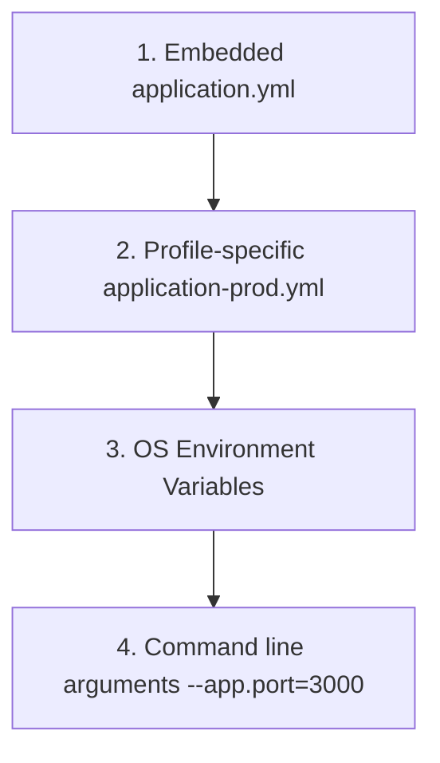

# 3.4.12. Spring Profiles and Configuration Management

> [!info] Orientation
> A robust backend application must remain adaptable across diverse execution environments (local development, QA testing, staging, and production). Spring Boot provides powerful configuration management utilities that decouple settings from code. This note details configuration loading orders, dynamic environment injection, and Spring Profiles architecture.

---

## 1. Properties vs. YAML and the Loading Hierarchy

Spring Boot supports two standard file formats for externalizing configurations:
1. **Properties files (`application.properties`):** Flat, key-value configurations (e.g., `app.mail.enabled=true`).
2. **YAML files (`application.yml`):** Hierarchical, structured configurations (preferred for readability and nested properties).

Spring Boot loads configurations from multiple sources sequentially. Each source overrides values from previous ones in the loading hierarchy:



This loading order lets you package safe default configurations inside your jar file while allowing container engines to override secrets (like database passwords) at runtime using standard environment variables.

---

## 2. Spring Profiles Architecture

Spring Profiles let you isolate parts of your application configuration and make them available only in specific environments.

### Declaring Profile-Specific Files
You can define separate configuration files using the naming convention `application-{profile}.yml`:
* `application-dev.yml` (e.g., pointing to local SQLite or H2 databases)
* `application-prod.yml` (e.g., pointing to production PostgreSQL clusters with connection pooling enabled)

To activate a specific profile, set the active profile environment variable:

```bash
java -jar my-app.jar --spring.profiles.active=prod
```

### Scoping Beans via `@Profile`
You can also restrict bean registration to specific active profiles using the `@Profile` annotation:

```java
@Configuration
public class DatabaseConfiguration {

    @Bean
    @Profile("dev")
    public DataSource localDataSource() {
        return new EmbeddedDatabaseBuilder().setType(EmbeddedDatabaseType.H2).build();
    }

    @Bean
    @Profile("prod")
    public DataSource productionDataSource() {
        HikariDataSource dataSource = new HikariDataSource();
        dataSource.setJdbcUrl(System.getenv("DB_URL"));
        return dataSource;
    }
}
```

---

## 3. Configuration Values Injection (`@Value` vs. `@ConfigurationProperties`)

Spring Boot provides two core methods to read configuration properties into your classes:

### Option A: The `@Value` Annotation (For Simple Settings)
Use `@Value` to inject individual properties directly into fields:

```java
@Component
public class TokenProvider {

    // Read property 'app.jwt.secret'. If missing, fallback to the default 'devSecretKey'
    @Value("${app.jwt.secret:devSecretKey}")
    private String jwtSecret;
}
```

### Option B: `@ConfigurationProperties` (Type-safe Grouping - Recommended)
For complex, nested configurations, group related properties into a type-safe POJO class. This supports nested objects, lists, map lookups, and validation checks:

```java
@Configuration
@ConfigurationProperties(prefix = "app.security")
@Validated // Enforce validation rules on application startup!
public class SecurityProperties {

    @NotNull
    private String tokenSecret;
    
    @Min(3600)
    private long tokenExpirationSeconds;
    
    private List<String> allowedOrigins = new ArrayList<>();

    // Standard Getters and Setters...
}
```

To enable this type-safe configuration binding, add the `@EnableConfigurationProperties` annotation to your main application class:

```java
@SpringBootApplication
@EnableConfigurationProperties(SecurityProperties.class)
public class Application { ... }
```

---

## Summary

Decoupling environment variables and credentials from code is essential for securing modern software deployments. By organizing configuration states inside environment-specific profiles (`application-{profile}.yml`), binding runtime properties dynamically to type-safe, JSR-380 validated POJO configurations using `@ConfigurationProperties`, and leveraging Spring's profile-scoping system, developers can run identical compiled artifacts across development, test, and production environments with ease.

## See Also

- [[3.4.1. Spring Boot Overview and Starters]]
- [[3.4.2. SpringBoot IoC and Core Internals]]
- [[3.4.7. Spring Boot Auto-Configuration Mechanics]]
- [[3.4.11. Spring Boot Integration Testing with SpringBootTest]]
