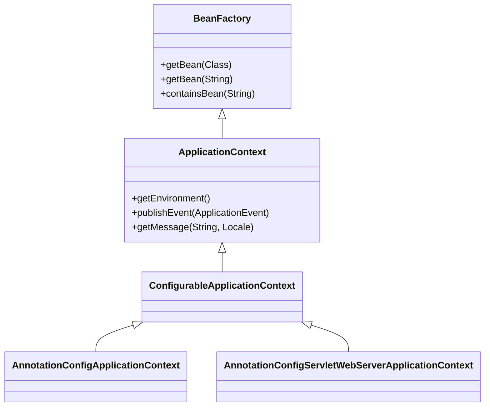
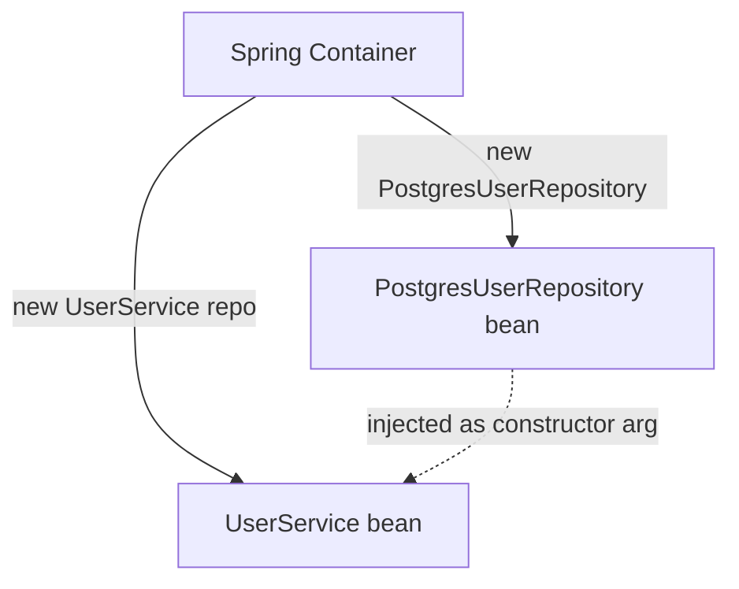
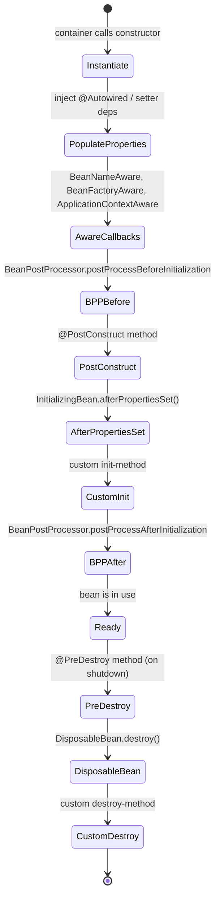
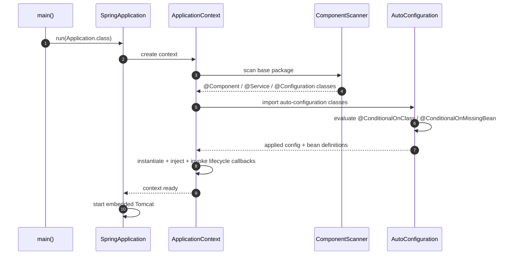

# 3.4.2. SpringBoot IoC and Core Internals

> [!info] Spring's inversion-of-control container is the engine that makes everything else in the framework possible.
> This note expands the Article 3 draft into a full treatment of the IoC principle, the three DI styles, the `BeanFactory` / `ApplicationContext` hierarchy, the bean lifecycle, scopes, stereotype annotations, qualifiers, profiles, AOP, and the auto-configuration mechanism that distinguishes Spring Boot from raw Spring.

## 1. Inversion of Control and the Hollywood Principle

Inversion of Control (IoC) is a design principle, not a framework feature. The principle states that a class should not actively fetch its dependencies; instead, an external container should *push* dependencies into the class at the appropriate moment. The Hollywood Principle — "Don't call us, we'll call you" — is the canonical one-line summary: your code does not call the framework to obtain collaborators; the framework calls your code (constructor, setter, method) when those collaborators are needed.

Consider the contrast. Without IoC, a service class instantiates its own repository:

```java
// Tight coupling — the service knows the concrete repository type.
public class UserService {
    private final UserRepository repository = new PostgresUserRepository();
    public User findUser(Long id) { return repository.findById(id); }
}
```

The consequence of this code is that switching from Postgres to MongoDB requires editing `UserService`, recompiling, and re-testing — even though the only thing that changed was the persistence technology. With IoC, the service declares what it needs and lets the framework supply it:

```java
// Loose coupling — the service depends on an interface.
@Service
public class UserService {
    private final UserRepository repository;
    public UserService(UserRepository repository) {
        this.repository = repository;       // injected by the container
    }
    public User findUser(Long id) { return repository.findById(id); }
}
```

The container — Spring's `ApplicationContext` — instantiates `PostgresUserRepository`, instantiates `UserService`, and wires them together. The service knows nothing about the concrete class. This is the central value proposition of Spring: it removes the `new` keyword from application code, replacing it with declarative dependency declaration that the framework satisfies.

## 2. The IoC Container: BeanFactory and ApplicationContext

Spring's IoC container is represented by two interfaces in the `org.springframework.context` and `org.springframework.beans.factory` packages. The `BeanFactory` interface is the most basic container: it can instantiate beans, manage their lifecycle, and resolve dependencies. The `ApplicationContext` interface extends `BeanFactory` and adds enterprise features — internationalisation, event publication, resource loading, integration with AOP, and lifecycle callbacks for web applications.

In practice, every Spring Boot application uses an `ApplicationContext` — specifically a `AnnotationConfigServletWebServerApplicationContext` for web applications. You almost never write code against the `BeanFactory` interface directly; the only time you encounter it is in framework internals or in test utilities that want a stripped-down container. The diagram below shows the inheritance.



The container's job is to hold *bean definitions* (metadata that describes how to construct a bean — its class, constructor arguments, properties, init/destroy methods) and *singleton instances* (the actual objects, for singleton-scoped beans). When you annotate a class with `@Service`, the container registers a bean definition with that class. When you ask the container for that bean — directly via `getBean()`, or indirectly by declaring it as a constructor parameter of another bean — the container instantiates the class, resolves its dependencies recursively, and returns the ready-to-use instance.

## 3. Dependency Injection Mechanisms

Spring supports three styles of dependency injection. They are functionally equivalent in trivial cases but diverge sharply in testability, immutability, and clarity.

### 3.1 Field Injection (Discouraged)

```java
@Service
public class UserService {
    @Autowired
    private UserRepository repository;
}
```

Field injection is the shortest form and the easiest to write. It is also the worst choice. Fields cannot be `final`, so the bean is mutable. The class cannot be instantiated without the Spring container — you cannot write `new UserService()` in a unit test and supply a mock repository, because the field is private and there is no constructor or setter through which to inject it. The Spring team officially discourages field injection, and most enterprise style guides ban it outright.

### 3.2 Setter Injection

```java
@Service
public class UserService {
    private UserRepository repository;

    @Autowired
    public void setRepository(UserRepository repository) {
        this.repository = repository;
    }
}
```

Setter injection makes the dependency optional and reconfigurable, which is occasionally useful (e.g. for `@ConditionalOnMissingBean` defaults that an application can override). It shares the immutability problem with field injection — the field cannot be `final` — and it adds a setter that callers in production never invoke. The main legitimate use case is for optional dependencies on legacy beans; for everything else, prefer constructor injection.

### 3.3 Constructor Injection (Recommended)

```java
@Service
public class UserService {
    private final UserRepository repository;

    public UserService(UserRepository repository) {
        this.repository = repository;
    }
}
```

Constructor injection is the recommended style. Since Spring 4.3, the `@Autowired` annotation is optional when a class has a single constructor, so the code above is already complete. The field is `final`, which guarantees immutability: once a `UserService` is constructed, its repository cannot be replaced. The class can be instantiated directly in a unit test with `new UserService(mockRepository)`, no Spring container required — this is the property that makes constructor injection the only choice for testable code.



The flow above is what happens internally when the container creates the `UserService` bean: it inspects the constructor, sees a parameter of type `UserRepository`, looks up (or creates) the matching bean, and passes it to the constructor. If `UserRepository` itself has dependencies, the same process recurses until the entire graph is materialised. If a dependency is missing or circular, the container fails fast at startup with a `BeanCreationException` — the "fail fast at boot" property that makes Spring applications reliable in production.

## 4. Bean Lifecycle

The bean lifecycle is the sequence of events the container triggers between instantiating a bean and destroying it. Understanding the lifecycle is essential for writing `BeanPostProcessor` extensions, `@PostConstruct` hooks, and `@PreDestroy` cleanup. The full sequence is:



The most commonly used hooks are `@PostConstruct` (run once after dependencies are injected; use it to open connections, warm caches, validate config) and `@PreDestroy` (run once before the bean is discarded; use it to close connections, flush buffers, release file handles). The `BeanPostProcessor` extension points are how Spring implements many of its own features: `@Autowired` is processed by `AutowiredAnnotationBeanPostProcessor`, AOP proxies are applied by `AnnotationAwareAspectJAutoProxyCreator`, and `@Scheduled` is wired by `ScheduledAnnotationBeanPostProcessor`. Each of these is a `BeanPostProcessor` that wraps or replaces the bean during `postProcessAfterInitialization`.

## 5. Bean Scopes

A bean's scope controls how often the container creates a new instance. The default scope is **singleton**: one instance per container, shared by every bean that depends on it. The other scopes are:

| Scope | Meaning |
| ----- | ------- |
| `singleton` (default) | One instance per container. Stateless services, repositories, configurations. |
| `prototype` | New instance every time the bean is requested. Stateful, short-lived objects. |
| `request` | One instance per HTTP request. Web-only. |
| `session` | One instance per HTTP session. Web-only. |
| `application` | One instance per `ServletContext`. Web-only. |
| `websocket` | One instance per WebSocket session. Web-only. |

You select a scope with `@Scope("prototype")` on the class or `@Bean` method. A common gotcha: injecting a prototype bean into a singleton bean does *not* give the singleton a fresh prototype per call — the injection happens once, at construction time. To get a fresh prototype each time, use `ObjectFactory<MyPrototype>` or `@Lookup`-annotated method injection, both of which defer the lookup to call time.

## 6. Stereotype Annotations

Spring provides a family of stereotype annotations that mark a class as a container-managed bean. They are functionally identical — all are meta-annotated with `@Component` — but they carry semantic meaning for tooling, AOP pointcuts, and exception translation.

| Annotation | Semantic role | Special behaviour |
| ---------- | -------------- | ------------------ |
| `@Component` | Generic bean | None |
| `@Service` | Business logic | None |
| `@Repository` | Data access | Auto-translates persistence exceptions to Spring's `DataAccessException` hierarchy |
| `@Controller` | Web MVC controller | Registered by `RequestMappingHandlerMapping` |
| `@RestController` | REST controller | `@Controller` + `@ResponseBody` on every handler |
| `@Configuration` | Bean definition source | Processed by CGLIB to allow inter-bean method calls in `@Bean` methods |

Using the right annotation is not just cosmetic. A class annotated `@Repository` gets its `SQLException` auto-translated to a `DataAccessException`; the same class annotated `@Component` would not. A class annotated `@Controller` is registered as a request handler; the same class annotated `@Component` would not. Picking the right stereotype is the difference between a bean that does what you expect and a bean that mysteriously does nothing.

## 7. Qualifiers, Primary, and Profiles

When the container has multiple beans of the same type, it cannot decide which one to inject by type alone. Three annotations resolve the ambiguity.

**`@Qualifier`** names the bean to inject. If you have two `PaymentGateway` implementations — `StripeGateway` and `PaypalGateway` — you inject the right one with:

```java
@Service
public class CheckoutService {
    public CheckoutService(
        @Qualifier("stripeGateway") PaymentGateway gateway
    ) { ... }
}
```

**`@Primary`** marks a bean as the default when multiple candidates exist. If `StripeGateway` is annotated `@Primary`, then any injection point that does not specify a qualifier gets `StripeGateway` automatically. This is convenient when one implementation is the production default and others are tests or alternatives.

**`@Profile`** restricts a bean to specific runtime profiles. A bean annotated `@Profile("dev")` is only created when the `dev` profile is active. This is the standard mechanism for swapping implementations between environments — an in-memory `H2DataSource` for `dev`, a real `PostgresDataSource` for `prod`:

```java
@Configuration
public class DataSourceConfig {
    @Bean @Profile("dev")
    public DataSource h2() { return new H2DataSource(...); }

    @Bean @Profile("prod")
    public DataSource postgres() { return new PostgresDataSource(...); }
}
```

## 8. AOP — Aspect-Oriented Programming

AOP lets you factor cross-cutting concerns (transactions, logging, security, caching, retries) out of business code. An **aspect** is a module of cross-cutting logic; a **pointcut** is an expression that matches join points (typically method executions); an **advice** is the code that runs at matched join points (`@Before`, `@After`, `@AfterReturning`, `@AfterThrowing`, `@Around`).

The classic example is `@Transactional`. When you annotate a service method with `@Transactional`, Spring's `TransactionInterceptor` (an around-advice) wraps the method: it opens a transaction before the call, commits on normal return, and rolls back on a runtime exception. The business method contains no transaction code — the aspect handles it.

```java
@Service
public class TransferService {
    @Transactional
    public void transfer(Long from, Long to, BigDecimal amount) {
        // ... business logic, no transaction plumbing ...
    }
}
```

Internally, Spring AOP is **proxy-based**: at bean creation time, the container wraps the target bean in a JDK dynamic proxy (or a CGLIB subclass proxy) that intercepts method calls and dispatches to the advice chain. This means AOP only works on *public methods called from outside the bean* — internal `this.method()` calls bypass the proxy and skip the advice. This is the most common AOP gotcha in Spring, and the root cause of "why is my `@Transactional` not working" Stack Overflow questions.

## 9. Auto-Configuration Mechanics

Spring Boot's auto-configuration is the mechanism that wires up sensible defaults based on your classpath. The entry point is `@EnableAutoConfiguration`, which triggers a `@Conditional`-driven import of configuration classes listed in `META-INF/spring/org.springframework.boot.autoconfigure.AutoConfiguration.imports` (Spring Boot 3.x; in 2.x this was `META-INF/spring.factories`).

Each auto-configuration class is a regular `@Configuration` class guarded by `@Conditional*` annotations:

- `@ConditionalOnClass(DataSource.class)` — only apply if the class is on the classpath.
- `@ConditionalOnMissingBean(DataSource.class)` — only apply if the user has not already defined one.
- `@ConditionalOnProperty("spring.datasource.url")` — only apply if a property is set.
- `@ConditionalOnWebApplication` — only apply if the application is a web application.

The combination is what makes auto-configuration *non-invasive*: it configures only what you have not configured yourself. If you define your own `DataSource` bean, the auto-configuration backs off and lets yours win. This is the "convention over configuration, but configuration wins" property that distinguishes Spring Boot from opinionated frameworks that lock you in.



The sequence above is what happens when you run `SpringApplication.run()`. Component scanning discovers your code; auto-configuration discovers framework code; both feed bean definitions into the same `ApplicationContext`; the container instantiates, injects, and lifecycle-manages them together. The result is a running application whose every dependency is explicit in code and whose wiring is reproducible from source.

## Summary

Spring's IoC container is the engine that materialises the application's object graph at startup, resolves dependencies, and manages the bean lifecycle through a well-defined sequence of instantiation, injection, aware callbacks, `BeanPostProcessor` hooks, and init/destroy methods. Constructor injection is the recommended DI style because it makes beans immutable and testable. Stereotype annotations (`@Service`, `@Repository`, `@Controller`) carry semantic meaning that affects exception translation and request-handler registration. `@Qualifier`, `@Primary`, and `@Profile` disambiguate and environment-scope beans. AOP — proxy-based in Spring — factors cross-cutting concerns like `@Transactional` out of business code. Auto-configuration, guarded by `@Conditional*` annotations, wires sensible defaults that the application can always override.

## See Also

- [[3.4.1. Spring Boot Overview and Starters]]
- [[3.5.2. Laravel Service Container and Eloquent]]
- [[3.3.1. Django Overview and MVT Pattern]]
- [[4.1. ORM Fundamentals]]

## References

- Spring team, "The IoC Container", https://docs.spring.io/spring-framework/reference/core/beans.html
- Spring team, "Core Technologies — AOP", https://docs.spring.io/spring-framework/reference/core/aop.html
- Spring team, "Auto-configuration", https://docs.spring.io/spring-boot/docs/current/reference/html/using.html#using.auto-configuration
- Walls, C., *Spring in Action*, 6th ed., Manning.
