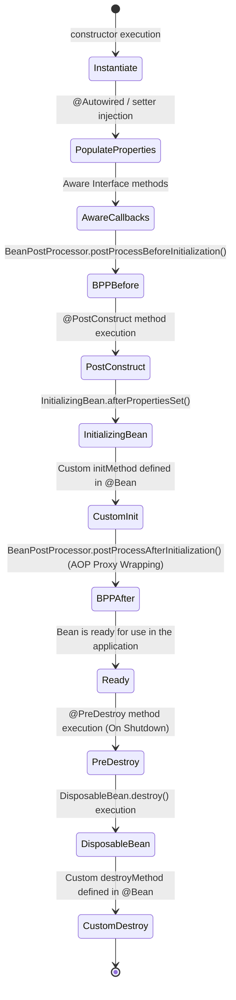

# 3.4.3. Spring Bean Lifecycle and Scopes

> [!info] The Spring Container manages the complete lifecycle and scoping of the objects (Beans) it instantiates.
> This note explains the bean scopes, details the bean lifecycle from constructor execution to garbage collection, and solves the prototype-into-singleton injection problem using Scoped Proxies and `ObjectFactory`.

---

## 1. Bean Scopes: Object Lifetime Modes

A bean's scope controls how often the container creates a new instance of that bean. Choosing the correct scope is critical for memory optimization and thread safety.

```mermaid
mindmap
  root((Spring Bean Scopes))
    Standard Scopes
      singleton (default) - shared container-wide
      prototype - new instance per resolution
    Web Scopes (Web-Only)
      request - unique per HTTP request
      session - unique per HTTP session
      application - unique per ServletContext
      websocket - unique per socket session
    Dynamic Resolution
      Scoped Proxies
      ObjectFactory
      @Lookup method injection
```

Spring provides six core bean scopes:

| Scope | Context | Thread Safety | Primary Use Case |
| :--- | :--- | :--- | :--- |
| **`singleton`** (Default) | One instance per container. | Must be stateless or thread-safe. | Controllers, Services, Repositories, Configurations. |
| **`prototype`** | A new instance is created every time the bean is requested (via `getBean()` or injection). | Thread-safe (since callers get unique instances). | Stateful task runners, dynamic data builders. |
| **`request`** (Web-Only) | One instance per single HTTP request. | Thread-safe. | Request audits, geo-location context tracking. |
| **`session`** (Web-Only) | One instance per HTTP session. | Thread-safe. | User shopping carts, user session preferences. |
| **`application`** (Web-Only)| One instance per `ServletContext` lifespan. | Must be thread-safe. | Application-wide shared configurations. |
| **`websocket`** (Web-Only) | One instance per WebSocket session. | Thread-safe. | Live message feeds, active chat buffers. |

To apply a scope, use the `@Scope` annotation on your class or `@Bean` declaration:

```java
@Component
@Scope("prototype")
public class StatefulTaskRunner {
    // A fresh instance is generated on every injection point
}
```

---

## 2. The Scope Injection Problem and Solutions

A common architectural bug in Spring is **injecting a shorter-lived bean (like a prototype) into a longer-lived bean (like a singleton)**.

Because a singleton is instantiated only once during application startup, its constructor is executed and its dependencies are resolved only *once*. If you inject a prototype bean into a singleton, the singleton retains the *same* prototype instance forever. The prototype is effectively downgraded to a singleton, defeating its purpose.

```java
// ❌ INCORRECT (The prototype bean behaves like a singleton!)
@Component
@Scope("singleton") // Default
public class OrderService {
    @Autowired
    private StatefulTaskRunner taskRunner; // Injected ONCE at startup!

    public void process() {
        // Uses the SAME taskRunner instance on every call!
        taskRunner.execute();
    }
}
```

To solve this scope mismatch, you must instruct Spring to resolve the prototype bean dynamically at call-time.

### Solution A: Scoped Proxies (Recommended)
You can declare the prototype bean with a **Scoped Proxy**. Spring injects an invisible AOP proxy instead of the real bean. When the singleton calls a method on this proxy, the proxy intercepts the call and resolves a fresh, new target instance from the container:

```java
@Component
@Scope(value = "prototype", proxyMode = ScopedProxyMode.TARGET_CLASS)
public class StatefulTaskRunner {
    ...
}
```

### Solution B: `ObjectFactory<T>`
`ObjectFactory` acts as a lazy container lookup wrapper. Instead of receiving the bean instance directly, you retrieve the factory and call `getObject()` at the exact moment you need the dependency:

```java
// ✅ CORRECT (Resolves a fresh prototype on every method call)
@Component
public class OrderService {
    @Autowired
    private ObjectFactory<StatefulTaskRunner> taskRunnerFactory;

    public void process() {
        // Spawns a fresh prototype instance here
        StatefulTaskRunner runner = taskRunnerFactory.getObject();
        runner.execute();
    }
}
```

---

## 3. The Complete Bean Lifecycle Sequence

Understanding the bean lifecycle is essential for writing initialization routines, configuration validators, thread pool warm-ups, and graceful shutdown cleanups.



### 3.1 Step-by-Step Breakdown

1. **Instantiation:** The container reads bean definitions, invokes the class constructor, and instantiates the raw object.
2. **Populate Properties:** The container resolves dependencies and injects them into fields annotated with `@Autowired` or passed via setters.
3. **Aware Callbacks:** If the bean implements any `Aware` interfaces, Spring executes their callback methods to expose container properties:
   * `BeanNameAware`: Exposes the bean's registered name.
   * `BeanFactoryAware`: Exposes the enclosing `BeanFactory`.
   * `ApplicationContextAware`: Exposes the enclosing `ApplicationContext` environment.
4. **`BeanPostProcessor` (Before Init):** Spring passes the raw bean through all registered `BeanPostProcessor` implementations, invoking their `postProcessBeforeInitialization()` methods.
5. **Initialization Hooks:** The container triggers initialization routines in a strict sequence:
   * **`@PostConstruct`** annotated methods.
   * **`InitializingBean.afterPropertiesSet()`** methods.
   * **Custom `initMethod`** declarations (e.g., `@Bean(initMethod = "start")`).
6. **`BeanPostProcessor` (After Init):** Spring executes `postProcessAfterInitialization()`. **This is where AOP proxy generation occurs.** If a bean has transactional (`@Transactional`) or asynchronous (`@Async`) attributes, Spring wraps the raw bean in a dynamic proxy class and returns the proxy instead of the raw instance.
7. **Bean Ready:** The bean is wired, proxied, and ready to receive calls in the application context.
8. **Destruction Hooks:** When the JVM process receives a `SIGTERM` signal, the application context triggers destruction routines in this order:
   * **`@PreDestroy`** annotated methods.
   * **`DisposableBean.destroy()`** methods.
   * **Custom `destroyMethod`** declarations (e.g., `@Bean(destroyMethod = "stop")`).

---

## 4. Summary

Spring manages Bean lifetimes using distinct scopes (singleton, prototype, and web-specific scopes like request/session). Mismatched scopes, such as injecting short-lived prototype beans into long-lived singletons, can be resolved using Scoped Proxies or the `ObjectFactory` pattern to ensure dependencies are resolved dynamically. The core lifecycle sequence coordinates instantiation, aware callbacks, and initialization hooks, with AOP proxy wrapping executing during the post-initialization phase to apply transactional and logging behaviors.

---

## See Also

- [[3.4.1. Spring Boot Overview and Starters]]
- [[3.4.2. SpringBoot IoC and Core Internals]]
- [[3.4.4. Spring Aspect-Oriented Programming AOP]]
- [[3.5.3. Laravel Service Container and Service Providers]]
