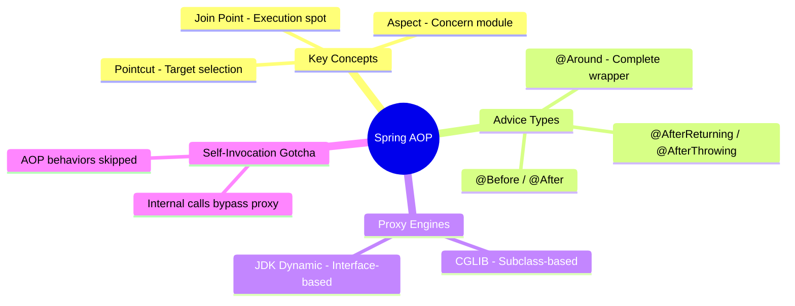
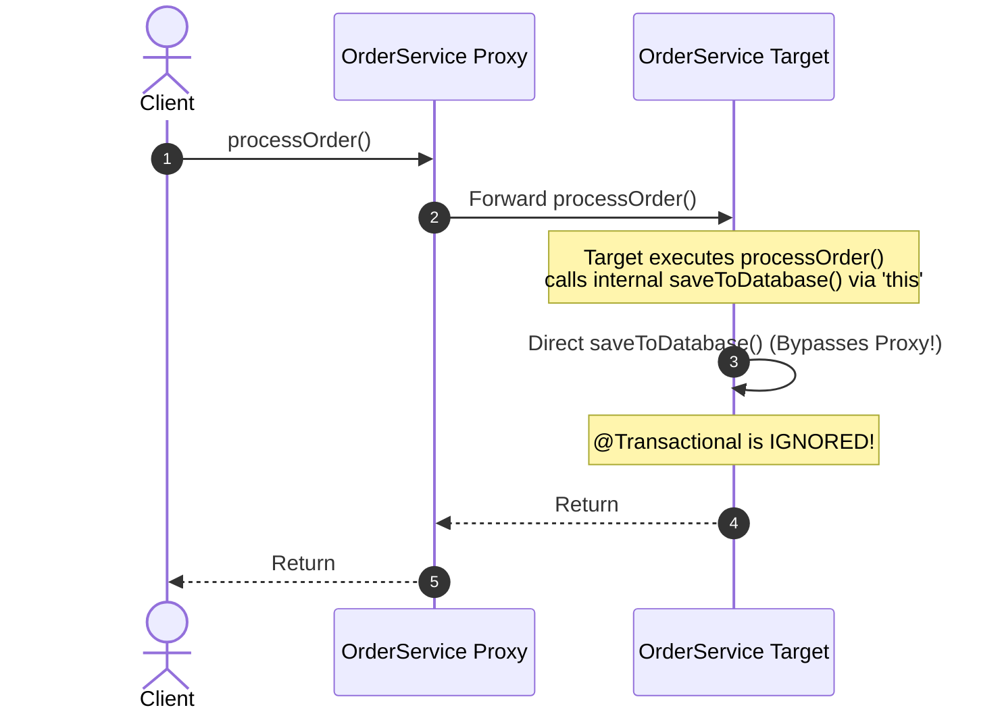

# 3.4.4. Spring Aspect-Oriented Programming AOP

> [!info] Aspect-Oriented Programming (AOP) decouples cross-cutting concerns (transactions, logging, caching, auditing, and security) from primary business logic.
> This note analyzes core AOP definitions, demonstrates writing custom aspects using AspectJ expressions, compares JDK Dynamic and CGLIB proxies, and details the self-invocation gotcha.

---

## 1. Core Concepts and AOP Definitions

In a standard application, certain behaviors apply across multiple layers (cross-cutting concerns). Writing transaction management, logging, or security audits inside every service method results in code duplication and tight coupling.

AOP solves this by allowing developers to define these concerns in modular classes called **Aspects**.



### 1.1 Five Core Definitions:
* **Aspect:** A modular class that gathers cross-cutting logic (e.g., `LoggingAspect`).
* **Join Point:** A specific point during application execution where an Aspect can be applied (such as method execution or exception throwing). In Spring AOP, a Join Point always represents a **method execution**.
* **Pointcut:** An expression that matches specific Join Points. It determines *where* the advice code will execute.
* **Advice:** The action taken by an Aspect at a particular Join Point. It is the code that runs (e.g., executing a database write before or after a method runs).
* **Target Object:** The business service bean being advised by the Aspect.

---

## 2. Pointcut Expressions & Advice Types

Spring uses **AspectJ pointcut expression syntax** to select target methods.

### 2.1 The Pointcut Expression Structure:

```java
// Matches: public methods in com.example.service package ending in "Service" with any parameters
execution(public * com.example.service.*Service.*(..))
```

### 2.2 Writing a Custom Aspect with Advice Types

Spring provides five types of Advice, allowing you to intercept method execution at different points:

| Advice | Execution Timing | Use Case |
| :--- | :--- | :--- |
| **`@Before`** | Before the target method execution begins. | Security checking, validation audits. |
| **`@After`** | After the method completes, regardless of the outcome (success or error). | Resource cleanup, closing file streams. |
| **`@AfterReturning`** | Only after the method successfully returns a value without throwing an exception. | Result logging, caching output values. |
| **`@AfterThrowing`** | Only if the method raises an unhandled exception. | Translating exceptions, triggering alerts. |
| **`@Around`** | Wraps the target method completely. It can inspect arguments, skip execution, or modify the return value. | Performance profiling, declarative transactions. |

#### Example Aspect: Performance Logging

```java
package com.example.aspect;

import org.aspectj.lang.ProceedingJoinPoint;
import org.aspectj.lang.annotation.Around;
import org.aspectj.lang.annotation.Aspect;
import org.springframework.stereotype.Component;
import lombok.extern.slf4j.Slf4j;

@Aspect
@Component
@Slf4j
public class PerformanceAspect {

    // Around advice intercepts execution. It receives ProceedingJoinPoint to invoke the method.
    @Around("execution(* com.example.service.*.*(..))")
    public Object profileMethodExecution(ProceedingJoinPoint joinPoint) throws Throwable {
        long startTime = System.currentTimeMillis();
        
        try {
            // Forward execution to the actual target method
            Object result = joinPoint.proceed();
            return result;
        } finally {
            long executionTime = System.currentTimeMillis() - startTime;
            log.info("Method: {} executed in {} ms", joinPoint.getSignature().toShortString(), executionTime);
        }
    }
}
```

---

## 3. Dynamic Proxies: JDK vs CGLIB

Spring AOP is entirely **proxy-based**. When the container instantiates a bean that matches an Aspect pointcut, Spring does not return the raw bean to the application. Instead, it generates a proxy that wraps the target bean, intercepting all external method calls to execute the Advice chain before calling the target.

Spring uses two different proxy technologies depending on the structure of the target bean:

### 3.1 JDK Dynamic Proxies (Interface-Based)
* **Rule:** Used if the target class implements at least one interface.
* **Under the Hood:** Creates a dynamic class in memory that implements the target interfaces. It delegates execution calls to an `InvocationHandler`.
* **Limitation:** Can only proxy methods defined on the implemented interfaces.

### 3.2 CGLIB Proxies (Subclass-Based)
* **Rule:** Used if the target class does not implement any interfaces (or if explicitly configured to force CGLIB).
* **Under the Hood:** Uses byte-code modification to generate a subclass of the target class at runtime, overriding its public methods to execute the advice.
* **Limitation:** Cannot proxy classes declared as `final` or methods declared as `final` or `private` (since subclassing cannot override them).

Since Spring Boot 2.x, **CGLIB is used by default** for all Spring Beans to prevent ClassCastExceptions when developers attempt to inject concrete classes instead of interfaces.

---

## 4. The Self-Invocation Gotcha

The single most common bug when working with AOP (including `@Transactional` and `@Async` behaviors) is **Self-Invocation**.

Because AOP is proxy-based, the advice logic executes only when a method call **passes through the outer proxy object**. If a method inside a bean calls another method on the *same* bean using `this.method()`, the call bypasses the proxy, and the advice (such as transaction management) is skipped.

```java
@Service
public class OrderService {

    public void processOrder() {
        // ... business checks ...
        
        // ❌ BUG: Self-invocation! This call bypasses the AOP proxy.
        // The @Transactional annotation is ignored, and no transaction is opened!
        saveToDatabase(); 
    }

    @Transactional
    public void saveToDatabase() {
        // Database operations...
    }
}
```



### How to Solve Self-Invocation:

1. **Refactor Code (Best Practice):** Move the advised method to a separate helper bean so that calls pass through its proxy. This maintains clean class boundaries and separates concerns.
2. **Inject the Proxy Dynamically (Self-Injection):** You can inject a lazy reference to the bean itself. Spring resolves the proxy at runtime, ensuring that calls pass through the advice chain:

```java
@Service
public class OrderService {

    @Autowired
    @Lazy // Lazy prevents circular dependency exceptions at startup
    private OrderService self;

    public void processOrder() {
        // ... business checks ...
        
        // ✅ CORRECT: Call passes through 'self' (the proxy wrapper)
        self.saveToDatabase(); 
    }

    @Transactional
    public void saveToDatabase() {
        // Runs within an active database transaction!
    }
}
```

---

## 5. Summary

Aspect-Oriented Programming (AOP) isolates cross-cutting concerns like logging or transaction management into modular classes called Aspects. Pointcuts match targeted methods using AspectJ syntax, and advices execute logic at different stages of method execution. Spring applies AOP using runtime proxies generated via JDK Dynamic or CGLIB mechanisms. Developers must understand that internal self-invocations bypass these proxies, requiring refactoring or self-injection to apply AOP behaviors consistently.

---

## See Also

- [[3.4.1. Spring Boot Overview and Starters]]
- [[3.4.2. SpringBoot IoC and Core Internals]]
- [[3.4.3. Spring Bean Lifecycle and Scopes]]
- [[3.4.6. Spring Data JPA and Hibernate]]
