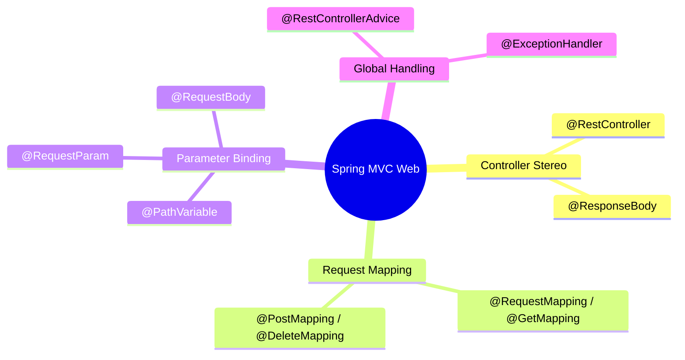
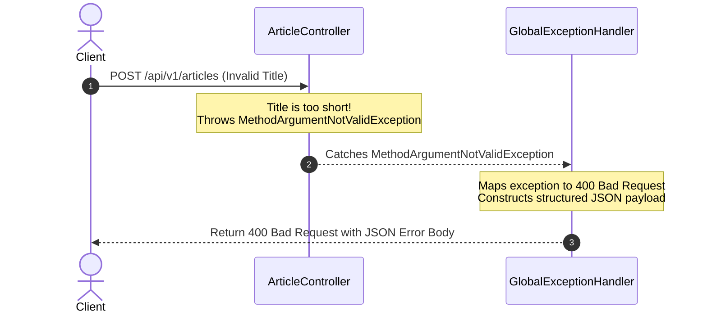

# 3.4.5. Spring Boot MVC Web Layer and Global Exception Handling

> [!info] The MVC (Model-View-Controller) web layer of Spring Boot manages request routing, payload deserialization, and HTTP response rendering.
> This note explains the core Spring MVC controller annotations, maps path and query arguments, and demonstrates unified API error handling using Controller Advices.

---

## 1. The Controller Architecture

The web layer of a Spring Boot application is powered by **Spring MVC** (Model-View-Controller). While traditional MVC models returned server-rendered HTML views, modern web APIs return raw data payloads (JSON) directly to clients.

Spring Boot streamlines API development using the `@RestController` stereotype. This annotation combines `@Controller` (marking the class as a routing target) and `@ResponseBody` (instructing Spring to serialize return values directly into JSON using the Jackson library).



---

## 2. Request Mapping and Argument Binding

Spring controllers use annotations to map incoming HTTP request details (paths, query parameters, payloads) to method arguments.

```java
package com.example.controller;

import org.springframework.http.HttpStatus;
import org.springframework.http.ResponseEntity;
import org.springframework.validation.annotation.Validated;
import org.springframework.web.bind.annotation.*;
import jakarta.validation.Valid;
import java.util.List;

@RestController
@RequestMapping("/api/v1/articles") // Common path prefix for all handlers in this class
@Validated
public class ArticleController {

    // 1. GET /api/v1/articles?status=published (Query Parameters)
    @GetMapping
    public List<ArticleDto> getArticles(@RequestParam(value = "status", defaultValue = "published") String status) {
        return List.of(new ArticleDto("Java AOP", status));
    }

    // 2. GET /api/v1/articles/42 (Path Variable)
    @GetMapping("/{id}")
    public ResponseEntity<ArticleDto> getArticleById(@PathVariable("id") Long id) {
        ArticleDto article = new ArticleDto("Java IoC", "published");
        return ResponseEntity.ok(article); // Wraps body and HTTP status explicitly
    }

    // 3. POST /api/v1/articles (Request Body and Validation)
    @PostMapping
    public ResponseEntity<ArticleDto> createArticle(@Valid @RequestBody ArticleDto dto) {
        // @Valid triggers bean validation rules declared on the DTO class
        return new ResponseEntity<>(dto, HttpStatus.CREATED);
    }
}
```

### 2.1 Parameter Binding Types:
* **`@PathVariable`:** Extracts values directly from the request URI path (e.g., mapping `/articles/{id}` to a method argument).
* **`@RequestParam`:** Extracts query string parameters (e.g., `?status=published`). Supports default values and optional flags.
* **`@RequestBody`:** Instructs Spring to read the raw HTTP request body, deserialize the JSON payload, and instantiate a typed Java Object (usually a DTO) using Jackson.
* **`@Valid`:** Triggers the Bean Validation framework (Hibernate Validator) to enforce validation constraints declared on the target class (such as `@NotNull`, `@Size`, or `@Email`).

---

## 3. Global Exception Handling: The Unified REST Controller Advice

In a professional web API, you must prevent the application server from leaking raw Java stack traces (like `NullPointerException` or `JDBCConnectionException`) to clients on error. Stack leaks are a security vulnerability that expose internal architectural details.

Instead, all exceptions should be caught and returned as clean, structured, and consistent JSON error payloads.

Spring MVC solves this globally using **`@RestControllerAdvice`**. This interceptor class catches exceptions thrown by any controller method in the application and transforms them into standard HTTP responses.



### 3.1 Implementation of a Global Exception Handler

First, we define a standard JSON error payload class:

```java
package com.example.exception;

import java.time.LocalDateTime;
import java.util.List;
import lombok.Value;

@Value // Lombok immutable value class
public class ApiErrorResponse {
    String message;
    int status;
    LocalDateTime timestamp;
    List<String> errors; // Detail error lists, e.g., validation messages
}
```

Next, we create the `@RestControllerAdvice` class:

```java
package com.example.exception;

import org.springframework.http.HttpStatus;
import org.springframework.http.ResponseEntity;
import org.springframework.web.bind.MethodArgumentNotValidException;
import org.springframework.web.bind.annotation.ExceptionHandler;
import org.springframework.web.bind.annotation.RestControllerAdvice;
import java.time.LocalDateTime;
import java.util.List;
import java.util.stream.Collectors;

@RestControllerAdvice
public class GlobalExceptionHandler {

    // 1. Handle Validation Failures (HTTP 400)
    @ExceptionHandler(MethodArgumentNotValidException.class)
    public ResponseEntity<ApiErrorResponse> handleValidationErrors(MethodArgumentNotValidException ex) {
        List<String> errors = ex.getBindingResult()
            .getFieldErrors()
            .stream()
            .map(error -> error.getField() + ": " + error.getDefaultMessage())
            .collect(Collectors.toList());

        ApiErrorResponse error = new ApiErrorResponse(
            "Validation Failed",
            HttpStatus.BAD_REQUEST.value(),
            LocalDateTime.now(),
            errors
        );

        return new ResponseEntity<>(error, HttpStatus.BAD_REQUEST);
    }

    // 2. Handle Custom Domain Exceptions (e.g., Resource Not Found - HTTP 404)
    @ExceptionHandler(ResourceNotFoundException.class)
    public ResponseEntity<ApiErrorResponse> handleNotFound(ResourceNotFoundException ex) {
        ApiErrorResponse error = new ApiErrorResponse(
            ex.getMessage(),
            HttpStatus.NOT_FOUND.value(),
            LocalDateTime.now(),
            List.of()
        );

        return new ResponseEntity<>(error, HttpStatus.NOT_FOUND);
    }

    // 3. Fallback Handler for unexpected Server Errors (HTTP 500)
    @ExceptionHandler(Exception.class)
    public ResponseEntity<ApiErrorResponse> handleFallback(Exception ex) {
        ApiErrorResponse error = new ApiErrorResponse(
            "An unexpected internal server error occurred",
            HttpStatus.INTERNAL_SERVER_ERROR.value(),
            LocalDateTime.now(),
            List.of()
        );

        return new ResponseEntity<>(error, HttpStatus.INTERNAL_SERVER_ERROR);
    }
}
```

---

## 4. Summary

Spring MVC handles incoming request routing and parameter mapping through `@RestController` controllers. Standard path, query, and body arguments can be bound and validated natively. Unified error handling is achieved globally using `@RestControllerAdvice`, which intercepts uncaught controller exceptions and maps them to consistent, structured JSON responses to prevent leaking sensitive application details.

---

## See Also

- [[3.4.1. Spring Boot Overview and Starters]]
- [[3.4.2. SpringBoot IoC and Core Internals]]
- [[3.4.3. Spring Bean Lifecycle and Scopes]]
- [[3.4.6. Spring Data JPA and Hibernate]]
