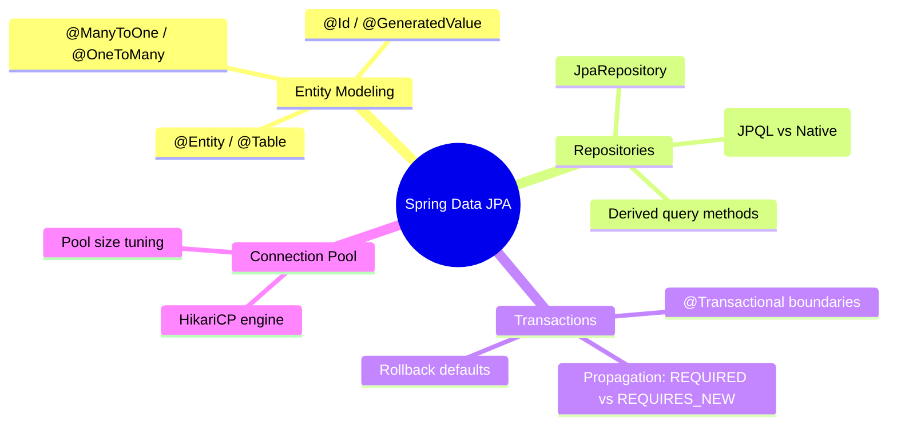

# 3.4.6. Spring Data JPA and Hibernate

> [!info] Spring Data JPA abstracts database operations behind dynamic repositories, utilizing Hibernate under the hood as the primary JPA (Java Persistence API) implementation.
> This note analyzes entity modeling annotations, demonstrates derived and custom query methods, explains the declarative transaction model, and explores connection pooling configurations.

---

## 1. Entity Mapping with Hibernate

JPA is a specification (a set of guidelines), and **Hibernate** is the concrete Object-Relational Mapping (ORM) library that implements it.

In JPA, database tables are mapped to standard Java classes using JPA annotations. These mapped classes are called **Entities**.



### 1.1 JPA Entity Mapping Example

```java
package com.example.model;

import jakarta.persistence.*;
import java.time.LocalDateTime;
import java.util.ArrayList;
import java.util.List;
import lombok.Getter;
import lombok.Setter;

@Entity
@Table(name = "users_custom") // Overrides default snake_case table name
@Getter
@Setter
public class User {

    @Id
    @GeneratedValue(strategy = GenerationType.IDENTITY) // Matches auto-incrementing DB columns
    private Long id;

    @Column(name = "username", nullable = false, unique = true, length = 100)
    private String username;

    @Column(name = "created_at", nullable = false, updatable = false)
    private LocalDateTime createdAt = LocalDateTime.now();

    // Bi-directional Many-to-One relationship
    // 'mappedBy' indicates that 'Article' is the owner of this relation
    @OneToMany(mappedBy = "author", cascade = CascadeType.ALL, orphanRemoval = true)
    private List<Article> articles = new ArrayList<>();
}
```

---

## 2. Spring Data JPA Repositories

Writing database access boilerplate code is tedious. Spring Data JPA eliminates this by automatically generating table access queries based on interface declarations.

By extending the `JpaRepository` interface, Spring automatically provides basic CRUD operations (`save()`, `findById()`, `findAll()`, `deleteById()`) without requiring any implementation code.

```java
package com.example.repository;

import com.example.model.User;
import org.springframework.data.jpa.repository.JpaRepository;
import org.springframework.data.jpa.repository.Query;
import org.springframework.data.repository.query.Param;
import org.springframework.stereotype.Repository;
import java.util.Optional;

@Repository
public interface UserRepository extends JpaRepository<User, Long> {

    // 1. Derived Query Method: Spring parses the method name to generate the SQL query automatically!
    Optional<User> findByUsername(String username);

    // 2. Custom JPQL Query: Operates on Java class entities, not raw tables
    @Query("SELECT u FROM User u WHERE u.username LIKE :pattern")
    List<User> searchUsersByPattern(@Param("pattern") String pattern);

    // 3. Custom Native SQL Query: Runs raw SQL directly against the database engine
    @Query(value = "SELECT * FROM users_custom WHERE created_at > NOW() - INTERVAL '30 days'", nativeQuery = true)
    List<User> findRecentSignups();
}
```

---

## 3. Declarative Transactions (`@Transactional`)

Database operations must maintain ACID (Atomicity, Consistency, Isolation, Durability) properties. Spring manages this declaratively using the `@Transactional` annotation.

Under the hood, `@Transactional` is implemented using **Spring AOP**. When a transactional method is invoked, the proxy intercepts the call, starts a database transaction, executes your business logic, and commits the transaction on completion.

### 3.1 Transaction Rollback Rules
* **Default Behavior:** Spring automatically rolls back transactions for any **unchecked exceptions** (classes inheriting from `RuntimeException` or `Error`).
* **Checked Exceptions Gotcha:** Spring **does not** roll back transactions for **checked exceptions** (classes inheriting from `Exception`, such as `IOException` or `SQLException`) by default.
* **Correction:** If you expect a checked exception to roll back a transaction, you must declare it explicitly using the `rollbackFor` attribute:

```java
@Transactional(rollbackFor = Exception.class)
public void processTransaction() throws Exception {
    // Both checked and unchecked exceptions will trigger a database rollback!
}
```

### 3.2 Transaction Propagation Behaviors
If a transactional method calls another transactional method, how should the second transaction behave? Spring defines several propagation options:

* **`REQUIRED`** (Default): Supports the current transaction; creates a new one if none exists.
* **`REQUIRES_NEW`**: Suspends the current transaction and creates a new, independent transaction. Useful for tasks like writing audit logs that must persist even if the main transaction rolls back.

---

## 4. Connection Pooling with HikariCP

Creating a new database connection for every incoming HTTP request is expensive, introducing latency and consuming server resources. Production applications solve this using a **Connection Pool** — a pre-allocated pool of active database connections shared by incoming worker threads.

Spring Boot uses **HikariCP** as its default connection pooling engine, which is widely recognized as one of the fastest and most efficient connection pools in the Java ecosystem.

### 4.1 Recommended Configuration in `application.properties`:

```properties
# Database connection details
spring.datasource.url=jdbc:postgresql://localhost:5432/mydb
spring.datasource.username=dbuser
spring.datasource.password=dbpass

# HikariCP Configuration
# 1. Maximum number of connections in the pool
spring.datasource.hikari.maximum-pool-size=20

# 2. Minimum number of idle connections Hikari maintains in the pool
spring.datasource.hikari.minimum-idle=5

# 3. Maximum time (ms) a connection is allowed to sit idle before being closed
spring.datasource.hikari.idle-timeout=300000

# 4. Maximum time (ms) a client will wait for a connection from the pool before throwing a ConnectionTimeoutException
spring.datasource.hikari.connection-timeout=30000
```

---

## 5. Summary

Spring Data JPA abstracts database operations using entity mapping annotations and JpaRepository interfaces. Declarative transaction boundaries are managed using `@Transactional` annotations, whose propagation behaviors must be configured carefully to handle unchecked and checked exceptions correctly. Production database performance is maintained using the HikariCP connection pool, which preserves pre-allocated database connections to optimize thread throughput.

---

## See Also

- [[3.4.1. Spring Boot Overview and Starters]]
- [[3.4.2. SpringBoot IoC and Core Internals]]
- [[3.4.4. Spring Aspect-Oriented Programming AOP]]
- [[4.1. ORM Fundamentals]]
