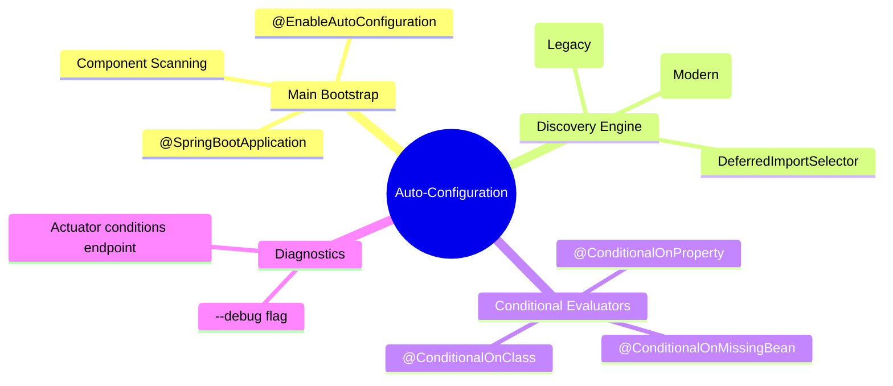

# 3.4.7. Spring Boot Auto-Configuration Mechanics

> [!info] Orientation
> Spring Boot revolutionized Java development by eliminating the traditional, verbose XML and Java configuration boilerplate. The core engine driving this change is the **Auto-Configuration** mechanism, which automatically instantiates and wires beans in your application context based on classpath dependencies and runtime properties. This note details how this engine works under the hood.

---

## 1. The `@SpringBootApplication` Annotation Composition

Every Spring Boot project begins with a main application class decorated with `@SpringBootApplication`. This is not a single, isolated annotation; it is a **meta-annotation** composed of three crucial sub-annotations that drive bootstrapping:

```java
@Target(ElementType.TYPE)
@Retention(RetentionPolicy.RUNTIME)
@Documented
@Inherited
@SpringBootConfiguration      // 1. Declares this class as a configuration source
@EnableAutoConfiguration     // 2. Activates Spring Boot Auto-Configuration
@ComponentScan               // 3. Enables component scanning on the package hierarchy
public @interface SpringBootApplication { ... }
```



---

## 2. The Auto-Configuration Lifecycle Engine

How does `@EnableAutoConfiguration` work? It instructs Spring to load class definitions dynamically from pre-compiled libraries rather than scanning your active source folders.

1. **Discovery Phase:**
   Spring Boot scans all JARs on your classpath for a configuration registry.
   * **In modern versions (Spring Boot 3.x):** It reads the file `META-INF/spring/org.springframework.boot.autoconfigure.AutoConfiguration.imports`. This file is a flat list of fully-qualified class names of configuration classes.
   * **In legacy versions (Spring Boot 2.x and below):** It reads `META-INF/spring.factories` under the key `org.springframework.boot.autoconfigure.EnableAutoConfiguration`.

2. **Parsing Phase:**
   The framework loads these configuration classes into memory. However, it does not instantiate them immediately. It passes them through a series of **Conditional Evaluators** to check if they are actually required at runtime.

---

## 3. Classpath and Bean Evaluation (Conditional Annotations)

Auto-configuration classes are decorated with `@Conditional` annotations. These annotations act as "if statements" that the bean container evaluates before registering a bean. This is how Spring Boot includes the H2 database or configuration blocks only when the libraries are actively imported.

### Key Conditional Annotations:

* **`@ConditionalOnClass(ClassName.class)`:** 
  Only load this configuration block if the specified class is active and resolvable on the JVM classpath. For example, the `DataSourceAutoConfiguration` class uses `@ConditionalOnClass(DataSource.class)` to verify database drivers exist before attempting database configurations.
* **`@ConditionalOnMissingBean(BeanName.class)`:** 
  Only register this bean if the user hasn't already defined a custom bean of the same type. This allows you to override default Spring Boot beans simply by writing your own `@Bean` method in your configuration files.
* **`@ConditionalOnProperty(prefix = "...", name = "...", havingValue = "...")`:** 
  Only activate this configuration if a specific property is present and matches the configured value in `application.properties` or `application.yml`.

### Code Example: Auto-configuration of an Email Service

```java
@Configuration
@ConditionalOnClass(JavaMailSender.class) // 1. Check if Mail library is on classpath
@ConditionalOnProperty(prefix = "app.mail", name = "enabled", havingValue = "true") // 2. Check property config
public class MailAutoConfiguration {

    @Bean
    @ConditionalOnMissingBean // 3. Allow developers to override with a custom bean
    public EmailService emailService(JavaMailSender mailSender) {
        return new SmtpEmailService(mailSender);
    }
}
```

---

## 4. Diagnosing and Debugging Auto-Configuration Decisions

Because auto-configuration runs silently behind the scenes, diagnosing issues (such as why a specific bean wasn't instantiated) can be difficult.

You can instruct Spring Boot to print a comprehensive **Conditions Evaluation Report** (detailing exactly which configurations passed or failed and why) using two methods:

### Option A: The CLI Debug Flag
Add the `--debug` parameter when launching your application:

```bash
java -jar target/my-app-1.0.0.jar --debug
```

### Option B: Spring Boot Actuator
Query the `/actuator/conditions` REST endpoint to retrieve the evaluation report as a structured JSON payload.

---

## Summary

Spring Boot Auto-Configuration simplifies enterprise development by dynamically configuring bean environments. By scanning `AutoConfiguration.imports` files on the classpath and evaluating conditional constraints (such as `@ConditionalOnClass` or `@ConditionalOnMissingBean`), the framework matches your runtime configuration precisely to your classpath dependencies.

## See Also

- [[3.4.1. Spring Boot Overview and Starters]]
- [[3.4.2. SpringBoot IoC and Core Internals]]
- [[3.4.3. Spring Bean Lifecycle and Scopes]]
- [[3.4.8. Spring Boot Actuator and Observability]]
