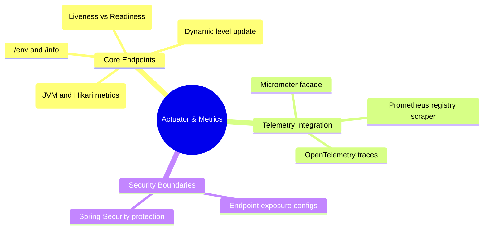

# 3.4.8. Spring Boot Actuator and Observability

> [!info] Orientation
> Building applications is only half the battle; running them reliably in production requires deep observability. **Spring Boot Actuator** provides built-in, production-ready endpoints that expose application health, database connectivity, thread pools, and execution metrics. This note details how to configure, secure, and monitor Spring applications using Actuator and Micrometer.

---

## 1. Production Readiness and the Actuator Dependency

Spring Boot Actuator is a framework module that exposes REST endpoints to monitor and interact with your running application. To activate it, add the starter dependency to your project:

```xml
<!-- pom.xml -->
<dependency>
    <groupId>org.springframework.boot</groupId>
    <artifactId>spring-boot-starter-actuator</artifactId>
</dependency>
```



---

## 2. Core Actuator Endpoints

By default, only `/health` is exposed publicly to prevent accidental leakage of sensitive system properties. Here are the core endpoints available inside Actuator:

| Endpoint | Purpose | Default Exposed HTTP |
| :--- | :--- | :--- |
| **`/health`** | Exposes basic or detailed application health statistics. | Yes |
| **`/metrics`**| Exposes current metrics (JVM memory, GC counts, active threads). | No |
| **`/env`** | Lists current active environment and configuration values. | No |
| **`/loggers`**| Displays and allows dynamic updates to application log levels. | No |
| **`/info`** | Displays custom build or application metadata. | No |

---

## 3. Advanced Health Endpoints (Liveness vs. Readiness)

In modern containerized deployments (like Kubernetes), orchestrators monitor container state using two distinct checks:
1. **Liveness Probe:** Is the application process running, or is it deadlocked and needs to be restarted?
2. **Readiness Probe:** Is the application ready to accept network traffic (i.e., has it completed initialization, and can it communicate with database and cache pools)?

To enable detailed health indicators and expose separate liveness and readiness probes, update your configuration:

```yaml
# application.yml
management:
  endpoint:
    health:
      show-details: always
  health:
    probes:
      enabled: true
```

Actuator will now expose dedicated sub-endpoints:
* **`/actuator/health/liveness`** (Exposes standard JVM state)
* **`/actuator/actuator/health/readiness`** (Validates active database connections and Redis pools)

---

## 4. Dynamic Logging Control

If an incident occurs in production, logging everything at `DEBUG` or `TRACE` levels permanently degrades performance. Actuator's `/loggers` endpoint allows you to **dynamically alter the log levels of specific classes or packages in real-time, without restarting the application**.

### Example: Modifying Log Levels via Curl
To temporarily increase the log level of your UserService to debug a database transaction, send a `POST` request to Actuator:

```bash
curl -X POST http://localhost:8080/actuator/loggers/com.example.service.UserService \
     -H "Content-Type: application/json" \
     -d '{"configuredLevel": "DEBUG"}'
```

---

## 5. Exposing Metrics to Prometheus via Micrometer

Actuator does not capture or visualize metrics itself. Instead, it relies on **Micrometer**, a lightweight instrumentation facade for Java applications (similar to SLF4J but for metrics).

To export metrics into a Prometheus-readable format (which can then be pulled and visualized on a Grafana dashboard), add the Prometheus registry dependency:

```xml
<!-- pom.xml -->
<dependency>
    <groupId>io.micrometer</groupId>
    <artifactId>micrometer-registry-prometheus</artifactId>
</dependency>
```

Configure your application to expose the Prometheus scraper endpoint:

```yaml
# application.yml
management:
  endpoints:
    web:
      exposure:
        include: "health,prometheus" # Expose health and prometheus endpoints
```

Prometheus can now scrape your metrics at: `http://localhost:8080/actuator/prometheus`.

---

## 6. Securing Actuator Endpoints

Exposing endpoints like `/env` or `/heapdump` to the public internet is a major security risk, as they can leak sensitive credentials and database connection details.

Always secure your actuator endpoints using **Spring Security**:

```java
@Configuration
@EnableWebSecurity
public class SecurityConfiguration {

    @Bean
    public SecurityFilterChain securityFilterChain(HttpSecurity http) throws Exception {
        http
            .authorizeHttpRequests(auth -> auth
                .requestMatchers("/actuator/health/**").permitAll() # Anyone can check health
                .requestMatchers("/actuator/**").hasRole("ADMIN")  # Restrict other endpoints to Admins
                .anyRequest().authenticated()
            )
            .httpBasic(Customizer.withDefaults()); // Restrict access using HTTP Basic Auth
        return http.build();
    }
}
```

---

## Summary

Spring Boot Actuator, paired with Micrometer, provides enterprise-grade observability. By configuring separate liveness and readiness checks for container engines, managing dynamic package log levels during runtime incidents, and exporting Prometheus telemetry streams, developers can safely monitor and scale their production clusters.

## See Also

- [[3.4.1. Spring Boot Overview and Starters]]
- [[3.4.5. Spring Boot MVC Web Layer and Global Exception Handling]]
- [[3.4.7. Spring Boot Auto-Configuration Mechanics]]
