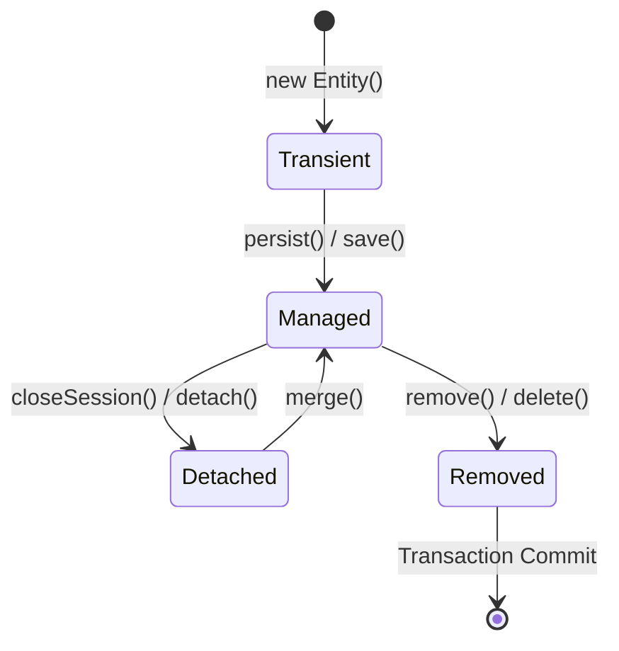

# 3.4.9. Spring Data JPA Advanced Queries and Performance

> [!info] Orientation
> Spring Data JPA and Hibernate provide clean abstractions for database persistence, but poor database management can lead to massive SQL overhead. This note details how to write advanced JPQL and Native queries, diagnose Hibernate performance issues, and resolve the classic JPA N+1 query problem using Entity Graphs and fetch joins.

---

## 1. Hibernate Entity States Lifecycle

To write performant JPA queries, you must understand Hibernate's Entity Lifecycle. An entity instance exists in one of four states inside the Persistence Context:

1. **Transient:** The object is newly instantiated in memory (`new User()`) and is not associated with any database row or Hibernate Session.
2. **Managed (Persistent):** The entity is actively tracked by the current Hibernate Session. Any changes made to the object's fields in memory will be automatically synchronized (flushed) to the database upon transaction commit.
3. **Detached:** The entity is associated with a database record, but its parent Hibernate Session has been closed or cleared. Updates are no longer tracked automatically.
4. **Removed:** The entity is marked for deletion and will be removed from the database when the transaction commits.



---

## 2. Resolving the JPA N+1 Query Problem

The N+1 Query Problem occurs when Hibernate retrieves a parent entity using one SQL query and then runs additional database queries to load its lazily-associated children when they are accessed in memory.

```java
// ❌ Slow Code: Triggers 1 query to fetch Users, plus N queries to fetch each User's Orders!
List<User> users = userRepository.findAll();
for (User user : users) {
    System.out.println(user.getOrders().size());
}
```

To resolve this bottleneck, we can force Hibernate to fetch the related entities in a single, optimized query using **Fetch Joins** or **Entity Graphs**:

### A. JPQL Fetch Joins (Declarative Join Fetches)
By default, standard `JOIN` statements in JPQL do not populate related child lists. You must use the **`FETCH`** keyword to instruct Hibernate to load the associated records in a single database query:

```java
public interface UserRepository extends JpaRepository<User, Long> {

    // 🚀 One Query with SQL JOIN: Fetches Users and their Orders in a single call!
    @Query("SELECT u FROM User u LEFT JOIN FETCH u.orders")
    List<User> findAllUsersWithOrders();
}
```

### B. Spring Data `@EntityGraph` (Dynamic Pre-fetching)
If you want to keep Spring Data's auto-generated query methods but fetch relationships eagerly on demand, you can decorate your repository methods with **`@EntityGraph`**:

```java
public interface UserRepository extends JpaRepository<User, Long> {

    // Automatically overrides default LAZY loading configurations for this specific method
    @EntityGraph(attributePaths = {"orders", "profile"})
    List<User> findAll();
}
```

---

## 3. Custom Query Styles: JPQL vs. Native SQL

Spring Data JPA supports multiple ways to declare database queries:

| Method Style | When to Use | Portability | Performance |
| :--- | :--- | :--- | :--- |
| **Derived Queries** | Simple queries (e.g., `findByEmailAndPassword`). | High | Good |
| **JPQL (`@Query`)**| Object-oriented queries using entity class names instead of tables. | High | Excellent |
| **Native Queries**  | Complex, database-specific queries (using indexes, common table expressions, json operators). | Low (tied to DB) | Excellent |

### Code Implementation Example:

```java
public interface ProductRepository extends JpaRepository<Product, Long> {

    // 1. JPQL Object Query
    @Query("SELECT p FROM Product p WHERE p.price > :minPrice")
    List<Product> findExpensiveProducts(@Param("minPrice") BigDecimal minPrice);

    // 2. Database-Specific Native SQL Query
    @Query(value = "SELECT * FROM products p WHERE p.properties->>'color' = :color", nativeQuery = true)
    List<Product> findProductsByJsonColor(@Param("color") String color);
}
```

---

## 4. Bulk Modifications in JPA

Hibernate tracks entity states in memory, which means executing bulk modifications (such as updating 10,000 records) using standard loops is extremely slow. It loads each entity into memory, modifies it, and runs 10,000 separate `UPDATE` commands.

To update or delete records in bulk efficiently, use `@Modifying` annotations with direct JPQL or Native SQL:

```java
public interface ProductRepository extends JpaRepository<Product, Long> {

    @Modifying
    @Transactional
    @Query("UPDATE Product p SET p.price = p.price * 1.1 WHERE p.category = :category")
    int applyCategoryInflation(@Param("category") String category);
}
```

> [!important] The Persistence Context Sync Issue
> Because bulk updates run directly in the database, Hibernate's in-memory persistence context is not updated automatically.
> To prevent reading stale data, configure the `@Modifying` annotation to automatically clear the Hibernate session after executing:
> `@Modifying(clearAutomatically = true)`

---

## Summary

Spring Data JPA performance tuning requires balancing developer convenience with optimized database queries. By resolving N+1 queries using fetch joins and Entity Graphs, utilizing JPQL and native SQL queries where appropriate, and managing Hibernate entity lifecycle states, applications can execute database operations at high speeds.

## See Also

- [[3.4.1. Spring Boot Overview and Starters]]
- [[3.4.2. SpringBoot IoC and Core Internals]]
- [[3.4.6. Spring Data JPA and Hibernate]]
- [[3.4.10. Spring Transaction Management and Propagation]]
