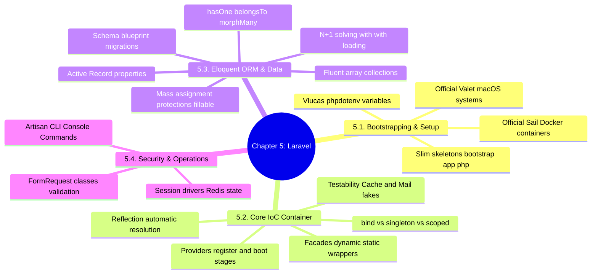

# 3.5.0. Laravel MOC

> [!info] Map of Content Purpose
> This local index acts as your navigation hub for Chapter 5: Laravel & Modern PHP Framework Architecture. Laravel is an expressive PHP framework emphasizing developer experience, rapid iteration, and high-productivity APIs. This MOC connects bootstrapping, the Service Container, active record mappings, security components, and custom console utilities.

---

## 1. Chapter Mind Map

The mind map below lays out the key services, patterns, and features of Laravel:

---

## 2. Topic Outline & Atomic Notes

This module has 12 notes tracking the core concepts and workflows of Laravel:

### [[3.5.1. Laravel Overview and Installation|1. Laravel Overview & Installation]]
*Starting with Laravel, comparison to other stacks, and development setups.*
* **Foundations:** Core Pallets dependencies, PHP version configurations (8.2+), and the artisan CLI.
* **Environments:** Homestead VMs, Sail Docker containers, and macOS Valet servers.

### [[3.5.2. Laravel Service Container and Eloquent|2. Container & Data Foundations]]
*The dual pillars of Laravel's system architecture.*
* **DI and ORM:** High-level overview of Laravel's Reflection-based Service Container and Eloquent Active Record ORM.

### [[3.5.3. Laravel Service Container and Service Providers|3. Service Container & Service Providers]]
*Decoupling object building and binding.*
* **Container Lifecycle:** Binding modes (`bind()`, `singleton()`, `scoped()`) and automatic DI.
* **Service Providers:** Bootstrapping execution loops using `register()` and `boot()` methods.

### [[3.5.4. Laravel Facades and Testability fakes|4. Facades & Testability Fakes]]
*Under the hood of Laravel's syntactic facades.*
* **Facade Resolution:** Magic methods (`__callStatic()`) and resolving container instances dynamically.
* **Testing Fakes:** Decoupling integrations using `Mail::fake()`, `Queue::fake()`, and `Cache::fake()`.

### [[3.5.5. Laravel Eloquent Relationships and Collections|5. Eloquent Relationships & Eloquent Collections]]
*Designing relational data systems and mapping arrays.*
* **Eloquent Relations:** `hasOne`, `hasMany`, `belongsTo`, `belongsToMany` (pivot arrays).
* **Collections:** Processing dataset models in memory using functional pipelines (`map()`, `filter()`).

### [[3.5.6. Laravel Eloquent Query Optimization and N1 Problem|6. Query Optimization & Stopping N+1 Bottlenecks]]
*Tuning database calls and writing efficient queries.*
* **N+1 Optimizations:** Eager loading (`with()`), Lazy eager loading (`load()`), and optimizing queries using debug tools.

### [[3.5.7. Laravel Middleware and Route Pipelines|7. Middleware & Routing Pipelines]]
*Configuring HTTP filters and session groupings.*
* **Middleware Pipelines:** Custom HTTP filters, global interceptors, and route group middleware (Web vs API).

### [[3.5.8. Laravel Artisan CLI and Custom Commands|8. Artisan CLI & Custom Commands]]
*Automating tasks using custom CLI classes.*
* **CLI Automation:** Generating CLI scripts, CLICK parameter options, and integrating CRON systems.

### [[3.5.9. Laravel Advanced Eloquent and Polymorphic Relations|9. Polymorphic Relationships & Advanced Eloquent]]
*Implementing dynamic, complex database mappings.*
* **Polymorphic Relations:** Morphic mappings (`morphTo`, `morphMany`, `morphToMany`) for flexible schemas.

### [[3.5.10. Laravel Form Validation and Request Objects|10. Form Validation & Custom Requests]]
*Isolating validation constraints and defensive coding.*
* **Form Requests:** Self-validating FormRequest classes, validation rules, authorization overrides, and automated error redirects.

### [[3.5.11. Laravel Authentication and Security|11. Laravel Authentication & Security]]
*Implementing user session gates, guards, and tokens.*
* **Authentication:** Guard models, user providers, session fixation protections, and CSRF synchronizer tokens.

### [[3.5.12. Laravel Collections and Lazy Collections|12. Memory-Safe Collections & Generators]]
*Processing extremely large datasets efficiently in PHP memory.*
* **Collections Deep Dive:** Eloquent arrays vs Memory-safe **Lazy Collections** backed by PHP Generators.

---

## 3. Prerequisite Knowledge & Downstream Impact

* **Prerequisites:** 
  - Having a strong grasp of PHP's execution architecture discussed in [[3.6.1. PHP Execution Models]] is useful.
* **Downstream Connections:**
  - Laravel's Active Record design is similar to Django's ORM [[3.3.4. Django ORM Deep Dive and Database Abstraction]], contrasting with Spring's Hibernate implementation [[3.4.6. Spring Data JPA and Hibernate]].
  - Laravel's Reflection container auto-wires dependencies implicitly, contrasting with Spring's constructor wiring requirement [[3.4.2. SpringBoot IoC and Core Internals]].

---

*See also: [[00. Master Index]] — [[3.0. Chapter Index]]*
