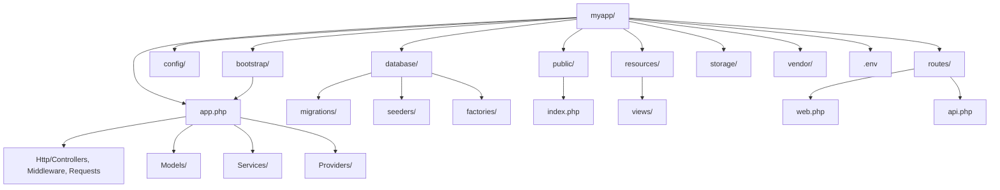
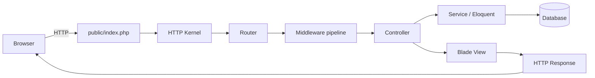

# 3.5.1. Laravel Overview and Installation

> [!info] Laravel is an expressive PHP web framework built on top of Symfony components, designed for developers who want the productivity of Rails without leaving the PHP ecosystem.
> This note covers what Laravel is, how it compares to other PHP frameworks, the PHP version requirements, Composer installation, the artisan CLI, the directory structure, the bootstrap and configuration files, and the local-dev environments (Homestead, Sail, Valet).

## 1. What Laravel Is

Laravel is a free, open-source PHP web framework created by Taylor Otwell in 2011 as an alternative to CodeIgniter, which at the time lacked built-in authentication, sessions, and a usable ORM. The first release was a small MVC framework with expressive routing and a Fluent query builder; subsequent releases added Eloquent (the Active Record ORM), Blade (the templating engine), the Service Container (IoC), migrations, queues, broadcasts, and a polished artisan CLI. Laravel's stated mission is to make PHP development joyful — "PHP for artisans" — and its design choices consistently favour developer experience: clear syntax, sensible defaults, and a fluent, chainable API surface across nearly every subsystem.

Laravel is built on top of Symfony components — the HTTP kernel, the console application, the routing engine, the filesystem abstractions, and many of the lower-level utilities are Symfony packages reused under the hood. The relationship is symbiotic: Laravel consumes Symfony's battle-tested foundations and adds the expressive API and batteries that Symfony Framework itself deliberately omits. The result is that a Laravel developer gets the stability of Symfony internals with the productivity of a Rails-style DSL.

The framework is maintained by Laravel LLC (a commercial entity) and the wider open-source community. Major versions ship on a yearly cadence (Laravel 10 in February 2023, Laravel 11 in March 2024, Laravel 12 in February 2025), with bug fixes for 18 months and security fixes for 2 years per release. LTS-style support was retired in favour of the predictable yearly cadence, which simplifies upgrade planning.

## 2. Comparison to Other PHP Frameworks

The PHP framework landscape has four serious options in 2024: Laravel, Symfony, CodeIgniter, and CakePHP. The table below summarises how they differ on the dimensions that matter for picking one.

| Framework | Philosophy | ORM | Templating | DI Container | Market share |
| --------- | ---------- | --- | ---------- | ------------- | ------------ |
| **Laravel** | Expressive, batteries-included, developer joy | Eloquent (Active Record) | Blade | Service Container | Dominant |
| **Symfony** | Component-based, explicit, enterprise | Doctrine (Data Mapper) | Twig | DependencyInjection component | Enterprise / government |
| **CodeIgniter** | Lightweight, minimal, fast | Query Builder (optional) | PHP-native views | Minimal | Legacy / shared hosting |
| **CakePHP** | Convention-based, batteries-included | CakeORM (Active Record) | .ctp templates | Built-in DI | Niche |

Laravel's distinguishing trait is its consistent fluent API. Routes are declared with `Route::get('/users', [UserController::class, 'index'])`, database queries with `DB::table('users')->where('active', true)->get()`, validation with `$request->validate(['email' => 'required|email'])`. The pattern repeats across caching (`Cache::put`), queues (`Queue::push`), events (`Event::dispatch`), and mailing (`Mail::to(...)->send(...)`). Symfony, by contrast, favours explicit service definitions and annotations/attributes over a DSL; CodeIgniter is much thinner and ships with fewer components; CakePHP is similar in spirit to Laravel but with a smaller ecosystem and a different convention system.

For new PHP projects where the team has no legacy constraint, Laravel is the default choice in 2024. Symfony is the right choice when the project is part of a larger enterprise stack that already standardises on Symfony components, or when Data Mapper (Doctrine) is preferred over Active Record (Eloquent).

## 3. PHP Version Requirements

Laravel's PHP version requirement tracks the supported PHP versions. Laravel 10 requires PHP 8.1, Laravel 11 requires PHP 8.2, and Laravel 12 requires PHP 8.2+. The PHP version constraint is enforced by Composer at install time, so attempting to `composer create-project laravel/laravel` on PHP 7.4 fails immediately with a dependency resolution error.

The choice of PHP 8.x is not arbitrary. Laravel uses PHP 8.1 enums for some internal types (e.g. route middleware positions in Laravel 11), PHP 8.0 union types in many service signatures, readonly properties (PHP 8.1) for value objects, and named arguments throughout the framework's API. Running Laravel on an older PHP version is impossible not because of policy but because the framework code itself uses language features that do not exist before PHP 8.1.

The PHP execution model — request-bound lifecycle, FPM worker pools, opcache behaviour — is covered in detail in [[3.6.1. PHP Execution Models]]. Architectural patterns for scaling PHP applications (shared-nothing, stateless workers, load-balanced FPM pools) are covered in [[3.6.5. PHP Architectures]].

## 4. Installation via Composer

The canonical installation command is:

```bash
composer create-project laravel/laravel myapp
```

This creates a fresh Laravel project in `./myapp` with the latest stable release. The `create-project` command is equivalent to `git clone` + `composer install` + running the post-install scripts that generate the `.env` file and the application key. After installation, the application key is set automatically; in older Laravel versions you had to run `php artisan key:generate` manually.

For a specific version, append `--prefer-dist "laravel/laravel:11.*"` or use the Laravel installer:

```bash
composer global require laravel/installer
laravel new myapp --git
```

The Laravel installer is faster (it caches the skeleton) and offers interactive prompts for the starter kit (Breeze, Jetstream), the database driver, and whether to initialise a Git repository. Both methods produce an identical project layout.

## 5. The Artisan CLI

Artisan is Laravel's command-line tool, invoked as `php artisan <command>` from the project root. It is built on top of Symfony's Console component and ships with roughly 80 built-in commands covering code generation, database migrations, queue management, cache clearing, and application inspection.

| Command | Purpose |
| ------- | ------- |
| `php artisan serve` | Start a PHP dev server on `localhost:8000` |
| `php artisan make:controller UserController` | Generate a controller class |
| `php artisan make:model Post -mfsc` | Generate a model with migration, factory, seeder, and controller |
| `php artisan migrate` | Run pending migrations |
| `php artisan migrate:rollback` | Roll back the last migration batch |
| `php artisan tinker` | Open a PsySH REPL bound to the application container |
| `php artisan route:list` | Print all registered routes |
| `php artisan optimize` | Cache config, routes, events, and views for production |
| `php artisan queue:work` | Start a queue worker process |
| `php artisan test` | Run the Pest/PHPUnit test suite |
| `php artisan db:seed` | Run database seeders |
| `php artisan key:generate` | Generate the application key in `.env` |

Custom commands are generated with `php artisan make:command`. Each command class extends `Console\Command` and implements a `handle()` method; Laravel's container resolves the command and injects any type-hinted dependencies into `handle()`. This is the standard pattern for one-off admin scripts, cron jobs, and queue dispatchers.

## 6. Directory Structure

A fresh Laravel 11 application has the following top-level layout:



The `app/` directory holds application code: `Http/Controllers` for request handlers, `Models` for Eloquent classes, `Providers` for service provider bindings. The `routes/` directory holds the route definitions split by entry point — `web.php` for browser routes (with session, CSRF, cookie middleware), `api.php` for stateless JSON API routes (token-based auth, no session). The `public/` directory is the document root: `public/index.php` is the single entry point through which every HTTP request passes. The `config/` directory holds PHP configuration files that return arrays. The `resources/views/` directory holds Blade templates. The `database/migrations/` directory holds schema migration files.

Laravel 11 introduced a slimmer skeleton: the `app/Http/Kernel.php`, `app/Console/Kernel.php`, and `app/Exceptions/Handler.php` classes were removed and their responsibilities folded into `bootstrap/app.php`. The result is fewer boilerplate files and a single, expressive bootstrap file where you register middleware, exceptions, and routing concerns.

## 7. Configuration: bootstrap/app.php and config/app.php

The `bootstrap/app.php` file creates the Laravel application instance and registers core service providers. In Laravel 11, this is also where you configure middleware, exception handling, and routing:

```php
use Illuminate\Foundation\Application;
use Illuminate\Foundation\Configuration\Exceptions;
use Illuminate\Foundation\Configuration\Middleware;

return Application::configure(basePath: dirname(__DIR__))
    ->withRouting(
        web: __DIR__.'/../routes/web.php',
        api: __DIR__.'/../routes/api.php',
        commands: __DIR__.'/../routes/console.php',
        health: '/up',
    )
    ->withMiddleware(function (Middleware $middleware) {
        $middleware->append(\App\Http\Middleware\EnsureUserIsAdmin::class);
    })
    ->withExceptions(function (Exceptions $exceptions) {
        //
    })->create();
```

The `config/` directory holds discrete configuration files: `app.php` (timezone, locale, encryption key, fallback locale), `database.php` (connection defaults), `cache.php` (cache store default), `queue.php` (queue connections), `auth.php` (guards and providers), `mail.php` (mail driver), `filesystems.php` (disk configuration). Each file returns an array, and every value can be overridden by an environment variable via the `env()` helper:

```php
// config/database.php
'default' => env('DB_CONNECTION', 'mysql'),
'connections' => [
    'mysql' => [
        'driver' => 'mysql',
        'host' => env('DB_HOST', '127.0.0.1'),
        'port' => env('DB_PORT', '3306'),
        'database' => env('DB_DATABASE', 'forge'),
        'username' => env('DB_USERNAME', 'forge'),
        'password' => env('DB_PASSWORD', ''),
    ],
],
```

## 8. The .env File

The `.env` file in the project root holds environment-specific configuration. It is loaded by `vlucas/phpdotenv` at boot, and the values are exposed to the application via the `env()` helper in `config/*.php`. The `.env` file is `.gitignore`d by default; `.env.example` ships with the project as a template.

```ini
APP_NAME=MyApp
APP_ENV=local
APP_KEY=base64:...
APP_DEBUG=true
APP_URL=http://localhost

DB_CONNECTION=mysql
DB_HOST=127.0.0.1
DB_PORT=3306
DB_DATABASE=myapp
DB_USERNAME=root
DB_PASSWORD=secret

CACHE_DRIVER=redis
QUEUE_CONNECTION=redis
SESSION_DRIVER=redis
```

The separation between `.env` (per-environment values) and `config/*.php` (application structure) is deliberate. Configuration files are committed to Git; environment files are not. The pattern forces secrets out of the repository and into the deployment environment, where they belong.

## 9. Local Dev Environments

Three official local-dev environments are documented in the Laravel installation guide:

- **Homestead** — a pre-packaged Vagrant box (Ubuntu, Nginx, PHP, MySQL, Redis, Postgres, etc.). Homestead is the oldest option, predates Docker's dominance, and is now in maintenance mode.
- **Sail** — a Docker-based local environment shipped as a `docker-compose.yml` and a `sail` CLI script. Sail is the default recommendation for Linux and Windows; it runs PHP-FPM, MySQL, Redis, Mailpit, and MinIO in containers, and exposes a `./vendor/bin/sail up` command that brings the whole stack up.
- **Valet** — a macOS-only dev server that uses Nginx + DnsMasq to serve any project in `~/Sites` at `http://project-name.test` without configuration. Valet is the lightest option for macOS users who do not need a full Docker stack.



The request lifecycle, summarised above, is identical regardless of which dev environment you use: every request enters through `public/index.php`, which bootstraps the application kernel, dispatches the request through the router and middleware pipeline to the controller, and returns the response. The kernel is covered in detail in [[3.5.2. Laravel Service Container and Eloquent]]. For deployment topology — FPM workers, Nginx reverse proxy, container layout — see [[6.1. Docker Containerization and Networking]] and [[6.3. Nginx Reverse Proxy and Load Balancing]].

## Summary

Laravel is an expressive, batteries-included PHP framework built on Symfony components, with a yearly release cadence and a PHP 8.2+ requirement. Installation is a single `composer create-project` command; the artisan CLI provides code generation, migrations, queue workers, and a tinker REPL; the directory structure splits application code (`app/`), routes (`routes/`), configuration (`config/`), views (`resources/views/`), and the public entry point (`public/index.php`). Laravel 11's slimmed-down skeleton folds kernel responsibilities into `bootstrap/app.php`, and configuration is externalised through `.env` files consumed by `config/*.php`. Local development uses Sail (Docker), Valet (macOS), or Homestead (Vagrant) — pick whichever matches your platform and Docker tolerance.

## See Also

- [[3.5.2. Laravel Service Container and Eloquent]]
- [[3.6.1. PHP Execution Models]]
- [[3.6.5. PHP Architectures]]
- [[3.4.1. Spring Boot Overview and Starters]]
- [[3.3.1. Django Overview and MVT Pattern]]

## References

- Laravel LLC, "Laravel Documentation", https://laravel.com/docs
- Otwell, T., "Laravel: From Apprentice To Artisan", https://laravel.com/docs/4.2/upgrade
- Symfony SAS, "Symfony Components", https://symfony.com/components
- PHP-FIG, "PHP Standards Recommendations", https://www.php-fig.org/psr/
