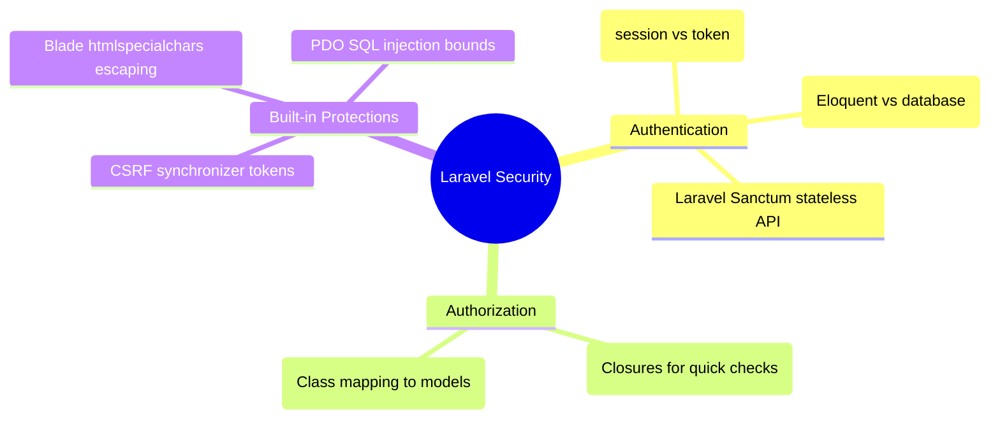

# 3.5.11. Laravel Authentication and Security

> [!info] Orientation
> Laravel is designed to be highly secure by default, offering built-in protections against common web vulnerabilities. This note explores the underpinnings of Laravel's security architecture, detailing stateful session authentication, stateless API security using Laravel Sanctum, and authorization gates and policies.

---

## 1. Authentication Architecture: Guards and Providers

Laravel's authentication system is divided into two core components configured inside `config/auth.php`:

1. **Guards:** Define how users are authenticated for each request.
   * `session` guard: Reads user state from active session storage and validates cookies on each request.
   * `token` or `sanctum` guard: Reads state from bearer tokens in incoming request headers.
2. **Providers:** Define how users are retrieved from storage.
   * `eloquent` provider: Queries users from the database using your active Eloquent model.
   * `database` provider: Queries users directly using the DB Query Builder interface.



---

## 2. Stateless API Security with Laravel Sanctum

For modern SPA interfaces or mobile apps, stateful sessions are difficult to manage. **Laravel Sanctum** provides a lightweight, token-based authentication system built-in.

### Issuing API Tokens
When a user authenticates, you can generate and return a unique bearer token:

```php
use App\Models\User;
use Illuminate\Http\Request;
use Illuminate\Support\Facades\Hash;

Route::post('/login', function (Request $request) {
    $request->validate([
        'email' => 'required|email',
        'password' => 'required',
    ]);

    $user = User::where('email', $request->email)->first();

    if (! $user || ! Hash::check($request->password, $user->password)) {
        return response()->json(['message' => 'Invalid credentials'], 401);
    }

    // Generate a personal access token
    $token = $user->createToken('auth-token')->plainTextToken;

    return response()->json([
        'user' => $user,
        'token' => $token,
    ]);
});
```

### Protecting API Routes
To restrict API endpoints to authenticated clients, apply the `auth:sanctum` middleware in your routing definitions:

```php
Route::middleware('auth:sanctum')->get('/user', function (Request $request) {
    return $request->user();
});
```

---

## 3. Resource Authorization: Gates and Policies

While **Authentication** checks *who* a user is, **Authorization** checks *what* actions they are permitted to perform. Laravel implements this using Gates and Policies.

### A. Gates (For quick, non-model checks)
Gates are simple closures defined inside `app/Providers/AppServiceProvider.php`:

```php
use Illuminate\Support\Facades\Gate;
use App\Models\User;

public function boot(): void
{
    // Define an administrator check Gate
    Gate::define('access-admin', function (User $user) {
        return $user->role === 'admin';
    });
}
```

Check gates inside your controllers or routes:

```php
if (Gate::allows('access-admin')) {
    // Execute admin task...
}
```

### B. Policies (For specific model instances)
Policies are PHP classes that group authorization checks for specific database models.

To generate a policy for an `Article` model, run:

```bash
php artisan make:policy ArticlePolicy --model=Article
```

This creates a class inside `app/Policies/ArticlePolicy.php`:

```php
namespace App\Policies;

use App\Models\Article;
use App\Models\User;

class ArticlePolicy
{
    /**
     * Determine if the user can update the article.
     */
    public function update(User $user, Article $article): bool
    {
        // Only allow authors to edit their own articles, or admins
        return $user->id === $article->user_id || $user->role === 'admin';
    }
}
```

Apply policies inside your controller methods:

```php
public function update(Request $request, Article $article)
{
    // Throws a 403 Forbidden exception if check fails!
    $this->authorize('update', $article);

    $article->update($request->all());
}
```

---

## 4. Built-in Production Exploits Shielding

Laravel secures your application from the start by automating mitigations for major OWASP vulnerabilities:

* **SQL Injection:** Eloquent and DB Query Builder use PHP Data Objects (PDO) parameter binding under the hood. This ensures all database inputs are treated as parameters rather than executable SQL code, completely neutralizing SQL injections.
* **Cross-Site Scripting (XSS):** Blade's double curly brace syntax (`{{ $data }}`) automatically passes output through PHP's `htmlspecialchars()` function, preventing execution of injected `<script>` tags. Use `{!! $data !!}` only for trusted HTML templates.
* **Cross-Site Request Forgery (CSRF):** Laravel registers global CSRF protection middleware on web routes. It automatically injects a synchronizer token into active user sessions and validates it on incoming state-changing requests (POST, PUT, DELETE) using the `@csrf` blade directive.

---

## Summary

Laravel provides a highly complete security ecosystem. By leveraging Guard configurations for session or token-based logins, Laravel Sanctum for lightweight API token authentication, and decoupling permissions using Gates and Policies, applications can meet enterprise security compliance with minimal boilerplate.

## See Also

- [[3.5.1. Laravel Overview and Installation]]
- [[3.5.2. Laravel Service Container and Eloquent]]
- [[3.5.7. Laravel Middleware and Route Pipelines]]
- [[3.5.10. Laravel Form Validation and Request Objects]]
