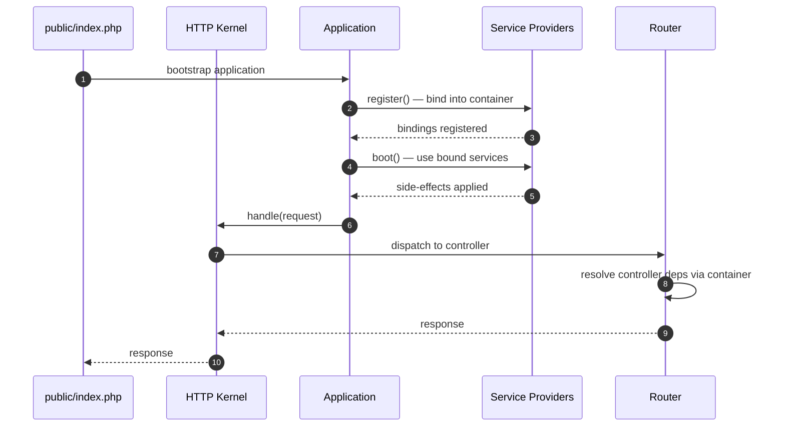

# 3.5.2. Laravel Service Container and Eloquent

> [!info] Laravel's two architectural pillars are the Service Container (IoC + dependency resolution via reflection) and Eloquent (Active Record ORM).
> This note expands the Article 3 draft into a full treatment of bindings, service providers, facades, the Eloquent model lifecycle, relationships, the N+1 problem, mass assignment, migrations, tinker, and collections.

## 1. The Service Container

The Service Container is Laravel's IoC container. It is the place where you register bindings — "when someone asks for `PaymentGatewayInterface`, give them a `StripeGateway` instance" — and it is the engine that resolves constructor dependencies throughout the framework. The container is exposed at runtime as the `Application` instance itself (`app()`), since `Application` extends `Container`.

The two operations you perform on the container are **binding** and **resolving**. A binding tells the container what to return when a particular abstract type is requested; resolution is the act of actually constructing the object (and its dependencies, recursively).

```php
// Binding an interface to an implementation
$this->app->bind(PaymentGatewayInterface::class, StripeGateway::class);

// Binding a singleton — same instance returned for every resolution
$this->app->singleton(CacheStore::class, function ($app) {
    return new RedisCacheStore($app->make('redis'), 'laravel:');
});

// Binding a scoped singleton — one instance per request lifecycle
$this->app->scoped(RequestContext::class, function ($app) {
    return new RequestContext($app->make('request'));
});
```

Three binding modes are worth distinguishing. `bind()` returns a fresh instance on every resolution — appropriate for stateful short-lived objects. `singleton()` returns the same instance for the lifetime of the container (which, in a PHP-FPM request, is the lifetime of the request). `scoped()` returns the same instance within one request lifecycle but creates a fresh one in the next, which matters in long-running workers (Octane, Swoole) where the container persists across multiple requests.

Resolution happens automatically when a class declares a type-hinted constructor dependency that the container can satisfy. Laravel's router inspects controller constructors via PHP's Reflection API, recursively resolves each parameter, and passes the resulting instances to the constructor. The same is true for controller method parameters, event listeners, queue job handlers, middleware, and console command handlers — anything Laravel instantiates on your behalf goes through the container.

```php
namespace App\Http\Controllers;

use App\Services\PaymentGateway;
use Illuminate\Http\Request;

class OrderController extends Controller
{
    public function __construct(protected PaymentGateway $payment) {}

    public function store(Request $request)
    {
        $this->payment->charge($request->input('amount'));
    }
}
```

In this example, both `PaymentGateway` (constructor) and `Request` (method) are resolved by the container. The `app()` helper is the manual escape hatch for when you need to resolve something outside a container-instantiated class, e.g. inside a non-DI legacy function.

## 2. Service Providers

Service providers are the central place where Laravel applications are bootstrapped. Every Laravel application has a list of providers in `config/app.php` (or `bootstrap/providers.php` in Laravel 11+) that are instantiated and called in order during boot. Each provider has two lifecycle methods:

```php
namespace App\Providers;

use Illuminate\Support\ServiceProvider;
use App\Services\PaymentGatewayInterface;
use App\Services\StripeGateway;

class PaymentServiceProvider extends ServiceProvider
{
    public function register(): void
    {
        // Bind things into the container.
        $this->app->bind(PaymentGatewayInterface::class, StripeGateway::class);
    }

    public function boot(): void
    {
        // Use things that have been bound.
        View::share('currency', config('app.currency'));
    }
}
```

The distinction between `register()` and `boot()` is enforced by the framework. `register()` is for *binding only* — you must not call other services, fire events, or run database queries here, because the provider that registers those services may not have run yet. `boot()` is for *using* — by the time `boot()` runs, every provider's `register()` has executed and every binding is available. The two-phase design prevents the order-dependent bugs that plague naive IoC setups where everything happens in one method.



The sequence above shows the bootstrap flow: index.php creates the application, registers providers, boots providers, then hands the request to the kernel which dispatches through the router to a controller. Every step is container-mediated, which is why type-hinting dependencies works uniformly across the framework.

## 3. Facades

Facades are Laravel's syntactic sugar for accessing container-resolved services through a static-looking API. `Cache::get('key')`, `DB::table('users')`, `Log::info('msg')`, `Mail::to(...)->send(...)` are all facades — they look like static method calls but actually resolve a bound service from the container and forward the call.

```php
use Illuminate\Support\Facades\Cache;

// These two are equivalent:
Cache::put('user.1', $user, 60);
app('cache')->put('user.1', $user, 60);
```

Under the hood, every facade extends `Illuminate\Support\Facades\Facade` and implements `getFacadeAccessor()` returning a container binding key. When you call `Cache::put(...)`, the base `Facade` class uses `__callStatic()` to resolve the `cache` binding from the container and forward the method call to the resolved instance. The result is a clean, discoverable API (`Cache::`, `Log::`, `Mail::`) without sacrificing testability — Laravel's test framework swaps the underlying implementation with a fake (`Cache::fake()`, `Mail::fake()`, `Queue::fake()`) for unit tests.

The trade-off is that facades hide dependencies. A controller that calls `Cache::get(...)` does not declare `Cache` as a constructor dependency, so the dependency is not visible in the class signature. Some teams ban facades on this basis; others consider the discoverability and test-fake integration worth the trade. The Laravel docs explicitly endorse both styles.

## 4. Eloquent ORM — Active Record

Eloquent implements the **Active Record** pattern: a single class represents both the table schema and a single row in that table. The class extends `Illuminate\Database\Eloquent\Model`, the table name is inferred from the class name (`User` → `users`), the primary key is `id` by default, and timestamps (`created_at`, `updated_at`) are managed automatically.

```php
namespace App\Models;

use Illuminate\Database\Eloquent\Model;

class User extends Model
{
    protected $fillable = ['name', 'email', 'password'];

    public function posts()
    {
        return $this->hasMany(Post::class);
    }
}
```

Creating a row is a two-step dance — instantiate, set properties, call `save()`:

```php
$user = new User;
$user->name = 'Alice';
$user->email = 'alice@example.com';
$user->password = bcrypt('secret');
$user->save();          // INSERT INTO users ...
```

Or the mass-assignment form:

```php
$user = User::create([
    'name' => 'Alice',
    'email' => 'alice@example.com',
    'password' => bcrypt('secret'),
]);
```

The Active Record pattern is in contrast to the **Data Mapper** pattern used by Doctrine (PHP) and Hibernate (Java), where the model is a plain object and a separate `EntityManager`/`Repository` is responsible for persistence. Active Record wins on simplicity and developer speed; Data Mapper wins on architectural isolation and testability. For a deeper comparison of these patterns, see [[4.1. ORM Fundamentals]].

## 5. Defining Relationships

Eloquent relationships are defined as methods on the model that return a `Relation` object. The relationship type is determined by the method used:

| Method | Relationship | Example |
| ------ | ------------ | ------- |
| `hasMany` | One-to-many | `User` has many `Post`s |
| `belongsTo` | Inverse of hasMany / hasOne | `Post` belongs to `User` |
| `hasOne` | One-to-one | `User` has one `Profile` |
| `belongsToMany` | Many-to-many (with pivot table) | `User` belongs to many `Role`s |
| `morphMany` | Polymorphic one-to-many | `Comment` belongs to `Post` or `Video` |
| `morphTo` | Inverse polymorphic | `Comment` morphs to `Post` / `Video` |
| `morphToMany` | Polymorphic many-to-many | `Tag` morphed by `Post` / `Video` |

```php
class User extends Model
{
    public function posts()              { return $this->hasMany(Post::class); }
    public function profile()            { return $this->hasOne(Profile::class); }
    public function roles()              { return $this->belongsToMany(Role::class); }
}

class Post extends Model
{
    public function user()               { return $this->belongsTo(User::class); }
    public function comments()           { return $this->morphMany(Comment::class, 'commentable'); }
    public function tags()               { return $this->morphToMany(Tag::class, 'taggable'); }
}
```

Foreign-key column names follow convention (`user_id` for a `belongsTo(User::class)` on `Post`), but can be overridden by passing a second argument. The polymorphic methods (`morphMany`, `morphTo`) use two columns — `<name>_type` and `<name>_id` — to store the related class and primary key, which lets a single comments table serve posts, videos, and any future commentable entity without schema changes.

## 6. Querying and the N+1 Problem

Eloquent queries are fluent and chainable:

```php
$users = User::where('active', true)
             ->orderBy('name')
             ->take(10)
             ->get();
```

Under the hood, `where()`, `orderBy()`, and `take()` build up a query builder; `get()` triggers the actual SQL execution and returns a `Collection` of model instances. Lazy loading is the default — accessing `$user->posts` triggers a fresh `SELECT * FROM posts WHERE user_id = ?` query every time.

The **N+1 problem** is the direct consequence of lazy loading: iterating over a list of users and accessing each user's posts runs one query for the users plus one query per user for the posts, hence N+1 queries for N users. On a list of 100 users this is 101 database round-trips — measurable in milliseconds on a local DB, fatal in production over a network.

```php
// N+1 problem: 1 query for users, then 1 query PER user for posts
foreach (User::all() as $user) {
    echo $user->posts->count();           // triggers a query each iteration
}
```

Eager loading via `with()` solves this by issuing the related query up front, in a single additional `SELECT ... WHERE user_id IN (...)`:

```php
// 2 queries total — one for users, one for all their posts
$users = User::with('posts')->get();
foreach ($users as $user) {
    echo $user->posts->count();           // already loaded, no extra query
}
```

`load()` is the lazy equivalent — useful when you already have a collection in hand and need to eager-load a relationship after the fact. Nested eager loading is supported via dot notation: `User::with('posts.comments')`. This is identical in spirit to Django's `select_related` / `prefetch_related` and to SQLAlchemy's `selectinload` / `joinedload` (see [[4.2. SQLAlchemy Core vs ORM Internals]]).

## 7. Mass Assignment Protection

Mass assignment is the practice of creating or updating a model from an array of user-supplied data (`User::create($request->all())`). The danger is that a malicious user might add an `is_admin` field to their POST body and escalate privileges. Laravel mitigates this with two model properties:

- `$fillable` — the **whitelist** of attributes that may be mass-assigned. Everything else is rejected.
- `$guarded` — the **blacklist** of attributes that may not be mass-assigned. Everything else is allowed.

```php
class User extends Model
{
    protected $fillable = ['name', 'email', 'password'];
    // 'is_admin' is NOT in $fillable — mass-assigning it throws MassAssignmentException
}
```

The two are mutually exclusive in practice — pick one. The Laravel team recommends `$fillable` (whitelist) because it is safer: adding a new sensitive column to the table does not silently become mass-assignable. Setting `$guarded = []` (empty blacklist) is sometimes seen in admin-only models but is a known security smell.

## 8. Migrations

Migrations are version control for the database. Each migration file is a PHP class with `up()` and `down()` methods that describe a schema change and its inverse. Laravel tracks applied migrations in a `migrations` table in the database itself, so running `php artisan migrate` applies only the pending files in order.

```php
use Illuminate\Database\Migrations\Migration;
use Illuminate\Database\Schema\Blueprint;
use Illuminate\Support\Facades\Schema;

return new class extends Migration {
    public function up(): void
    {
        Schema::create('users', function (Blueprint $table) {
            $table->id();
            $table->string('name');
            $table->string('email')->unique();
            $table->timestamp('email_verified_at')->nullable();
            $table->string('password');
            $table->rememberToken();
            $table->timestamps();
        });
    }

    public function down(): void
    {
        Schema::dropIfExists('users');
    }
};
```

The `Blueprint` object exposes a fluent API for column types (`string`, `integer`, `text`, `json`, `uuid`, `foreignId`), modifiers (`nullable`, `default`, `unique`, `after`), and constraints (foreign keys, indexes). `Schema::table('users', ...)` modifies an existing table; `Schema::create('users', ...)` creates a new one. Migrations are committed to Git and run on every environment, so schema changes are reproducible and reviewable. The MySQL engine internals that ultimately execute these DDL statements are covered in [[2.3. MySQL Engine Internals]].

## 9. Collections

Eloquent's `get()`, `all()`, and similar methods return a `Collection` — Laravel's fluent wrapper around PHP arrays. Collections offer higher-order methods (`map`, `filter`, `reject`, `reduce`, `sortBy`, `groupBy`, `pluck`, `flatten`, `chunk`) that compose into pipelines:

```php
$activeAuthors = User::with('posts')
    ->get()
    ->filter(fn ($u) => $u->posts->isNotEmpty())
    ->map(fn ($u) => $u->name)
    ->sortBy(fn ($name) => $name)
    ->values();
```

Collections are eager — every operation runs immediately and returns a new collection. This is distinct from query builders, which are lazy until `get()` or `first()` is called. The performance implication: filter and map in the database when you can (`where`, `orderBy` on the query builder), and use collections for in-memory transformations on already-fetched data. Mixing the two — calling `get()` too early and then `filter()` on a million rows in PHP — is a common performance pitfall.

## 10. Tinker

`php artisan tinker` opens a PsySH REPL bound to the Laravel container. Every class, facade, and service is available exactly as it would be in a controller. Tinker is the fastest way to explore a new codebase, prototype a query, test a service method, or inspect a record:

```bash
$ php artisan tinker
>>> User::where('active', true)->count()
=> 42
>>> $u = User::first();
>>> $u->posts()->count()
=> 7
>>> App\Services\StripeGateway::class
=> "App\Services\StripeGateway"
```

Tinker loads your entire application bootstrap, so container bindings, facades, and Eloquent models all work. This makes it the most useful single tool in the Laravel toolbox for debugging and interactive exploration.

## Summary

Laravel's Service Container is an IoC container that resolves dependencies via reflection, with `bind`, `singleton`, and `scoped` lifetime modes. Service providers split registration (`register()`) from usage (`boot()`) to enforce order-independent bootstrap. Facades present container-resolved services through a static-looking API that integrates with Laravel's test fakes. Eloquent implements the Active Record pattern with fluent relationship definitions, eager loading via `with()` to defeat the N+1 problem, and `$fillable`/`$guarded` for mass-assignment protection. Migrations provide version-controlled schema evolution, and Collections offer a fluent functional API for in-memory data transformation.

## See Also

- [[3.5.1. Laravel Overview and Installation]]
- [[4.1. ORM Fundamentals]]
- [[4.2. SQLAlchemy Core vs ORM Internals]]
- [[2.3. MySQL Engine Internals]]
- [[3.4.2. SpringBoot IoC and Core Internals]]

## References

- Laravel LLC, "Service Container", https://laravel.com/docs/container
- Laravel LLC, "Eloquent: Relationships", https://laravel.com/docs/eloquent-relationships
- Laravel LLC, "Migrations", https://laravel.com/docs/migrations
- Fowler, M., *Patterns of Enterprise Application Architecture*, Addison-Wesley, 2002. (Active Record and Data Mapper patterns)
