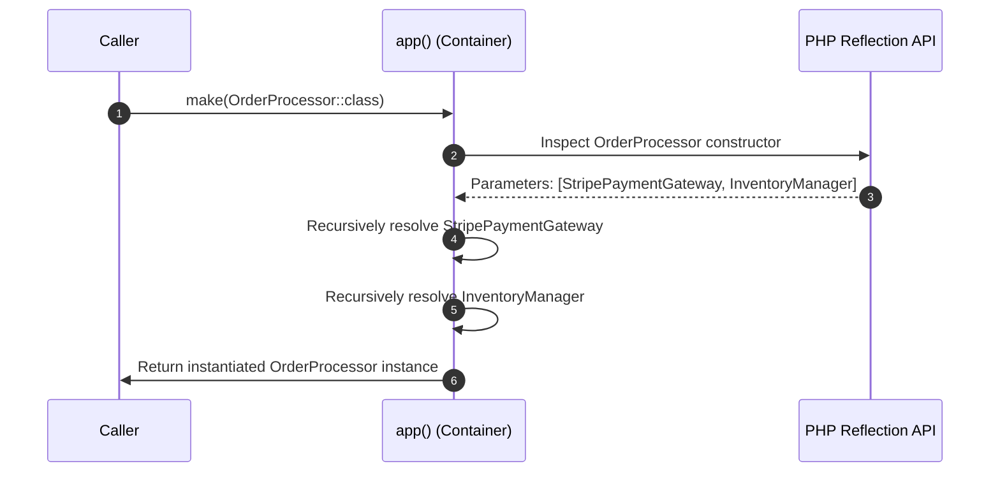

# 3.5.3. Laravel Service Container and Service Providers

> [!info] The Service Container and Service Providers form the core architectural foundation of Laravel. They manage class instantiation, automate dependency injection via reflection, and coordinate application bootstrapping.
> This note analyzes container binding modes, explores reflection-based automatic resolution, and unpacks the two-phase registration lifecycle of service providers.

---

## 1. The IoC Container: Core Mechanics

The Laravel **Service Container** is a powerful tool for managing class dependencies and performing dependency injection. At its core, it is an Inversion of Control (IoC) container.

When we say "Inversion of Control," we mean that instead of classes manually instantiating their collaborators via the `new` keyword, the container manages instantiation and resolves those collaborators recursively, injecting them where requested.

The container is represented by the `Illuminate\Container\Container` class. In a running Laravel application, the primary Application instance (`Illuminate\Foundation\Application`) inherits from this class. Consequently, the container can be accessed globally via the `app()` helper or by resolving the `Illuminate\Contracts\Container\Container` contract.

```mermaid
mindmap
  root((Laravel Container))
    Binding Modes
      bind() - fresh instance per call
      singleton() - shared single instance
      scoped() - unique per request lifecycle
      instance() - pre-constructed object
    Automatic Resolution
      Reflection API
      Constructor inspection
      Recursive dependency tree
    Service Providers
      register() - bindings only
      boot() - side-effects & usage
```

---

## 2. Binding Modes and Object Lifetimes

To use the container, you must first register **bindings** (mapping abstract keys or interfaces to concrete implementations) and then **resolve** them.

There are four primary ways to bind classes into the container, each establishing a distinct object lifetime:

### 2.1 Transient Bindings (`bind()`)
A transient binding instructs the container to construct a **fresh, new instance** of the specified class on every single resolution.

```php
$this->app->bind(PaymentGatewayInterface::class, StripePaymentGateway::class);
```

### 2.2 Singleton Bindings (`singleton()`)
A singleton binding instructs the container to construct the object **only once** per application lifecycle. Subsequent resolutions return the exact same cached instance.

```php
$this->app->singleton(MetricsCollector::class, function ($app) {
    return new MetricsCollector(config('metrics.api_key'));
});
```

### 2.3 Scoped Bindings (`scoped()`)
A scoped binding behaves like a singleton **within the scope of a single request lifecycle**. If the application is running in a long-running process worker (such as Laravel Octane, RoadRunner, or Swoole), a scoped bean is destroyed and reset between requests, whereas a standard singleton persists in memory across all requests.

```php
$this->app->scoped(ActiveUserContext::class, function ($app) {
    return new ActiveUserContext($app->make('request')->user());
});
```

### 2.4 Instance Bindings (`instance()`)
Used to bind an already instantiated, pre-constructed object into the container.

```php
$externalClient = new ThirdPartyClient('secret-token');
$this->app->instance(ThirdPartyClient::class, $externalClient);
```

---

## 3. Reflection-Based Automatic Resolution

One of Laravel's most significant developer productivity features is **Zero-Configuration Automatic Resolution (Auto-wiring)**. You do not need to write manual bindings for a class if it only depends on concrete classes.

Laravel achieves this by inspecting constructors using PHP’s native **Reflection API**:

```php
namespace App\Services;

class OrderProcessor
{
    // No binding is registered in any Service Provider for this class!
    public function __construct(
        protected StripePaymentGateway $payment,
        protected InventoryManager $inventory
    ) {}
}
```

When you request the container to resolve `OrderProcessor`:
1. The container inspects the `OrderProcessor` constructor.
2. It detects that the constructor demands `StripePaymentGateway` and `InventoryManager`.
3. It recursively calls `app()->make(StripePaymentGateway::class)` and `app()->make(InventoryManager::class)`.
4. Once those dependencies are resolved, the container instantiates and returns the fully loaded `OrderProcessor`.



This recursive resolution eliminates massive amounts of XML or PHP configuration files, enabling rapid application development without sacrificing structural decoupling.

---

## 4. Service Providers: Application Bootstrapping Center

Service Providers are the central mechanism where Laravel applications are bootstrapped. Every application service, database connection, queue driver, and routing rule is registered and initialized via a service provider.

A service provider is a subclass of `Illuminate\Support\ServiceProvider`. It contains two core lifecycle methods: `register()` and `boot()`.

```php
namespace App\Providers;

use Illuminate\Support\ServiceProvider;
use App\Services\PaymentGatewayInterface;
use App\Services\StripePaymentGateway;

class PaymentServiceProvider extends ServiceProvider
{
    /**
     * Phase 1: Register bindings.
     * ONLY bind services into the container. Do not execute other code.
     */
    public function register(): void
    {
        $this->app->singleton(PaymentGatewayInterface::class, function ($app) {
            return new StripePaymentGateway(config('services.stripe.secret'));
        });
    }

    /**
     * Phase 2: Bootstrapping execution.
     * Invoked after EVERY service provider's register method has completed.
     */
    public function boot(): void
    {
        // Safe to use any container-bound service or apply framework-level side-effects
        \Illuminate\Support\Facades\Blade::directive('currency', function ($expression) {
            return "<?php echo number_format($expression, 2); ?>";
        });
    }
}
```

### 4.1 The Importance of Lifecycle Splitting
The distinction between `register()` and `boot()` is a critical design pattern that prevents order-of-initialization bugs:
* **`register()`:** Designed **exclusively for container binding**. You must not trigger database queries, register routes, fire events, or resolve other bound services here because the provider responsible for those resources may not have run yet.
* **`boot()`:** Invoked only after every single provider listed in your configuration has successfully completed its `register()` phase. This guarantees that all services are bound and ready to be resolved safely.

---

## 5. Summary

Laravel's Service Container handles object instantiation and automated dependency resolution using the PHP Reflection API. Developers can bind classes using transient, singleton, or scoped lifetimes to manage memory and persistence correctly. Service Providers coordinate this system, dividing their work into a container-binding `register()` phase and an execution `boot()` phase to ensure safe, order-independent application initialization.

---

## See Also

- [[3.5.1. Laravel Overview and Installation]]
- [[3.5.2. Laravel Service Container and Eloquent]]
- [[3.5.4. Laravel Facades and Testability fakes]]
- [[3.4.2. SpringBoot IoC and Core Internals]]
