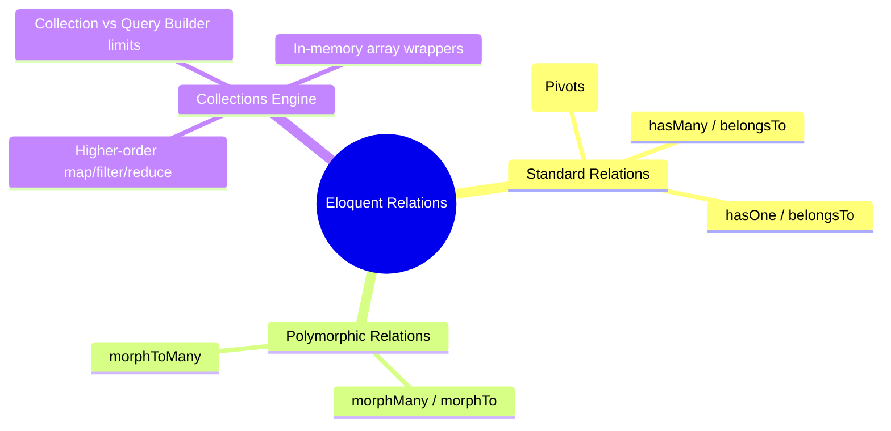

# 3.5.5. Laravel Eloquent Relationships and Collections

> [!info] Eloquent Relationships define how tables associate with one another, while Collections wrap query results in a fluent functional API.
> This note covers how to define standard and polymorphic relationships, manages custom pivot attributes, and examines the performance implications of in-memory collection processing versus database-level operations.

---

## 1. Core Relationship Definitions

Eloquent relationships are defined as methods on your Active Record models. Because relationships return an instance of `Illuminate\Database\Eloquent\Relations\Relation`, you can chain further query filters onto them before fetching the data.



### 1.1 One-to-Many Relationships
A user can have many posts; a post belongs to exactly one user.

```php
// app/Models/User.php
class User extends Model
{
    public function posts()
    {
        // Eloquent assumes the foreign key is user_id on the posts table
        return $this->hasMany(Post::class);
    }
}

// app/Models/Post.php
class Post extends Model
{
    public function user()
    {
        return $this->belongsTo(User::class);
    }
}
```

---

## 2. Many-to-Many & Pivot Tables

Establishing a many-to-many relationship requires a middle "join" table. By default, Eloquent assumes a naming convention of alphabetized singular model names (e.g., `user_role` for `User` and `Role`).

```php
// app/Models/User.php
class User extends Model
{
    public function roles()
    {
        return $this->belongsToMany(Role::class);
    }
}
```

### 2.1 Working with Pivot Columns
If your intermediary table contains extra attributes (e.g., who granted the role, or a timestamp), you must declare them explicitly using the `withPivot` and `withTimestamps` methods:

```php
// Inside User.php
public function roles()
{
    return $this->belongsToMany(Role::class)
                ->withPivot('assigned_by')
                ->withTimestamps();
}
```

You can access these dynamic pivot attributes via the intermediate `$role->pivot` model property on the resolved relations:

```php
$user = User::with('roles')->first();

foreach ($user->roles as $role) {
    echo "Role: {$role->name} assigned by: {$role->pivot->assigned_by}";
}
```

---

## 3. Polymorphic Relationships

Polymorphic relations allow a single model to belong to more than one other model type on a single association column.

Imagine you want a `Comment` model to belong to both `Post` models and `Video` models.

```php
// database/migrations/create_comments_table.php
Schema::create('comments', function (Blueprint $table) {
    $table->id();
    $table->text('body');
    // Generates: commentable_id (bigint) and commentable_type (varchar)
    $table->numericMorphs('commentable'); 
    $table->timestamps();
});
```

### 3.1 Model Definitions

The child comment model defines a dynamic `morphTo` relationship:

```php
// app/Models/Comment.php
class Comment extends Model
{
    public function commentable()
    {
        return $this->morphTo();
    }
}
```

The parent models define a `morphMany` relationship:

```php
// app/Models/Post.php
class Post extends Model
{
    public function comments()
    {
        return $this->morphMany(Comment::class, 'commentable');
    }
}

// app/Models/Video.php
class Video extends Model
{
    public function comments()
    {
        return $this->morphMany(Comment::class, 'commentable');
    }
}
```

When a comment is created on a Post with ID `12`:
* `commentable_id` stores `12`.
* `commentable_type` stores `App\Models\Post`.

When you resolve `$comment->commentable`, Eloquent inspects the `commentable_type` string, instantiates the corresponding model class, and queries the correct table dynamically.

---

## 4. The Collection Engine: In-Memory vs DB Operations

When you execute an Eloquent query using `get()`, `all()`, or `pluck()`, the return value is not a plain PHP array, but an instance of `Illuminate\Database\Eloquent\Collection`. This collection wraps native PHP arrays in a highly expressive, fluent, functional interface.

### 4.1 Collection Pipelines
Collections allow you to chain functional transformations:

```php
$activeAuthors = User::with('posts')->get()
    ->filter(fn ($user) => $user->posts->count() > 5)
    ->map(fn ($user) => [
        'name' => strtoupper($user->name),
        'total_views' => $user->posts->sum('view_count')
    ])
    ->sortByDesc('total_views')
    ->values(); // Reset array indexes
```

### 4.2 The Performance Pitfall: DB Processing vs PHP Memory

The flexibility of collections frequently leads to significant performance regressions in production. Developers must remember that **Collections are eager and process data in PHP memory**, whereas the **Query Builder executes operations inside the database engine**.

```php
// ❌ INCORRECT (Severe Performance Scent)
// This loads 1,000,000 database rows into PHP memory,
// instantiates 1,000,000 User objects, and filters them in PHP!
$activeCount = User::all()->filter(fn($u) => $u->active === true)->count();

// ✅ CORRECT (High Performance)
// This compiles down to: SELECT COUNT(*) FROM users WHERE active = 1;
// Only a single integer is returned to PHP memory!
$activeCount = User::where('active', true)->count();
```

#### Rule of Thumb:
* **Filter, order, aggregate, and limit in the Database** using the Query Builder (`where()`, `orderBy()`, `count()`, `select()`) wherever possible.
* **Use Collections only for post-processing** and formatting the final, already-minimized dataset in-memory.

---

## 5. Summary

Eloquent Relationships enable standard (one-to-many, many-to-many) and advanced (polymorphic) associations through native, fluent PHP class methods. Many-to-many relationships are bridged using pivot tables whose custom columns are accessed dynamically. Resulting Eloquent datasets are returned as functional collections. Developers must separate in-memory collection processing from database query builders to avoid loading massive database footprints into web worker memory.

---

## See Also

- [[3.5.1. Laravel Overview and Installation]]
- [[3.5.2. Laravel Service Container and Eloquent]]
- [[3.5.6. Laravel Eloquent Query Optimization and N1 Problem]]
- [[4.1. ORM Fundamentals]]
