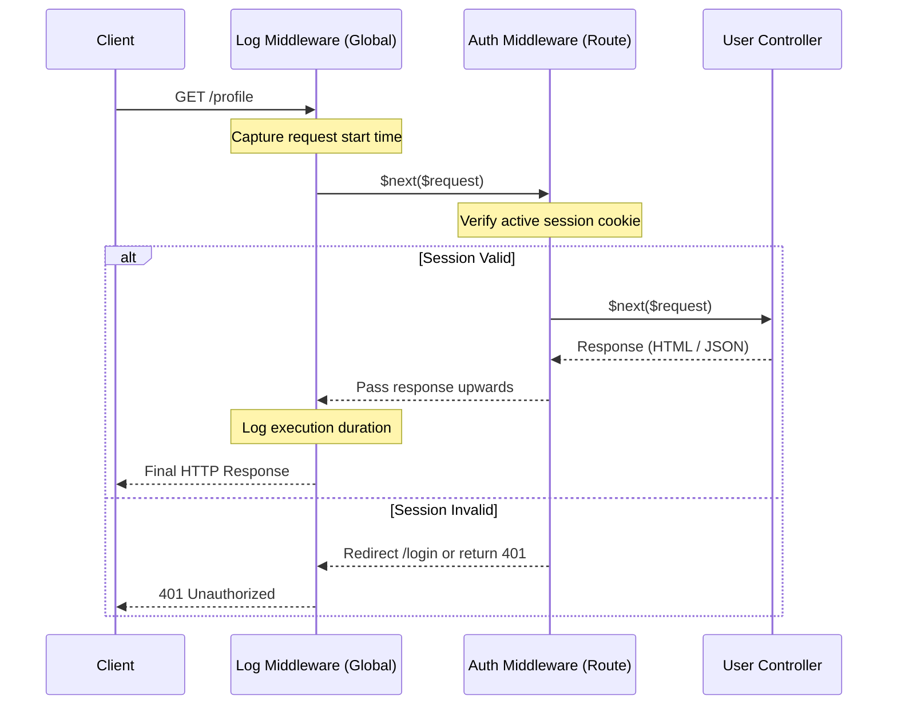

# 3.5.7. Laravel Middleware and Route Pipelines

> [!info] Orientation
> Middleware provides a convenient mechanism for inspecting and filtering HTTP requests entering your Laravel application. In Laravel 11, the middleware architecture has been streamlined, relocating configurations from legacy kernel files into the single, unified `bootstrap/app.php` entry point. This note details the execution lifecycle of Laravel middleware, writing custom middleware, and managing route pipelines.

---

## 1. The HTTP Kernel Pipeline and Middleware Lifecycle

Laravel executes middleware using the **Decorating Filter (Pipeline)** pattern. The incoming HTTP request is treated as a payload passed through a series of middleware closures.

Each middleware has the opportunity to:
1. Pre-process the request (run checks *before* delegating downstream).
2. Execute the downstream request handler (controller) by invoking the `$next($request)` callback.
3. Post-process the response (modify headers or cookies *after* the controller finishes).



---

## 2. Writing Custom Middleware

To generate a custom middleware, use the Artisan CLI:

```bash
php artisan make:middleware EnsureEmailIsVerified
```

This creates a class template inside `app/Http/Middleware/`:

### A. Pre-Middleware (Check first, then run)
If you run operations *before* the request proceeds, execute them before calling `$next($request)`:

```php
namespace App\Http\Middleware;

use Closure;
use Illuminate\Http\Request;
use Symfony\Component\HttpFoundation\Response;

class EnsureEmailIsVerified
{
    public function handle(Request $request, Closure $next): Response
    {
        // 1. Pre-processing Check
        if ($request->user() && ! $request->user()->email_verified_at) {
            return response()->json(['error' => 'Email address is not verified.'], 403);
        }

        // 2. Delegate downstream safely
        return $next($request);
    }
}
```

### B. Post-Middleware (Run controller first, then modify response)
To modify the generated response (e.g., adding secure headers), capture the response object before exiting:

```php
class AddSecurityHeaders
{
    public function handle(Request $request, Closure $next): Response
    {
        // 1. Let the downstream pipeline run first
        $response = $next($request);

        // 2. Post-process the response object
        $response->headers->set('X-Frame-Options', 'DENY');
        $response->headers->set('X-Content-Type-Options', 'nosniff');

        return $response;
    }
}
```

---

## 3. Registering Middleware in Laravel 11

In Laravel 11, the legacy file `app/Http/Kernel.php` has been removed. Global, group, and route-scoped middlewares are now configured inside the slim bootstrap configuration file `bootstrap/app.php`:

```php
// bootstrap/app.php
use Illuminate\Foundation\Application;
use Illuminate\Foundation\Configuration\Middleware;
use App\Http\Middleware\AddSecurityHeaders;
use App\Http\Middleware\EnsureEmailIsVerified;

return Application::configure(basePath: dirname(__DIR__))
    ->withRouting(
        web: __DIR__.'/../routes/web.php',
        api: __DIR__.'/../routes/api.php',
        commands: __DIR__.'/../routes/console.php',
        health: '/up',
    )
    ->withMiddleware(function (Middleware $middleware) {
        // 1. Append middleware globally to the HTTP stack
        $middleware->append(AddSecurityHeaders::class);

        // 2. Define custom route-middleware aliases
        $middleware->alias([
            'verified' => EnsureEmailIsVerified::class,
        ]);
        
        // 3. Customize default group behavior (e.g. disabling CSRF validation on API webhooks)
        $middleware->web(validateCsrfTokens: [
            'webhooks/*'
        ]);
    })
    ->create();
```

---

## 4. Applying Scoped Middleware onto Route Groups

Once your middleware alias is defined in `bootstrap/app.php`, you can apply it directly to specific endpoints or route groups inside your route definitions:

```php
// routes/web.php
use Illuminate\Support\Facades\Route;
use App\Http\Controllers\DashboardController;

// Protect a group of routes using the 'auth' and custom 'verified' middleware
Route::middleware(['auth', 'verified'])->group(function () {
    Route::get('/dashboard', [DashboardController::class, 'index']);
    Route::post('/settings', [DashboardController::class, 'save']);
});
```

---

## Summary

Laravel 11 streamlines middleware configuration into the unified `bootstrap/app.php` entry point. By writing custom handlers that manage pre- and post-processing cycles via clean `$next($request)` execution layers, developers can modularize cross-cutting concerns like CORS policies, request tracing, and security validations with ease.

## See Also

- [[3.5.1. Laravel Overview and Installation]]
- [[3.5.3. Laravel Service Container and Service Providers]]
- [[3.5.10. Laravel Form Validation and Request Objects]]
- [[3.5.11. Laravel Authentication and Security]]
```
