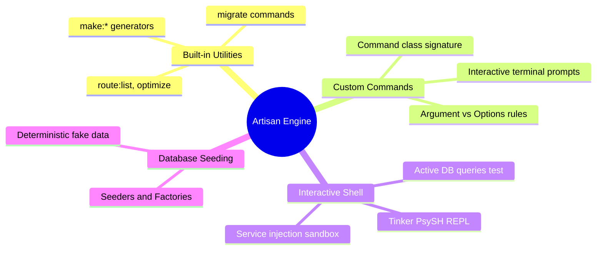

# 3.5.8. Laravel Artisan CLI and Custom Commands

> [!info] Orientation
> Laravel’s **Artisan** command-line interface provides powerful development utilities, generator templates, and a sandbox shell. This note details the essential built-in commands, walks through writing custom CLI commands, explores the interactive Tinker REPL, and covers database seeding workflows.

---

## 1. The Artisan CLI Engine Architecture

The Artisan CLI is built on top of the robust **Symfony Console** component. Artisan acts as the command hub for your application, allowing you to generate boilerplate files, execute database migrations, clear configuration caches, and run asynchronous background queue workers.



---

## 2. Writing a Custom Artisan Command

To automate recurring tasks (such as database cleanups, scraping jobs, or cron utilities), you can write custom Artisan commands.

First, generate the command skeleton:

```bash
php artisan make:command CleanupTempRecords
```

This creates a new class file inside `app/Console/Commands/CleanupTempRecords.php`:

```php
namespace App\Console\Commands;

use Illuminate\Console\Command;
use App\Models\TemporaryRecord;

class CleanupTempRecords extends Command
{
    /**
     * The name and signature of the console command.
     * Arguments use '{name}', options use '{--option}'.
     *
     * @var string
     */
    protected $signature = 'app:cleanup-temp-records {days=7 : The age of records to remove in days} {--force : Avoid safety prompts}';

    /**
     * The console command description shown in lists.
     *
     * @var string
     */
    protected $description = 'Safely deletes expired temporary records from the database.';

    /**
     * Execute the console command.
     */
    public function handle()
    {
        // 1. Extract arguments and options
        $days = (int) $this->argument('days');
        $force = $this->option('force');

        $cutoffDate = now()->subDays($days);
        $expiredCount = TemporaryRecord::where('created_at', '<', $cutoffDate)->count();

        if ($expiredCount === 0) {
            $this->info("No expired records found older than {$days} days.");
            return Command::SUCCESS;
        }

        // 2. Perform interactive safety prompt if --force is missing
        if (! $force) {
            $confirmed = $this->confirm(
                "Are you sure you want to delete {$expiredCount} temporary records older than {$days} days?"
            );
            
            if (! $confirmed) {
                $this->warn("Cleanup operation cancelled by administrator.");
                return Command::FAILURE;
            }
        }

        // 3. Perform delete transaction
        TemporaryRecord::where('created_at', '<', $cutoffDate)->delete();
        $this->info("Successfully cleared {$expiredCount} expired temporary records.");

        return Command::SUCCESS;
    }
}
```

You can now run this command directly from your terminal:

```bash
php artisan app:cleanup-temp-records 14 --force
```

---

## 3. The Tinker Sandbox (Interactive REPL)

One of Laravel's most useful features is **Tinker**, an interactive REPL shell powered by PsySH. It bootstraps your entire application environment inside your terminal, letting you execute queries, call methods, and test functions on your live database with ease.

To start Tinker, execute:

```bash
php artisan tinker
```

### Sandbox Examples:

```php
// 1. Fetch user records from DB in real-time
>>> App\Models\User::first();
=> App\Models\User {#5230
     id: 1,
     name: "Admin User",
     email: "admin@example.com",
   }

// 2. Test active helper functions
>>> bcrypt('securePassword');
=> "$2y$12$K1r.m6HlA48jB0Nq.8nBieF20W9X3v/jT2pZ8D7Q889"

// 3. Resolve a service directly from the Service Container
>>> app(\App\Services\PaymentService::class)->charge(100);
```

---

## 4. Database Seeding and Model Factories

Laravel provides a structured system to generate realistic test data to populate your local database environments quickly.

### A. Model Factories
Model Factories define the default attributes of your models, typically using the **Faker** library to generate realistic mock values:

```php
// database/factories/UserFactory.php
namespace Database\Factories;

use Illuminate\Database\Eloquent\Factories\Factory;

class UserFactory extends Factory
{
    public function definition(): array
    {
        return [
            'name' => $this->faker->name(),
            'email' => $this->faker->unique()->safeEmail(),
            'email_verified_at' => now(),
            'password' => bcrypt('password'), // default secure password
            'remember_token' => str_random(10),
        ];
    }
}
```

### B. Database Seeders
Seeders orchestrate your factories to populate tables in the correct order:

```php
// database/seeders/DatabaseSeeder.php
namespace Database\Seeders;

use Illuminate\Database\Seeder;
use App\Models\User;
use App\Models\Post;

class DatabaseSeeder extends Seeder
{
    public function run(): void
    {
        // 1. Generate 10 Users
        User::factory(10)->create()->each(function ($user) {
            // 2. Generate 3 Posts for each User
            Post::factory(3)->create([
                'user_id' => $user->id,
            ]);
        });
    }
}
```

Execute all seeders using:

```bash
php artisan db:seed
```

---

## Summary

The Artisan CLI provides a complete set of automation and sandbox tools. By writing custom CLI commands with structured arguments, leveraging the Tinker REPL sandbox to inspect running application states, and utilizing model factories and seeders, developers can easily manage application pipelines and test states.

## See Also

- [[3.5.1. Laravel Overview and Installation]]
- [[3.5.2. Laravel Service Container and Eloquent]]
- [[3.5.5. Laravel Eloquent Relationships and Collections]]
- [[3.5.12. Laravel Collections and Lazy Collections]]
