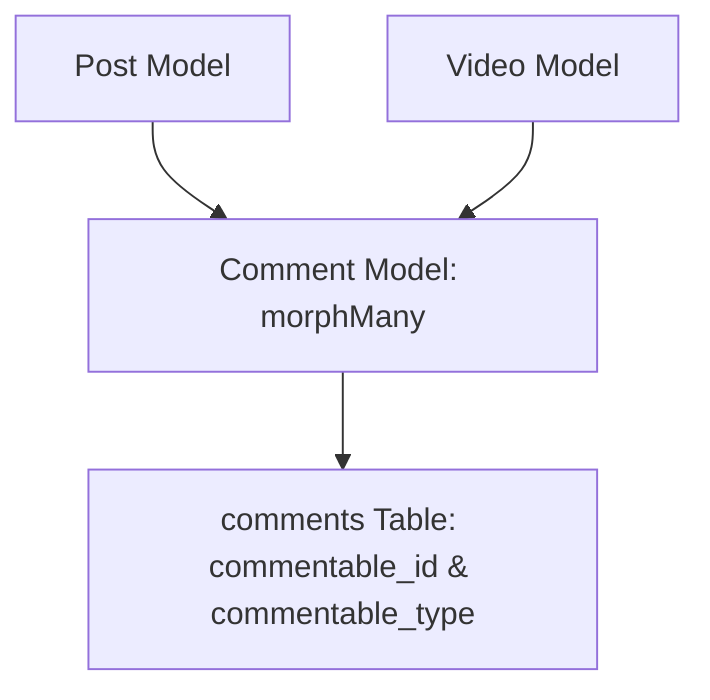

# 3.5.9. Laravel Advanced Eloquent and Polymorphic Relations

> [!info] Orientation
> Eloquent's Active Record ORM goes far beyond basic CRUD operations. For complex domain models, features like Polymorphic Relations, custom Query Scopes, Modern Attribute Mutators, and Model Observers are essential. This note explores these advanced paradigms to keep database operations secure and highly DRY.

---

## 1. What are Polymorphic Relations?

A **Polymorphic Relation** allows a single child model to belong to multiple parent models using a single association.

For example, on a social media site, both `Post` and `Video` models might support user comments. Instead of creating separate `post_comments` and `video_comments` tables, we can define a single, polymorphic `comments` table.



To support this polymorphism, the child table must feature two specific columns:
1. **`commentable_id`:** Stores the primary key ID of the parent post or video.
2. **`commentable_type`:** Stores the class namespace string of the parent model (e.g., `App\Models\Post` or `App\Models\Video`).

---

## 2. Implementing Polymorphic Models

### A. The Migration Schema
Set up the morph columns inside the child table's migration using Laravel's fluent schema builder:

```php
Schema::create('comments', function (Blueprint $table) {
    $table->id();
    $table->text('body');
    // Generates integer commentable_id & string commentable_type columns
    $table->morphs('commentable'); 
    $table->timestamps();
});
```

### B. Defining the Child Model (`Comment`)
Implement the `morphTo` relationship to resolve parent models dynamically:

```php
namespace App\Models;

use Illuminate\Database\Eloquent\Model;
use Illuminate\Database\Eloquent\Relations\MorphTo;

class Comment extends Model
{
    public function commentable(): MorphTo
    {
        return $this->morphTo();
    }
}
```

### C. Defining Parent Models (`Post` and `Video`)
Use the `morphMany` relationship to link parent instances to children:

```php
namespace App\Models;

use Illuminate\Database\Eloquent\Model;
use Illuminate\Database\Eloquent\Relations\MorphMany;

class Post extends Model
{
    public function comments(): MorphMany
    {
        return $this->morphMany(Comment::class, 'commentable');
    }
}
```

---

## 3. Local and Dynamic Query Scopes

Local Scopes allow you to encapsulate reusable query constraints directly inside your models, preventing duplication of database query logic across controllers.

To define a local scope, prefix your model method with **`scope`**:

```php
namespace App\Models;

use Illuminate\Database\Eloquent\Model;
use Illuminate\Database\Eloquent\Builder;

class Article extends Model
{
    /**
     * Scope to only include active, published articles.
     */
    public function scopePublished(Builder $query): Builder
    {
        return $query->where('status', 'published')->where('published_at', '<=', now());
    }

    /**
     * Dynamic Scope with parameters.
     */
    public function scopeMinReadingTime(Builder $query, int $minutes): Builder
    {
        return $query->where('reading_time', '>=', $minutes);
    }
}
```

### Usage inside Controllers:
You can chain scopes fluently when querying your models:

```php
$articles = Article::published()->minReadingTime(5)->get();
```

---

## 4. Modern Accessors and Mutators

Accessors and Mutators let you format database values when retrieving or writing model attributes. In modern Laravel, these are defined using a single, type-hinted method returning an `Attribute` cast:

```php
namespace App\Models;

use Illuminate\Database\Eloquent\Model;
use Illuminate\Database\Eloquent\Casts\Attribute;

class User extends Model
{
    /**
     * Get and set user's full name.
     */
    protected function name(): Attribute
    {
        return Attribute::make(
            // Accessor: Capitalize name on retrieval
            get: fn (string $value) => ucwords($value),
            
            // Mutator: Lowercase name before writing to DB
            set: fn (string $value) => strtolower($value),
        );
    }
}
```

---

## 5. Model Observers (Event Decoupling)

If your models trigger secondary events (such as sending emails, auditing actions, or generating slugs on creation), bloating your models with event hooks is an anti-pattern. Instead, isolate these operations inside an **Observer**.

First, generate the observer class:

```bash
php artisan make:observer UserObserver --model=User
```

```php
namespace App\Observers;

use App\Models\User;
use App\Mail\WelcomeMail;
use Illuminate\Support\Facades\Mail;

class UserObserver
{
    /**
     * Handle the User "created" event.
     */
    public function created(User $user): void
    {
        // Automatically send welcome email upon successful user creation
        Mail::to($user->email)->send(new WelcomeMail($user));
    }

    /**
     * Handle the User "saving" event.
     */
    public function saving(User $user): void
    {
        // Automatically generate username slug before saving
        $user->slug = str_slug($user->name);
    }
}
```

Register the observer inside your `app/Providers/AppServiceProvider.php` file:

```php
use App\Models\User;
use App\Observers\UserObserver;

public function boot(): void
{
    User::observe(UserObserver::class);
}
```

---

## Summary

Advanced Eloquent features structure large-scale database operations cleanly. By using Polymorphic relations to share comments or media files across models, local scopes to centralize database queries, modern Attribute casts to manage mutators, and decoupling lifecycle actions using Model Observers, developers can build robust, highly maintainable systems.

## See Also

- [[3.5.2. Laravel Service Container and Eloquent]]
- [[3.5.5. Laravel Eloquent Relationships and Collections]]
- [[3.5.6. Laravel Eloquent Query Optimization and N1 Problem]]
- [[3.5.12. Laravel Collections and Lazy Collections]]
