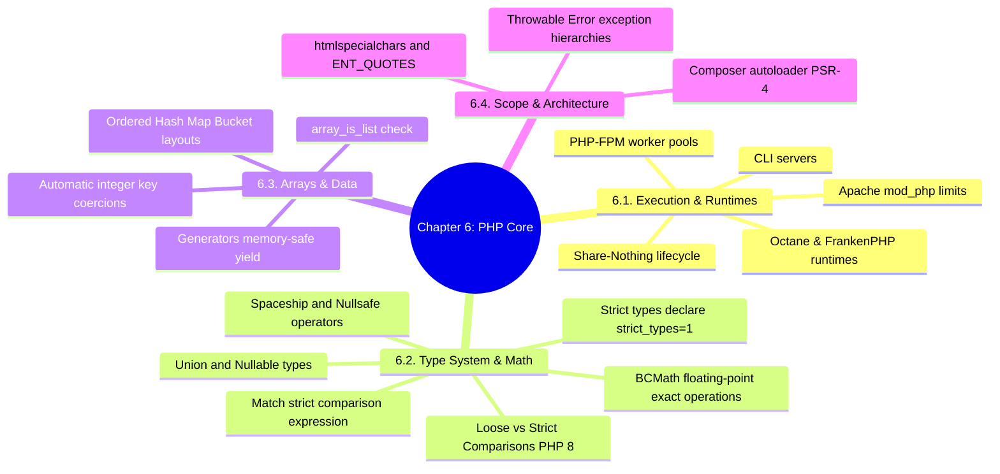

# 3.6.0. PHP Core Language MOC

> [!info] Map of Content Purpose
> This local index acts as your navigation hub for Chapter 6: Core PHP Language & Engine Specification. Writing secure, scalable, and high-performance applications in PHP requires understanding PHP's Share-Nothing execution models, type-coercion algorithms, HashTable internals, and context-aware escaping libraries.

---

## 1. Chapter Mind Map

The mind map below lays out the syntax, core structures, execution runtimes, and engine designs of PHP:

---

## 2. Topic Outline & Atomic Notes

This module has 21 comprehensive notes detailing the core mechanics and runtimes of the PHP language:

### [[3.6.1. PHP Execution Models|1. PHP Execution Models]]
*Analyzing PHP's classic Share-Nothing request/response cycle.*
* **Request Lifecycles:** Memory initialization, execution, complete variable destruction, and persistent Octane runtimes.

### [[3.6.2. Apache Server and PHP-FPM|2. Apache Server & PHP-FPM Pools]]
*How web servers execute PHP.*
* **PHP-FPM:** Running FastCGI Process Managers, process management modes (`static`, `dynamic`, `ondemand`), and worker pool configurations.

### [[3.6.3. PHP Built-in Server and CLI|3. PHP Built-in Server & CLI Environments]]
*Developing and running PHP from the command line.*
* **Development Servers:** Using `php -S` and CLI executors, thread limits, and routing restrictions.

### [[3.6.4. MariaDB vs MySQL|4. Database Management: MySQL vs MariaDB]]
*Picking the right relational storage system for PHP.*
* **Databases:** Comparing performance, licensing, indexing engines, and database client drivers (`PDO`).

### [[3.6.5. PHP Architectures|5. Scaling PHP System Architectures]]
*Architectural patterns for high-availability PHP systems.*
* **Scaling:** Horizontal scaling, stateless web workers, centralized caching (Redis), and load balancing.

### [[3.6.6. Echo Print and PrintR|6. Output Operations: echo, print & print_r]]
*How PHP outputs data to streams and buffers.*
* **Outputs:** Comparing evaluation expressions, byte returns, and recursive array output inspectors.

### [[3.6.7. Mixing PHP and HTML|7. Mixing PHP & HTML]]
*Inspecting template tag boundaries.*
* **Templating:** Short tag boundaries, inline script execution, and avoiding messy mixing anti-patterns.

### [[3.6.8. PHP Errors and Error Handling|8. PHP Error Levels & Custom Handlers]]
*How PHP tracks and responds to system errors.*
* **Errors:** Understanding `E_ERROR`, `E_WARNING`, and `E_NOTICE`, and using `set_error_handler()`.

### [[3.6.9. Constants and Define|9. Constants & Define Operations]]
*Declaring immutable values.*
* **Constants:** Comparing compile-time `const` keywords to runtime `define()` execution blocks.

### [[3.6.10. Strings and Numbers|10. String Syntax, Encodings & BCMath Precision]]
*Processing text data and precise decimals.*
* **Strings & Math:** Heredoc/Nowdoc string styles, multibyte operations, and exact precision operations using **BCMath** (`bcadd`).

### [[3.6.11. Booleans and Comparisons|11. Loose vs Strict Comparisons in PHP 8]]
*The comparison engine of PHP.*
* **Comparisons:** Loose (`==`) vs Strict (`===`) comparisons, and the major PHP 8 comparison engine overhaul.

### [[3.6.12. Conditions if else elseif switch|12. Conditionals & Switch Fall-Throughs]]
*Directing application execution flow.*
* **Conditions:** Constructing if-else paths, and avoiding fall-through bugs in legacy switch-case blocks.

### [[3.6.13. Loops for while foreach do-while|13. Loop Structures & foreach Reference Pointers]]
*Executing repetitive statements.*
* **Loops:** Writing array loops, value-copying loops, and avoiding the reference pointer bug in foreach loops.

### [[3.6.14. Break and Continue|14. Break & Continue Operations]]
*Controlling loop execution states.*
* **Loops Operations:** Short-circuiting execution using nested control depths (`break N`, `continue N`).

### [[3.6.15. Indexed Arrays|15. Indexed Arrays & Key Sorting]]
*Working with lists of data.*
* **Arrays:** Array list helpers, type coercions, and index sorting helpers (`sort()`).

### [[3.6.16. Associative Arrays|16. Associative Arrays & Key Coercion Rules]]
*Working with dictionaries.*
* **Key Coercions:** How PHP automatically casts floats, numeric strings, and null values inside arrays.

### [[3.6.17. Multi-Dimensional Arrays|17. Multi-Dimensional Arrays & Array Splitting]]
*Working with nested configurations and data tables.*
* **Nested Arrays:** Accessing nested trees, mapping arrays, and using array unpacking operators.

### [[3.6.18. htmlspecialchars and Output Escaping|18. Output Escaping & XSS Protection]]
*Protecting clients from malicious inputs.*
* **XSS Defenses:** Context-aware escaping using `htmlspecialchars()` with proper escaping parameters (`ENT_QUOTES`).

### [[3.6.19. Functions|19. Functions, Closures & First-Class Callables]]
*Writing reusable execution modules.*
* **Functions:** Variadics, named arguments, variable-capturing closures, arrow functions, and callables.

### [[3.6.20. Variable Scope|20. Variable Scope, Globals & Static Persistence]]
*Controlling the lifetime and visibility of variables.*
* **Scopes:** Local scopes, global variables, and using static variables inside functions across execution loops.

### [[3.6.21. Include and Require|21. Code Inclusion & Autoloading Engines]]
*How PHP registers and imports external classes.*
* **Autoloading:** Comparing `include` to `require`, autoloading classes using `spl_autoload_register()`, and managing namespaces with PSR-4 and Composer.

---

## 3. Prerequisite Knowledge & Downstream Impact

* **Prerequisites:** 
  - Having a basic understanding of server architectures and processes discussed in Chapter 0 is helpful.
* **Downstream Connections:**
  - PHP's share-nothing execution model explains the necessity of Laravel's Service Providers [[3.5.3. Laravel Service Container and Service Providers]].
  - Correct context-aware escaping [[3.6.18. htmlspecialchars and Output Escaping]] is the underlying system used by Blade templating engines [[3.5.1. Laravel Overview and Installation]].

---

*See also: [[00. Master Index]] — [[3.0. Chapter Index]]*
