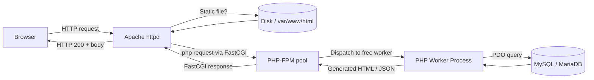

# 3.6.2. Apache Server and PHP-FPM

> [!info] Apache is the web server, PHP is the language engine, and PHP-FPM is the modern glue that connects them. This note explains what Apache actually does, why a PHP script cannot do it alone, and how the two communicate in a modern production setup.

## 1. What Apache Actually Is

Apache HTTP Server is a web server — one of the oldest and most battle-tested pieces of software on the internet. Its primary job is to listen for and respond to HTTP/HTTPS requests from web browsers. It is not a PHP interpreter, and a PHP script by itself cannot fulfil Apache's role. A PHP script is just a text file with instructions; it has no way to listen on a TCP port, manage concurrent connections, terminate SSL handshakes, or serve a 200-megabyte video file efficiently. Apache does all of those things, and only calls into PHP when a request requires dynamic processing.

Think of Apache as the front of house in a restaurant. The host, waiters, and manager greet customers (browser requests), take orders, manage all the tables (TCP connections), and bring out the food (the finished HTML page). They handle drinks and simple appetizers themselves — serving images, CSS, JavaScript, and static HTML files directly from disk. The PHP interpreter is the specialist chef in the kitchen: it never talks to customers. The waiter brings it a specific order (a request for a `.php` file), it prepares the dish (executes the script, queries the database), and hands the finished plate back to the waiter, who delivers it.

## 2. Why PHP Needs Apache (or Nginx)

A handful of jobs must happen before PHP code even gets to run, and these are the jobs Apache is built for. Understanding them clarifies why `php -S localhost:8000` is fine for development but unacceptable in production.

Apache listens on network ports — typically port 80 for HTTP and port 443 for HTTPS — and is the public-facing front door to the server. It manages hundreds or thousands of concurrent connections without crashing, using either a prefork model (one process per connection) or an event model (a small pool of worker threads reacting to I/O readiness). It serves static files directly from disk, which is dramatically faster than having PHP read and `echo` them. It routes requests based on URL patterns, deciding which ones to handle itself and which to forward to PHP. It terminates TLS, enforces access control via `.htaccess` rules, rewrites ugly query-string URLs into clean paths via `mod_rewrite`, and applies caching headers, gzip compression, and rate limiting. None of these are things PHP is good at, and all of them must work before a single line of PHP executes.

## 3. mod_php vs PHP-FPM

Apache needs a "connector" to talk to PHP, and historically there have been two ways to provide one. The choice between them is one of the most important configuration decisions in a LAMP stack.

### 3.1 mod_php (The Old Way)

`mod_php` is an Apache module that embeds a PHP interpreter directly inside each Apache worker process. It is simple to set up — install the package, restart Apache, and PHP works — but it has serious downsides. Every Apache worker, even ones serving static images or CSS, carries a full PHP interpreter in memory, which wastes RAM. The PHP version is locked to the Apache process, so upgrading PHP requires restarting the entire web server. Thread safety is a recurring headache because PHP extensions are not all thread-safe, which forces Apache to use the prefork MPM and forfeit the event-driven performance gains.

`mod_php` is essentially legacy at this point. It is still installed by default in some beginner-oriented tutorials and bundles, but it has no place in a modern production setup.

### 3.2 PHP-FPM (The Modern Way)

PHP-FPM (FastCGI Process Manager) is a separate, dedicated daemon that runs an optimised pool of PHP worker processes. Apache forwards PHP requests to FPM over the FastCGI protocol, FPM executes the script in one of its workers, and the result comes back to Apache, which sends it to the browser.

This split is more efficient because Apache workers do not need to carry a PHP interpreter, so they can serve static files with a tiny memory footprint. It is more secure because PHP runs as a separate user, isolated from the web server's privileges. It is more scalable because the FPM pool size can be tuned independently of Apache's worker count. And it is portable: the same FPM daemon can serve Nginx, Apache, or any other FastCGI-capable web server without changes.

## 4. The Apache + PHP-FPM Request Flow



The key insight from the diagram is that Apache acts as a router and security boundary. PHP-FPM never speaks directly to the browser, which means PHP code does not need to worry about TLS, slow-client handling, or static asset delivery. The FPM pool can be sized independently — for example, 50 Apache workers for static traffic and 10 PHP workers for dynamic workloads — so memory is allocated where it is actually needed.

## 5. Installing and Controlling Apache

### 5.1 Installation on Debian and Ubuntu

```bash
sudo apt update
sudo apt install apache2
```

### 5.2 Installation on Red Hat, CentOS, and Fedora

```bash
sudo dnf install httpd
```

### 5.3 Service Management

Apache is controlled through `systemctl` on any modern Linux distribution. The commands below assume the Debian/Ubuntu service name `apache2`; on Red Hat family systems the service is named `httpd` instead.

```bash
sudo systemctl start apache2     # Start the daemon
sudo systemctl stop apache2      # Stop the daemon
sudo systemctl restart apache2   # Hard restart (drops active connections)
sudo systemctl reload apache2    # Graceful reload of config (no downtime)
sudo systemctl enable apache2    # Start on boot
sudo systemctl disable apache2   # Do not start on boot
sudo systemctl status apache2    # Show current state
```

`reload` is preferable to `restart` in production because it re-reads the configuration without dropping in-flight requests. `restart` should be reserved for cases where a shared module must be reloaded.

## 6. Default Directories and Configuration

Apache's default document root on Debian and Ubuntu is `/var/www/html`. Replacing the default `index.html` with your own file is the quickest way to verify the install. The main configuration file is `/etc/apache2/apache2.conf` on Ubuntu and `/etc/httpd/conf/httpd.conf` on Red Hat. Virtual hosts — one configuration block per domain or subdomain — live in `/etc/apache2/sites-available/` and are enabled with `a2ensite`:

```bash
sudo a2ensite your-site.conf
sudo systemctl reload apache2
```

To enable PHP processing, install PHP and the Apache PHP-FPM module:

```bash
sudo apt install php-fpm libapache2-mod-fcgid
sudo a2enmod proxy proxy_fcgi setenvif
sudo a2enconf php8.2-fpm
sudo systemctl reload apache2
```

A `test.php` placed in `/var/www/html` containing `<?php phpinfo();` should now render the PHP info page at `http://localhost/test.php`. Remove that file immediately after verifying — `phpinfo()` leaks a dangerous amount of configuration detail to anyone who can reach it.

## 7. Apache vs. PHP at a Glance

| Feature | Apache HTTP Server | PHP Interpreter |
| ------- | ------------------ | --------------- |
| Primary role | Web server | Scripting language engine |
| What it does | Listens for traffic, serves files, enforces security | Executes PHP code, performs logic, talks to the database |
| Speaks | HTTP/HTTPS | PHP language syntax |
| Listens for | Browser connections on ports 80/443 | Instructions from a web server or the command line |
| Lifecycle | Runs continuously as a long-running service | Starts for one request, executes, then exits (in the request/response model) |

## 8. Production Pitfalls

A few mistakes show up repeatedly in Apache + PHP-FPM deployments. The first is leaving `mod_php` enabled after switching to FPM — both paths cannot coexist cleanly, and the resulting process model wastes memory. The second is mis-sizing the FPM pool: too few workers cause requests to queue, too many cause RAM exhaustion and OOM kills. A reasonable starting point is `pm = dynamic` with `pm.max_children` set so that `max_children × memory_per_request` is roughly 75% of available RAM. The third is using `.htaccess` files in production — they are re-read on every request, which is wasteful. Moving the rules into the main server config and setting `AllowOverride None` eliminates the overhead. Finally, never expose `phpinfo()` or the `/server-status` handler to the public internet; both leak configuration details that attackers use to plan exploits.

## Summary

Apache is the front door, PHP-FPM is the kitchen, and the FastCGI protocol is the order ticket that passes between them. Modern PHP deployments use PHP-FPM exclusively — `mod_php` is legacy. The split lets Apache focus on what it is good at (connection handling, TLS, static files, security) and lets PHP focus on what it is good at (executing application code). Understanding the request flow through Apache → FPM → worker → database makes every other PHP deployment decision easier to reason about.

## See Also

- [[3.6.1. PHP Execution Models]]
- [[3.6.3. PHP Built-in Server and CLI]]
- [[6.2. Docker vs Apache for PHP]]
- [[6.3. Nginx Reverse Proxy and Load Balancing]]

## References

- Apache HTTP Server Documentation — httpd.apache.org/docs
- PHP-FPM configuration manual — php.net/manual/en/install.fpm
- Apache `mod_proxy_fcgi` documentation — httpd.apache.org/docs/current/mod/mod_proxy_fcgi.html
