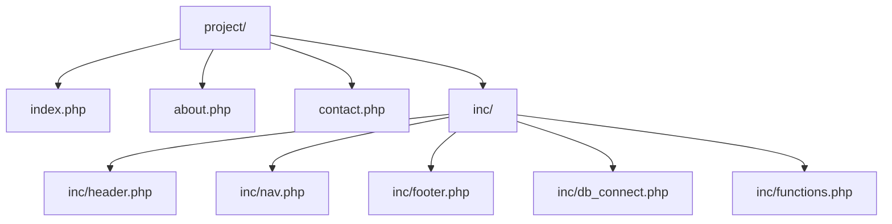

# 3.6.21. Include and Require

> [!info] `include` and `require` are PHP's language constructs for inserting one PHP file's contents into another. They are the basic mechanism for code reuse, modular file organisation, and template rendering. Their `_once` variants prevent duplicate inclusions. In modern PHP, however, manual `require_once` calls have largely been replaced by Composer's PSR-4 autoloader, which loads classes on demand. This note covers the four inclusion constructs, the often-overlooked return value of an included file, and the modern PSR-4 / Composer alternative.

## 1. The Purpose — Why Include Files

Imagine building a website with many pages. Each page likely needs the same navigation bar (`nav.php`), the same footer (`footer.php`), a database connection setup (`db_connect.php`), and a collection of utility functions (`functions.php`). Instead of copying and pasting this code into every file, you can put it into separate files and `include` or `require` it wherever needed.

A typical project layout:



The `inc/` directory holds shared files that multiple pages include. This pattern is the foundation of code reuse in PHP — see [[3.6.5. PHP Architectures]] for how it evolves into the Front Controller and framework-based architectures.

## 2. include — Non-Fatal on Missing File

The `include` statement embeds the specified file. If the file cannot be found, PHP generates a **Warning** and the script continues executing any code after the `include` statement.

```php
<?php
echo 'Starting script.<br>';
include 'ninjas.php';  // File does NOT exist
echo 'End of script. This line will still run.<br>';
```

Output:

```text
Starting script.
Warning: include(ninjas.php): Failed to open stream: No such file or directory in ...
End of script. This line will still run.
```

Use `include` when the file being included is *optional* or not absolutely critical for the rest of the script to run. A common use case is for template fragments like a sidebar that might not always be present on every page.

## 3. require — Fatal on Missing File

The `require` statement is identical to `include` except for error handling. If the file cannot be found, PHP generates a **Fatal Error** and the script halts immediately at the point of the error. No code after the `require` runs.

```php
<?php
echo 'Starting script.<br>';
require 'ninjas.php';  // File does NOT exist
echo 'End of script. This line will NOT run.<br>';
```

Output:

```text
Starting script.
Fatal error: require(): Failed opening required 'ninjas.php' (include_path='.:/usr/share/php') in ...
```

Use `require` when the file being included is **essential** for the script's core functionality. A database connection file, a class definition, or a critical functions file that the rest of the script depends on should always be `require`d — there is no point continuing if the dependency is missing.

## 4. The `_once` Variants

Sometimes you might include the same file multiple times inadvertently, especially in larger applications where different components depend on the same shared files. This can lead to problems like redefining functions or classes, causing `Fatal Error: Cannot redeclare function/class`, or unnecessary processing that impacts performance.

To prevent this, PHP offers `include_once` and `require_once`. They behave like their non-`_once` counterparts but check if the file has already been included; if it has, they skip the inclusion. If the file is missing, `include_once` generates a Warning and continues; `require_once` generates a Fatal Error and stops.

```php
<?php
// functions.php defines greet()
require_once 'functions.php';  // First inclusion — loads the file
require_once 'functions.php';  // Skipped — already included

greet();  // Function is defined and callable
```

If you had used `require` instead of `require_once` for the second line, you would get a `Fatal Error: Cannot redeclare function greet()`.

### 4.1 Why `require_once` Is Slow

The `require_once` and `include_once` constructs maintain a list of every file that has been included so far. On every call, they perform path normalisation (resolving symlinks, collapsing `..`, etc.) on the requested path and compare it against the list. This is more expensive than a plain `require` and was historically a meaningful performance cost on large codebases.

In modern PHP this overhead is much smaller (the engine optimises the check), but the bigger reason to avoid manual `require_once` in modern code is that **autoloading replaces it entirely**. With Composer's PSR-4 autoloader, you write zero `require_once` statements for classes — they are loaded on demand the first time they are referenced. See section 6.

## 5. The Return Value of an Included File

A frequently overlooked feature: an included file can `return` a value, and that value is available at the call site. This turns `include` and `require` into a lightweight configuration loader — you can store configuration as a PHP array in a file, and `require` it to get the array back.

**File: `config.php`**

```php
<?php
return [
    'db' => [
        'host'     => 'localhost',
        'name'     => 'myapp',
        'user'     => 'root',
        'password' => 'secret',
    ],
    'debug' => true,
];
```

**File: `index.php`**

```php
<?php
$config = require 'config.php';
echo $config['db']['host'];  // localhost
```

This pattern is used by many PHP frameworks for configuration files. It is faster than parsing JSON or YAML (no parsing step — PHP loads the array directly), it can contain conditional logic if needed, and it produces a PHP-syntax-checked file (you cannot accidentally ship a malformed config file — PHP would fail to parse it on the first request).

## 6. Modern Alternative — Autoloading with PSR-4 and Composer

In modern PHP, you should not manually `require_once` class files. Instead, you register an autoloader that loads classes on demand the first time they are referenced. The standard mechanism is Composer's PSR-4 autoloader.

### 6.1 PSR-4 in Brief

PSR-4 is a standard mapping between fully-qualified class names and file paths. The rule is: the namespace prefix corresponds to a base directory, and the rest of the namespace corresponds to subdirectories. So a class `App\Services\EmailService` lives in `<base_dir>/App/Services/EmailService.php`.

With Composer, you declare this mapping in `composer.json`:

```json
{
    "autoload": {
        "psr-4": {
            "App\\": "src/"
        }
    }
}
```

After running `composer install` or `composer dump-autoload`, Composer generates a `vendor/autoload.php` file. Your application's entry point includes that one file:

```php
<?php
require __DIR__ . '/vendor/autoload.php';

$email = new App\Services\EmailService();  // File loaded automatically
```

The first time `App\Services\EmailService` is referenced, the autoloader resolves it to `src/Services/EmailService.php` and `require`s it. You never write a manual `require_once` for any class.

### 6.2 `__autoload` Is Deprecated

PHP used to support a single `__autoload()` function for autoloading. This is **deprecated and removed in PHP 8**. Always use `spl_autoload_register()` to register autoloaders — it supports multiple autoloaders (so your framework, your app, and your libraries can each register one) and is the only supported mechanism. Composer's autoloader uses `spl_autoload_register` internally.

### 6.3 Classmap Autoloading

For classes that do not follow PSR-4 (legacy code, generated code), Composer also supports a `classmap` autoloader that scans specified directories and builds a map of class name to file path:

```json
{
    "autoload": {
        "psr-4": { "App\\": "src/" },
        "classmap": ["lib/"]
    }
}
```

`composer dump-autoload --optimize` generates a flat classmap even for PSR-4 classes, which is faster in production because the autoloader does a single array lookup instead of a filesystem path resolution on each class load.

## 7. Practical Example — A Simple Page

A common pattern is to `require_once` the header, render the page content, and `require_once` the footer:

```php
<?php
require_once 'inc/header.php';
?>
<h1><?php echo 'some content!'; ?></h1>
<div>This is main content area.</div>
<?php
require_once 'inc/footer.php';
```

This is fine for a small site. For anything larger, graduate to a Front Controller pattern (see [[3.6.5. PHP Architectures]]) where a single `index.php` routes to controllers, and controllers render templates through a template engine.

## 8. Summary Table

| Construct | File not found | Duplicate inclusion | Common use case | Recommendation |
| --------- | -------------- | ------------------- | --------------- | -------------- |
| `include` | Warning, continues | Includes again | Optional content (sidebars) | Use `_once` when possible |
| `require` | Fatal Error, halts | Includes again | Essential files | Prefer `require_once` for critical files |
| `include_once` | Warning, continues | Skipped | General templating | Good for non-critical reusable components |
| `require_once` | Fatal Error, halts | Skipped | Loading class definitions, configs | Recommended default for manual inclusion |

In modern PHP, manual `require_once` is mostly restricted to: (a) the Composer autoloader entry point (`require __DIR__ . '/vendor/autoload.php';`), (b) configuration files that return arrays, and (c) template files in non-framework code. Everything else should be autoloaded.

## Summary

`include` and `require` insert one PHP file into another. `include` warns and continues on a missing file; `require` halts with a Fatal Error. The `_once` variants prevent duplicate inclusions but at the cost of path-normalisation overhead. An included file can `return` a value, which makes `require` a lightweight config loader. In modern PHP, manual `require_once` is largely replaced by Composer's PSR-4 autoloader, which loads classes on demand based on namespace-to-path mapping. The deprecated `__autoload` function has been removed in PHP 8 — always use `spl_autoload_register` (which Composer does for you).

## See Also

- [[3.6.5. PHP Architectures]]
- [[3.6.19. Functions]]
- [[3.6.8. PHP Errors and Error Handling]]
- [[3.6.20. Variable Scope]]

## References

- PHP Manual: "include" — php.net/manual/en/function.include
- PHP Manual: "require_once" — php.net/manual/en/function.require-once
- PHP Manual: "Autoloading classes" — php.net/manual/en/language.oop5.autoload
- PSR-4 autoloader specification — www.php-fig.org/psr/psr-4
- Composer documentation — getcomposer.org/doc
