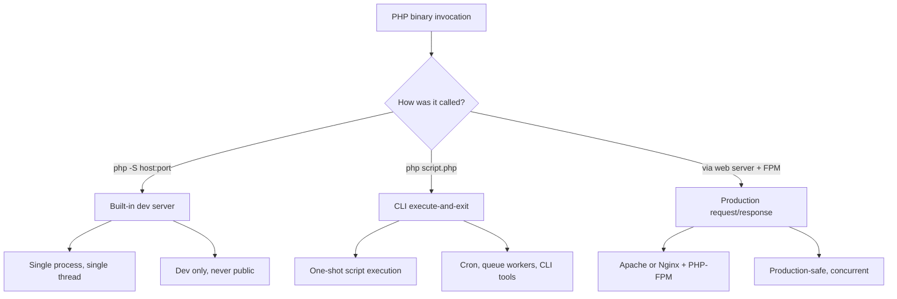

# 3.6.3. PHP Built-in Server and CLI

> [!info] PHP ships with a tiny single-process web server intended for development, and a command-line interpreter that runs PHP scripts the same way Python or Bash scripts run. Both are invaluable tools and both have sharp edges that catch beginners. This note covers what they are, when to use them, and the gotchas that bite when they are misused.

## 1. The Built-in Web Server

The command `php -S localhost:8000` starts PHP's built-in web server. Despite the name, this is not a production web server. It is a development convenience that lets a developer run a PHP application on any machine that has PHP installed, with zero configuration, no Apache, no Nginx, and no Docker.

### 1.1 What It Does

When the command runs, PHP enters a special mode in which one process does two jobs at once. It binds to the address and port you specify (here `localhost:8000`) and listens for HTTP requests. When a request arrives, it looks up the requested path on disk; if the file is a `.php` file, it executes that file in a fresh script context, captures the output, and sends it back as the response body. Static files like CSS, JavaScript, and images are read from disk and sent verbatim.

This is fundamentally different from a production setup. In production, the web server (Apache or Nginx) and the PHP processor (PHP-FPM) are two separate, highly optimised programs with different roles. With the built-in server, one PHP process tries to do both jobs simultaneously, and it is not good at either of them when the load rises.

### 1.2 Why You Should Not Use It in Production

The PHP documentation itself warns explicitly: *This web server was designed to aid application development. It is not a full-featured web server. It should not be used on a public network.* The reasons matter and are worth understanding in detail.

The server is single-threaded and handles one request at a time. If one user triggers a request that takes three seconds — say, generating a large report or making a slow external API call — every other user who tries to load a page during those three seconds waits in a queue. Their browsers just spin until the previous request finishes. Apache and Nginx, by contrast, are designed for concurrency and can handle thousands of simultaneous connections, handing the PHP work off to a pool of workers.

Static file performance is poor. While the built-in server *can* serve images, CSS, and JavaScript, it does so by reading them into PHP's memory and writing them back out, with none of the kernel-level optimisations (like `sendfile`) that real web servers use. A page with twenty static assets will load noticeably slower than it would under Apache or Nginx.

Security features are essentially absent. There is no `.htaccess` rewriting, no advanced access control, no rate limiting, no robust TLS support, no protection against slowloris-style denial-of-service attacks. Anything that depends on web-server-level security will silently fail. Configuration is also minimal: no virtual hosts, no per-directory settings, no caching headers, no reverse proxy mode.

### 1.3 What It Is Good For

Despite those limitations, the built-in server is one of the most useful tools in a PHP developer's daily workflow. It is zero-configuration — running `php -S localhost:8000` from a project directory is enough to be up and running. It is portable, working on any machine with PHP installed, which makes it ideal for quick demos or for testing a single script. It is the simplest possible environment for learning, since it removes the complexity of setting up a full LAMP or LEMP stack. It is also fantastic for testing APIs: spin up the server, point a client like `curl` or Postman at it, iterate, and shut it down.

A useful analogy is the difference between a pop-up shop and a supermarket. The built-in server is a pop-up shop run by one person who greets customers, works the register, and stocks the shelves. It is fine for a few customers for a short time. If fifty people show up at once, the system collapses. Apache and Nginx are supermarkets — dedicated greeters, dozens of cashiers, stock-room workers, and managers all working in parallel, designed for massive volume.

## 2. The Command-Line Interface (CLI)

`php my_script.php` is the purest form of PHP execution. The interpreter loads, parses, and compiles the script, executes it from top to bottom, prints anything the script sends to `stdout`, and exits. No web server is involved. No HTTP request is constructed. The superglobals `$_GET`, `$_POST`, `$_REQUEST` are essentially empty (only `$_ENV` and `$_SERVER['argv']` carry meaningful data), and `$_SERVER['REQUEST_URI']` is not set at all.

### 2.1 Common CLI Use Cases

The CLI is the workhorse for everything that is not a web request: cron jobs that clean up database rows at midnight, queue workers that consume jobs from Redis or RabbitMQ, database migration runners, code generators, test runners, static analysis tools, and the Composer package manager itself. Any time PHP is invoked by a scheduler, a CI pipeline, or another process, it is almost certainly the CLI.

### 2.2 Useful CLI Flags

| Flag | Purpose |
| ---- | ------- |
| `-S host:port` | Start the built-in development server |
| `-f file.php` | Execute a file (same as `php file.php`) |
| `-r 'code'` | Run inline PHP code without writing a file |
| `-a` | Start the interactive REPL |
| `-l file.php` | Lint (syntax check) without executing |
| `-m` | List compiled and loaded extensions |
| `-i` | Print `phpinfo()` output to stdout |
| `--version` | Print PHP version and exit |
| `-d setting=value` | Override a `php.ini` directive for this run |

`php -l` is particularly useful as a pre-commit hook or CI step — it catches syntax errors without executing any code, so it is safe to run on untrusted scripts.

### 2.3 A Note on Input

CLI scripts read arguments from `$_SERVER['argv']` (or the `$argv` global, if `register_argc_argv` is on). The first element is always the script name; subsequent elements are the arguments in order. For anything more sophisticated than positional arguments, use a library like `symfony/console` — manual argument parsing becomes painful quickly.

## 3. Built-in Server vs CLI vs Production

## 4. Common Gotchas

A handful of mistakes recur with both the built-in server and the CLI. The first is reaching for the built-in server when something production-shaped is needed for a demo or a staging environment — it works for one user, then collapses the moment a second user hits a slow endpoint. The second is assuming the built-in server respects `.htaccess`: it does not. URL rewriting must be implemented in a custom router script passed as the third argument to `php -S` (e.g., `php -S localhost:8000 router.php`). Laravel and Symfony both ship with such a router for the dev server.

The third gotcha, on the CLI side, is relying on web-only superglobals. A script that reads `$_POST['data']` will silently get `null` in CLI mode, even if you pass the data as an argument. The fix is to detect the SAPI with `php_sapi_name() === 'cli'` and read from `$argv` instead. The fourth is mixing up `php.ini` files: PHP-FPM, Apache, and the CLI each load their own `php.ini` (typically `/etc/php/8.2/fpm/php.ini`, `/etc/php/8.2/apache2/php.ini`, and `/etc/php/8.2/cli/php.ini` on Debian). A directive set in the FPM `php.ini` does not affect CLI scripts, which is a common cause of "it works on the web but my cron fails."

## Summary

The built-in server is a development convenience, not a production server. It is single-threaded, slow at static files, and lacks every security feature you would expect from a real web server — but it is unbeatable for spinning up a quick local endpoint. The CLI is PHP in its purest form: load, execute, exit. It powers every cron job, queue worker, and developer tool in the PHP ecosystem. Both tools assume you understand their limits; the moment you exceed those limits, switch to Apache or Nginx with PHP-FPM.

## See Also

- [[3.6.1. PHP Execution Models]]
- [[3.6.2. Apache Server and PHP-FPM]]
- [[3.6.5. PHP Architectures]]

## References

- PHP Manual: "Built-in web server" — php.net/manual/en/features.commandline.webserver
- PHP Manual: "Command line usage" — php.net/manual/en/features.commandline
- Symfony Console component — symfony.com/doc/current/components/console
