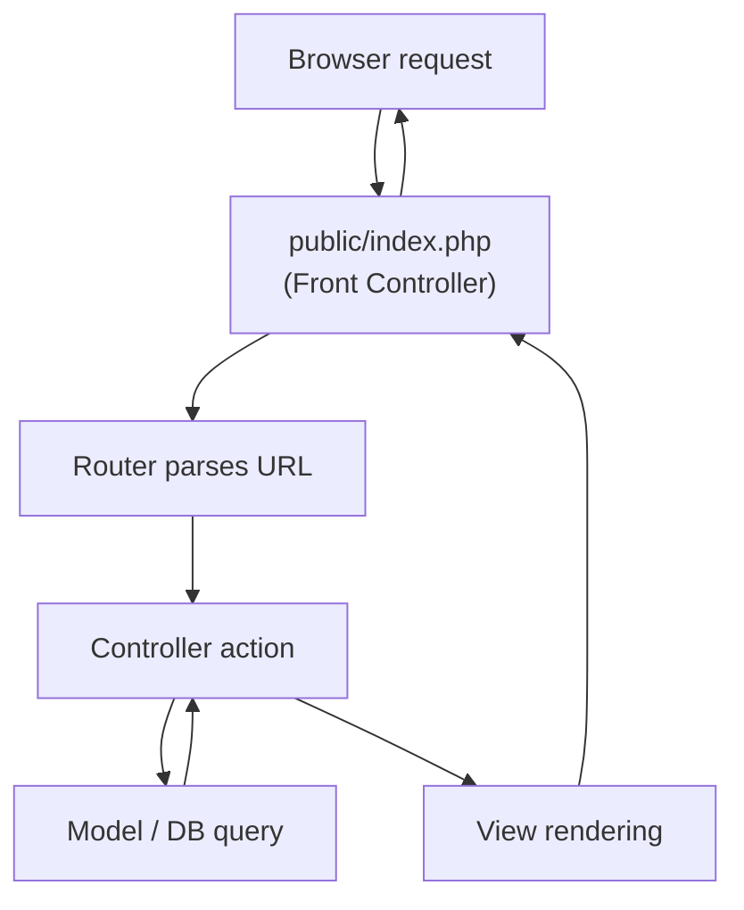
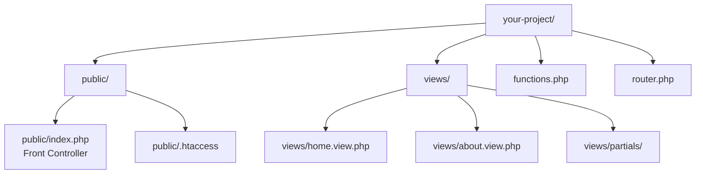

# 3.6.5. PHP Architectures

> [!info] Professional PHP development focuses on Separation of Concerns — the principle that different parts of an application should be responsible for different jobs. This note walks through the evolution of PHP architectures, from the beginner "spaghetti" file to the modern framework-based MVC or pure-API design, and explains why each step was taken.

## 1. The Three Jobs of a Web Application

A web application has three main responsibilities: logic, presentation, and routing. **Logic** is processing data, talking to the database, validating input, enforcing business rules — PHP's core strength. **Presentation** is producing the HTML, CSS, and JavaScript that the browser renders — the "view". **Routing** is deciding, based on the URL, which logic to run and which view to render.

Beginner PHP code mixes all three in a single file. Professional PHP code separates them into different files, different layers, and ideally different architectural components. The history of PHP architecture is the history of pulling these three concerns apart.

## 2. Approach 1 — The Beginner Method (All-in-One)

In the beginner approach, a single `.php` file contains HTML markup, CSS styles, and PHP code all mixed together. The PHP code directly manipulates variables and `echo`es them into the HTML wherever they are needed. This is often called "spaghetti code".

The advantage is simplicity — it is easy to understand and get started, and great for small scripts and learning exercises. The disadvantages become painful as the file grows: large files are hard to read and debug, there is no reusability because headers and footers must be copied into every file, and designers cannot easily work on the HTML without risking breaking the PHP logic.

```php
<?php
// index.php — everything in one file
$products = get_products_from_database(); // assume this function exists
?>
<html>
  <body>
    <h1>Products</h1>
    <ul>
      <?php foreach ($products as $product): ?>
        <li><?php echo htmlspecialchars($product['name']); ?></li>
      <?php endforeach; ?>
    </ul>
  </body>
</html>
```

This pattern is fine for a 20-line script. It becomes a maintenance nightmare past 200 lines.

## 3. Approach 2 — Separating Logic and Presentation

The first major step towards a professional setup is to split a page into two files: a logic file and a template file. The logic file (`index.php`) handles all the data processing, database queries, and decision-making, preparing every variable the page needs. At the very end, it `require`s a separate template file (`index.view.php`), which is almost pure HTML with only simple `echo` statements and loops to display the variables that were prepared for it.

```php
<?php
// index.php — the controller / logic
require 'database.php';
require 'functions.php';

$pageTitle = 'Our Products';
$products = get_all_products();

// At the very end, load the presentation file.
require 'views/products.view.php';
?>
```

```php
<!-- views/products.view.php — the view / template -->
<!DOCTYPE html>
<html>
  <head>
    <title><?php echo htmlspecialchars($pageTitle); ?></title>
  </head>
  <body>
    <h1>Products</h1>
    <ul>
      <?php foreach ($products as $product): ?>
        <li><?php echo htmlspecialchars($product['name']); ?></li>
      <?php endforeach; ?>
    </ul>
  </body>
</html>
```

This is a huge improvement. The logic is clean and separate from the messy HTML. A designer can edit the view file without touching PHP logic (as long as they leave the `<?php ?>` tags alone), and a developer can change the database queries without wading through HTML. This pattern is the foundation of every more advanced PHP architecture. See [[3.6.18. htmlspecialchars and Output Escaping]] and [[3.6.21. Include and Require]] for the supporting details.

## 4. Approach 3 — Frameworks and APIs

The third approach takes the separation of concerns to the next level and is how most professional PHP applications are built today. It has two major variants.

### 4.1 MVC Frameworks (Laravel, Symfony)

MVC stands for **Model-View-Controller**. A framework is a pre-built structure that enforces this pattern and provides a large library of supporting infrastructure: routing, database abstraction, authentication, validation, sessions, mail, queues, and testing tools.

The **Model** represents your data and interacts directly with the database. In Laravel this is typically an Eloquent class; in Symfony it might be a Doctrine entity. The **View** is the presentation layer, usually a template file written in a specialised templating engine like Blade (Laravel) or Twig (Symfony) that simplifies writing PHP inside HTML and auto-escapes output for security. The **Controller** is the orchestrator: it receives the user request, uses the Model to fetch data, and passes that data to the View to be rendered.

MVC is the evolution of Approach 2, but with a highly organised, reusable, and secure structure provided for you. The framework handles routing, dependency injection, middleware, and a hundred other concerns you would otherwise have to build yourself. See [[3.5.1. Laravel Overview and Installation]] and [[3.5.2. Laravel Service Container and Eloquent]] for the Laravel-specific details.

### 4.2 PHP as a Pure API

In this modern architecture, PHP and the frontend are completely decoupled. The PHP application does not generate any HTML. Its only job is to be a pure API — when a request arrives (e.g., `GET /api/products`), the PHP code fetches data from the database and returns it in a universal data format, usually JSON. The frontend is a completely separate application, often built with a JavaScript framework like React, Vue, or Angular. The user loads a single HTML page, the JavaScript makes requests to the PHP API using `fetch` or Axios, and when it receives the JSON response, the JavaScript dynamically builds and renders the HTML.

```php
<?php
// api/products.php
$products = get_all_products();
header('Content-Type: application/json');
echo json_encode($products);
```

```javascript
// app.js (frontend)
fetch('/api/products.php')
  .then(response => response.json())
  .then(products => {
    const html = '<ul>' +
      products.map(p => `<li>${p.name} — $${p.price}</li>`).join('') +
      '</ul>';
    document.body.innerHTML = html;
  });
```

The API approach has clear advantages for teams with separate frontend and backend specialists, and it lets the same backend power a web app, a mobile app, and a desktop client. The cost is more moving parts: CORS, authentication tokens, deployment of two separate apps, and a steeper learning curve. It is overkill for a small content site but standard for SaaS products.

## 5. The Front Controller Pattern

The Front Controller pattern is the foundation of virtually every modern PHP framework. The core idea is simple: every single request to the website is handled by one single file, `index.php`. This file acts as a traffic cop or router. It inspects the URL and decides which controller to invoke and which view to render.



The principles that make the Front Controller pattern work are a single entry point (all requests funnel through `public/index.php`), clean URLs (URLs represent a concept or resource like `/products`, not a physical file), separation of concerns (the front controller and router decide what to do, controllers handle business logic, views just display data), and enhanced security (sensitive files like database credentials live outside the public web root, so they cannot be requested directly by URL).

### 5.1 Directory Structure

A typical Front Controller project layout separates public files from application files:



The `public/` directory is the only folder a browser can ever reach. The web server's document root is pointed at it. Everything outside `public/` — including views, configuration, and helper functions — is unreachable by URL, which is a critical security feature.

### 5.2 URL Rewriting

A `.htaccess` file inside `public/` tells Apache to funnel every non-file, non-directory request to `index.php`:

```apache
Options -MultiViews
RewriteEngine On

RewriteCond %{REQUEST_FILENAME} !-d
RewriteCond %{REQUEST_FILENAME} !-f
RewriteRule ^ index.php [L]
```

Now a request to `yoursite.com/about` is silently handled by `yoursite.com/public/index.php`. The front controller reads `$_SERVER['REQUEST_URI']`, looks the path up in a route table, and dispatches to the appropriate handler.

### 5.3 A Minimal Router

```php
<?php
// router.php
$uri = parse_url($_SERVER['REQUEST_URI'])['path'];

$routes = [
    '/'       => 'views/home.view.php',
    '/about'  => 'views/about.view.php',
    '/contact'=> 'views/contact.view.php',
];

function routeToView(string $uri, array $routes): void {
    if (array_key_exists($uri, $routes)) {
        require $routes[$uri];
    } else {
        http_response_code(404);
        require 'views/404.view.php';
    }
}

routeToView($uri, $routes);
```

The `parse_url(...)['path']` strips off query parameters so that `/about?id=123` is matched as `/about`. If the URI is in the route table, the corresponding view is loaded; otherwise the server emits a 404 status code and renders a not-found page. The front controller itself becomes trivial — it just bootstraps dependencies and hands off to the router:

```php
<?php
// public/index.php
require '../functions.php';
require '../router.php';
```

The `../` is critical: it tells PHP to go up one directory from `public/` to find application files that the browser cannot reach.

## 6. Which Approach Should You Use?

For learning, the all-in-one file is fine — it teaches the basics of PHP syntax without forcing architectural decisions on the student. For a first "real" project, the manual Front Controller pattern described above is the best non-framework approach. It teaches routing, separation of concerns, and secure file structure without the overhead of a framework.

For professional or large projects, use a framework like Laravel. Frameworks take the Front Controller pattern and build a robust, feature-rich, and highly secure ecosystem around it. They have solved all of these problems for you in a standardised way. The recommended learning path is to build one or two small projects using the manual Front Controller pattern, understand *why* it works, and then graduate to Laravel — at which point the framework's structure feels natural rather than magical.

## Summary

PHP architectures evolve from all-in-one spaghetti files, through separated logic and template files, to the modern framework-based MVC or pure-API designs. The Front Controller pattern — funnelling every request through a single `index.php` — is the foundation of every modern framework. Each step in the evolution trades a bit of simplicity for a large gain in maintainability, security, and scalability. Once you understand the Front Controller pattern by building it manually, frameworks like Laravel stop feeling like magic and start feeling like the natural next step.

## See Also

- [[3.6.7. Mixing PHP and HTML]]
- [[3.6.18. htmlspecialchars and Output Escaping]]
- [[3.6.21. Include and Require]]
- [[3.5.1. Laravel Overview and Installation]]

## References

- "PHP The Right Way" — phptherightway.com
- Front Controller pattern — martinfowler.com/eaaCatalog/frontController.html
- Laravel routing documentation — laravel.com/docs/routing
