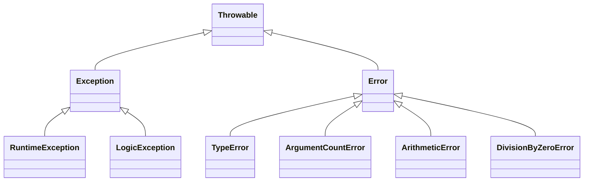

# 3.6.8. PHP Errors and Error Handling

> [!info] PHP errors are categorised by severity — Parse, Fatal, Warning, Notice — and the runtime's behaviour at each level differs in important ways. Modern PHP (7+) unifies errors and exceptions under the `Throwable` interface, and PHP 8 promotes many silent failures to Errors. This note covers the four error categories, the `php.ini` directives that control them, and the modern `set_error_handler` / `set_exception_handler` mechanism for centralised error handling.

## 1. Why Errors Do Not Always Show Up — The Server Configuration

The primary reason errors are sometimes visible and sometimes not is the `php.ini` configuration file. Think of `php.ini` as the master settings panel for PHP. Two directives are critical for error handling.

The `display_errors` directive is a light switch. Set to `On`, PHP prints errors directly to the browser screen — ideal for a development environment. Set to `Off`, PHP hides errors from the user, which is essential for a live production website to prevent leaking sensitive information and confusing visitors. The `error_reporting` directive determines *which types* of errors PHP should bother reporting. You can tell it to report everything, only the most severe errors, or to ignore minor notices.

| Environment | `display_errors` | `error_reporting` | Purpose |
| ----------- | ---------------- | ----------------- | ------- |
| Development (your PC) | `On` | `E_ALL` | See every mistake so you can fix it |
| Production (live site) | `Off` | `E_ALL` (logged to file) | Hide errors from users; log privately for review |

If your page goes blank with no error message, it is almost certainly a serious error on a server configured like a Production environment — the error happened, but it was hidden from you.

## 2. The Four Error Categories

PHP errors can be broadly categorised by severity, from most severe to least severe. Each category has different runtime consequences.

### 2.1 Parse Error (Syntax Error)

A Parse Error means PHP could not understand your code because it violates the language's grammar rules. Common causes are missing semicolons, mismatched parentheses, incorrect keyword usage, or unbalanced braces. The effect is severe: the script never starts. PHP cannot even begin to read the instructions, so nothing gets executed. This is why you often see a blank page or a direct error message for a parse error.

```php
<?php
echo 'Hello, World'   // Missing the semicolon
echo 'This line will never run.';
?>
```

Error message: `Parse error: syntax error, unexpected 'echo' ... on line 3`. Both `echo` statements are skipped because the file never compiles.

### 2.2 Fatal Error

A Fatal Error occurs when PHP understands the code, but a critical condition arises during execution that it cannot recover from. Common causes are calling a function that does not exist, `require`-ing a file that cannot be found, trying to `new` a class that has not been defined, or running out of memory. The script halts immediately at the point of the error. Any code *before* the error will run, but the code after it will not.

```php
<?php
echo 'This will be displayed.';
my_non_existent_function();
echo 'This will NOT be displayed.';
?>
```

Error message: `Fatal error: Uncaught Error: Call to undefined function my_non_existent_function() ...`. The first `echo` ran; the second did not.

### 2.3 Warning (Non-Fatal)

A Warning signifies a problem, but it is not severe enough to stop the script. PHP will complain, but it will try its best to continue. Common causes are `include`-ing a file that does not exist (unlike `require`, which would be fatal), supplying the wrong number of arguments to a function, or reading from an uninitialized string offset. The script continues to execute after the warning, which can lead to unexpected behaviour later in the code.

```php
<?php
echo 'About to include a file...<br>';
include 'non_existent_file.php';
echo 'The script continued even after the warning!';
?>
```

Error message: `Warning: include(non_existent_file.php): Failed to open stream: No such file or directory ...`. The second `echo` still runs.

### 2.4 Notice

A Notice is the least severe error type. It is more of a suggestion or a hint from PHP that you might have made a mistake. Common causes are trying to use a variable that has not been defined yet, or accessing an array key that does not exist. Notices are shown if `error_reporting` is set to include `E_NOTICE` (which `E_ALL` does), but the script continues without interruption.

```php
<?php
echo "Hello, $undefinedName!";
echo "<br>The script is still running.";
?>
```

Error message: `Notice: Undefined variable: undefinedName ...`. In PHP 8+, this has been promoted from a Notice to a Warning, reflecting the modern PHP philosophy that silent failures should be loud.

## 3. Error Impact on Execution

| Error on line 5 is a... | Do lines 1–4 run? | Does line 5 run? | Do lines 6+ run? |
| ----------------------- | ----------------- | ---------------- | ---------------- |
| Parse Error | No | No | No |
| Fatal Error | Yes | No (fails) | No |
| Warning / Notice | Yes | Yes (but complains) | Yes |

The "parse before execute" two-phase behaviour explains why a single missing semicolon can blank out an entire page. PHP first reads (parses) the entire file to confirm it is syntactically valid; only then does it start executing from line 1. A parse error means the second phase never begins.

## 4. Controlling Errors at Runtime

When you are learning, you want to see **all** errors. If your practice server is hiding them, you can add a "magic snippet" at the very top of your PHP file to enable them for that script only:

```php
<?php
ini_set('display_errors', 1);
ini_set('display_startup_errors', 1);
error_reporting(E_ALL);

// ... your regular code ...
echo $myVariable; // Will now show a Notice / Warning
```

`ini_set('display_errors', 1)` temporarily turns on the error light switch for this script only. `error_reporting(E_ALL)` sets the filter to show all possible errors, including Notices. Never use this snippet on a live website — it is a tool for learning and debugging only.

In production, the recommended setup is `display_errors = Off`, `log_errors = On`, and `error_log = /var/log/php_errors.log` (or equivalent). Errors are written to the log file but not shown to users. Tools like Sentry or Bugsnag can then tail the log and aggregate errors across your fleet.

## 5. Modern Error Handling — Throwable, Error, and Exception

PHP 7 introduced a major reorganisation of the error hierarchy. Before PHP 7, fatal errors could not be caught — they always killed the script. PHP 7 introduced the `Error` class (for internal PHP errors like type mismatches or undefined function calls) and the `Throwable` interface, which is implemented by both `Error` and `Exception`. As of PHP 7, you can catch fatal errors with a `try / catch` block:

```php
<?php
try {
    my_non_existent_function();
} catch (\Error $e) {
    echo 'Caught: ' . htmlspecialchars($e->getMessage());
}
// Script continues
```

The class hierarchy looks like this:



The rule of thumb is: catch `Exception` for application-level errors (a database connection failed, a config file was missing) and `Error` for engine-level problems (a wrong type was passed, a class was not found). In a top-level handler, catching `Throwable` catches both, which is useful as a last line of defence.

## 6. Custom Error and Exception Handlers

PHP lets you register custom handlers that take over error reporting entirely. `set_error_handler()` intercepts user-level errors (Warnings, Notices, deprecated messages) before they are printed. `set_exception_handler()` is invoked when an exception reaches the top of the call stack without being caught. Together, these let you centralise error handling — convert every warning into an exception, log every error with a stack trace, and render a friendly 500 page to the user.

```php
<?php
set_error_handler(function (int $errno, string $errstr, string $errfile, int $errline): bool {
    if (!(error_reporting() & $errno)) {
        return false; // Respect @ suppression
    }
    throw new \ErrorException($errstr, 0, $errno, $errfile, $errline);
});

set_exception_handler(function (\Throwable $e): void {
    error_log($e->getMessage() . "\n" . $e->getTraceAsString());
    http_response_code(500);
    echo 'An unexpected error occurred. Please try again later.';
});

// Now warnings throw ErrorException, which the exception handler catches:
try {
    $data = file_get_contents('missing.txt'); // Triggers Warning → ErrorException
} catch (\ErrorException $e) {
    echo 'Could not read file: ' . htmlspecialchars($e->getMessage());
}
```

The pattern of converting warnings to `ErrorException` is the standard way to make PHP's old-style errors behave like modern exceptions. It is the default behaviour in many frameworks, including Laravel and Symfony.

## Summary

PHP errors come in four severities — Parse, Fatal, Warning, Notice — each with different runtime consequences. The `php.ini` directives `display_errors` and `error_reporting` control what users see and what gets logged. PHP 7 unified errors and exceptions under the `Throwable` interface, making fatal errors catchable for the first time. Modern applications use `set_error_handler` to convert warnings to exceptions and `set_exception_handler` to render friendly error pages, then log the technical details privately for developers.

## See Also

- [[3.6.9. Constants and Define]]
- [[3.6.19. Functions]]
- [[3.6.21. Include and Require]]
- [[3.5.2. Laravel Service Container and Eloquent]]

## References

- PHP Manual: "Errors and logging" — php.net/manual/en/errorfunc
- PHP Manual: "Throwable" — php.net/manual/en/class.throwable
- PHP Manual: "ErrorException" — php.net/manual/en/class.errorexception
- PHP 8 RFCs that promoted notices to warnings — wiki.php.net/rfc
