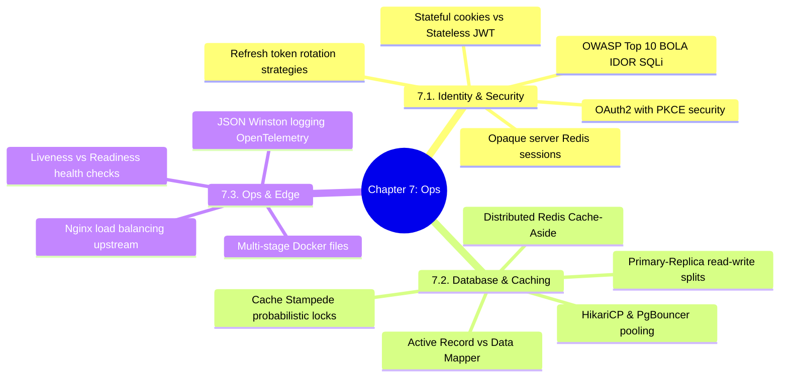

# 3.7.0. Cross-Cutting Patterns and Infrastructure MOC

> [!info] Map of Content Purpose
> This local index acts as your navigation hub for Chapter 7: Cross-Cutting Architectural Patterns & Infrastructure Deployment. Regardless of your selected backend framework, deploying a secure, resilient, and highly scalable application requires standardizing on unified security, caching, containerization, and monitoring topologies.

---

## 1. Chapter Mind Map

The mind map below structures the operational and architectural principles covered in this chapter:

---

## 2. Topic Outline & Atomic Notes

This module has 10 notes detail-tracking enterprise operations and systems scaling:

### [[3.7.1. Security Architecture and Authentication Patterns|1. Security Architecture & Authentication Patterns]]
*Reviewing identity architectures and authentication patterns.*
* **Identity Systems:** Cookies, server-side Redis sessions, stateless JWTs, and secure credentials storage.

### [[3.7.2. Database and Caching Topologies|2. Database & Caching Topologies]]
*Tuning database connections, query routing, and caching layers.*
* **Topologies:** Primary/Replica replication architectures, connection pooling proxies, and cache-aside/write-through behaviors.

### [[3.7.3. Containerization, Reverse Proxies and Observability|3. Containerization, Reverse Proxies & Observability]]
*Bundling web code and managing traffic at the edge.*
* **Edge Systems:** Multi-stage Docker architectures, Nginx load balancing pipelines, and system telemetry monitoring.

### [[3.7.4. Stateless Auth and JWT Best Practices|4. Stateless Auth & JWT Best Practices]]
*How to sign, verify, store, and revoke JSON Web Tokens securely.*
* **JWT Security:** Standard payload algorithms, token expiration, sliding sessions, refresh token rotation, and securing tokens in `HttpOnly` cookies.

### [[3.7.5. OAuth2 and OpenID Connect OIDC Protocols|5. OAuth2 & OpenID Connect (OIDC)]]
*Delegated authorization and standardized single-sign-on (SSO).*
* **OAuth2 Specs:** Standard roles, scopes, grant flows (Authorization Code with PKCE), and parsing OIDC identity tokens.

### [[3.7.6. OWASP Top 10 Mitigation in Modern Backends|6. OWASP Top 10 Mitigations]]
*Hardening backends against the ten most prevalent vulnerabilities.*
* **Vulnerabilities:** Defending against SQL Injection, XSS, CSRF, and Broken Object-Level Authorization (BOLA/IDOR).

### [[3.7.7. Redis Caching Topologies and Stampede Mitigation|7. Distributed Caching & Cache Stampede Mitigation]]
*Building resilient, fast caching layers with Redis.*
* **Caching:** Cluster configurations, eviction strategies, and resolving cache stampede locks using probabilistic early expiration.

### [[3.7.8. Nginx Load Balancing and Reverse Proxy Configuration|8. Nginx Reverse Proxy & Load Balancing]]
*Configuring Nginx pipelines to manage incoming network traffic.*
* **Nginx Pipelines:** Worker systems, `upstream` load balancers, location configurations, TLS offloading, and HTTP Backend upgrades.

### [[3.7.9. Production Logging and Distributed Tracing|9. Production Logging & Distributed Tracing]]
*Maintaining visibility and tracking operations across microservices.*
* **Observability:** Centralized JSON logging, request context propagation, and tracking distributed services with OpenTelemetry and Sentry.

### [[3.7.10. Containerization with Docker Multi-Stage Builds|10. Docker Multi-Stage Builds & Orchestration]]
*Writing ultra-lean, secure Docker configurations.*
* **Docker Optimization:** Layer caching optimizations, multi-stage builds, non-root user execution, and graceful SIGTERM shutdown signaling.

---

## 3. Prerequisite Knowledge & Downstream Impact

* **Prerequisites:** 
  - Having a strong grasp of Chapter 0 is highly recommended—particularly [[3.0.2. IO Multiplexing and Event-Driven Concurrency]] (explaining Nginx's asynchronous architecture) and [[3.0.3. HTTP and HTTPS Protocol Mechanisms]] (explaining TLS/SSL termination).
* **Connections to Frameworks:**
  - Standard JWT mechanisms explained in [[3.7.4. Stateless Auth and JWT Best Practices]] are used to secure Express routes [[3.1.8. Custom Middleware and Chaining]] and Flask endpoints [[2.12.3 API Authentication Patterns]].
  - PostgreSQL connection pooling [[3.7.2. Database and Caching Topologies]] is handled by HikariCP in Spring Boot [[3.4.6. Spring Data JPA and Hibernate]].

---

*See also: [[00. Master Index]] — [[3.0. Chapter Index]]*
