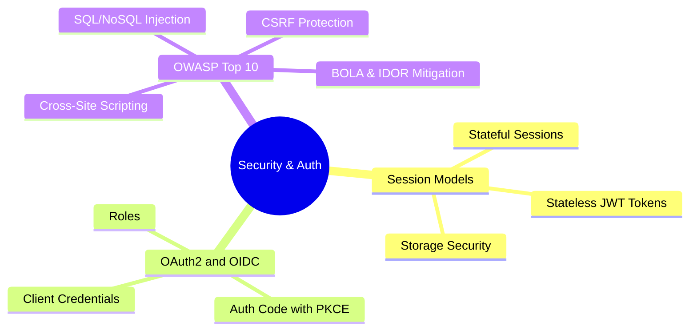

# 3.7.1. Security Architecture and Authentication Patterns

> [!info] Note Orientation
> This note explores the design of secure backend architectures. We analyze stateful sessions versus stateless token paradigms (JWT storage, expiration, and rotation), dissect the roles and grants of OAuth2 and OpenID Connect (including PKCE), and delve into mitigating critical OWASP Top 10 security risks like Injection, XSS, CSRF, and Broken Object Level Authorization (BOLA/IDOR).

---

## 1. Authentication Paradigms: Stateful Sessions vs. Stateless Tokens

Securing endpoints requires establishing a trusted mechanism to identify the client making the request.



### Stateful Sessions (Session-ID Model)
* **Mechanism:** Upon successful authentication, the server generates a unique, cryptographically random string called a **Session ID**.
  * The server stores the Session ID in a fast, in-memory datastore (like Redis or Memcached) alongside the user's data (ID, roles, etc.).
  * The server returns the Session ID to the client inside a `Set-Cookie` header.
  * On subsequent requests, the client browser automatically transmits this cookie. The server intercepts the cookie, queries Redis to find the matching session record, and populates `request.user`.
* **Security & Control Pros:** Excellent control. The server can instantly invalidate/revoke any active session (e.g., if a user logs out or their account is compromised) by simply deleting the session key from Redis.
* **Scaling Cons:** Relies on a centralized database. As requests scale, the session store must scale horizontally. Sticky sessions or replicated session stores are required if no single global database is used.

### Stateless Tokens (JSON Web Tokens / JWT)
* **Mechanism:** Upon successful authentication, the server packs the user's identity data (the claims, like user ID and roles) into a JSON object. It cryptographically signs this object using a private key (using algorithms like HS256 for symmetric or RS256 for asymmetric signatures) and returns the encoded string—the **JWT**—to the client.
* **Verification:** On subsequent requests, the client transmits the JWT inside the `Authorization: Bearer <token>` header. The server intercepts the token and verifies the signature using its public/private key. If the signature is valid, the server trusts the claims inside the payload instantly, *without ever querying a database*.
* **The Revocation Problem:** Because the token is self-contained and verified statelessly, the server cannot easily revoke a JWT before its expiration date. If a token is stolen, the attacker has full access until it expires.
* **Mitigation (Refresh Token Rotation):**
  * Use very short-lived Access Tokens (e.g., 15 minutes) and longer-lived Refresh Tokens (e.g., 7 days) stored in database tables.
  * When the access token expires, the client sends the refresh token to `/api/auth/refresh` to obtain a new access/refresh pair.
  * **Refresh Token Rotation:** Every time a refresh token is used, it is invalidated, and a *new* refresh token is issued. If an attacker steals a refresh token and attempts to use it, the server detects that the token was used twice, assumes a breach, and immediately invalidates the entire token lineage, forcing the user to re-authenticate.

### Storage Security: LocalStorage vs. HttpOnly Cookies
Where should client-side applications store authentication tokens?

* **`localStorage` / `sessionStorage`:**
  * **Pros:** Highly accessible via JavaScript; easy to read and append to headers.
  * **Cons:** Extremely vulnerable to **Cross-Site Scripting (XSS)**. If an attacker successfully injects a malicious script, they can execute `localStorage.getItem("token")` and transmit the user's credentials to an external server instantly.
* **`HttpOnly` + `Secure` Cookies:**
  * **Pros:** Safe from XSS. Setting the `HttpOnly` flag prevents JavaScript from accessing the cookie via `document.cookie`. Setting the `Secure` flag guarantees the cookie is only transmitted over HTTPS.
  * **Cons:** Vulnerable to **Cross-Site Request Forgery (CSRF)**, as browsers automatically attach cookies to every request matching the target domain. Must be paired with `SameSite=Lax` or `SameSite=Strict` attributes to block cross-site request leakage.

---

## 2. OAuth2 & OpenID Connect (OIDC)

OAuth2 (RFC 6749) is an **authorization framework** allowing applications to obtain limited access to user accounts on an HTTP service. OpenID Connect (OIDC) is an **identity layer** built on top of OAuth2, adding standardized authentication (using ID tokens) and profile discovery.

### The Four Core OAuth2 Roles
1. **Resource Owner:** The user who grants access to a protected resource (e.g., a person with a Google account).
2. **Client:** The application making protected resource requests on behalf of the Resource Owner (e.g., a calendar scheduler app).
3. **Authorization Server:** The server that authenticates the Resource Owner and issues Access Tokens to the Client (e.g., Google's OAuth server).
4. **Resource Server:** The API hosting the protected user data (e.g., Google Calendar API).

### Grant Type: Authorization Code with PKCE
The **Proof Key for Code Exchange (PKCE, RFC 7636)** protocol is the mandatory security standard for Single Page Applications (SPAs) and mobile apps, where client secrets cannot be securely hidden in code.

```
Client                             Auth Server
  | -- 1. Authorization Request -----> | (Includes Code Challenge)
  | <-- 2. Auth Code (redirect) ------ |
  |                                    |
  | -- 3. Token Request -------------> | (Includes Code Verifier)
  | <-- 4. Access Token -------------- | (Verifies challenge == hash of verifier)
```

1. **Generation:** The Client generates a cryptographically random string called the **Code Verifier**, and hashes it (usually using SHA-256) to produce the **Code Challenge**.
2. **Authorization Request:** The Client redirects the user to the Authorization Server, passing the Code Challenge and challenge method.
3. **Authorization Code:** The user authenticates, and the Auth Server redirects back to the Client with a temporary **Authorization Code**.
4. **Token Exchange:** The Client sends a POST request to the Auth Server's `/token` endpoint, passing the Authorization Code and the raw **Code Verifier**.
5. **Verification:** The Auth Server hashes the Verifier and checks if it matches the originally sent Code Challenge. If they match, it proves the Client requesting the token is the same Client that initiated the login, mitigating authorization code interception attacks. The server returns the Access and ID tokens.

### Grant Type: Client Credentials
Used for **Machine-to-Machine (M2M)** communication where no end-user is involved (e.g., a backend microservice fetching configuration from another service).
* The Client sends its `client_id` and `client_secret` directly to the `/token` endpoint.
* The Auth Server verifies the credentials and returns an Access Token.

---

## 3. Web Application Security: OWASP Top 10 Deep Dive

Designing resilient APIs requires enforcing strict defenses against common web vulnerabilities.

### 1. SQL / NoSQL Injection
* **The Vulnerability:** Occurs when untrusted user input is directly concatenated into database query strings, allowing attackers to manipulate the SQL statement structure.
* **The Mechanism:**
  ```sql
  -- Vulnerable Concatenation
  SELECT * FROM users WHERE username = 'admin' OR '1'='1' AND password = '...';
  ```
* **The Mitigation (Parameterized Queries):**
  * Parameterization separates the SQL query structure from the data.
  * When compiling a parameterized query, the database engine compiles the SQL template first (e.g., `SELECT * FROM users WHERE username = ?`). It then binds the user input strictly as literal values inside placeholders, preventing the input from ever altering the query's structural execution plan.
  * **ORM Safety:** Modern ORMs (like Hibernate/Spring Data, Django ORM, or Laravel Eloquent) use parameterized queries by default. However, developers must be careful not to bypass ORM abstractions with raw SQL execution helpers (e.g., calling `raw()` in Django or `DB::raw()` in Laravel with unescaped string concatenations).

### 2. Cross-Site Scripting (XSS)
* **The Vulnerability:** Occurs when an application accepts untrusted data, fails to sanitize or escape it, and includes it in a web page delivered to other browsers. The browser executes the injected malicious script in the context of the user's session.
* **Types of XSS:**
  * **Stored (Persistent):** The malicious script is permanently stored in a database (e.g., a comment field) and executed whenever a user views that record.
  * **Reflected (Non-Persistent):** The script is passed as part of an HTTP request parameter (e.g., a search query) and immediately reflected back by the server on the response page.
  * **DOM-Based:** The vulnerability exists entirely in client-side JavaScript that processes untrusted URL variables and writes them directly to the Document Object Model (DOM) using unsafe sinks (like `element.innerHTML`).
* **The Defenses:**
  * **Context-Aware Escaping:** Convert special characters into safe HTML entities (e.g., converting `<` to `&lt;`, `>` to `&gt;`). Escaping rules differ depending on where the data is rendered (HTML Body, HTML Attribute, JavaScript block, or URL query parameters).
  * **Content Security Policy (CSP):** A response header (`Content-Security-Policy`) that restricts the sources of executable scripts, stylesheets, and fonts. For example, a CSP can forbid the execution of inline scripts (`unsafe-inline`) and restrict script execution strictly to trusted whitelisted domains.

### 3. Cross-Site Request Forgery (CSRF)
* **The Vulnerability:** An exploit that forces a logged-in user's browser to execute state-changing HTTP requests (like transferring funds or changing an email) against an authenticated web application where they currently hold a session cookie.
* **The Defenses:**
  * **Synchronizer Token Pattern:**
    * The server generates a unique, cryptographically secure CSRF token associated with the user's active session.
    * When rendering a form, the server embeds this token in a hidden input field.
    * Upon submission (POST/PUT/DELETE), the server verifies that the submitted form token matches the token stored in the user's session. Since an external attacker site cannot read the token from the user's browser due to Same-Origin policies, they cannot forge a valid request.
  * **SameSite Cookie Attributes:**
    * **`SameSite=Strict`:** The browser never transmits the cookie on cross-site requests (including clicking a simple external link to the target domain).
    * **`SameSite=Lax` (Default):** The browser blocks the cookie on cross-site sub-resources (like image loads or AJAX calls), but attaches it when the user performs a top-level navigation (clicking a link). This provides a balanced mix of security and user experience.

### 4. Broken Object Level Authorization (BOLA / IDOR)
* **The Vulnerability:** Also known as **Insecure Direct Object References (IDOR)**. It occurs when an API endpoint exposes a reference to an internal database object ID (e.g., `/api/invoices/9981`) and fails to verify if the currently authenticated user has permission to access that specific object.
* **The Trap:** A developer might write code that authenticates the user successfully (ensuring they are logged in) but fails to perform authorization checks against the requested record. An attacker can simply cycle through ID numbers to view other users' private records.
* **The Mitigation (Service-Layer Verification):**
  * Never trust that a user owns a resource simply because they requested its ID.
  * Inside your controller or service layer, execute explicit ownership queries:
    ```python
    # Secure Authorization Pattern
    invoice = db.query(Invoice).filter_id(invoice_id)
    if invoice.user_id != current_user.id:
        raise ForbiddenException("Unauthorized access to this resource")
    ```
  * **Resource-Based Authorization:** Utilize policy files, decorators, or Spring Security annotations (e.g., `@PreAuthorize("#invoice.userId == authentication.principal.id")`) to enforce these checks declaratively across the service layer.

---

## See Also

* [[3.0.1. Socket Abstractions and BSD Sockets API]] — Socket-level security mechanics.
* [[3.1.6. Express Middleware Architecture]] — Implementing Helmet security headers.
* [[3.2.12. Authentication Basics in Flask]] — Client-side authentication structures.

## References

* OWASP Foundation. (2021). *OWASP Top 10:2021 — The Core Security Risks*. https://owasp.org/www-project-top-ten/
* Hardt, D. (2012). *The OAuth 2.0 Authorization Framework*. RFC 6749.
* Sakimura, N., Bradley, J., Jones, M., de Medeiros, B., & Mortimore, C. (2014). *OpenID Connect Core 1.0*. https://openid.net/specs/openid-connect-core-1_0.html
