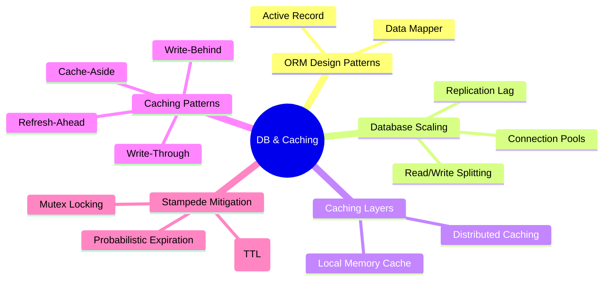

# 3.7.2. Database and Caching Topologies

> [!info] Note Orientation
> This note analyzes database scalability and caching strategies. We compare the structural differences and trade-offs of Active Record and Data Mapper persistence patterns, examine connection pooling and read/write replication splitting, dissect the execution mechanics of distributed caching patterns, and review advanced cache invalidation and stampede mitigation techniques.

---

## 1. Data Persistence Patterns: Active Record vs. Data Mapper

Object-Relational Mapping (ORM) frameworks bridge the gap between relational databases (tables, foreign keys) and object-oriented programming (classes, references). There are two dominant architectural patterns for ORM design.



### Active Record (e.g., Laravel Eloquent, Django ORM)
* **Design Philosophy:** A single class represents both the database table schema and a single row instance. The model class contains both the data properties *and* the database operations (like `save()`, `update()`, `delete()`).
* **Code Example:**
  ```python
  # Django ORM Example
  user = User.objects.get(id=1)  # Querying via class-level manager
  user.email = "new@email.com"   # Modifying instance property
  user.save()                    # Instance saves itself to database
  ```
* **Pros:**
  * Highly intuitive and fast to write.
  * Perfect for CRUD-heavy applications where the database schema maps closely to the business domain.
* **Cons:**
  * **Violates Single Responsibility Principle (SRP):** The model class is responsible for both holding data and performing persistence, making it highly coupled to the database.
  * **Testing Difficulty:** Unit testing Active Record models requires a running database connection (or an in-memory database like SQLite) because database logic is tightly bound to the class instance.

### Data Mapper (e.g., Spring Data JPA/Hibernate, SQLAlchemy)
* **Design Philosophy:** Decouples the in-memory domain model from the database persistence layer. The domain class (the Entity) is a plain, lightweight object (POJO / dataclass) that has no knowledge of the database. Persistence operations are managed by separate repository or manager classes.
* **Code Example:**
  ```java
  // Hibernate / JPA Example
  User user = entityManager.find(User.class, 1L); // Entity is returned
  user.setEmail("new@email.com");                // Entity is mutated
  entityManager.getTransaction().commit();       // Mapper detects change and flushes SQL
  ```
* **Pros:**
  * **Separation of Concerns:** Business logic inside entities is completely decoupled from persistence details.
  * **Testability:** Domain entities can be easily unit tested in isolation using pure mocks, without ever booting a database.
  * **Architectural Flexibility:** Allows mapping complex, nested domain objects onto highly normalized database tables that do not align one-to-one with the code properties.
* **Cons:**
  * Introduces substantial boilerplate code (interfaces, XML/annotation configurations, repositories).
  * Steeper learning curve; requires understanding session flushing and transaction lifecycles.

---

## 2. Database Connection Scaling

Database connections are expensive operating system resources. Establishing a connection requires a TCP three-way handshake, TLS negotiations, and thread/process allocations on the database server.

### Connection Pooling (e.g., HikariCP, PgBouncer)
Instead of opening and closing a database connection for every HTTP request, servers utilize a **Connection Pool**.
* **Mechanism:** The application boots and pre-allocates a fixed pool of active database connections (e.g., 20 connections).
* **The Request Cycle:** When an API request needs to execute a query, it requests a connection from the pool. The pooler returns a hot, active connection instantly. Once the query completes, the application releases the connection *back to the pool* for reuse.
* **Tuning Parameters:**
  * **`maximumPoolSize`:** The maximum number of concurrent active connections. Setting this too high can exhaust the database server’s RAM and CPU thread limits; setting it too low causes application requests to block waiting for available connections.
  * **`connectionTimeout`:** The maximum time an application thread will wait for an available connection from the pool before throwing an error.
  * **`idleTimeout` / `maxLifetime`:** Determines when idle connections are closed and recycled to prevent memory leaks or socket stale states.

### Read/Write Splitting
As traffic scales, read queries (SELECT) typically bottleneck database CPU. **Read/Write Splitting** horizontalizes this load across a primary-replica cluster.

```
                  +---> [ Primary Database ] (Writes Only)
                  |          | (Replication Sync)
[ Router / ORM ] -+          v
                  +---> [ Replica Database ] (Reads Only)
```

* **The Routing Layer:** The application or a middleware router inspects SQL statements:
  * Stateful operations (`INSERT`, `UPDATE`, `DELETE`) are routed strictly to the **Primary Database**.
  * Stateless reads (`SELECT`) are balanced across the pool of **Replica Databases**.
* **The Challenge (Replication Lag):**
  * Changes written to the primary take a brief window (ranging from milliseconds to seconds) to propagate asynchronously to the replicas.
  * **Read-After-Write Inconsistency:** If a user submits a profile update (POST to Primary) and the browser instantly refreshes the page (GET from Replica), the user may see their old data because the write has not yet propagated to the replica.
  * **Mitigation:** Implement session-based routing. For a short window after a state-changing POST request (e.g., 5 seconds), route all subsequent read queries for that user's session directly to the Primary database, bypassing replicas until replication lag has caught up.

---

## 3. Distributed Caching Topologies & Patterns

Caching stores frequently accessed data in ultra-fast, in-memory datastores to reduce database read pressure and lower response latency.

### Caching Layers
* **Local Memory Cache (In-Process):** Stores data directly in the application's RAM (e.g., a hash map inside Node.js or Guava Cache in Java).
  * **Pros:** Blazing fast (microsecond access); zero network overhead.
  * **Cons:** Memory is isolated to that specific container. If you run 10 stateless API containers behind a load balancer, their caches will diverge, resulting in cache inconsistency.
* **Distributed Cache (e.g., Redis, Memcached):** A dedicated, standalone, in-memory database shared across all application containers over the network.
  * **Pros:** Consistent data state across all horizontally scaled API instances.
  * **Cons:** Millisecond-level network round-trips to query the cache over the LAN.

### Core Caching Patterns

#### 1. Cache-Aside (Lazy Loading)
The most common caching pattern. The application directly coordinates cache and database operations.
* **Read Flow:**
  1. The application queries the cache.
  2. **Cache Hit:** The cache returns the data; the flow ends.
  3. **Cache Miss:** The cache returns null. The application queries the primary database, stores the returned record in the cache for future requests, and returns the data to the client.
* **Write Flow:**
  1. The application writes the update to the primary database.
  2. The application deletes (invalidates) the stale key from the cache.
* **Pros:** Highly resilient to cache crashes (the application falls back gracefully to querying the database).
* **Cons:** First-query latency penalty (every new record suffers a cache-miss before caching).

#### 2. Write-Through
The application treats the cache as the main data store. The cache is responsible for persisting data to the database.
* **Write Flow:**
  1. The application writes data to the cache.
  2. The cache synchronously writes the data to the database before completing the write operation.
* **Pros:** Data in the cache is never stale, ensuring immediate read consistency.
* **Cons:** High write latency, as every write must perform a synchronous double-write.

#### 3. Write-Behind (Write-Back)
An asynchronous optimization of the Write-Through pattern.
* **Write Flow:**
  1. The application writes data to the cache.
  2. The cache queues the update in memory and returns success to the application instantly.
  3. A background daemon asynchronously flushes the queued updates to the database in batches.
* **Pros:** Blazing-fast write performance; excellent for write-heavy workloads (like logging IoT telemetry or tracking video views).
* **Cons:** High risk of data loss. If the cache container crashes or loses power before the background daemon flushes the queue, data is permanently lost.

#### 4. Refresh-Ahead
* **Mechanism:** The cache automatically reloads active keys from the database *before* their TTL expires, using background polling.
* **Pros:** Completely eliminates read latencies for highly popular keys.
* **Cons:** Hard to configure accurately; can waste substantial database bandwidth if keys that are rarely accessed are refreshed repeatedly.

---

## 4. Cache Invalidation and Stampede Mitigation

Managing cache lifecycles and protecting databases during high-concurrency spikes requires robust invalidation designs.

### Cache Invalidation Strategies
* **TTL (Time-To-Live):** Every cached key is assigned an expiration timeout (e.g., 3600 seconds). Once the TTL expires, the key is removed automatically. This acts as a fallback safety net to limit data staleness.
* **Active Eviction:** When a database record is modified, the application explicitly deletes the cached key. This is the standard write-flow of Cache-Aside.

### Cache Stampede (The Dogpile Effect)
A **Cache Stampede** occurs when a highly popular, hot key (e.g., homepage configuration or trending search metadata) expires under massive concurrent load.

```
Hot Key Expires ===> [ 10,000 Concurrent Requests ] ===> Cache Miss ===> [ 10,000 Parallel DB Queries ] ===> Database Crashes
```

* **The Disaster Scenario:** Because the key has expired, thousands of application threads experience a cache-miss at the exact same millisecond. They all execute parallel SQL queries against the database and attempt to write the result back to the cache. This sudden spike in database CPU and connections can easily crash the database server.

### Mitigation Strategies

#### 1. Mutex Locking (Single-Flight Pattern)
Instead of allowing all threads to query the database on a cache miss, the application enforces a distributed lock (mutex) using Redis.
* **The Protocol:**
  1. Upon cache-miss, the thread attempts to acquire a short-lived lock (e.g., using Redis `SET key value NX PX 5000`).
  2. **Thread 1 (Wins Lock):** Queries the database, updates the cache, and releases the lock.
  3. **Other Threads (Lose Lock):** Wait briefly and retry reading the cache, or return a stale copy of the data until Thread 1 has updated the cache.

#### 2. Probabilistic Early Expiration (XFetch)
A mathematical approach that voluntarily recalculates and updates the cache *before* the key officially expires.
* **The Math:** When querying the cache, the application uses a probability function based on the key's remaining TTL, the time it takes to compute the database query, and a randomization constant. As the key nears expiration, the probability that a read request will trigger a background database refresh increases.
* **The Win:** A single user request triggers the update in the background before the key dies, ensuring other users always experience a cache hit.

---

## See Also

* [[3.2.9. Flask with SQLite and SQLAlchemy]] — Configuring databases in Flask.
* [[3.5.2. Laravel Service Container and Eloquent]] — Laravel's Active Record ORM.
* [[3.7.3. Containerization, Reverse Proxies and Observability]] — Scaling database container nodes.

## References

* Fowler, M. (2002). *Patterns of Enterprise Application Architecture*. Addison-Wesley Professional.
* Kleppmann, M. (2017). *Designing Data-Intensive Applications: The Big Ideas Behind Reliable, Scalable, and Maintainable Systems*. O'Reilly Media.
* Redis Labs. (2020). *Redis Caching Patterns and Best Practices*. https://redis.io/
