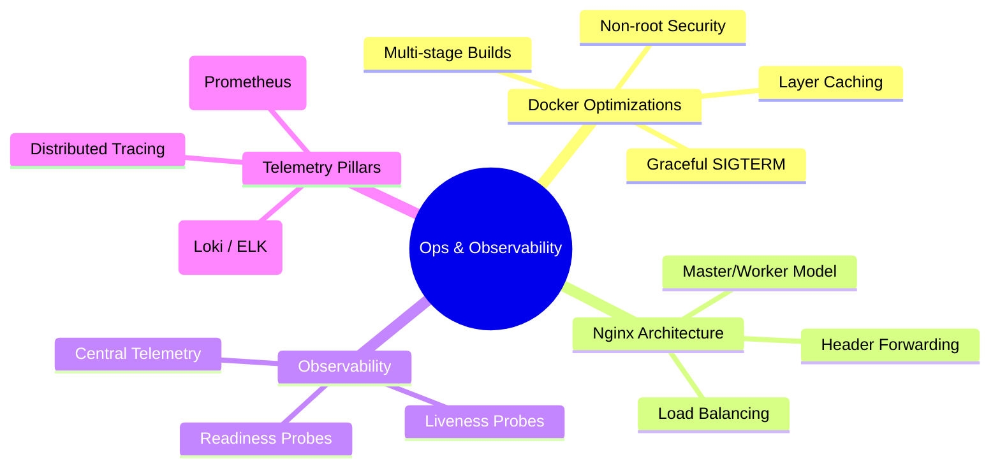

# 3.7.3. Containerization, Reverse Proxies and Observability

> [!info] Note Orientation
> This note explores production deployment and infrastructure engineering. We examine multi-stage Docker builds and layer-caching strategies, dissect Nginx’s non-blocking master/worker architecture and load-balancing directives, compare Liveness and Readiness health probes, and review centralized telemetry standards including metrics, logs, and distributed tracing.

---

## 1. Containerization with Docker: Production Optimizations

Deploying backends inside containers guarantees that applications execute identically across development, staging, and production environments.



### Multi-stage Builds
A naive Dockerfile copies the entire source code, installs all compilers, dev dependencies, and build packages, and runs the application. This results in bloated, insecure image sizes (often over 1GB) containing tools (like git, compilers, npm caches) that an attacker can exploit if the container is compromised.

**Multi-stage builds** solve this by splitting the build sequence into separate logical containers:
1. **The Build Stage:** Uses a heavy base image containing compilers and build tools to download packages, compile TypeScript/Java/PHP assets, and run tests.
2. **The Production Stage:** Spawns a fresh, ultra-lightweight runtime image (like `alpine` or Google’s `distroless`). It copies *only* the compiled production artifacts (e.g., a compiled Java fat JAR, or Node's compiled `dist/` and production `node_modules/`) from the build stage. The compilers and caches are left behind.
* **The Win:** Image sizes are reduced drastically (often below 100MB), the attack surface is minimized, and deploy times are accelerated.

### Layer Caching Optimization
Docker builds images sequentially, caching the output of each line (instruction) in the Dockerfile. If a line's dependencies or copied files do not change, Docker reuses the cached layer. If a change is detected, Docker invalidates that layer *and all subsequent layers*.

* **The Anti-Pattern:**
  ```dockerfile
  # Unoptimized: Modifying a single JS file forces npm install to re-download all packages!
  COPY . /app
  RUN npm install
  ```
* **The Optimized Pattern:**
  ```dockerfile
  # Optimized: Dependencies are cached separately from code changes
  COPY package.json package-lock.json /app/
  RUN npm ci --only=production
  COPY src/ /app/src/
  ```
* **The Explanation:** Because `package.json` changes rarely compared to the application source code, placing dependency operations first guarantees that Docker will reuse the cached `RUN npm ci` layer for subsequent builds, speeding up compilation times from minutes to seconds.

### Container Security and Lifecycles
* **Non-Root Execution:** By default, containers execute as the `root` user. If an attacker exploits a remote code execution vulnerability inside the application, they inherit full root privileges on the host kernel.
  * **Remediation:** Always create and transition to a dedicated non-root system user inside the Dockerfile (e.g., using `USER node` in Node.js or `RUN adduser -D appuser && USER appuser` in Alpine).
* **Signal Forwarding (`SIGTERM`):** When stopping a container, orchestrators (like Kubernetes or Cloud Run) send a `SIGTERM` signal to the process running as PID 1.
  * If the process handles `SIGTERM` correctly, it initiates a **Graceful Shutdown**: it stops accepting new connections, finishes processing active HTTP requests, drains database connection pools, and exits cleanly.
  * **The PID 1 Trap:** If your Dockerfile launches the app using a shell format (e.g., `CMD npm start`), the shell process (`/bin/sh`) becomes PID 1 and fails to forward the `SIGTERM` signal to the Node application. When the orchestrator's shutdown timeout expires (typically 30 seconds), the kernel kills the app abruptly with `SIGKILL`, dropping in-flight user requests.
  * **Remediation:** Always launch applications using the JSON array format (`CMD ["node", "src/index.js"]`), which executes the application binary directly as PID 1.

---

## 2. Reverse Proxies & Load Balancing: Nginx

Nginx is an open-source, high-performance HTTP server and reverse proxy designed to sit at the edge of production networks.

### Process and Concurrency Architecture
Unlike blocking application servers, Nginx uses a **Master/Worker process architecture**:
* **The Master Process:** Reads and evaluates configuration files, manages worker processes, and binds sockets to ports (like 80 or 443).
* **The Worker Processes:** Run as single-threaded, non-blocking event loops (using OS-level multiplexers like `epoll` or `kqueue`).
* **Performance:** A single Nginx worker process can monitor and handle tens of thousands of concurrent connections simultaneously with minimal CPU and memory overhead, making it highly efficient at terminating TLS, serving static files, and throttling brute-force attacks at the edge.

### Configuration Blocks & Directives
Nginx configurations are structured hierarchically:

```nginx
# Nginx Upstream & Server Definition
upstream backend_servers {
    least_conn; # Load balancing algorithm
    server api-node-1.internal:3000;
    server api-node-2.internal:3000;
    keepalive 32; # Keep-alive connections to backend nodes
}

server {
    listen 80;
    server_name api.example.com;

    location / {
        proxy_pass http://backend_servers;
        proxy_http_version 1.1;
        proxy_set_header Connection "";
        
        # Forwarding real client identifiers
        proxy_set_header Host $host;
        proxy_set_header X-Real-IP $remote_addr;
        proxy_set_header X-Forwarded-For $proxy_add_x_forwarded_for;
        proxy_set_header X-Forwarded-Proto $scheme;
    }
}
```

* **`upstream` Block:** Defines a logical group of backend application servers.
  * **Load Balancing Algorithms:**
    * **Round Robin (Default):** Distributes requests sequentially.
    * **`least_conn`:** Routes requests to the server with the fewest active connections, preventing worker starvation on slow nodes.
    * **`ip_hash`:** Uses the client’s IP address to compute a hash key, ensuring a client is consistently routed to the same backend server (sticky sessions).
* **`location` Matching Priorities:**
  1. `=` Exact matches (highest priority).
  2. `^~` Non-regular expression prefix matches.
  3. `~` (Case-sensitive) & `~*` (Case-insensitive) Regular Expression matches.
  4. `/` Generic prefix match (fallback).
* **`proxy_pass` Directives & Client Headers:**
  * When proxying traffic, Nginx acts as a client to the backend servers.
  * To prevent backend applications from logging Nginx's internal IP address instead of the public user's IP, developers must inject forwarding headers:
    * **`X-Real-IP`:** Captures the immediate client IP (`$remote_addr`).
    * **`X-Forwarded-For`:** A comma-separated list tracking the entire proxy chain of IPs.
    * **`X-Forwarded-Proto`:** Let’s backend apps know if the public edge connection was HTTPS (`$scheme`), preventing infinite SSL-redirect loops.

---

## 3. Production Observability & Health Monitoring

Observability is the practice of measuring a system’s internal state based on its external outputs.

### Health Check Protocols: Liveness vs. Readiness
When running containerized clusters, orchestrators continuously poll application health endpoints to automate recovery.

```
                  +---> Liveness Probe (GET /health/live) ---> Fails ---> Restart Container
                  |
[ Orchestrator ] -+
                  |
                  +---> Readiness Probe (GET /health/ready) -> Fails ---> Stop Routing Traffic
```

* **Liveness Probe (Is it alive?):**
  * **Purpose:** Detects if the application process has crashed, deadlocked, or entered an unrecoverable infinite loop.
  * **Action:** If the liveness probe fails (returns a non-200 code), the orchestrator instantly restarts the container.
  * **Implementation:** Keep it extremely lightweight. A simple `/health/live` route that returns `200 OK` instantly, verifying only that the event loop is active. Never include external database queries in liveness checks; a transient database delay would trigger cascading container restarts.
* **Readiness Probe (Is it ready?):**
  * **Purpose:** Detects if the container is ready to accept user traffic.
  * **Action:** If the readiness probe fails, the orchestrator stops routing public requests to this container, but **does not kill it**. It waits for the container to report ready before re-introducing it to the load balancer pool.
  * **Implementation:** Query downstream dependencies. The `/health/ready` endpoint should actively verify that database connection pools have initialized, cache servers are reachable, and required configuration modules have loaded.

---

## 4. The Three Pillars of Telemetry

To trace and debug high-concurrency production systems, backends must emit structured telemetry data.

### 1. Metrics (e.g., Prometheus)
* **Strategy:** Time-series data tracking system state. Prometheus uses a **pull-based model**, scraping metrics endpoints (`/metrics`) emitted by applications at regular intervals (e.g., every 15 seconds).
* **Standard (The RED Method):**
  * **Rate:** The number of requests processed per second (RPS).
  * **Errors:** The number of requests that fail (HTTP 5xx status codes).
  * **Duration:** The time it takes to process requests (latencies, tracked via percentiles: p50, p90, p99).

### 2. Log Aggregation (e.g., Loki, ELK Stack)
* **Strategy:** Structured event logs. Backends must output logs strictly as structured **JSON** streams to stdout rather than writing to local files.
* **Aggregators:** Daemons (like Promtail or FluentBit) scrape container stdout, parsing the JSON fields and forwarding them to a centralized store (Loki, Elasticsearch). This allows developers to query logs across millions of containers instantly based on indexed tags.
* **Context Propagation:** Ensure a unique **Request ID** (UUID) is generated at the edge (Nginx) and injected into the request context. Every log line emitted during that request must print this ID, allowing developers to trace the entire lifecycle of a single user request across multiple services.

### 3. Distributed Tracing (e.g., OpenTelemetry, Jaeger)
* **Strategy:** In microservice or distributed architectures, a single user request can trigger dozens of cascading internal API calls. Logs alone cannot easily isolate where delays are happening.
* **Traces and Spans:**
  * A **Trace** represents the complete end-to-end journey of a request.
  * A **Span** represents a single unit of work (e.g., executing a SQL query, calling an auth service, rendering a template).
* **Propagation:** OpenTelemetry library wrappers automatically inject tracing headers (like `traceparent`) into outgoing HTTP/gRPC requests. Backend services parse these headers, enabling tracing collectors to construct detailed visual waterfall charts showing exact latencies across all systems, isolating performance bottlenecks instantly.

---

## See Also

* [[3.0.2. IO Multiplexing and Event-Driven Concurrency]] — How Nginx scales using event loops.
* [[3.2.15. Deploying to Railway or Render]] — Cloud platform deployments.
* [[3.7.1. Security Architecture and Authentication Patterns]] — Securing the edge proxy.

## References

* Burns, B. (2018). *Designing Distributed Systems: Patterns and Paradigms for Modern Microservices*. O'Reilly Media.
* Soni, M. (2021). *Architecting for Scale: How to Keep Your Services Up and Running*. O'Reilly Media.
* Nginx Inc. (2022). *Nginx Admin's Guide*. https://docs.nginx.com/
