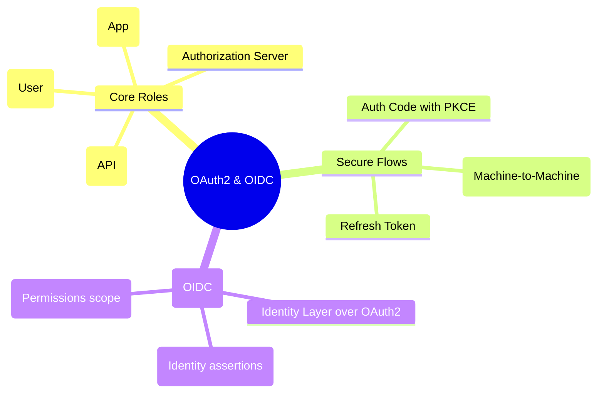
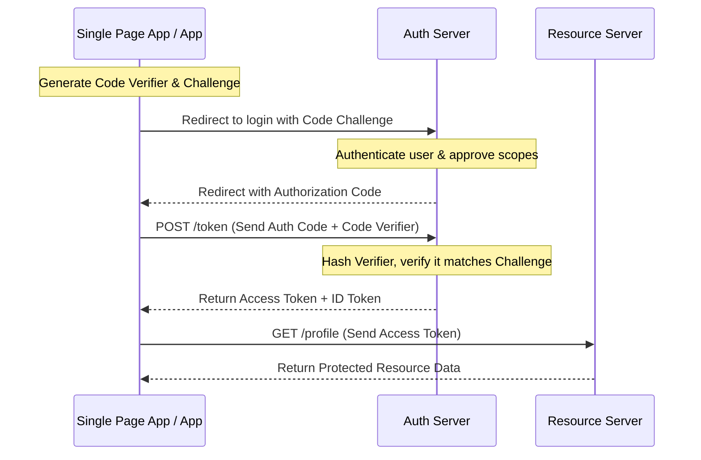

# 3.7.5. OAuth2 and OpenID Connect OIDC Protocols

> [!info] Orientation
> Delegating access and verifying identity across modern web architectures requires structured protocols. This note explores **OAuth 2.0** and **OpenID Connect (OIDC)**, detailing the fundamental roles, the secure Authorization Code Flow with PKCE, and the distinction between authorization and identity tokens.

---

## 1. The Core Roles of OAuth 2.0

OAuth 2.0 is an delegation protocol designed to allow a third-party application to access resources on behalf of a user, without sharing the user's login credentials.

The protocol defines four core roles:
1. **Resource Owner (User):** The individual who grants access to a portion of their account.
2. **Client (Application):** The application (mobile, web, or backend) requesting access to the resource owner's account.
3. **Authorization Server:** The server that authenticates the user, obtains authorization, and issues secure access tokens to the client (e.g., Google Identity, Auth0, Okta).
4. **Resource Server (API):** The server hosting the user's protected data (e.g., Google Calendar API). It accepts and validates incoming access tokens.



---

## 2. Authorization Code Flow with PKCE (Proof Key for Code Exchange)

Historically, single-page applications (SPAs) and mobile apps used the *Implicit Flow*, which exposed access tokens directly in the browser's URL history. This flow has been deprecated due to security risks.

The modern standard is the **Authorization Code Flow with PKCE** (RFC 7636). It uses a dynamic cryptographic challenge to prevent authorization code interception attacks on public clients.

### Step-by-Step PKCE Exchange:

1. **Generate Secrets:** The Client generates a random secret string named **`Code Verifier`**, and hashes it to create the **`Code Challenge`**.
2. **Initiate Login:** The Client redirects the user to the Authorization Server, passing along the `Code Challenge` and hashing method (S256).
3. **User Authentication:** The user logs in and consents to the requested permissions scopes.
4. **Authorization Code Issued:** The Authorization Server redirects the user back to the Client with a temporary **`Authorization Code`**.
5. **Token Exchange:** The Client sends a `POST` request to the token endpoint, passing the `Authorization Code` and the raw `Code Verifier`.
6. **Cryptographic Validation:** The Authorization Server hashes the incoming `Code Verifier`. If it matches the original `Code Challenge`, it verifies that the client requesting the token is the same one that initiated the login, and issues the **Access Token**.



---

## 3. Understanding OAuth 2.0 Grant Types

Depending on your application architecture, select the appropriate **Grant Type**:

* **Authorization Code with PKCE:** Used for SPAs, mobile applications, and server-rendered web apps representing interactive users.
* **Client Credentials:** Used for machine-to-machine (M2M) communications (e.g., a background microservice querying an internal billing API). There is no user interactive login; the service authenticates using its client ID and client secret directly.
* **Refresh Token:** Used to obtain a new access token without requiring the user to re-authenticate, once the short-lived access token expires.

---

## 4. OIDC: The Identity Layer Over OAuth 2.0

A common security mistake is trying to use OAuth 2.0 directly for user authentication (identifying *who* is logged in). OAuth 2.0 is purely designed for *Authorization* (delegating access with scopes); it does not provide user identity details.

**OpenID Connect (OIDC)** is an identity layer built on top of OAuth 2.0. It extends OAuth to provide a standard format for federated authentication:

```text
OIDC = OAuth 2.0 + Identity Assertions (ID Token) + Userinfo Endpoint
```

### OIDC Token Comparison:

* **Access Token (OAuth 2.0):** An opaque string designed for the **Resource Server (API)**. It grants permissions (scopes) but does not contain user profile details.
* **ID Token (OIDC):** A formatted **JWT** designed for the **Client (Application)**. It contains assertions about the user's identity (e.g., `email`, `sub` unique ID, and profile picture).
* **Userinfo Endpoint:** A standard REST endpoint hosted on the Authorization Server where the client can send the Access Token to retrieve detailed profile details about the authenticated user.

---

## Summary

OAuth 2.0 and OpenID Connect (OIDC) provide the foundation for modern web authorization and identity federation. By implementing the Authorization Code Flow with PKCE for interactive public clients, leveraging Client Credentials for secure machine-to-machine integrations, and using standard OIDC ID tokens for identity assertions, developers can build secure, distributed APIs with ease.

## See Also

- [[3.7.1. Security Architecture and Authentication Patterns]]
- [[3.7.4. Stateless Auth and JWT Best Practices]]
- [[3.7.6. OWASP Top 10 Mitigation in Modern Backends]]
