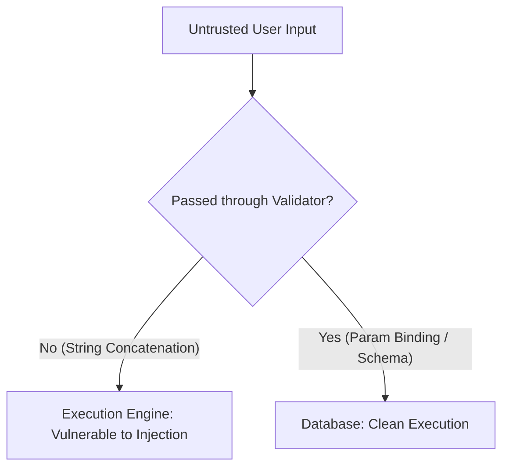

# 3.7.6. OWASP Top 10 Mitigation in Modern Backends

> [!info] Orientation
> Building resilient backend infrastructure requires active defenses against web application security threats. This note details the OWASP Top 10 security risks, exploring the mechanics behind major attack vectors and walking through specific mitigation strategies to protect production APIs.

---

## 1. Injection Vulnerabilities (SQLi, NoSQLi, Command Injection)

**Injection** occurs when untrusted user input is passed directly to an interpreter (such as a database query engine or operating system shell) without validation, allowing the input to execute malicious commands.

### Mitigations:
* **Parameterized Queries (SQL):** Never build SQL queries using string concatenation (e.g., `"SELECT * FROM users WHERE email = '" + $email + "'"`). Always use parameterized bindings via PDO or standard ORMs.
* **Property Filtering (NoSQL):** Ensure object properties in NoSQL databases are validated as strings (using schema validators like Zod) to prevent property-injection attacks (e.g., passing `{ "$gt": "" }` to bypass password checks in MongoDB).
* **Escape System Input (Command Injection):** Avoid passing user input to system executing shells (e.g., NodeJS `exec()` or PHP `system()`). If mandatory, use array arguments that bypass execution shells entirely (e.g., `execFile()`).



---

## 2. Broken Access Control & Insecure Direct Object References (IDOR)

**Broken Access Control** occurs when an application fails to validate if an authenticated user has permission to perform a requested action or access a specific resource. This includes **Insecure Direct Object References (IDOR)**, where changing an ID parameter in a URL or payload exposes unauthorized records.

```text
// ❌ Vulnerable Controller: Allows user 123 to view user 999's invoice by altering the ID!
GET /api/invoices/999
```

### Mitigations:
* **Enforce Resource Ownership Checks:** Always validate that the authenticated user owns the requested resource before returning data:

```php
//  Secure Controller Action
public function show(Invoice $invoice) {
    // Check ownership explicitly or use Policy classes
    if ($invoice->user_id !== Auth::id()) {
        abort(403, 'Unauthorized access to this resource.');
    }
    return response()->json($invoice);
}
```

* **Use Cryptographically Secure UUIDs:** Avoid exposing auto-incrementing integer IDs (like `/api/users/45`) in your public API routes. Use random, high-entropy UUIDs (`/api/users/f81d4fae-7dec-11d0-a765-00a0c91e6bf6`) to prevent attackers from scraping your database sequentially.

---

## 3. Cryptographic Failures & Sensitive Data Exposure

**Cryptographic Failures** involve exposing sensitive data (like credentials, credit cards, or personal health info) during transit or at rest.

### Mitigations:
* **Enforce HTTPS Everywhere:** Block standard HTTP connections. Use HTTP Strict Transport Security (**HSTS**) headers to instruct browsers to connect exclusively via secure HTTPS pipelines.
* **Modern Hashing Algorithms:** Never store passwords using obsolete hashing algorithms like MD5 or SHA1. Use slow, key-stretching cryptographic algorithms designed to withstand brute-force attacks: **Argon2id** or **bcrypt**.
* **Encrypt Sensitive Columns At-Rest:** For database records containing sensitive information (like API keys or tax IDs), use AES-256 encryption at rest.

---

## 4. Cross-Site Scripting (XSS) and Cookie Protection

**Cross-Site Scripting (XSS)** occurs when an application executes untrusted, client-injected JavaScript inside a user's browser session.

```html
<!-- ❌ Vulnerable: Renders unescaped comment data directly! -->
<div>{!! $comment->body !!}</div>
<!-- If the comment body is <script>stealCookies()</script>, it executes! -->
```

### Mitigations:
* **Auto-Escape Outputs:** Ensure your templating engine escapes all HTML output by default (e.g., using `{{ $data }}` in Blade or React's JSX).
* **Secure Cookie Flags:** Protect active session cookies from being accessed by malicious client scripts by enabling security flags:
  * **`HttpOnly`:** Blocks JavaScript engines from reading the cookie via `document.cookie`.
  * **`Secure`:** Enforces that the cookie is only transmitted over encrypted HTTPS connections.
  * **`SameSite=Lax/Strict`:** Mitigates Cross-Site Request Forgery (CSRF) by preventing the cookie from being sent on cross-site requests.

---

## 5. Security Misconfigurations

**Security Misconfigurations** include default settings, overly verbose error logging, or active developer tools left enabled in production.

### Mitigations:
* **Disable Verbose Stack Traces in Production:** Ensure `debug` mode is disabled in your production environment configurations (e.g., `APP_DEBUG=false` or `NODE_ENV=production`). Verbose stack traces leak framework configurations, server folder paths, and database query shapes directly to potential attackers.
* **Disable Directory Browsing:** Configure your Nginx or Apache server engines to block file directory listings.
* **Strip Unused HTTP Headers:** Disable headers like `X-Powered-By` or `Server` that advertise exact software versions, preventing attackers from searching for specific, known exploits.

---

## Summary

The OWASP Top 10 provides a comprehensive checklist for securing modern web applications. By utilizing parameterized database queries, enforcing strict resource ownership checks with secure UUID keys, protecting cookies using `HttpOnly` and `Secure` flags, and disabling verbose debugging modes in production, developers can build secure backend architectures.

## See Also

- [[3.7.1. Security Architecture and Authentication Patterns]]
- [[3.7.4. Stateless Auth and JWT Best Practices]]
- [[3.7.5. OAuth2 and OpenID Connect OIDC Protocols]]
