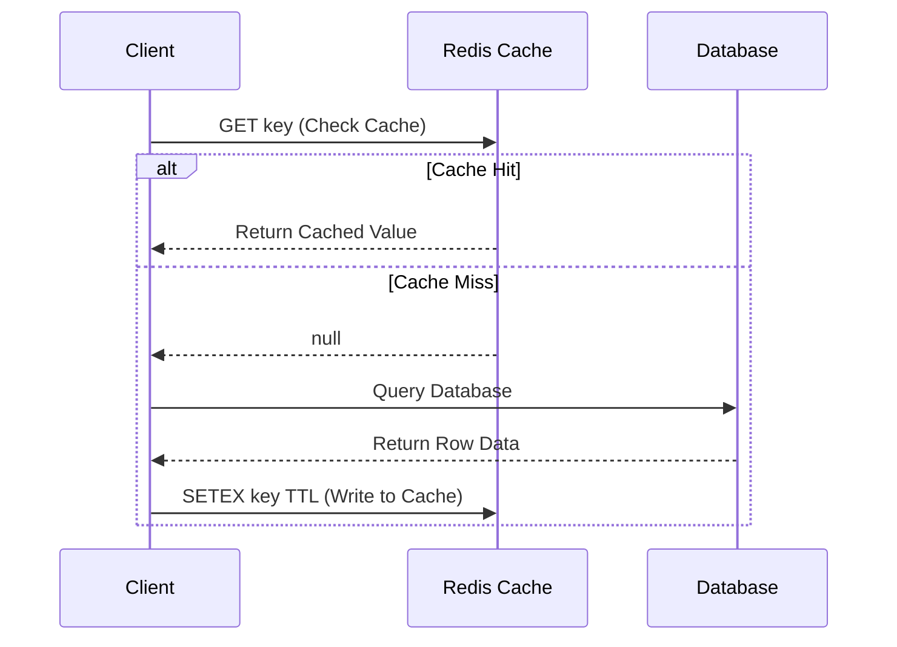
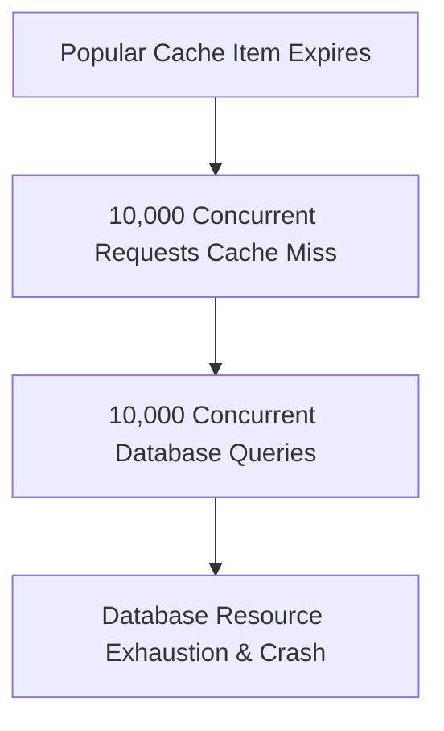

# 3.7.7. Redis Caching Topologies and Stampede Mitigation

> [!info] Orientation
> High-performance backends scale by minimizing direct database lookups. **Redis**, an in-memory key-value data store, serves as the industry standard caching layer. This note explores standard caching topologies, Redis memory eviction policies, and advanced strategies to mitigate the **Cache Stampede** (Thundering Herd) problem on high-traffic endpoints.

---

## 1. Caching Strategies: Cache-Aside vs. Write-Through

To integrate Redis into your backend, select the appropriate data flow topology:

### A. Cache-Aside (Lazy Loading - Most Common)
The application attempts to read data from Redis first. If a cache miss occurs, the application queries the database, writes the result to Redis, and returns the response.



* **Pros:** Lazy evaluation; only stores requested data. If Redis fails, the app falls back to the database.
* **Cons:** Cache-miss latency penalty on first lookup. Stale data risk if database values are modified without updating the cache.

### B. Write-Through
The application writes updates to the cache and the database simultaneously.

* **Pros:** Cache is always up-to-date, preventing stale data reads.
* **Cons:** High write latency overhead because every write requires updating two independent storage systems.

---

## 2. Managing TTLs and Eviction Policies

To prevent Redis from running out of memory (OOM), configure dynamic **Eviction Policies** inside `redis.conf`:

```text
# Exceeded maximum memory behavior configuration
maxmemory 2gb
maxmemory-policy allkeys-lru
```

### Key Eviction Policies:
* **`volatile-lru` (Least Recently Used):** Evicts the least recently used keys, but only those featuring an active **TTL** (Time-To-Live). Recommended if you use Redis for both transient caching and persistent session queues.
* **`allkeys-lru`:** Evicts *any* key using the LRU algorithm, regardless of whether it has a TTL.
* **`allkeys-lfu` (Least Frequently Used):** Evicts keys with the lowest access frequency count, keeping highly popular keys cached.
* **`noeviction`:** Returns out-of-memory write errors when memory limits are reached. Extremely dangerous in production.

---

## 3. The Cache Stampede (Thundering Herd) Problem

A **Cache Stampede** occurs on highly trafficked endpoints when a popular, expensive cached item expires (reaches TTL = 0).

Because the cache is now empty, hundreds or thousands of concurrent incoming requests experience a cache miss simultaneously. They all query the underlying database and attempt to rebuild the cache at the same time, leading to database connection pool exhaustion and database failure.



---

## 4. Cache Stampede Mitigation Strategies

### Mitigation A: Mutual Exclusion (Locking)
When a cache miss occurs, the request must acquire a short-lived distributed lock (using Redis `SETNX`) before querying the database. Other concurrent requests fail to acquire the lock and simply wait or return a slightly stale value:

```javascript
async function getProductWithLock(productId) {
  const cacheKey = `product:${productId}`;
  let value = await redis.get(cacheKey);

  if (value) return JSON.parse(value);

  // Cache Miss: Attempt to acquire distributed lock
  const lockKey = `lock:${cacheKey}`;
  const hasLock = await redis.set(lockKey, "locked", "NX", "PX", 2000); // 2-sec limit

  if (hasLock) {
    try {
      // Fetch from DB & Write back to Cache
      const dbValue = await db.queryProduct(productId);
      await redis.set(cacheKey, JSON.stringify(dbValue), "EX", 3600);
      return dbValue;
    } finally {
      // Release lock safely
      await redis.del(lockKey);
    }
  } else {
    // Lock acquisition failed: Wait briefly and retry reading cache
    await sleep(100);
    return getProductWithLock(productId);
  }
}
```

### Mitigation B: Probabilistic Early Expiration (XFetch Algorithm)
Instead of waiting for the key to reach a hard TTL of zero, the client uses a probabilistic algorithm to recompute and update the cache *before* it expires. The closer the key is to expiration, and the higher the current request traffic, the higher the probability that a background thread will fetch the latest database value and refresh the cache early, completely preventing cache-miss latency spikes.

---

## Summary

Redis is a critical tool for scaling high-traffic backend applications. By selecting the correct cache topology, managing eviction policies like `volatile-lru`, and implementing distributed locks or probabilistic early expiration to prevent Cache Stampedes, applications can easily support massive traffic volumes.

## See Also

- [[3.7.2. Database and Caching Topologies]]
- [[3.7.8. Nginx Load Balancing and Reverse Proxy Configuration]]
- [[3.7.9. Production Logging and Distributed Tracing]]
