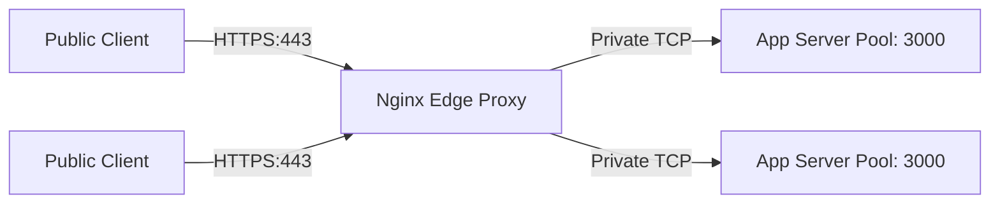

# 3.7.8. Nginx Load Balancing and Reverse Proxy Configuration

> [!info] Orientation
> Running backend services directly exposed to the public internet is a major security risk. **Nginx** serves as a high-performance reverse proxy, load balancer, and security shield, routing traffic to backend microservices. This note details Nginx upstream load balancing algorithms, SSL/TLS termination, and production rate-limiting configurations.

---

## 1. Nginx as a Reverse Proxy

A **Reverse Proxy** acts as an intermediary gateway between public client browsers and your internal backend application servers.

Instead of clients querying your application ports (like node on `:3000` or java on `:8080`) directly, all traffic routes through Nginx on ports `80` (HTTP) or `443` (HTTPS). Nginx processes the headers, performs security checks, and forwards the clean requests to the backend application pool over fast internal local networks.



---

## 2. Load Balancing Upstream Pools and Algorithms

Nginx can distribute incoming traffic across multiple backend servers using **Upstream Blocks**. You can configure different load-balancing algorithms depending on your architecture:

### A. Round Robin (Default)
Requests are distributed sequentially across the available servers in the pool.

### B. Least Connections (`least_conn`)
Requests are routed to the server with the fewest active connections. Recommended for resource-heavy APIs where request durations vary widely.

### C. IP Hash (`ip_hash`)
Routes requests from the same client IP address to the same backend server (session persistence). Useful for legacy stateful session applications.

### Concrete Production Configuration:

```nginx
# nginx.conf
events { worker_connections 1024; }

http {
    # Define an upstream pool of backend servers
    upstream app_backend_pool {
        least_conn; # Use Least Connections algorithm
        server 10.0.0.10:3000 max_fails=3 fail_timeout=10s;
        server 10.0.0.11:3000 max_fails=3 fail_timeout=10s;
        server 10.0.0.12:3000 backup; # Only used if others fail
    }

    server {
        listen 80;
        server_name api.example.com;
        
        # Automatically redirect all unencrypted HTTP traffic to HTTPS
        return 301 https://$host$request_uri;
    }
}
```

---

## 3. SSL/TLS Termination Setup

Configuring SSL decryption directly inside your Node.js or Java applications degrades CPU performance. **SSL Termination** offloads this task to Nginx: Nginx decrypts incoming HTTPS traffic, processes security certificates at the edge, and passes unencrypted HTTP requests to your backend servers over secure local networks.

```nginx
# Extending the HTTP server block in nginx.conf
server {
    listen 443 ssl http2;
    server_name api.example.com;

    # SSL Certificates (managed by Let's Encrypt / Certbot)
    ssl_certificate /etc/letsencrypt/live/api.example.com/fullchain.pem;
    ssl_certificate_key /etc/letsencrypt/live/api.example.com/privkey.pem;

    # Modern SSL Protocols and Cyphers (Mozilla intermediate profile)
    ssl_protocols TLSv1.2 TLSv1.3;
    ssl_ciphers ECDHE-ECDSA-AES128-GCM-SHA256:ECDHE-RSA-AES128-GCM-SHA256:ECDHE-ECDSA-AES256-GCM-SHA384:ECDHE-RSA-AES256-GCM-SHA384;
    ssl_prefer_server_ciphers off;

    # Enable Session Tickets for fast resumption
    ssl_session_cache shared:SSL:10m;
    ssl_session_timeout 1d;

    location / {
        # Forward headers so backend correctly identifies client IP and protocol
        proxy_pass http://app_backend_pool;
        proxy_set_header Host $host;
        proxy_set_header X-Real-IP $remote_addr;
        proxy_set_header X-Forwarded-For $proxy_add_x_forwarded_for;
        proxy_set_header X-Forwarded-Proto $scheme;
    }
}
```

---

## 4. Production Rate Limiting (DDoS Shielding)

To protect your backend application from brute-force authentication attacks or Denial of Service (DDoS) attempts, implement **Rate Limiting** at the Nginx edge.

Nginx utilizes the highly efficient **Leaky Bucket** algorithm to queue and throttle requests:

```nginx
# Configure Rate Limiting Zone in the http context
# Limit by client IP address. Allocate 10MB memory zone (holds ~160,000 IPs). 
# Limit rates to 10 requests per second.
limit_req_zone $binary_remote_addr zone=api_limit_zone:10m rate=10r/s;

server {
    listen 443 ssl http2;
    # ... SSL configs ...

    location /api/ {
        # Apply rate limiting to this location block
        # Allow client to burst up to 5 requests temporarily before delaying them
        limit_req_zone api_limit_zone burst=5 nodelay;

        proxy_pass http://app_backend_pool;
    }
}
```

---

## Summary

Deploying Nginx as an edge gateway secures and optimizes backend applications. By distributing traffic across servers using Least Connections algorithms, offloading cryptographic decryption via SSL termination, and mitigating DDoS attacks with rate limits, Nginx ensures high availability and resilience for production clusters.

## See Also

- [[3.7.3. Containerization, Reverse Proxies and Observability]]
- [[3.7.6. OWASP Top 10 Mitigation in Modern Backends]]
- [[3.7.7. Redis Caching Topologies and Stampede Mitigation]]
- [[3.7.10. Containerization with Docker Multi-Stage Builds]]
