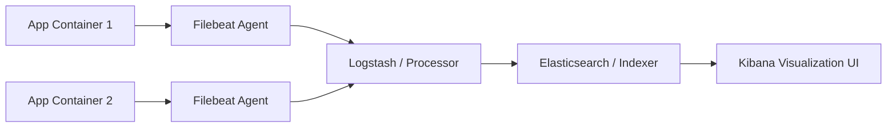

# 3.7.9. Production Logging and Distributed Tracing

> [!info] Orientation
> In distributed architectures, tracking a request across multiple database servers and microservices is highly complex. If a system failure occurs, searching scattered text logs is slow and ineffective. This note details structured JSON logging practices, centralized logging architectures (the ELK stack), and distributed tracing using Correlation IDs and OpenTelemetry.

---

## 1. Structured JSON Logging

Traditional application logs are written as flat, arbitrary text lines:

```text
// ❌ Poor Practice (Hard to parse automatically)
[2026-08-02 12:45:01] INFO UserService - User registered successfully with email: tester@example.com, IP: 192.168.1.1, execution took 12ms
```

To run scalable production environments, applications should output logs as structured **JSON objects**. JSON logs are easily parsed, indexed, and queried by centralized log aggregators (like Elasticsearch or Datadog) without needing complex regular expressions.

```json
//  Structured JSON Log (Machine-readable)
{
  "timestamp": "2026-08-02T12:45:01.234Z",
  "level": "INFO",
  "logger": "com.example.service.UserService",
  "message": "User registration completed",
  "context": {
    "user_email": "tester@example.com",
    "client_ip": "192.168.1.1",
    "duration_ms": 12
  },
  "trace": {
    "trace_id": "8f886fdf-e32a-431f-9975-4fc99b78809c",
    "span_id": "b3f3747f2e"
  }
}
```

Most modern frameworks feature dedicated JSON formatters:
* **Node.js (Winston / Bunyan):** Custom JSON format pipelines.
* **Java (Logback / Log4j2):** Jackson/JSON-Layout appenders.
* **PHP (Monolog):** `JsonFormatter` class configurations.

---

## 2. Centralized Logging Architecture (ELK / EFK Stack)

Running multiple servers in production means logs are scattered across individual disk files. A centralized logging pipeline aggregates these logs into a single, searchable index:

1. **Shipper (Filebeat / FluentBit):** A lightweight agent running on each application container that watches log files and ships new lines to the collector.
2. **Collector / Processor (Logstash / Fluentd):** Receives, parses, and normalizes log formats.
3. **Indexer (Elasticsearch / OpenSearch):** A highly performant document search engine that indexes and stores logs.
4. **Visualizer (Kibana / OpenSearch Dashboards):** A web interface to search, query, and visualize logs.



---

## 3. Distributed Tracing and Correlation IDs

When a client performs an action (like making a purchase), the request may pass through multiple services:

```text
Edge Proxy ➔ Web Front ➔ Order Service ➔ Inventory Service ➔ Database
```

If the inventory database fails, finding the root cause is difficult because each service logs the transaction independently.

### The Solution: Correlation IDs (Trace IDs)
A **Correlation ID** is a unique UUID generated at the edge of your infrastructure (usually by your reverse proxy or API gateway) and injected into the request headers:

```http
X-Correlation-ID: 8f886fdf-e32a-431f-9975-4fc99b78809c
```

As the request travels across downstream services, each microservice **must** read this header and propagate it to all subsequent HTTP requests and database queries. Every log statement printed by any service during this request cycle must include this correlation ID.

By searching for this single ID in Kibana, you can retrieve the end-to-end execution timeline across all services, making troubleshooting incredibly simple.

---

## 4. OpenTelemetry Standards

**OpenTelemetry (OTel)** is an open-source, vendor-neutral standard managed by the Cloud Native Computing Foundation (CNCF) for collecting telemetry data: **Traces, Metrics, and Logs**.

OTel provides:
* **APIs:** Standard interfaces to instrument code and generate data.
* **SDKs:** Language-specific libraries to manage processing and exporting.
* **Collector:** A high-performance proxy that receives, filters, and routes telemetry data to backends (such as Jaeger, Zipkin, or Datadog) for visualization.

```mermaid
graph TD
    App[Instrumented App with OTel SDK] -- OTLP Protobuf --➔ Collector[OpenTelemetry Collector]
    Collector -- Route to Backends --➔ Jaeger[Jaeger Traces UI]
    Collector -- Route to Backends --➔ Prometheus[Prometheus Metrics]
```

---

## Summary

Production logging and tracing are critical for running reliable systems. By structuring logs as JSON objects, aggregating logs into a centralized Elasticsearch index, propagating Correlation IDs through HTTP headers, and adopting OpenTelemetry standards, developers can easily monitor and debug complex microservice architectures.

## See Also

- [[3.7.1. Security Architecture and Authentication Patterns]]
- [[3.7.3. Containerization, Reverse Proxies and Observability]]
- [[3.7.8. Nginx Load Balancing and Reverse Proxy Configuration]]
