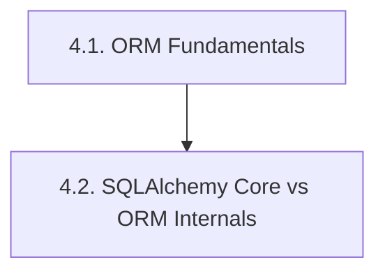
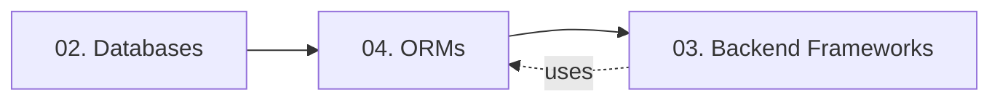
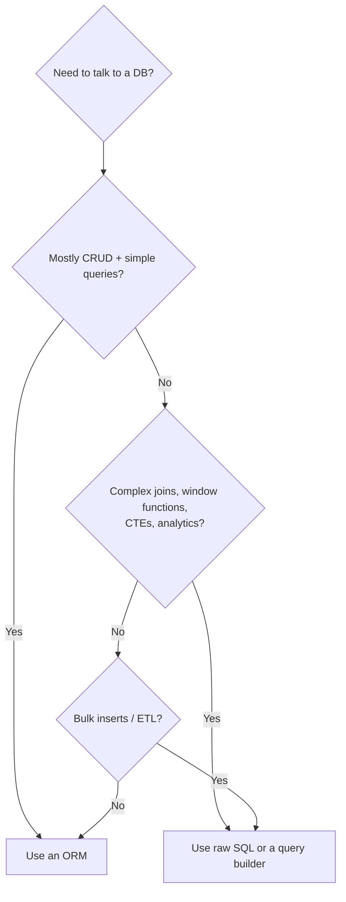

# 04. ORMs — Chapter Index

> [!info] Chapter Purpose
> Object-Relational Mappers (ORMs) sit between your OOP code and your relational database. This chapter explains what they do, why they exist, the two main architectural patterns (Active Record vs Data Mapper), and then deep-dives into **SQLAlchemy** — the most feature-complete ORM in the Python ecosystem and the one the Flask notes (`3.2.9.`) depend on.

The chapter is short by design. ORMs are a single concept with deep mechanics — two notes cover it.

---

## Notes in This Chapter

| # | Note | Topic |
| - | ---- | ----- |
| 4.1 | [[4.1. ORM Fundamentals]] | What an ORM is, Active Record vs Data Mapper, identity map, unit of work, lazy/eager loading, N+1 problem, anti-patterns. |
| 4.2 | [[4.2. SQLAlchemy Core vs ORM Internals]] | The two-layer SQLAlchemy architecture, Session lifecycle, 2.0 unified API, loading strategies, Alembic migrations, connection pool, async support. |

---

## Recommended Reading Order

Read **4.1.** first — it introduces the vocabulary (Active Record, Data Mapper, identity map, unit of work, N+1). Then **4.2.** shows how SQLAlchemy instantiates those concepts in a real library.

---

## Prerequisites

- **[[2.1. Database Engine Fundamentals]]** — you need to understand transactions, isolation, and connection pooling before an ORM's behavior makes sense.
- Comfortable with object-oriented programming (classes, instances, references).
- Some exposure to SQL — the author already knows SQL well, so the ORM notes focus on what the ORM *does for you* and *what it can't do*.

---

## What This Chapter Does NOT Cover

- **Other ORMs in depth** (Hibernate, Entity Framework, Prisma, Django ORM, Eloquent). They are mentioned in `4.1.` for comparison but not deeply documented. Eloquent has its own notes in `3.5.2.`; Django ORM in `3.3.1.`.
- **NoSQL ODMs** (Mongoose for MongoDB). Mongoose is mentioned in `2.6. MongoDB Storage and Clustering`, but a deep ODM chapter is out of scope.
- **ORM performance benchmarking** — benchmarks age fast and rarely generalize.
- **Database migration tooling beyond Alembic** (Flyway, Liquibase, Knex migrations, etc.) — covered only where they appear in framework notes.

---

## How This Chapter Connects to the Rest of the Vault

- **`4.2.` SQLAlchemy** is the engine behind `3.2.9. Flask with SQLite and SQLAlchemy`. Read 4.2 to understand what `db.session.commit()` actually does.
- **`4.1.` ORM Fundamentals** explains the Active Record pattern that `3.5.2. Laravel Service Container and Eloquent` uses.
- The `2.1. Database Engine Fundamentals` note explains the substrate (transactions, connections) that every ORM depends on.

---

## When to Use an ORM (and When Not To)

The ORM Fundamentals note (`4.1.`) walks through the trade-offs in detail. Short version: ORMs accelerate typical application work and slow down bulk/analytics work. Use them for the 90%, drop to raw SQL for the 10%.

---

## Maintenance Notes

- SQLAlchemy 2.0 is the current API style. If 3.0 ships with breaking changes, audit `4.2.`.
- New ORMs worth tracking: Prisma (TypeScript), SQLModel (Python, built on SQLAlchemy + Pydantic), Drizzle (TypeScript). If the author adopts one, add a new note.
- The async SQLAlchemy API is stable but evolving. Update `4.2.` when async patterns consolidate.

---

*See also: [[00. Master Index]] — [[00. README and Vault Conventions]]*
