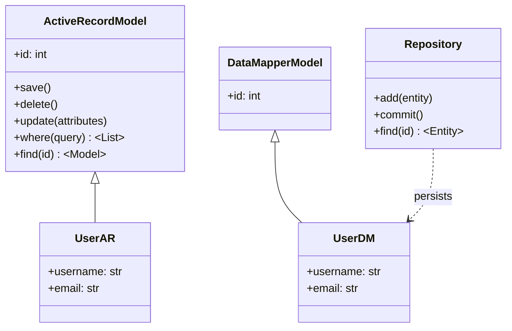

# 4.1. ORM Fundamentals

> [!info] This note defines Object-Relational Mapping, surveys the two dominant implementation patterns (Active Record and Data Mapper), and explains the runtime features that every mature ORM provides.
> It is the conceptual foundation for [[4.2. SQLAlchemy Core vs ORM Internals]] and the ORM-related sections of [[3.2.9. Flask with SQLite and SQLAlchemy]], [[3.3.1. Django Overview and MVT Pattern]], and [[3.5.2. Laravel Service Container and Eloquent]].

---

## 1. What an ORM Is

An **Object-Relational Mapper (ORM)** is a library that sits between an application's object-oriented domain model and a relational database, translating between the two representations. Classes become tables, instances become rows, attributes become columns, and associations between classes become foreign keys and join tables. The application code manipulates Python, Java, PHP, or Ruby objects, and the ORM emits the SQL that materializes those changes in the database.

The mapping is not one-to-one at the type level. A `datetime` in Python maps to a `TIMESTAMP` column, a `Decimal` maps to `NUMERIC`, an `Enum` maps to a check constraint or a native enum type, and a Python `list` of related objects maps to a join against a foreign-key table. The ORM owns the type coercion layer that converts bytes coming back from the DBAPI driver into the rich Python objects the application expects. This conversion is where most of the ORM's value lives, and also where most of its performance pitfalls live, because every row returned becomes at least one Python object allocated on the heap.

The motivation for an ORM is straightforward: writing raw SQL strings inside application code is error-prone, type-unsafe, and tightly coupled to a specific database vendor. The ORM provides a typed, composable, vendor-agnostic abstraction that lets the same model code target SQLite in development and PostgreSQL in production. It also provides higher-level services — connection pooling, transactions, migrations, identity management — that every non-trivial application eventually needs anyway.

---

## 2. Why ORMs Exist

Consider the raw SQL approach in a Flask application without an ORM:

```python
import sqlite3
conn = sqlite3.connect("users.db")
cursor = conn.cursor()
cursor.execute("SELECT * FROM users WHERE age > ?", (25,))
rows = cursor.fetchall()
```

This is three lines of code and a SQL string. The string is opaque to the type checker, the IDE, and the compiler. If you rename the `age` column to `years_alive`, the application continues to compile and starts failing at runtime. If you switch from SQLite to PostgreSQL, the parameter marker `?` is wrong — Postgres uses `%s`. If the `users` table is replaced with a view, or partitioned, or moved to a different schema, the query string is the only artifact that knows about the change, and it lives inside Python code.

The equivalent with SQLAlchemy is:

```python
users = session.execute(
    select(User).where(User.age > 25)
).scalars().all()
```

The query is expressed in terms of the `User` class, which is a real Python object the IDE can navigate. Rename the attribute and the query breaks at import time. Swap the dialect and the parameter markers are rewritten automatically. The expression `User.age > 25` is a Python object — a `BinaryExpression` — that composes with other expressions, can be inspected, and can be re-targeted at a subquery or CTE without rewriting string concatenation.

The ORM is not free: it adds an abstraction layer with its own performance characteristics, its own conceptual model, and its own failure modes. But for the 90% of database interactions in a typical application — single-row CRUD, simple joins, paginated listings — the ORM's productivity and safety win overwhelmingly. The remaining 10% (bulk loads, complex reporting, geospatial queries) is where raw SQL or the ORM's lower-level SQL expression layer is the right call.

---

## 3. The Two Main Patterns: Active Record vs Data Mapper

Every ORM in production use falls into one of two architectural patterns. The distinction matters because it shapes how you write application code, where persistence logic lives, and how testable the domain layer is.



**Active Record** fuses the domain object with its persistence mechanism. The model class is both the row representation and the data-access object. A model instance carries its own database state, and you persist it by calling a method on the instance itself: `user.save()`, `user.destroy()`, `User.where(active: true)`. The model knows about the database — it inherits from a base class that provides query methods, validation hooks, and callbacks. Django ORM, Laravel Eloquent, and Ruby on Rails' ActiveRecord are the canonical examples.

Active Record shines for CRUD-heavy applications with simple domain logic. The model is the single source of truth, the API is intuitive (`user.save()`), and the framework provides generators that scaffold models, migrations, and controllers from the same declaration. The cost is that domain logic and persistence logic are coupled: a `User` object cannot be instantiated and tested without a database connection (or a test double that simulates one), and the model tends to accumulate business logic until it becomes a God object.

**Data Mapper** separates the domain object from the persistence layer. The model is a plain Python/Java/PHP class with no knowledge of the database; a separate `Mapper`, `Repository`, or `Session` object is responsible for loading and storing instances. The domain layer remains pure — you can construct a `User` object, exercise its methods, and assert on its state without ever touching SQL or a session. SQLAlchemy, Hibernate/JPA, and Doctrine are the canonical examples.

Data Mapper pays for its purity with ceremony. You must explicitly open a session, `session.add(user)`, and `session.commit()`. The benefit is that domain logic stays testable, the persistence layer can be swapped (in principle), and the model is not a God object because persistence is a separate concern. For applications with rich domain rules — financial systems, scheduling engines, anything where the *behavior* of an entity is more interesting than its columns — Data Mapper is the better fit.

---

## 4. Common Runtime Features

Regardless of pattern, mature ORMs converge on a set of runtime features that address recurring problems in database-backed applications.

The **identity map** ensures that within a session, a given database row is represented by exactly one Python object. Without it, two queries for the same primary key would return two distinct objects, and modifying one would not affect the other — leading to stale state and lost updates. The identity map keys on (mapper, primary_key) and returns the existing object on cache hit.

The **unit of work** pattern batches all modifications made to objects in a session and flushes them in a single transaction at commit time. The ORM tracks which objects are new, which are dirty, and which are deleted, and emits a minimal set of `INSERT`, `UPDATE`, and `DELETE` statements ordered to satisfy foreign-key constraints. This means you can modify dozens of related objects and call `commit()` once, instead of writing a transaction by hand.

**Lazy loading** means a relationship attribute (`user.posts`) is not fetched from the database until it is accessed. This avoids loading the entire object graph eagerly when you only need the parent. The cost is the **N+1 query problem**: iterating over 100 users and accessing `user.posts` for each issues 1 query for the users plus 100 queries for the posts — 101 round trips where one join would have sufficed.

**Eager loading** is the fix: the ORM fetches the related rows in a single additional query (or in the same query via a JOIN). In SQLAlchemy 2.0 the strategies are `selectinload` (second query with `IN` clause), `joinedload` (single query with `OUTER JOIN`), and `subqueryload` (second query with a subquery). Choosing between them depends on the cardinality of the relationship and whether duplicate parent rows in the join result are acceptable.

The **query builder** is the typed, composable surface for expressing SQL in code. A `select(User).where(User.age > 25).order_by(User.name)` chain is a query builder: each method returns a new immutable query object, and the SQL is generated only when the query is executed. Query builders protect against SQL injection (parameters are always bound, never interpolated), enable refactoring (rename a column and the query builder call site fails at import time), and make dynamic query construction (filter by optional URL parameters) tractable.

**Migrations** are version-controlled schema changes. The ORM introspects the current model definitions, diffs them against the database's actual schema, and emits SQL DDL to reconcile the two. Alembic (SQLAlchemy), Django migrations, Laravel migrations, and Flyway (Java) all follow this pattern. Migrations are forward-only and reversible; each migration is a small, atomic, reviewed change to the schema that ships alongside the code.

**Transactions** are the unit of work's commit boundary. The ORM opens a transaction when the session begins, flushes pending changes when you call `commit()`, and rolls back on `rollback()` or on any exception that escapes the session. This is the same transaction the database sees; the ORM is not implementing transactions, just managing their lifecycle.

---

## 5. The N+1 Query Problem

The N+1 problem is the single most common ORM performance bug. It occurs when the application iterates over a collection of parent objects and accesses a lazy-loaded relationship on each, producing one query for the parents and N additional queries for the children.

```python
# N+1 query — 1 query for users, plus 1 query per user for their posts
users = session.execute(select(User)).scalars().all()
for user in users:
    print(user.username, len(user.posts))  # ← lazy load fires here
```

Detecting N+1 in development requires turning on SQL logging and watching the query count explode during a request. Most ORMs can log every statement they emit, and the pattern is unmistakable: a long run of identical `SELECT ... WHERE user_id = ?` queries with a single varying parameter.

The fix is eager loading. Tell the ORM up front that you will need the relationship, and it will fetch the data in one additional query instead of N.

```python
# Eager load — 2 queries total regardless of user count
users = session.execute(
    select(User).options(selectinload(User.posts))
).scalars().all()
for user in users:
    print(user.username, len(user.posts))  # already loaded, no query
```

`selectinload` issues a second `SELECT ... WHERE user_id IN (?, ?, ?, ...)` query — one round trip regardless of how many users. `joinedload` does it in one query with an `OUTER JOIN`, at the cost of duplicating parent columns across child rows. The right choice depends on row width and join cardinality.

---

## 6. Trade-offs and When ORMs Hurt

ORMs trade raw performance and SQL expressiveness for safety, productivity, and abstraction. The trade is favorable for most application code, but it breaks down in three situations.

First, **large bulk operations**. Inserting a million rows through the ORM means instantiating a million Python objects, tracking each in the identity map, and emitting a million `INSERT` statements. The ORM's `session.bulk_save_objects()` or Core's `insert().values([...])` bypasses the identity map and uses a single multi-row insert, but you lose the ORM's automatic state tracking. For bulk loads, raw SQL or the database's native `COPY` is the right answer.

Second, **complex reporting queries**. Multi-table aggregations, window functions, recursive CTEs, and `LATERAL` joins are expressible in SQL but painful in a query builder. The query builder's composition model assumes you are building one query at a time; complex reporting often requires a CTE that is reused across multiple later queries. Writing this in raw SQL is clearer and faster than fighting the builder.

Third, **performance-critical hot paths**. The ORM's overhead — identity map lookup, attribute access through descriptors, change tracking — is microseconds per row. For a request that loads 50 rows, that overhead is invisible. For a batch job that scans 50 million rows, it dominates the runtime. In hot paths, drop down to the SQL expression layer (SQLAlchemy Core) or to raw SQL with manual result mapping.

---

## 7. ORM Anti-Patterns

Several recurring mistakes degrade ORM-based codebases over time. Recognizing them early is the difference between a maintainable application and a tangled one.

**Leaking persistence into the domain layer** is the Active Record temptation: business rules live on the model class, the model class knows about the database, and therefore business rules are untestable without a database. The Data Mapper pattern exists specifically to prevent this; if you are using Active Record, the discipline of pushing business logic into service objects — and keeping models as data + simple validations — preserves testability.

**God models** emerge when a single table accumulates responsibilities: a `User` model that handles authentication, profile, preferences, billing, and notifications. The class grows to thousands of lines, every change risks breaking unrelated features, and the database table acquires dozens of nullable columns. The fix is to split the model along bounded-context lines — `AuthUser`, `Profile`, `BillingAccount` — even if they map to the same table.

**Broken relationships** happen when the ORM's relationship configuration does not match the foreign-key reality. A `relationship(User, back_populates='posts')` on `Post` requires a matching `relationship(Post, back_populates='user')` on `User`; if one side is missing, the in-memory object graph is inconsistent. Symptoms include stale relationships after commit, cascade deletes that do not fire, and tests that pass in isolation but fail in integration.

**Treating the ORM as a SQL replacement** is the strategic mistake. The ORM is a productivity layer over SQL, not a replacement for understanding SQL. Engineers who do not know what query the ORM will emit — what join it will choose, what index it will use, how it will paginate — produce applications that work in development and fall over in production. Always enable SQL logging in development; always read the generated SQL for non-trivial queries.

---

## Summary

An ORM maps object-oriented domain models to relational tables, translating between the two representations and providing higher-level services (identity map, unit of work, lazy/eager loading, migrations, transactions) that every database-backed application eventually needs. The two dominant patterns — Active Record and Data Mapper — trade simplicity for testability, and the choice shapes how the codebase evolves. The N+1 problem is the canonical ORM pitfall, fixed by eager loading; bulk loads, complex reporting, and hot-path queries are the cases where dropping below the ORM is correct. Used with discipline, an ORM is a productivity multiplier; used without understanding what it emits, it is a source of slow queries and unmaintainable models.

---

## See Also

- [[4.2. SQLAlchemy Core vs ORM Internals]]
- [[3.2.9. Flask with SQLite and SQLAlchemy]]
- [[3.5.2. Laravel Service Container and Eloquent]]
- [[3.3.1. Django Overview and MVT Pattern]]
- [[2.1. Database Engine Fundamentals]]

## References

- Martin Fowler, *Patterns of Enterprise Application Architecture* — original catalog of Active Record, Data Mapper, Identity Map, and Unit of Work patterns.
- SQLAlchemy 2.0 documentation, "Architecture" and "Session Basics" sections.
- Django documentation, "Making queries" and "QuerySet API reference".
