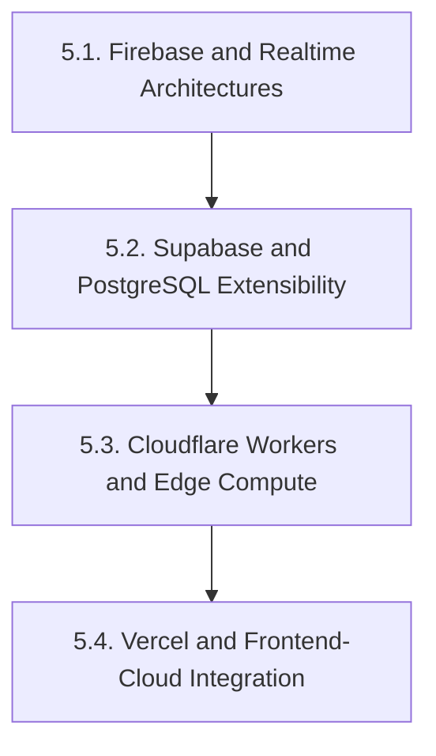
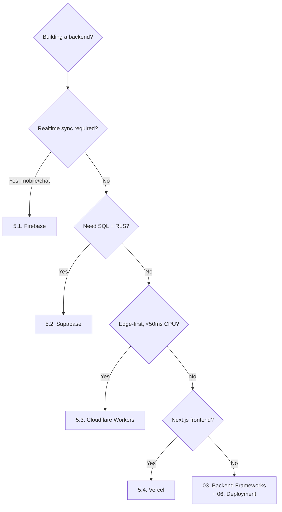
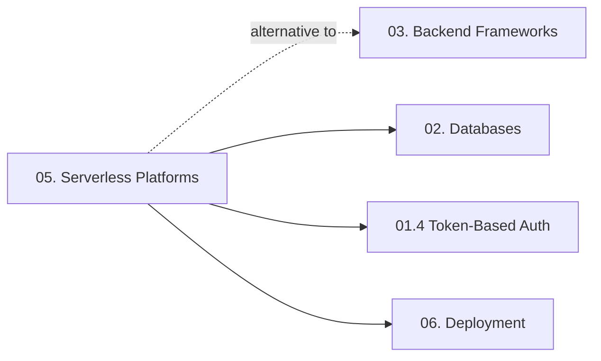

# 05. Serverless Platforms — Chapter Index

> [!info] Chapter Purpose
> "Serverless" is a deployment model where the cloud provider manages servers, scaling, and often the database, while you write functions or frontend code. This chapter covers four major serverless platforms: **Firebase** (Google), **Supabase** (open-source Postgres-based), **Cloudflare Workers** (edge compute on V8 isolates), and **Vercel** (frontend-cloud optimized for Next.js).

Serverless is an *alternative* to building a backend with a framework from chapter `03.`. Use this chapter to know when to skip the framework and go serverless.

---

## Notes in This Chapter

| # | Note | Topic |
| - | ---- | ----- |
| 5.1 | [[5.1. Firebase and Realtime Architectures]] | Firestore, Realtime Database, Auth, Cloud Functions, Hosting, pricing pitfalls, use cases. |
| 5.2 | [[5.2. Supabase and PostgreSQL Extensibility]] | Postgres + PostgREST + GoTrue + Realtime + Storage + Edge Functions. RLS as primary authz. |
| 5.3 | [[5.3. Cloudflare Workers and Edge Compute]] | V8 isolates, edge runtime, KV / Durable Objects / R2 / D1 storage, Workers vs Lambda. |
| 5.4 | [[5.4. Vercel and Frontend-Cloud Integration]] | Next.js deployment, App Router, Server Components, Edge Functions, KV/Postgres/Blob. |

---

## Recommended Reading Order

Read in order. The progression is intentional:

1. **5.1. Firebase** — the original BaaS. Introduces the model of "frontend talks directly to managed DB with realtime sync."
2. **5.2. Supabase** — the open-source Firebase alternative built on Postgres. Same BaaS model, but SQL instead of NoSQL, and RLS instead of security rules.
3. **5.3. Cloudflare Workers** — different model entirely: serverless *functions* at the edge, not BaaS. Smaller surface, more flexible.
4. **5.4. Vercel** — frontend-cloud model: deploy a Next.js app, get serverless functions, edge middleware, and managed data products as one integrated platform.

---

## Prerequisites

- **[[1.1. HTTP Protocol and Lifecycle]]** — every serverless platform is fundamentally an HTTP request processor.
- **[[1.4. Token-Based Authentication]]** — Firebase, Supabase, and Vercel all use JWTs for auth.
- **[[2.2. PostgreSQL Engine Internals]]** — required reading before Supabase (5.2).
- **[[6.1. Docker Containerization and Networking]]** — helpful context, since most serverless platforms use containers under the hood (Cloudflare Workers is the exception — V8 isolates).

---

## Decision Tree — Which Platform?

This is a starting heuristic, not a verdict. Real decisions weigh team familiarity, pricing, vendor lock-in tolerance, and existing stack.

---

## What This Chapter Does NOT Cover

- **AWS Lambda / GCP Cloud Functions / Azure Functions** — the "raw FaaS" offerings. They are mentioned in `5.3.` for comparison with Workers but not deeply documented. If the author adopts them, add new notes.
- **Serverless frameworks** (Serverless Framework, SST, Architect) — out of scope.
- **System design for serverless at scale** (cold-start mitigation math, provisioned concurrency, cost-at-scale forecasting). *Covered in the System Design vault.*
- **Serverless databases** in depth (DynamoDB, Cosmos DB, CockroachDB Serverless) — DynamoDB is mentioned in `2.7.` as a wide-column example.

---

## How This Chapter Connects to the Rest of the Vault

- **Serverless vs Frameworks**: serverless platforms remove the need to deploy and operate a framework. The trade-off is vendor lock-in and platform-imposed limits.
- **Serverless → Databases**: Firebase has Firestore, Supabase has Postgres, Cloudflare has D1/KV/R2, Vercel has Vercel Postgres/KV/Blob. Each platform couples compute and storage.
- **Serverless → Deployment**: when you go serverless, you skip most of chapter `06.` (no Docker, no Nginx, no VPS hardening — the platform handles all of it).

---

## Maintenance Notes

- Pricing and feature sets change quarterly. Audit this chapter every 6 months.
- New platforms to watch: Fly.io (edge VMs), Modal (Python serverless), Railway (backend-as-a-service, not strictly serverless). Add notes when adopted.
- Cloudflare Workers is rapidly evolving (D1 GA, Queues, R2 events). Update `5.3.` as the platform matures.

---

*See also: [[00. Master Index]] — [[00. README and Vault Conventions]]*
