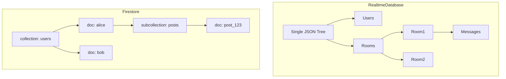
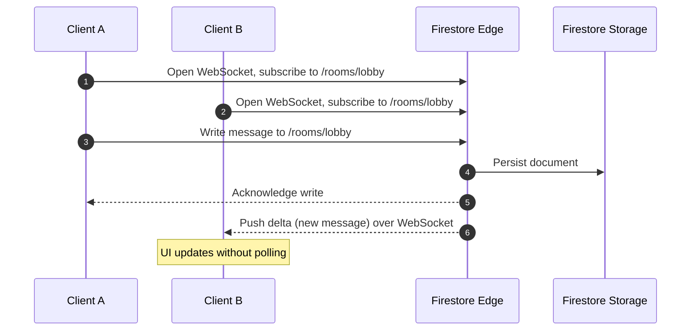

# 5.1. Firebase and Realtime Architectures

> [!info] Firebase is Google's Backend-as-a-Service platform: a NoSQL document database, an authentication provider, serverless functions, file storage, push messaging, and static hosting, all metered under a single bill.
> This note covers the two realtime databases, the data model, the WebSocket sync mechanism, offline support, auth, and the pricing model — and the limitations that bite at scale.

---

## 1. Firebase as a Backend-as-a-Service

Firebase is a suite of managed services that together aim to eliminate the need to operate a traditional backend. Instead of provisioning a database, an auth provider, a file store, and a serverless function runtime separately, a developer creates a Firebase project and gets all of them wired together with a single SDK. The SDK is the contract — the same client SDK that runs in a browser, an iOS app, an Android app, or a React Native app talks to the same backend over the same protocol.

The components are:

| Service | Role |
| ------- | ---- |
| Cloud Firestore | NoSQL document database, the default for new projects |
| Realtime Database | Older JSON-tree database, optimized for low-latency sync |
| Authentication | Email/password, OAuth (Google, Apple, GitHub, ...), phone, anonymous |
| Cloud Functions | Serverless functions triggered by Firestore, Auth, HTTP, Pub/Sub |
| Cloud Storage | Object storage for user uploads (images, videos, files) |
| Cloud Messaging | Push notifications to iOS, Android, and web (FCM) |
| Hosting | Static site hosting with global CDN, SSL, and atomic deploys |

The integration story is the value proposition. Auth issues a JWT that the SDK automatically includes in Firestore reads. Firestore security rules use `request.auth.uid` to scope rows to their owner. Cloud Functions can react to a Firestore document write and trigger a push notification via Cloud Messaging. None of this requires the developer to provision a server, manage a connection pool, or write an OAuth callback handler.

---

## 2. Firestore vs Realtime Database

Firebase offers two realtime databases, and the choice is not always obvious. **Cloud Firestore** is the newer, recommended database; **Realtime Database** is the original, kept alive for backward compatibility and a few niche use cases.



| Feature | Realtime Database | Cloud Firestore |
| ------- | ----------------- | --------------- |
| Data model | Single JSON tree | Collections → Documents → Subcollections |
| Max document size | 256 MB per tree node | 1 MB per document |
| Query | Sort or filter on a *single* property | Compound queries, range filters, indexes |
| Transactions | Whole-tree transactions | Document and batch transactions |
| Multi-region | Single region only | Native multi-region (nam5, eur3) |
| Realtime | WebSocket, ~100 ms typical | WebSocket, ~200 ms typical |
| Pricing | Per GB stored + per MB downloaded | Per document read, per document write, per GB stored |

For new projects, Firestore is the right choice. Its query model is richer (compound `where` clauses, `orderBy` + `limit`, cursor pagination), its data model is more familiar (collections and documents instead of one giant tree), and its scaling story is better (documents are sharded independently). Realtime Database is still useful for very small, very fast, very simple data (presence indicators, ephemeral typing indicators) where the 256 MB-per-node limit and the single-property-query limit are not blockers.

---

## 3. The Firestore Data Model

Firestore organizes data into **collections** and **documents**. A document is a JSON object with named fields; a collection is a list of documents. Documents can contain **subcollections**, which are themselves collections; the hierarchy is unbounded but in practice stays three or four levels deep.

```javascript
// Web SDK — read all posts by alice
const q = query(collection(db, "users", "alice", "posts"), orderBy("createdAt", "desc"));
const snap = await getDocs(q);
snap.forEach(d => console.log(d.id, d.data()));
```

Fields can be strings, numbers, booleans, timestamps, geopoints, arrays, maps (nested objects), references (pointers to other documents), or null. Arrays are special: you cannot query array membership with `where("tags", "==", "python")` (that would match the whole array), but you can use `array-contains` to find documents where an array includes a value, and `array-contains-any` for OR semantics across up to 30 values.

The data model does not support JOINs. To denormalize, you store the same data in multiple documents and keep them in sync with Cloud Functions triggers. To model a many-to-many relationship, you either use an array of references on each side (limited to ~10,000 entries by the 1 MB document size) or an intermediate "join" collection of documents that point to both sides. The choice depends on read patterns: arrays are fast to read but slow to update; join collections are easy to update but require a query to resolve.

---

## 4. Realtime Sync via WebSockets

The feature that defines Firebase is **realtime sync**. The client SDK opens a persistent WebSocket connection to Firebase's edge cluster on first read. Subsequent writes to the same document — from any client, the admin SDK, or a Cloud Function — are pushed to every client subscribed to that path.



The mechanism is conceptually a fan-out: when a document changes, Firestore's backend looks up the set of clients subscribed to that document (or a collection containing it, or a query matching it) and sends each one a small payload describing the change. The payload includes the new document state and the type of change (`added`, `modified`, `removed`), so the client can update its local cache incrementally.

This is what makes Firebase feel magical for chat, presence, and live dashboards: there is no polling loop, no `setInterval`, no SSE stream to manage. The SDK exposes an `onSnapshot` callback that fires on every change, and the framework handles the wire protocol. The cost is that the WebSocket is always open — which means battery drain on mobile, and a persistent connection per active user on the server side.

---

## 5. Offline Support and Conflict Resolution

The client SDK maintains a local on-disk cache of every document the app has read. When the network is unavailable, reads hit the cache and writes queue locally. When the network returns, the SDK syncs the queue and reconciles the cache with the server.

Conflict resolution is **last-write-wins** by default. Each document write carries a timestamp from the client; if two clients write the same field at nearly the same time, the later timestamp wins. This is fine for most fields but breaks for counters: two clients both incrementing `likes` from 5 to 6 will both write 6, and the final value will be 6 instead of 7.

The fix is **transactions** or **increment()**. `increment(1)` is a server-side atomic increment — the SDK sends "increment this field by 1" rather than "set this field to 6," and the server applies the increment atomically. Transactions are for multi-document atomicity: `runTransaction(async (tx) => { ... })` reads, modifies, and writes within a single server-side transaction, retrying automatically if the document changed underneath.

For complex conflict scenarios (collaborative editing, offline forms), Firebase offers no built-in CRDT support. You either accept last-write-wins, or you implement your own merge logic on top of Cloud Functions triggers, or you use a different database. This is the fundamental trade-off of Firebase's simplicity: easy cases are trivial, hard cases are hard.

---

## 6. Firebase Authentication

Firebase Auth is a managed identity provider. It supports email/password, email link (passwordless), phone number (SMS OTP), Google, Apple, Facebook, Twitter, GitHub, Microsoft, Yahoo, anonymous (a temporary account that can be upgraded later), and custom tokens (signed by your own server, for migrating existing users). The SDK handles the OAuth dance, the SMS sending, and the JWT issuance.

On login, Firebase issues a **JWT** (a Firebase ID token) that the client includes in subsequent Firestore reads. The JWT is signed with the project's private key and is valid for one hour; the SDK refreshes it transparently. The JWT contains the user's `uid`, their email, their provider, and any custom claims you set via the Admin SDK.

```javascript
// Web SDK — sign in with Google
import { getAuth, signInWithPopup, GoogleAuthProvider } from "firebase/auth";
const auth = getAuth();
const result = await signInWithPopup(auth, new GoogleAuthProvider());
const idToken = await result.user.getIdToken();
// idToken is a JWT you can verify on your own server with the Admin SDK
```

Security rules use the JWT to scope access. A rule like `allow read: if request.auth.uid == userId;` lets a user read only documents where the `userId` field matches their own `uid`. This moves authorization from the application server to the database, which is the entire point of Firebase — there is no application server, the client talks to Firestore directly.

---

## 7. Cloud Functions

Cloud Functions for Firebase is Google Cloud Functions pre-wired to Firebase events. Functions can be triggered by Firestore document writes (`onWrite`, `onCreate`, `onUpdate`, `onDelete`), Auth events (`onCreate`, `onDelete`), Pub/Sub messages, Cloud Storage object changes, HTTPS requests (a callable URL), and Callable Functions (an RPC-style endpoint invoked from the client SDK).

```javascript
// Node.js — send a welcome email when a new user signs up
exports.sendWelcomeEmail = functions.auth.user().onCreate(async (user) => {
  await mailer.send({
    to: user.email,
    subject: "Welcome to MyApp",
    body: `Hi ${user.displayName || "there"}, thanks for signing up!`,
  });
});
```

Runtimes supported are Node.js (the default and most-supported), Python, and Go. Cold start is the typical serverless issue: a function that has not been invoked in 15 minutes takes 1–3 seconds to start on first call, because the runtime must be provisioned. For HTTP functions in latency-sensitive paths, configure `minInstances` to keep a warm pool — at additional cost.

The Firestore trigger is the architectural workhorse. Any cross-document side effect (denormalizing a counter, sending a notification, writing an audit log, calling a third-party API) belongs in a Firestore-triggered function. The function is invoked exactly once per write, with retry-on-failure semantics, and it has access to the Admin SDK (which bypasses security rules).

---

## 8. Pricing and Cost Surprises

Firebase pricing is the thing that catches teams. Firestore charges per document read, per document write, per document delete, and per GB stored. Reads are the killer: a list view that loads 50 documents, refreshed every 30 seconds by 1000 users, costs 100,000 reads per hour — and free tier is 50,000 reads per day.

The fix is to be deliberate about reads:

- Use **query cursors** instead of `getDocs` on a whole collection; paginating with `startAfter` limits reads to the page size.
- Use **realtime listeners** sparingly; each `onSnapshot` is a continuous stream of reads as documents change.
- Cache aggressively on the client; the SDK's offline cache means a re-read of a cached document is free.
- Denormalize strategically; a single "summary" document with the data the UI needs is one read, vs N reads to compose it from primary documents.
- Use **Cloud Functions with the Admin SDK** for batch jobs; the Admin SDK bypasses the metered read path.

Realtime Database pricing is per GB stored and per GB downloaded, not per read — which is why Realtime Database can be cheaper for high-volume, low-fanout use cases. Cloud Functions pricing is per invocation plus per GB-sec of compute, like other serverless platforms.

Always model the cost before committing. A Firebase project that costs $0 in development (free tier) can scale to thousands of dollars per month in production if a single inefficient query gets hot.

---

## 9. Use Cases and Limitations

Firebase is the right choice for **mobile backends** (auth + Firestore + push notifications cover 80% of a typical mobile app's backend), **realtime apps** (chat, multiplayer, live dashboards, collaborative editors), and **prototyping** (a Firebase project can be stood up in an afternoon, vs days for a custom backend).

Firebase is the wrong choice when:

- You need **relational queries** (JOINs, foreign keys, transactions across many tables). Firestore's lack of JOINs forces denormalization, which is a tax on every write.
- You need **complex aggregations** (sum, average, group-by). Firestore has no native aggregation; you either maintain counters via `increment()` or export to BigQuery.
- You need **multi-region write availability**. Firestore's multi-region is single-writer; if a region fails, latency increases but writes do not stop. (Multi-master is not supported.)
- You need **vendor portability**. The SDK is Firebase-specific; migrating to Postgres or DynamoDB is a full rewrite of the data layer.
- You expect **cost to scale linearly with revenue**. Firebase's per-read pricing means a popular free app can cost more than a paid app, because the free app's reads are still metered.

For SQL-centric teams, [[5.2. Supabase and PostgreSQL Extensibility]] is the typical alternative. For edge-deployed request handlers, [[5.3. Cloudflare Workers and Edge Compute]] is a better fit.

---

## Summary

Firebase is a Backend-as-a-Service built around two NoSQL realtime databases (Firestore and Realtime Database), an auth provider that issues JWTs, serverless functions triggered by database events, file storage, and push messaging. The value is the integrated SDK and the realtime WebSocket sync that makes chat and presence apps trivial. The cost is per-document pricing that scales nonlinearly with read-heavy workloads, a NoSQL data model that forces denormalization, and the absence of relational queries and aggregations. Firebase is excellent for mobile backends, realtime apps, and prototypes; it is the wrong tool for relational data, complex reporting, or cost-sensitive high-volume reads.

---

## See Also

- [[5.2. Supabase and PostgreSQL Extensibility]]
- [[5.3. Cloudflare Workers and Edge Compute]]
- [[5.4. Vercel and Frontend-Cloud Integration]]
- [[1.4. Token-Based Authentication]]
- [[2.7. Relational vs Non-Relational Storage Engines]]

## References

- Firebase documentation, "Cloud Firestore data model", "Security rules", "Cloud Functions triggers".
- Google Cloud blog, "Understanding Firestore pricing" — the canonical explanation of read metering.
- "The Firebase Database Bible," David East (Firebase team) — community-curated data-modeling patterns.
