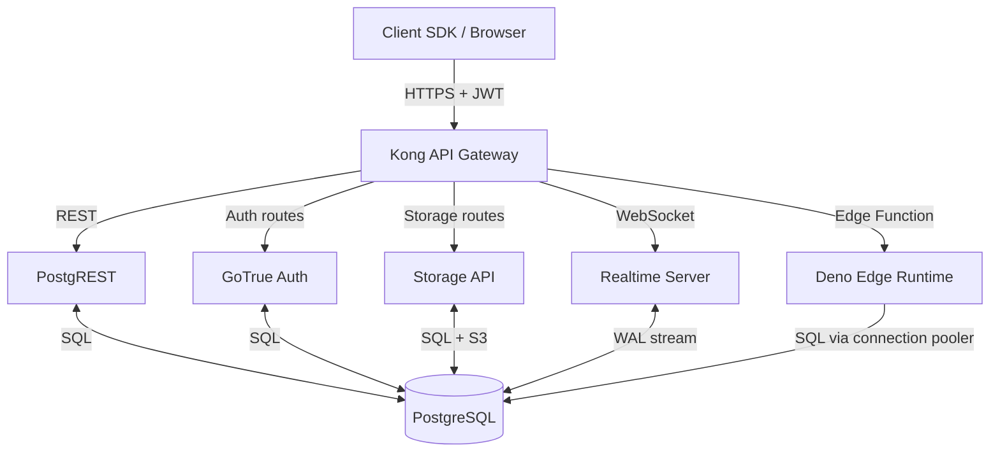

# 5.2. Supabase and PostgreSQL Extensibility

> [!info] Supabase is an open-source Backend-as-a-Service built on PostgreSQL, exposing the database directly to clients via an auto-generated REST API, with row-level security as the authorization layer.
> This note covers the component stack (Kong, PostgREST, GoTrue, Realtime, Storage, Edge Functions), how RLS works with JWT claims, the realtime WAL-based sync mechanism, and the trade-offs versus Firebase.

---

## 1. Supabase as an Open-Source Firebase Alternative

Supabase positions itself as "the open-source Firebase alternative." The marketing is accurate in one important way — Supabase, like Firebase, aims to eliminate the bespoke backend by giving the client SDK direct access to the database, with auth, storage, and serverless functions wired in — and inaccurate in another: where Firebase's database is a proprietary NoSQL store, Supabase's is plain PostgreSQL. This is the entire value proposition. Engineers who already know SQL, who already model data relationally, and who already use Postgres in production get the BaaS ergonomics without abandoning the relational model.

Supabase is not a single product; it is a curated stack of open-source projects pre-configured to run cohesively. Each component is replaceable — you can run them yourself, on your own infrastructure, and Supabase provides Docker Compose files to do exactly that. The hosted Supabase platform is the managed version of the same stack.

| Component | Role | Implementation |
| --------- | ---- | -------------- |
| Database | Relational storage | PostgreSQL 15+ |
| Auth | User management, JWT issuance | GoTrue (Go) |
| REST API | Auto-generated from DB schema | PostgREST (Haskell) |
| Realtime | WebSocket subscriptions on DB changes | Realtime (Elixir) |
| Storage | Object storage with DB metadata | Storage API (Node.js / S3 backend) |
| Edge Functions | Serverless TypeScript functions | Deno Deploy runtime |
| API Gateway | Single entry point, routing, JWT validation | Kong |

The database is the source of truth. Auth records live in `auth.users`. Storage file metadata lives in `storage.objects`. API permissions live in Postgres RLS policies. There is no separate "auth database" or "rules file"; the database itself is the configuration.

---

## 2. Architectural Stack



**Kong** is the API gateway. It terminates TLS, validates JWTs on protected routes, and routes incoming requests by path prefix: `/auth/v1/*` to GoTrue, `/rest/v1/*` to PostgREST, `/storage/v1/*` to Storage, `/realtime/v1/*` to Realtime, `/functions/v1/*` to Deno. Clients use the same base URL and the same JWT for all services; Kong dispatches based on path.

**PostgREST** is the magic. It is a standalone Haskell web server that introspects the PostgreSQL catalog (the `information_schema` and `pg_catalog`), reads the table and view definitions, the function signatures, and the relationship metadata, and exposes them as a REST API. A `GET /rest/v1/users?username=eq.alice&select=id,email` becomes `SELECT id, email FROM users WHERE username = 'alice'`. The translation is direct — PostgREST compiles each request to a single SQL query and runs it in a single transaction. There is no ORM layer, no N+1 risk, no startup latency.

**GoTrue** is an OAuth + JWT provider written in Go. It handles email/password, magic link, OAuth (Google, GitHub, Apple, ...), and phone (SMS OTP) authentication. On login, GoTrue issues a JWT containing the user's `sub` (user UUID), `email`, `role`, and any custom claims. The JWT is signed with the project's JWT secret, which PostgREST, Realtime, and Storage all share, so each service can verify the JWT independently.

**Realtime** is an Elixir server that connects to PostgreSQL as a logical replication client. It consumes the WAL (write-ahead log) stream, decodes the row change events, and fans them out to subscribed WebSocket clients. A client subscribes with `supabase.channel('public:posts').on('INSERT', ...)`, and every `INSERT` into `public.posts` produces a message on the WebSocket.

**Storage** is a Node.js service that exposes an S3-compatible API for file upload and download, with all file metadata (path, owner, size, mime type, bucket) stored in `storage.objects` in Postgres. RLS policies on `storage.objects` determine who can read or write which files.

**Edge Functions** are TypeScript functions running on Deno Deploy, deployed globally. They are invoked via HTTP and have access to the Supabase service SDK. They differ from Cloudflare Workers (which run on V8 isolates, not Deno) — see [[5.3. Cloudflare Workers and Edge Compute]] for the comparison.

---

## 3. PostgREST: The Auto-Generated REST API

PostgREST exposes every table and view in the `public` schema as a REST collection. A `GET /rest/v1/users` returns rows; a `POST /rest/v1/users` inserts; a `PATCH /rest/v1/users?id=eq.42` updates; a `DELETE /rest/v1/users?id=eq.42` deletes. Query parameters compose:

- `?username=eq.alice` — equality filter (`WHERE username = 'alice'`)
- `?age=gt.18` — range filter (`WHERE age > 18`)
- `?select=id,username,posts(title)` — column selection with relationship embedding
- `?order=created_at.desc&limit=20` — ordering and pagination
- `?id=in.(1,2,3)` — `IN` filter

The `select` parameter with `posts(title)` is how PostgREST handles JOINs. It detects the foreign-key relationship between `users` and `posts` and emits a single SQL query with the appropriate join, returning the embedded rows as a nested array. This is the key to using PostgREST without N+1 queries.

Stored functions (PostgreSQL functions) are exposed at `POST /rest/v1/rpc/function_name`. The function receives its arguments as a JSON body and returns whatever the function returns. Functions are the right place for complex business logic — multi-step updates, conditional inserts, aggregations — because they run server-side in a single round trip with full SQL power.

---

## 4. Row-Level Security (RLS) as the Authorization Layer

RLS is the core authorization mechanism. With RLS enabled on a table, every query is transparently filtered by a policy expression evaluated per row. The policy can use the current user's JWT claims — accessed via the `auth.uid()` helper, which returns the `sub` claim, or via `current_setting('request.jwt.claims', true)` for any other claim.

```sql
-- Enable RLS on the profiles table
alter table public.profiles enable row level security;

-- Users can read and update only their own profile
create policy "Users can read own profile"
  on public.profiles for select
  using ( auth.uid() = id );

create policy "Users can update own profile"
  on public.profiles for update
  using ( auth.uid() = id )
  with check ( auth.uid() = id );

-- Anyone can read posts; only the author can delete
create policy "Anyone can read posts"
  on public.posts for select
  using ( true );

create policy "Authors can delete their posts"
  on public.posts for delete
  using ( auth.uid() = author_id );
```

The flow when a client makes a request is:

1. Client logs in via GoTrue, receives a JWT.
2. Client includes the JWT in the `Authorization: Bearer <token>` header on every request.
3. Kong validates the JWT signature, then forwards the request to PostgREST with the JWT in a custom header.
4. PostgREST parses the JWT, extracts the claims, and sets them as PostgreSQL session parameters (`request.jwt.claims`) before executing the query.
5. PostgreSQL evaluates the RLS policy on each row. The `auth.uid()` helper reads the `sub` claim from `request.jwt.claims`.
6. Only rows that satisfy the policy's `USING` expression are returned; only rows that satisfy the `WITH CHECK` expression are written.

This is a fundamentally different model from Firebase's security rules. Firebase's rules are JavaScript-like expressions evaluated by the Firebase backend; Supabase's RLS policies are SQL expressions evaluated by Postgres itself. The Postgres approach is more powerful (any SQL expression works, including subqueries, joins, and function calls) and more auditable (policies are stored in the catalog and can be inspected with `\d+ table` in `psql`). The cost is that RLS policies are SQL, and writing correct SQL for authorization is a skill — a miswritten policy can leak data silently.

---

## 5. Realtime via WAL Logical Replication

The Realtime server does not poll the database. It connects to Postgres as a logical replication subscriber, the same mechanism used for cross-region replication and CDC pipelines. Every `INSERT`, `UPDATE`, and `DELETE` produces a WAL record; Realtime decodes the WAL, converts the change to a JSON payload (`{type: "UPDATE", schema: "public", table: "posts", old: {...}, new: {...}}`), and broadcasts it to every WebSocket subscriber filtered to that table.

```javascript
// Subscribe to all changes on the posts table
const channel = supabase
  .channel('public:posts')
  .on('postgres_changes', { event: '*', schema: 'public', table: 'posts' }, 
      payload => console.log('Change:', payload))
  .subscribe();
```

Realtime respects RLS: a subscriber only receives changes for rows they are authorized to read. This is implemented by having Realtime evaluate the table's RLS policies against the subscriber's JWT before delivering each event. The cost is that Realtime cannot just blindly broadcast — it must check authorization per event per subscriber, which limits fan-out at high scale.

For very high fan-out (a chat room with 10,000 subscribers), Broadcast and Presence channels bypass the database entirely. A Broadcast channel is a pub/sub topic where clients publish messages that Realtime fans out to all subscribers without touching Postgres. A Presence channel tracks which users are online (a la Firebase's presence). These are the right tools for ephemeral realtime data that does not need persistence.

---

## 6. Edge Functions (Deno)

Edge Functions are TypeScript functions running on Deno Deploy, deployed globally. They are invoked via HTTPS at `https://<project>.functions.supabase.co/<name>`, and they receive a `Request` object (Fetch API) and return a `Response`. They are the escape hatch for logic that does not fit cleanly into PostgREST + RLS — calling a third-party API, running a multi-step workflow, transforming a file before upload, sending a webhook.

```typescript
// supabase/functions/welcome-email/index.ts
import { createClient } from "https://esm.sh/@supabase/supabase-js@2";

Deno.serve(async (req: Request) => {
  const { user_id, email } = await req.json();
  // ... send email via Resend, SendGrid, etc.
  return new Response(JSON.stringify({ sent: true }), {
    headers: { "Content-Type": "application/json" },
  });
});
```

Edge Functions differ from Cloudflare Workers in runtime: Deno vs V8 isolates. Cold start is longer (50–200 ms vs <5 ms for Workers) because Deno boots a V8 isolate plus the Deno runtime plus your code. The trade-off is that Deno gives you a fuller runtime (file system access, `Deno.watchFs`, full TypeScript out of the box) that Workers' restrict-by-default model does not. For Supabase, Edge Functions are the right place for code that needs to talk to the database via the service-role key (bypassing RLS) — typically scheduled jobs, webhooks, and migrations of data.

---

## 7. Pricing and Connection Limits

Supabase pricing is per-project, not per-request. The Free tier gives you 500 MB database, 1 GB file storage, 50,000 monthly active users, and unlimited API requests, with the project paused after 7 days of inactivity. The Pro tier ($25/month) raises those limits (8 GB database, 100 GB storage, 100,000 MAUs) and adds daily backups, no project pausing, and the ability to add-ons (read replicas, more compute, longer log retention).

The pricing model is dramatically cheaper than Firebase for read-heavy workloads, because there is no per-read metering. A Supabase app with 1 million daily page views and 100 reads per page pays the same $25/month as one with 100 daily page views.

The constraint that bites is **Postgres connection limits**. Postgres connections are expensive (each is a forked process with ~10 MB of RAM). The default Supabase project allows 60 direct connections; the Pro tier raises this. The fix is the connection pooler (Supavisor, a successor to PgBouncer) which multiplexes many client connections onto a smaller pool of server connections in "transaction mode" — each client transaction borrows a server connection for the duration of the transaction, then returns it. The Supabase client SDK is configured to use the pooler by default; direct connections are for migrations and admin tasks only.

---

## 8. Use Cases and Limitations

Supabase is the right choice for **Postgres-centric teams** (you already know SQL, you want relational integrity, you need JOINs and transactions), **full-stack apps with RLS as primary authz** (the database enforces authorization, the client SDK is the entire API surface), and **migrating from Firebase to something SQL-based** (the data model maps cleanly, the realtime story is comparable).

Supabase is the wrong choice when:

- You need **write-heavy fan-out** (10,000 concurrent writers to one row). Postgres' single-writer-per-row model means write contention; this is where DynamoDB-style single-row-per-partition NoSQL wins.
- You need **globally distributed low-latency reads**. Postgres is single-region by default; Supabase read replicas are a paid add-on and they are async, so writes are not immediately visible to replicas.
- You need **a non-SQL data model** (graph, time-series at extreme scale, document with arbitrary nesting). Postgres handles all of these with extensions, but a specialized database (Neo4j, InfluxDB, MongoDB) is a better fit.
- Your team **does not know SQL or RLS well**. A misconfigured RLS policy leaks data; a slow query on a large table takes down the whole project because Postgres is shared. The Firebase model is more forgiving for teams that do not understand their database.

The other consideration is **vendor coupling to Postgres**. Supabase's value is that it is Postgres; the cost is that everything (auth, storage, realtime, functions) is structured around Postgres. If you outgrow Postgres — for write throughput, for global latency, for a different data model — you are migrating off the entire stack, not just the database.

---

## Summary

Supabase is an open-source Backend-as-a-Service built on PostgreSQL, with PostgREST auto-generating a REST API from the database schema, GoTrue issuing JWTs for auth, Realtime broadcasting WAL changes over WebSockets, and RLS as the per-row authorization layer. The client SDK talks to Postgres directly, scoped by JWT-derived RLS policies, and Cloud Functions provide the escape hatch for logic that needs server-side execution. The model is dramatically cheaper than Firebase for read-heavy workloads and is the natural fit for teams that already think relationally. The constraints are Postgres' connection limits (mitigated by Supavisor), single-region write availability, and the requirement that the team understand RLS well enough to write correct policies — because a miswritten policy leaks data silently.

---

## See Also

- [[5.1. Firebase and Realtime Architectures]]
- [[5.3. Cloudflare Workers and Edge Compute]]
- [[5.4. Vercel and Frontend-Cloud Integration]]
- [[2.2. PostgreSQL Engine Internals]]
- [[4.2. SQLAlchemy Core vs ORM Internals]]

## References

- Supabase documentation, "Architecture", "Row Level Security", "Realtime", "Edge Functions".
- PostgREST documentation, "The API", "Embedded relationships", "Stored procedures".
- PostgreSQL documentation, "Row Security Policies" (Chapter 5.8) and "Logical Replication" (Chapter 31).
