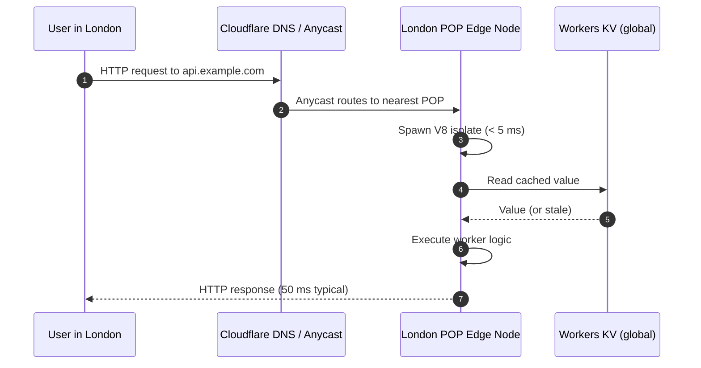
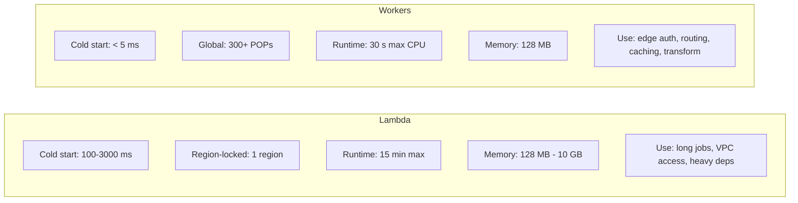

# 5.3. Cloudflare Workers and Edge Compute

> [!info] Cloudflare Workers are serverless functions that execute on Cloudflare's edge network (300+ POPs) inside V8 isolates, not containers.
> This note covers the V8-isolate runtime model, the Fetch API surface, the storage options (KV, Durable Objects, R2, D1, Queues), the consistency trade-offs, and how Workers compare to AWS Lambda and to Supabase Edge Functions.

---

## 1. What Cloudflare Workers Are

Cloudflare Workers are serverless functions that run on Cloudflare's edge network — the same global CDN that serves Cloudflare's DDoS protection and caching. When a request arrives at any of Cloudflare's 300+ points of presence (POPs), the worker executes on a server physically close to the user, typically within tens of milliseconds of round-trip time. The user in São Paulo hits the São Paulo POP; the user in Frankfurt hits the Frankfurt POP.

The architecture is fundamentally different from AWS Lambda or Google Cloud Functions. Lambda runs each function in a micro-VM (Firecracker), with a cold-start measured in hundreds of milliseconds and a runtime that includes the full Node.js or Python process. Workers run in V8 isolates — the same sandboxing technology Chrome uses to isolate JavaScript from different websites — with a cold start under 5 ms. There is no operating system to boot, no runtime process to spawn, no Node.js event loop to initialize. The isolate is a single V8 heap with your code and your dependencies, and it executes the request immediately.



The trade-off for that startup speed is a constrained runtime. Workers do not have Node.js built-ins: no `fs`, no `net`, no `child_process`, no `path`, no `crypto` (use `crypto.subtle` instead), no `process.env` (use `env` binding instead). Anything that requires those modules must be replaced with a Workers-compatible alternative or compiled to WebAssembly.

---

## 2. The V8 Isolate Runtime Model

A V8 isolate is a single JavaScript execution context with its own heap, its own garbage collector, and its own event loop. Multiple isolates share a single V8 engine process but cannot see each other's memory. This is the same model Chrome uses to isolate tabs; Cloudflare reuses it to isolate tenants.

The benefits are:

- **Cold start under 5 ms.** Spinning up an isolate is allocating a heap and loading the script, not booting an OS.
- **Memory footprint of 3–128 MB per isolate.** Compare to Lambda's 128 MB minimum.
- **Multi-tenant density.** A single Cloudflare edge server runs thousands of isolates from thousands of customers on the same machine, with V8's sandboxing preventing cross-tenant access.
- **No language runtime to install.** The V8 engine is the runtime; there is no Node.js or Python process to load.

The costs are:

- **No Node.js built-ins.** Workers polyfill some APIs (Fetch, URL, TextEncoder, Web Crypto, Performance) but not Node-specific ones.
- **No filesystem.** Persistent state must go to KV, R2, D1, or Durable Objects.
- **CPU limits.** The free tier caps CPU time at 10 ms per request; the paid tier caps at 30 s. CPU time is wall-clock time spent executing your code, not time spent waiting on I/O — a worker that issues a slow `fetch()` does not consume CPU while waiting.
- **Memory limits.** 128 MB per isolate on the paid tier; exceeding this throws an exception.

Supported languages are JavaScript, TypeScript (compiled to JS at deploy time), Rust, C, C++ (via WebAssembly), and Python (in beta, also via WASM). The TypeScript tooling (`wrangler`) handles compilation; the Rust tooling (`worker-build`) compiles to WASM.

---

## 3. The Workers Runtime Surface

A Worker is an ES module that exports a `fetch` handler. The handler receives a `Request` (Fetch API) and returns a `Response` (Fetch API). There is no `app.get('/foo', ...)` framework by default — Workers are lower-level than that, although frameworks like Hono and Remix build on top.

```typescript
// src/index.ts — a minimal Worker
export interface Env {
  API_TOKEN: string;        // secret bound at deploy time
  MY_KV: KVNamespace;       // KV namespace binding
}

export default {
  async fetch(request: Request, env: Env, ctx: ExecutionContext): Promise<Response> {
    const url = new URL(request.url);

    if (url.pathname === "/api/hello") {
      const cached = await env.MY_KV.get("greeting");
      if (cached) {
        return new Response(cached, { headers: { "content-type": "text/plain" } });
      }
      await env.MY_KV.put("greeting", "Hello from the edge!");
      return new Response("Hello from the edge!", {
        headers: { "content-type": "text/plain" },
      });
    }

    return new Response("Not found", { status: 404 });
  },
};
```

The `request` is a standard Fetch API `Request` — `request.method`, `request.headers`, `request.json()`, `request.text()`, `request.formData()` all work. The `env` argument exposes secrets (configured via `wrangler secret put`) and bindings to other Cloudflare resources (KV namespaces, R2 buckets, D1 databases, Durable Object namespaces). The `ctx` argument provides `waitUntil(promise)` to extend the worker's lifetime past the response for background work.

`fetch()` is the Workers' way of making outbound HTTP requests. The same Fetch API works for outbound calls as for the inbound request handler; a worker can `fetch("https://api.github.com/users/octocat")` and the request is made from the edge POP, not from the user's browser. This is the building block for proxying, aggregating, and transforming upstream APIs.

`crypto.subtle` is the Web Crypto API, the only crypto surface in Workers. It supports SHA-1/256/384/512, HMAC, RSA-PSS, RSA-OAEP, ECDSA, ECDH, AES-GCM, AES-CBC, and AES-KW. It is async and Promise-based, which takes getting used to if you are coming from Node's synchronous `crypto` module.

---

## 4. Storage Options at the Edge

Workers cannot write to the filesystem. Persistent state goes to one of several Cloudflare-managed stores, each with a different consistency model and use case.

| Store | Consistency | Use case |
| ----- | ----------- | -------- |
| **Workers KV** | Eventually consistent (~60 s) | Configuration, feature flags, cached lookups |
| **Durable Objects** | Strongly consistent (single instance per ID) | Counters, queues, multiplayer game rooms, sockets |
| **R2** | Strongly consistent (per-object) | S3-compatible object storage; large files, media |
| **D1** | Strongly consistent (per-database) | SQLite at the edge; relational data |
| **Queues** | At-least-once | Async message passing between workers |
| **Pub/Sub** | At-most-once (MQTT) | IoT and MQTT broker |

**Workers KV** is the workhorse. It is a globally distributed key-value store with reads served from the edge POP closest to the user. Writes go to a single "primary" region and propagate globally within roughly 60 seconds. A write followed by a read from a different POP may return the stale value for up to a minute. This makes KV unsuitable for counters or anything that needs read-after-write, but ideal for configuration data that changes rarely and is read constantly.

**Durable Objects** are the strongly consistent alternative. Each Durable Object has a unique ID (string), and all requests to that ID are routed to a single instance running in a single POP. The instance has in-memory state and a transactional key-value store backed by SQLite. Two concurrent writes to the same Durable Object are serialized by the runtime, so a counter increment cannot lose updates. Durable Objects are the right tool for chat rooms, multiplayer game lobbies, real-time collaboration, and any pattern where multiple clients need to coordinate through shared state.

**R2** is Cloudflare's S3-compatible object storage. Unlike AWS S3, R2 charges no egress fees — you pay only for storage and operations. This makes R2 dramatically cheaper than S3 for static assets served at scale. R2 objects are strongly consistent: a write is immediately visible to all subsequent reads.

**D1** is SQLite at the edge. Each D1 database has a single primary (in one region) and read replicas in other POPs. Writes go to the primary; reads may hit a replica with a small replication lag. D1 is the right tool when you need SQL — relational integrity, JOINs, transactions — but the data set fits in SQLite (which means up to about 10 GB per database). For larger datasets, you need a different database.

---

## 5. Workers vs AWS Lambda

The two serverless models have fundamentally different sweet spots.



Lambda is the right choice for **long-running jobs** (up to 15 minutes of wall time), **jobs that need VPC access** (database queries against a private RDS instance), **jobs that need large dependencies** (Pandas, NumPy, ML models), and **jobs that benefit from a full Node.js or Python runtime**. Lambda's cold start of hundreds of milliseconds makes it unsuitable for latency-critical edge serving, but its 15-minute runtime and 10 GB memory make it suitable for batch processing that Workers cannot do.

Workers are the right choice for **edge auth and authorization** (validate a JWT and route based on claims, with no origin round trip), **A/B testing and feature flag evaluation** (decide which variant to serve based on a cookie or header, at the edge), **image transformation and resizing** (use Cloudflare Images or a worker that calls an image library), **caching logic** (decide whether to serve from cache, override cache keys, manipulate TTLs), **country-based and device-based routing** (route to a different origin based on `cf-ipcountry`), and **edge rendering** (render HTML at the edge from KV-backed content, no origin server).

In practice, mature architectures use both. Workers handle the edge — auth, routing, caching, personalization. Lambda (or ECS, or EKS, or a long-running server) handles the heavy compute — database writes, machine learning, video transcoding.

---

## 6. Use Cases and Patterns

The canonical Workers patterns are:

**Edge authentication.** A worker validates a JWT in the request header. If valid, it forwards the request to the origin with the user's identity in a custom header. If invalid, it returns 401. The origin never sees an unauthenticated request, and the auth check adds ~5 ms instead of the 200+ ms of a round trip to the origin.

**A/B testing and personalization.** A worker reads a cookie, decides which variant the user should see, fetches the variant HTML from KV or from a different origin, and returns it. The user sees no flicker because the decision happens at the edge.

**API aggregation.** A worker receives a single request, fans out to N upstream APIs in parallel via `Promise.all([fetch(api1), fetch(api2)])`, merges the responses, and returns a single JSON object. The user's round trip is one; the worker's round trips are parallel from a close-to-the-user POP.

**Country-based routing.** A worker reads `request.cf.country` (Cloudflare injects the country code based on the client IP) and routes to the nearest origin. A user in Germany hits the EU origin; a user in the US hits the US origin.

**Durable Objects for realtime.** A Durable Object represents a chat room. Clients connect via WebSocket to the worker, which forwards the connection to the Durable Object. Messages are broadcast to all connected clients by the object. State (the list of connected clients, the message history) lives in the object's transactional storage.

---

## 7. Pricing

The pricing model is generous for low-volume use. The free tier includes 100,000 requests per day and 10 ms CPU per request. The paid tier ($5/month) raises this to 10 million requests per month included, then $0.30 per additional million, with 30 seconds of CPU per request and 128 MB of memory. KV is priced separately: 100,000 reads per day free, then $0.50 per million reads; 1,000 writes per day free, then $5.00 per million writes.

Compared to Lambda, Workers are dramatically cheaper at scale because there is no per-invocation overhead and no per-GB-second compute charge. A worker that handles 10 million requests per month costs $5; the same on Lambda (at 128 MB, 50 ms each) costs roughly $10.40 for compute plus $2.00 for requests.

The bigger cost difference is in egress. Cloudflare does not charge for bandwidth on Workers; AWS charges $0.09 per GB of egress from Lambda to the public internet. A worker that proxies 1 TB/month of API responses costs $5 + $0 egress; the same on Lambda costs $90 in egress alone.

---

## 8. Limitations and When Workers Hurt

Workers are the wrong choice when:

- You need **a long-running job** (video transcoding, batch processing, ML inference). Workers cap at 30 s of CPU per request; Lambda allows 15 minutes.
- You need **Node.js built-ins** that have no Workers equivalent (a specific npm package that depends on `fs`, `net`, or `child_process`).
- You need **a full database connection** to a private RDS instance. Workers cannot open raw TCP sockets; they can only `fetch()` HTTPS endpoints. To talk to a database, the database must be exposed via an HTTP API (PostgREST, Hasura, or a worker that proxies to a D1 database).
- You need **strong consistency globally**. KV is eventually consistent. Durable Objects are strongly consistent but single-region (the object lives in one POP). There is no built-in globally strongly-consistent store; you must architect around this.

The other limitation is the **mental model of the edge**. A worker that fetches data from KV on every request is fast, but if the data is large and changes often, you are paying for KV reads on every request and the worker is doing more work than necessary. Caching at the edge (via the Cache API or `caches.default`) is critical — without it, Workers can amplify load on backing services instead of absorbing it.

---

## Summary

Cloudflare Workers are serverless functions running on V8 isolates at 300+ edge POPs, with cold starts under 5 ms and a Fetch-API runtime surface. They are the right tool for edge auth, routing, caching, personalization, and any logic that benefits from being close to the user. The storage story — KV for eventually consistent global state, Durable Objects for strongly consistent single-instance state, R2 for S3-compatible object storage, D1 for SQL at the edge — covers most application needs. The constraints are the absence of Node.js built-ins, the CPU and memory limits, and the need to architect around KV's eventual consistency. Compared to Lambda, Workers are faster to start, cheaper at scale, and globally distributed, but cannot do long-running jobs or raw TCP. Use Workers for the edge; use Lambda or a long-running server for the heavy compute.

---

## See Also

- [[5.1. Firebase and Realtime Architectures]]
- [[5.2. Supabase and PostgreSQL Extensibility]]
- [[5.4. Vercel and Frontend-Cloud Integration]]
- [[6.3. Nginx Reverse Proxy and Load Balancing]]

## References

- Cloudflare Workers documentation, "How Workers work", "Runtime APIs", "Durable Objects", "Workers KV".
- Cloudflare blog, "Cloudflare Workers as a V8 runtime" — the architectural rationale.
- "Workers vs Lambda: A Technical Comparison," Cloudflare blog, 2022.
