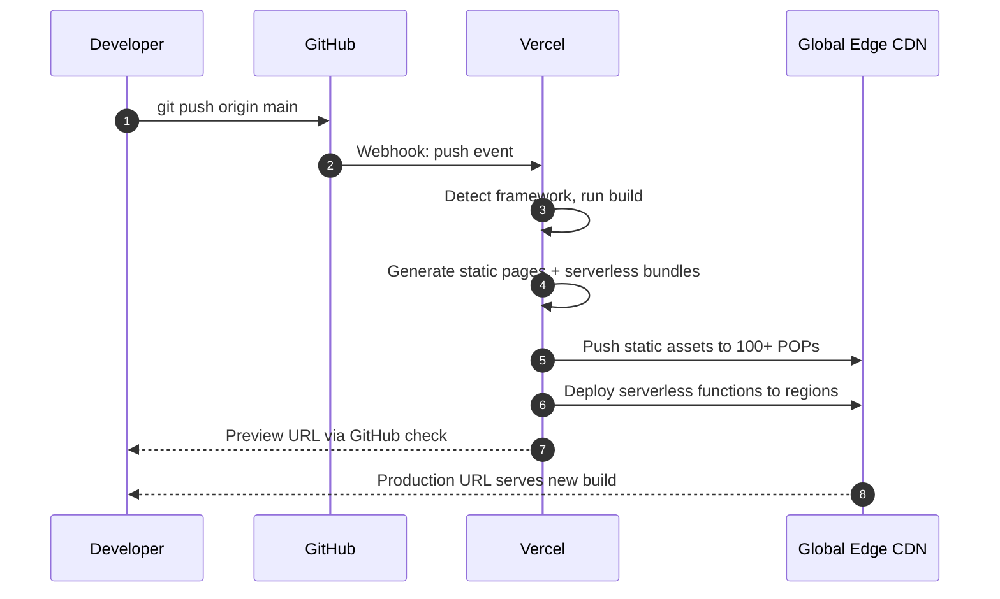

# 5.4. Vercel and Frontend-Cloud Integration

> [!info] Vercel is a frontend-cloud platform purpose-built for Next.js, with first-class support for the App Router, Server Components, Server Actions, Edge Middleware, and a suite of managed data products (Postgres, KV, Blob, Edge Config).
> This note covers the deploy-from-Git model, the Next.js integration, the serverless and edge function runtimes, the managed data products, and how Vercel compares to Netlify and Cloudflare Pages.

---

## 1. What Vercel Is

Vercel is a deployment and hosting platform for frontend applications, created by the team behind Next.js. The relationship is the defining feature: Next.js is the open-source framework, Vercel is the company that employs most of the framework's maintainers and operates the cloud platform tuned to host it. New Next.js features (Server Components, Server Actions, Partial Prerendering) ship first on Vercel, often with Vercel-specific runtime support that other hosts must reverse-engineer.

The core workflow is git-driven. You push to a branch on GitHub, GitLab, or Bitbucket; Vercel detects the push, builds the project with the framework's default build command, deploys the result to a global edge network, and assigns a unique URL (a preview deployment). Pushing to `main` triggers a production deployment at your custom domain. Every deployment is atomic, immutable, and instantly rollback-able.



The platform supports more than Next.js — React (CRA, Remix, Astro), Vue (Nuxt), Svelte (SvelteKit), Angular, and static site generators (Hugo, Gatsby, Eleventy) all work, with framework-specific build optimizations. But the integration is deepest for Next.js, and the rest of this note assumes Next.js unless otherwise noted.

---

## 2. Next.js Integration: App Router, Server Components, Server Actions

The Next.js App Router (introduced in Next.js 13, stabilized in 14 and 15) is the architectural feature that Vercel is most tightly coupled to. The App Router organizes the application as a tree of React Server Components, where each component renders on the server and streams HTML to the client. Components can be Server Components (default), Client Components (opt-in with `"use client"`), or Shared Components (importable by both).

| Rendering strategy | When it runs | Output |
| ------------------ | ------------ | ------ |
| Static Site Generation (SSG) | Build time | HTML + JSON, cached at the edge |
| Incremental Static Regeneration (ISR) | Build time + revalidate | HTML + JSON, refreshed in background |
| Server-Side Rendering (SSR) | Per request | HTML streamed to client |
| Server Components | Per request (server) | RSC payload streamed to client |
| Edge Runtime | Per request (edge POP) | HTML or JSON, near-user |
| Client Components | Per request (browser) | Hydrated React tree |

Server Actions are the other major feature. A Server Action is an `async` function declared with `"use server"` that runs on the server in response to a form submission or button click. The Next.js compiler serializes the call into a POST to an internal endpoint, the server runs the function, and the result is streamed back as part of the RSC payload. There is no API route to write, no fetch boilerplate, no client-side mutation hook — the framework handles the wire protocol.

```typescript
// app/actions.ts
"use server";
import { revalidatePath } from "next/cache";
import { db } from "@/lib/db";

export async function createPost(formData: FormData) {
  const title = formData.get("title") as string;
  await db.post.create({ data: { title } });
  revalidatePath("/posts");  // invalidate cached /posts page
}
```

```tsx
// app/posts/new/page.tsx
import { createPost } from "@/app/actions";

export default function NewPostPage() {
  return (
    <form action={createPost}>
      <input name="title" type="text" required />
      <button type="submit">Create</button>
    </form>
  );
}
```

Server Actions are the cleanest example of the Vercel-Next.js coupling. They rely on the Vercel-Edges-Function runtime to do the encryption of the action ID, the streaming of the response, and the cache invalidation — features that work seamlessly on Vercel and require more configuration on other hosts.

---

## 3. Serverless Functions and Edge Functions

Vercel supports two function runtimes: **Node.js Serverless Functions** and **Edge Functions**. They are not interchangeable; each has its own constraints.

| Property | Node.js Serverless | Edge Function |
| -------- | ------------------ | ------------- |
| Runtime | Node.js 18/20 | V8 isolate (Edge Runtime) |
| Cold start | 250 ms - 1 s | < 5 ms |
| Memory | Up to 3 GB | 128 MB |
| Duration (Hobby) | 10 s | 25 s |
| Duration (Pro) | 60 s | 300 s |
| Duration (Enterprise) | 300 s | 900 s |
| Regions | Single region by default | All regions by default |
| Node.js built-ins | Full | Subset (no `fs`, `net`, etc.) |
| File path | `app/api/*/route.ts` | `app/api/*/route.ts` with `export const runtime = 'edge'` |

A Node.js Serverless Function is the right choice when you need a full Node.js runtime — Prisma, sharp, native modules, file system access for build artifacts. The trade-off is cold start: a Node.js function with Prisma and a few other dependencies can take 1–2 seconds to start cold, which is unacceptable for latency-critical paths.

An Edge Function runs on Vercel's edge network (powered by the same V8-isolate model as Cloudflare Workers, but operated by Vercel). Cold start is under 5 ms, and the function runs in the POP closest to the user. The trade-off is the runtime constraint: no Node.js built-ins, no Prisma (Prisma's driver adapters do work on the edge via `@prisma/adapter-d1` and similar), 128 MB memory.

The choice is made per route. A route handler (`app/api/route.ts`) exports a `runtime` constant:

```typescript
// app/api/geo/route.ts — Edge Function
export const runtime = "edge";

export async function GET(request: Request) {
  const country = request.headers.get("x-vercel-ip-country") ?? "unknown";
  return Response.json({ country });
}
```

Edge Middleware is a special edge function that runs before every request, including static assets. It is the right tool for A/B testing, authentication redirects, localization, and feature flag evaluation — logic that must run on every request and cannot be cached.

---

## 4. Managed Data Products

Vercel's data products are the layer above raw function execution. They are integrations with external providers, packaged with a Vercel-native SDK and billed through the Vercel account.

| Product | Underlying tech | Use case |
| ------- | --------------- | -------- |
| Vercel Postgres | Neon (serverless Postgres) | Relational data with branch-per-environment |
| Vercel KV | Upstash (Redis-compatible) | Session storage, rate limiting, queues |
| Vercel Blob | Cloudflare R2 / S3 | File uploads, image storage |
| Edge Config | Vercel-managed KV | Read-heavy key-value at the edge (feature flags) |

**Vercel Postgres** is a wrapper around Neon, a serverless Postgres provider. The interesting feature is **branching**: every Git branch gets its own Postgres branch, a copy-on-write clone of the parent database. A pull request can be tested against a realistic database without affecting production data, and merging the PR can optionally merge the database branch back. The SDK (`@vercel/postgres`) provides typed query helpers that work in both Server Components and Edge Functions.

**Vercel KV** is Upstash Redis, exposed through a Vercel SDK. The classic use case is rate limiting: each request increments a counter keyed by IP, and the function returns 429 if the counter exceeds a threshold. Upstash's REST API means KV works from Edge Functions (which cannot open raw TCP sockets to a regular Redis instance).

**Edge Config** is a separate read-heavy store, optimized for the case where a value is read on every request and changed rarely (feature flags, country routing tables, maintenance mode). It is replicated to every edge POP, so reads are local and fast. Writes propagate globally within a few seconds.

---

## 5. Pricing Tiers

Vercel's pricing is per-seat (per-developer) plus per-usage. The Hobby tier is free for personal, non-commercial projects, with limits that are generous for prototyping (100 GB bandwidth, 100 GB-hours of serverless execution, 1 million Edge Function requests) but unsuitable for production. The Pro tier ($20/month per team member) raises those limits and adds commercial usage rights, daily deployments, team collaboration features, and longer function durations. The Enterprise tier (custom pricing) adds SSO, audit logs, dedicated regions, and 15-minute function durations.

The non-obvious cost driver is **bandwidth**. Vercel charges for egress from the edge network above the tier's cap. A Next.js app with large images and many users can blow through the Hobby tier's 100 GB in days, and the Pro tier's 1 TB in weeks. Vercel Blob and Vercel Postgres have their own egress charges, on top of Vercel's edge egress — a setup that can quietly produce three layers of bandwidth charges.

The other non-obvious cost is **Edge Function invocations**. The Hobby tier includes 1 million Edge Function requests per month; the Pro tier includes 1 million as well, then $0.60 per additional million. A site that uses Edge Middleware on every request, including static asset requests, can rack up invocations quickly. Use the `matcher` configuration to limit middleware to specific paths.

---

## 6. Vercel vs Netlify vs Cloudflare Pages

The three major frontend-cloud platforms overlap heavily. The differences are in defaults, framework coupling, and pricing structure.

**Vercel vs Netlify.** Netlify was the original static-site host; Vercel (originally "Z_E") arrived later with a stronger framework-coupling story. Today both support Next.js, but Vercel's Next.js support is first-party (the framework and the platform are built by overlapping teams) while Netlify's is via `@netlify/plugin-nextjs`, a community-maintained adapter. Server Components, Server Actions, and ISR work seamlessly on Vercel; on Netlify, some features require workarounds or are not supported. Netlify is the better choice for non-Next.js frameworks (Astro, Eleventy, Hugo) where the framework-coupling advantage disappears and Netlify's mature plugin ecosystem wins.

**Vercel vs Cloudflare Pages.** Cloudflare Pages is Cloudflare's answer to Vercel, integrated with Cloudflare Workers and the broader Cloudflare storage stack (KV, R2, D1, Durable Objects). Pages is dramatically cheaper at scale: Cloudflare does not charge for bandwidth, while Vercel's bandwidth charges are the typical production cost driver. Pages also runs on Cloudflare's 300+ POPs, vs Vercel's ~100. The trade-off is Next.js feature support: Cloudflare Pages uses `@cloudflare/next-on-pages`, a community adapter that lags Vercel's first-party support. New Next.js features ship on Vercel first and may take weeks or months to work on Pages.

For a greenfield Next.js project where vendor lock-in is acceptable, Vercel is the path of least resistance. For a cost-sensitive project at scale, Cloudflare Pages plus an acceptance of slower Next.js feature availability is the better economic choice.

---

## 7. Limitations and Lock-In

Vercel's limitations are the limitations of serverless, plus the limitations of Next.js coupling.

**Function timeouts** are the most-encountered limit. The Hobby tier caps Node.js Serverless Functions at 10 seconds; long-running endpoints (CSV generation, video processing, large report rendering) must be moved off Vercel to a long-running server or a Lambda function. The Pro tier's 60-second cap covers most request/response cycles but still rules out true batch processing. Edge Functions on Pro have a 300-second cap, which is the most generous, but the Edge Runtime's constraints (no Prisma, no native modules) often rule it out for the same workload.

**Next.js feature lock-in** is the subtler cost. App Router features — Server Components, Server Actions, Partial Prerendering, `next/image` with Vercel's optimizer, `next/font` with Vercel's font CDN — work seamlessly on Vercel and require adapters or fallbacks on other hosts. A Next.js application that uses these features is, in practice, a Vercel application that happens to use an open-source framework. Migrating to a self-hosted Next.js setup (a Node.js server running `next start` behind a reverse proxy) requires giving up some of these features or replacing them with self-hosted equivalents.

**Vendor lock-in via `next/vercel` APIs.** Next.js exposes a small number of APIs that are Vercel-specific: `next/headers` for reading Vercel's headers, `next/og` for image generation (Vercel's `@vercel/og` is the underlying implementation), and the Edge Config SDK. Code that uses these APIs is portable in principle (Next.js provides fallbacks) but tightly coupled to Vercel in practice.

The mitigation is to keep the Vercel-specific surface small. Use the standard Web APIs (`Request`, `Response`, `fetch`, `crypto.subtle`) instead of Node-specific ones where possible. Use Prisma or Drizzle with a connection-string-based database, not Vercel Postgres with its SDK. Keep image generation in a separate service if it is a major feature. The result is a Next.js application that runs on Vercel today and can be migrated to a self-hosted setup or another platform tomorrow.

---

## Summary

Vercel is a frontend-cloud platform tuned for Next.js, with a git-driven deploy model, an edge network for static assets and edge functions, a Node.js serverless runtime for heavier endpoints, and a suite of managed data products (Postgres, KV, Blob, Edge Config) integrated with the framework. The value is the seamless integration: Server Components, Server Actions, ISR, and Edge Middleware work out of the box, and the developer experience from `git push` to production URL is unmatched. The costs are the serverless function timeout model (10 s on Hobby, 60 s on Pro), the bandwidth charges that can dominate production bills, and the Next.js feature lock-in that makes migration to other platforms a non-trivial project. For Next.js applications where vendor lock-in is acceptable, Vercel is the default; for cost-sensitive workloads at scale, Cloudflare Pages plus the Cloudflare storage stack is the cheaper alternative.

---

## See Also

- [[5.1. Firebase and Realtime Architectures]]
- [[5.2. Supabase and PostgreSQL Extensibility]]
- [[5.3. Cloudflare Workers and Edge Compute]]
- [[6.3. Nginx Reverse Proxy and Load Balancing]]

## References

- Vercel documentation, "Deployments", "Functions", "Edge Runtime", "Next.js App Router".
- Next.js documentation, "Server Components", "Server Actions", "Edge Runtime".
- "Vercel vs Netlify vs Cloudflare Pages," Vercel blog, 2024 — feature comparison.
