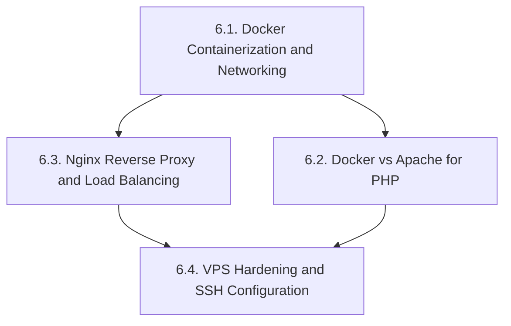
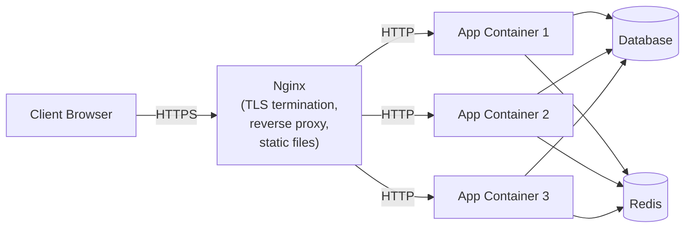
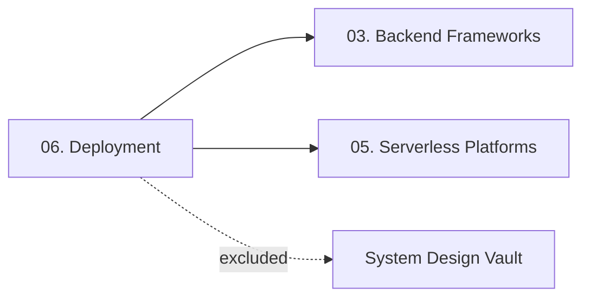
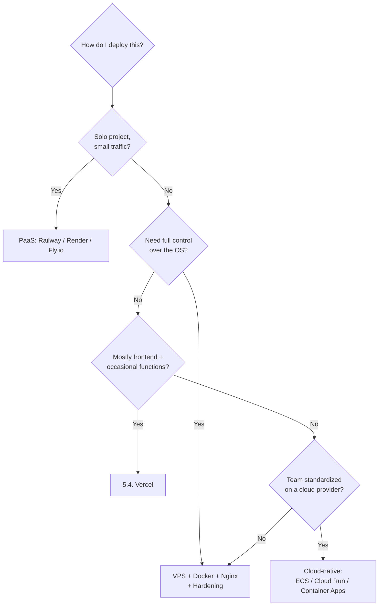

# 06. Deployment — Chapter Index

> [!info] Chapter Purpose
> Deployment is everything that happens between "the code works on my laptop" and "users can hit it on the internet." This chapter covers the three pillars of modern backend deployment: **Docker** (containerization), **Nginx** (reverse proxy and load balancing), and **VPS hardening** (the OS-level security baseline). A fourth note covers the specific decision of **Docker vs Apache for PHP workloads**, which migrated from the old PHP vault.

If you deploy anything to the internet, read every note in this chapter.

---

## Notes in This Chapter

| # | Note | Topic |
| - | ---- | ----- |
| 6.1 | [[6.1. Docker Containerization and Networking]] | Containers vs VMs, Dockerfile anatomy, multi-stage builds, Compose, network drivers, image optimization. |
| 6.2 | [[6.2. Docker vs Apache for PHP]] | Decision tree for PHP workloads: when to run Apache natively vs containerize. Worked Laravel example both ways. |
| 6.3 | [[6.3. Nginx Reverse Proxy and Load Balancing]] | Nginx architecture, http/server/location hierarchy, proxy headers, upstream algorithms, TLS termination, caching, rate limiting. |
| 6.4 | [[6.4. VPS Hardening and SSH Configuration]] | SSH hardening, UFW firewall, Fail2ban, unattended-upgrades, AppArmor/SELinux, backups. |

---

## Recommended Reading Order

1. **6.1. Docker** — the modern baseline. Even if you don't use Docker in production, you'll use it in CI.
2. **6.3. Nginx** — the public-facing reverse proxy in almost every production deployment.
3. **6.2. Docker vs Apache for PHP** — only relevant if you deploy PHP, but the decision-making framework generalizes.
4. **6.4. VPS Hardening** — read last, because it applies to whatever you deployed via 6.1–6.3.

---

## Prerequisites

- **[[1.1. HTTP Protocol and Lifecycle]]** — you cannot configure Nginx without understanding HTTP headers, methods, and status codes.
- **[[3.6.1. PHP Execution Models]]** and **[[3.6.2. Apache Server and PHP-FPM]]** — required reading for `6.2. Docker vs Apache for PHP`.
- Comfort with the Linux command line — every note in this chapter uses shell commands.

---

## The Standard Production Topology

This is the topology the chapter builds toward. Notes 6.1, 6.3, and 6.4 are the building blocks; note 6.2 is a side-path for PHP-specific decisions.

---

## What This Chapter Does NOT Cover

- **Kubernetes** — out of scope. K8s is a chapter on its own, and the author's "System Design vault" likely covers it. Mentioned only in passing where relevant.
- **CI/CD pipelines** (GitHub Actions, GitLab CI, CircleCI, Jenkins) — out of scope.
- **Infrastructure as Code** (Terraform, Pulumi, CloudFormation) — out of scope.
- **Cloud-provider-specific deployment** (AWS ECS, GCP Cloud Run, Azure Container Apps) — out of scope, except for one-off mentions in `6.1.`.
- **Observability stack** (Prometheus, Grafana, OpenTelemetry, Loki) — out of scope.

If you need any of the above, treat them as separate vaults.

---

## How This Chapter Connects to the Rest of the Vault

- **Frameworks → Deployment**: every framework note in `03.` ends with "deploy this to ..." — `6.1.` (Docker) and `6.3.` (Nginx) are the universal answers. Flask has a special-case `3.2.15. Deploying to Railway or Render` that bypasses the chapter entirely (PaaS).
- **Serverless → Deployment**: serverless platforms (`05.`) mostly remove the need for this chapter. But knowing Docker helps even on serverless (Cloudflare Workers Container Support, Vercel custom runtimes).
- **PHP-specific path**: `3.6.1. PHP Execution Models` and `3.6.2. Apache Server and PHP-FPM` directly feed `6.2. Docker vs Apache for PHP`.

---

## The Deployment Decision Tree

This is a starting heuristic. Real decisions weigh cost, traffic shape, team size, regulatory constraints, and existing infrastructure.

---

## Maintenance Notes

- Docker releases a new major version yearly. Audit `6.1.` annually for deprecated commands and new best practices.
- Nginx config syntax is stable, but new modules (HTTP/3, dynamic modules) appear regularly. Audit `6.3.` every 6 months.
- VPS hardening advice evolves slowly, but new attack vectors (e.g., the SSH agent forwarding attacks of recent years) warrant periodic updates to `6.4.`.
- If the author adopts Kubernetes, create a new chapter `07. Orchestration` rather than expanding this one.

---

*See also: [[00. Master Index]] — [[00. README and Vault Conventions]]*
