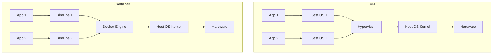
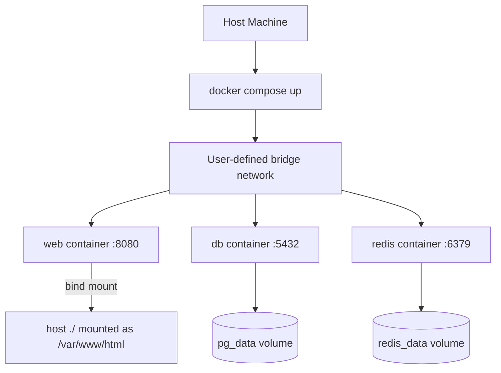

# 6.1. Docker Containerization and Networking

> [!info] Docker is the de facto containerization platform: it bundles an application and its dependencies into an immutable image, runs that image as an isolated process on a shared host kernel, and provides network and storage abstractions for multi-container applications.
> This note covers the image/container/volume/network object model, the Dockerfile, multi-stage builds, the CLI, Docker Compose, and the network drivers — the operational minimum for shipping a containerized application.

---

## 1. Containers vs Virtual Machines

A **virtual machine** virtualizes the hardware. A hypervisor (KVM, VMware, Hyper-V) presents virtual CPUs, virtual NICs, and virtual disks to a guest operating system, which boots and runs as if it had the hardware to itself. Each VM carries a full kernel, init system, userland, and the application. The isolation is strong (a VM escape requires a hypervisor bug) but the cost is high: a VM is gigabytes of disk, seconds to start, and a full OS to patch and maintain.

A **container** virtualizes the operating system. The host kernel is shared; the container sees only its own process tree, its own network interfaces, its own filesystem, and its own user namespace. The isolation is weaker (a kernel exploit can escape a container) but the cost is dramatically lower: a container is megabytes of disk, milliseconds to start, and the only thing to patch is the application's own dependencies.



The shared-kernel property is what makes containers cheap. It is also what makes them less isolated: a kernel CVE affects every container on the host. The mitigation is to run untrusted workloads in separate VMs (or in gVisor/Kata-containers sandboxes that re-introduce a kernel boundary), and to keep the host kernel patched. For most application workloads — your own services, in a trusted environment — the container model is the right trade-off.

Docker achieves isolation through two Linux kernel primitives:

- **Namespaces** partition kernel resources so a process inside a container cannot see processes, networks, mounts, IPC, or users of the host or other containers. The `pid` namespace gives the container its own process IDs (with init at PID 1); the `net` namespace gives it its own loopback and ethernet interfaces; the `mnt` namespace gives it its own filesystem mount tree; the `uts` namespace gives it its own hostname; the `user` namespace maps UIDs so root inside the container is non-root outside.

- **cgroups** (control groups) limit and account for resource usage — CPU time, memory, block I/O, network bandwidth. A container cannot consume all the host's RAM and crash adjacent containers, because its cgroup memory limit will trigger an OOM kill of the offending process first.

---

## 2. The Core Object Model

Docker's vocabulary is small and stable. Five objects cover 95% of usage.

An **image** is a read-only template with the application code, its dependencies, and a manifest of how to run them. Images are layered: each instruction in a Dockerfile creates a new layer that is a diff over the previous one. Layers are cached and shared across images, so two images built from the same `node:20` base share the base layer and only differ in the upper layers. Images are immutable and identified by a SHA-256 digest; tags (`myapp:1.2.3`, `myapp:latest`) are pointers to digests.

A **container** is a running instance of an image. Creating a container adds a writable layer on top of the image's read-only layers; writes go to the writable layer and are lost when the container is removed. A container has a process (PID 1 from its own perspective), a network interface, a filesystem view, and a set of resource limits. Containers are ephemeral by design — any state that must survive container restart lives in a volume, not in the container's writable layer.

A **volume** is persistent storage managed by Docker. A volume is a directory on the host that Docker mounts into the container at a specified path. The container writes to `/var/lib/postgresql/data`; Docker maps that to a host path like `/var/lib/docker/volumes/pg_data/_data`. Removing the container does not remove the volume, so the database survives. Volumes are the production-grade persistence mechanism; bind mounts (which map a host path directly to a container path) are for development only.

A **network** is a virtual network that containers attach to. The default bridge network (`docker0`) is created automatically and lets containers on the same host talk to each other by IP. A user-defined bridge network gives containers DNS-based name resolution — `web` and `db` on the same network can `ping db` and reach the database container. Other network drivers (host, none, overlay, macvlan) cover specialized cases.

A **registry** is a server that stores images. Docker Hub is the default public registry; cloud providers operate their own (ECR, GCR, ACR); enterprises run private registries (Harbor, Nexus, Artifactory). `docker push myregistry.com/myapp:1.0` uploads the image; `docker pull` downloads it. Production deployments pull from a registry, not from a local build.

---

## 3. The Dockerfile Anatomy

A Dockerfile is a sequence of instructions that build an image. Each instruction is a layer; layers are cached and reused, so the order matters for build performance.

| Instruction | Purpose |
| ----------- | ------- |
| `FROM base:image` | Set the base image — the starting point |
| `WORKDIR /app` | Set the working directory for subsequent instructions |
| `COPY package.json package-lock.json ./` | Copy files from build context into the image |
| `RUN npm ci` | Execute a command in the shell, committing the result as a layer |
| `ENV NODE_ENV=production` | Set an environment variable |
| `EXPOSE 3000` | Document which port the container listens on (informational) |
| `USER node` | Run subsequent commands as a non-root user |
| `CMD ["node", "server.js"]` | Set the default command when the container starts |
| `ENTRYPOINT ["node"]` | Set the executable that always runs; CMD becomes its args |

A worked example — a Node.js Express application:

```dockerfile
# syntax=docker/dockerfile:1.7
FROM node:20-slim AS base
WORKDIR /app
ENV NODE_ENV=production

# --- Dependencies stage ---
FROM base AS deps
COPY package.json package-lock.json ./
RUN npm ci --omit=dev

# --- Build stage (not strictly needed for plain JS, used for TS) ---
FROM base AS build
COPY package.json package-lock.json ./
RUN npm ci
COPY tsconfig.json ./
COPY src/ ./src/
RUN npm run build

# --- Runtime stage ---
FROM base AS runtime
COPY --from=deps /app/node_modules ./node_modules
COPY --from=build /app/dist ./dist
COPY package.json ./
USER node
EXPOSE 3000
CMD ["node", "dist/server.js"]
```

Each `FROM` starts a new stage; the final stage is the image that gets tagged. The intermediate stages (`deps`, `build`) are discarded. The result is an image that contains only the runtime dependencies and the compiled output — no TypeScript compiler, no dev dependencies, no source maps — typically 10x smaller than a single-stage image that bundled everything.

---

## 4. Layer Caching and Build Performance

Docker caches each layer and reuses it if the instruction and its inputs have not changed. The cache is keyed on the instruction text and a hash of the build-context files the instruction references. A cache hit skips the instruction and reuses the existing layer; a cache miss rebuilds the layer and every layer after it.

The practical implication is **instruction ordering**. `COPY package.json package-lock.json ./` followed by `RUN npm ci` caches the dependency install and only re-runs it when `package.json` changes. `COPY . ./` followed by `RUN npm ci` rebuilds the dependencies on every source change, because `COPY . .` invalidates the cache whenever any file in the project changes.

The pattern, then, is to copy files that change rarely first (manifests, lockfiles, config) and run the expensive install step against them, then copy the rest of the source. The same pattern applies to Python (`requirements.txt` before `pip install`, then `COPY .`), PHP (`composer.json` before `composer install`), Go (`go.mod` and `go.sum` before `go mod download`), and Ruby (`Gemfile` and `Gemfile.lock` before `bundle install`).

`.dockerignore` is the other half of build performance. Without it, `COPY . .` ships the entire build context — `node_modules`, `.git`, `dist`, `build`, test fixtures, environment files — to the Docker daemon, which slows the build and can leak secrets into the image. A `.dockerignore` listing `node_modules`, `.git`, `*.env`, `dist`, `build` keeps the context lean and the image clean.

---

## 5. The Docker CLI

The day-to-day commands for building, running, and inspecting containers:

```bash
# Build an image from the Dockerfile in the current directory, tagged myapp:1.0
docker build -t myapp:1.0 .

# Run a container, mapping host port 3000 to container port 3000,
# detaching it from the terminal, naming it myapp
docker run -d --name myapp -p 3000:3000 myapp:1.0

# List running containers (add -a for stopped ones too)
docker ps

# Tail the logs of a running container (add -f to follow)
docker logs myapp

# Execute a shell inside a running container (for debugging)
docker exec -it myapp sh

# Stop a running container (sends SIGTERM, then SIGKILL after 10s)
docker stop myapp

# Remove a stopped container
docker rm myapp

# Remove an image
docker rmi myapp:1.0

# Show disk usage (images, containers, volumes, build cache)
docker system df

# Remove all stopped containers, dangling images, and unused networks
docker system prune
```

`docker exec -it <name> sh` is the debugging workhorse — open a shell inside the running container, inspect the filesystem, run `ps`, check environment variables. The `-i` (interactive) and `-t` (tty) flags are required for an interactive shell. Use `bash` instead of `sh` if the image has bash; alpine-based images only have `sh`.

---

## 6. Docker Compose: Multi-Container Applications

Real applications are multi-container: a web service, a database, a cache, maybe a queue. Docker Compose defines the whole stack in a `docker-compose.yml` file and brings it up with a single command. Compose is the development and small-production tool; Kubernetes is the large-production tool, but for a single-host stack Compose is dramatically simpler.

```yaml
# docker-compose.yml — a Laravel-style stack
services:
  web:
    build: .
    ports:
      - "8080:80"
    volumes:
      - ./:/var/www/html
    depends_on:
      - db
      - redis
    environment:
      DB_HOST: db
      REDIS_HOST: redis

  db:
    image: postgres:16-alpine
    environment:
      POSTGRES_DB: app
      POSTGRES_USER: app
      POSTGRES_PASSWORD: secret
    volumes:
      - pg_data:/var/lib/postgresql/data

  redis:
    image: redis:7-alpine
    volumes:
      - redis_data:/data

volumes:
  pg_data:
  redis_data:
```



`docker compose up -d` builds the `web` image if needed, pulls the `postgres` and `redis` images, creates the network and volumes, and starts all three containers in dependency order. `docker compose logs -f web` follows the web container's logs. `docker compose down` stops and removes the containers, network, and (with `-v`) the volumes. `docker compose exec web sh` opens a shell in the running web container.

The user-defined bridge network lets the three containers reach each other by service name: the web container connects to `db:5432` and `redis:6379`, and Docker's embedded DNS resolves those names to the corresponding container IPs. This is the right way to wire multi-container applications — never hardcode IPs, always use service names.

The volumes (`pg_data`, `redis_data`) persist data across `docker compose down` and `docker compose up`. Without them, every restart would wipe the database. The bind mount (`./:/var/www/html`) is for development — it maps the host source code into the container so code changes are reflected immediately without a rebuild. In production, the source code is `COPY`ed into the image and there is no bind mount.

---

## 7. Docker Network Drivers

Docker provides several network drivers, each for a different topology.

The **bridge** driver is the default. Docker creates a virtual bridge interface (`docker0`) on the host; each container is given a virtual ethernet pair, with one end in the container's network namespace and the other attached to the bridge. The container gets a private IP in the bridge's subnet (172.17.0.0/16 by default), and Docker configures iptables to NAT outbound traffic through the host's physical interface. The bridge is isolated from the host's LAN by default; to expose a service, publish a port with `-p host:container`.

The **host** driver removes the network namespace entirely. The container shares the host's network stack — `0.0.0.0:3000` in the container is `0.0.0.0:3000` on the host. There is no NAT, no bridge, no port mapping. The performance is the best possible (no virtualization overhead), but the isolation is the worst (the container can bind to any host port, and port conflicts are common). Use host networking only for high-throughput local services where the performance gain justifies the loss of isolation.

The **none** driver gives the container a network namespace with only the loopback interface. The container has no network access at all. Use it for offline batch processing or for security-sensitive workloads that should not have any network connectivity.

The **overlay** driver creates a virtual network spanning multiple Docker hosts, using VXLAN tunnels to encapsulate traffic between them. Overlay networks are the foundation of Docker Swarm and the basis for Kubernetes' pod networking. They are not used in single-host deployments.

The **macvlan** driver assigns each container a MAC address on the host's physical network, making the container appear as a separate physical machine on the LAN. Use it for legacy applications that need to be on the same L2 network as the host (rare in modern deployments).

Port mapping (`-p 8080:80`) is the bridge-driver mechanism for exposing a container. The Docker daemon binds port 8080 on the host and forwards traffic to port 80 in the container's network namespace. The mapping is implemented with iptables DNAT rules. To expose a UDP port, append `/udp` (`-p 53:53/udp`).

---

## 8. Volumes vs Bind Mounts

The distinction matters and is a frequent source of confusion.

A **volume** is created and managed by Docker. It lives in a Docker-controlled directory on the host (`/var/lib/docker/volumes/<name>/_data` on Linux) and is mounted into the container by name. Volumes are independent of the container's lifecycle: `docker rm mycontainer` leaves the volume intact, and a new container can mount it by name. Volumes are the right choice for production data — databases, file uploads, application state that must survive container restarts.

A **bind mount** maps a host path directly to a container path. `docker run -v /home/me/code:/app myimage` mounts the host's `/home/me/code` directory into the container at `/app`. Bind mounts are fast (no copy), convenient (the host's files are immediately visible in the container), and the right choice for development — the container sees your source code as you edit it. They are the wrong choice for production, because the container's behavior now depends on a specific host path, breaking portability.

The `docker-compose.yml` syntax distinguishes the two: a volume entry that begins with `.` or `/` is a bind mount; a volume entry that is just a name is a volume (which must be declared under the top-level `volumes:` key).

---

## 9. Image Size Optimization

Image size matters because it affects pull time, push time, storage cost, and attack surface. A smaller image is faster to deploy, cheaper to store, and has fewer packages that could contain vulnerabilities. The optimization techniques, in order of impact:

**Use a slim or alpine base image.** `node:20` is 1 GB; `node:20-slim` is 250 MB; `node:20-alpine` is 150 MB. The slim image strips out development headers, man pages, and documentation; the alpine image uses musl libc instead of glibc and is smaller still. The trade-off is that alpine's musl can break packages that assume glibc — test before committing.

**Use multi-stage builds.** Build dependencies in one stage, copy only the artifacts to a slim runtime stage. The classic example is Go: the build stage has the Go toolchain (1 GB); the runtime stage has only the compiled binary (20 MB). The same pattern applies to compiled TypeScript (build with `tsc`, copy `dist/` to a slim runtime image).

**Add a `.dockerignore`.** Without one, `COPY . .` ships `node_modules`, `.git`, `dist`, `build`, and any other large directories in the build context. A `.dockerignore` with `node_modules`, `.git`, `dist`, `build`, `*.env`, `*.log` keeps the context lean.

**Avoid `apt-get upgrade` in the Dockerfile.** Upgrading all packages at build time invalidates the layer cache, slows the build, and produces a different image on every build. Pin the base image by digest (`FROM node:20-slim@sha256:...`) and rebuild when a new version is released, rather than upgrading inside the Dockerfile.

**Combine `RUN` commands.** Each `RUN` creates a layer; multiple `RUN apt-get install` calls leave intermediate layers with the package lists and downloaded debs. Combine them into one `RUN apt-get update && apt-get install -y --no-install-recommends pkg1 pkg2 && rm -rf /var/lib/apt/lists/*` to keep the final layer small.

**Use `--no-install-recommends` for apt.** Debian's `apt` installs "recommended" packages by default, which can double the size of an install. `--no-install-recommends` installs only the explicit dependencies, which is what you almost always want in a container.

---

## Summary

Docker is the standard containerization platform: it bundles an application and its dependencies into a layered image, runs the image as an isolated process sharing the host kernel, and provides volume and network abstractions for multi-container applications. The Dockerfile is the build recipe; multi-stage builds produce small images by separating build-time dependencies from runtime artifacts. The CLI (`build`, `run`, `ps`, `logs`, `exec`, `stop`) is the daily driver; Docker Compose orchestrates multi-container stacks on a single host with service-name DNS and named volumes. The bridge network driver with port mapping covers the common case; host and none drivers are specialized. Volumes are the production-grade persistence mechanism; bind mounts are for development. Image size optimization — slim base images, multi-stage builds, `.dockerignore`, combined `RUN` commands — keeps images small, fast to deploy, and cheaper to operate.

---

## See Also

- [[6.2. Docker vs Apache for PHP]]
- [[6.3. Nginx Reverse Proxy and Load Balancing]]
- [[6.4. VPS Hardening and SSH Configuration]]
- [[2.5. Oracle DBMS Containerized Internals]]

## References

- Docker documentation, "Dockerfile reference", "Compose file reference", "Network drivers".
- "Best practices for writing Dockerfiles," Docker docs.
- Adrian Mouat, *Using Docker* (O'Reilly, 2nd edition) — operational patterns.
