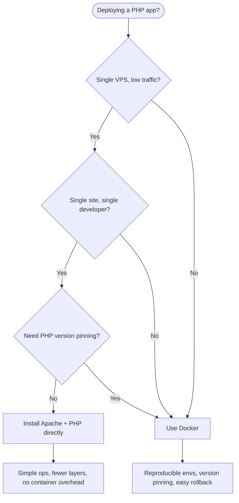

# 6.2. Docker vs Apache for PHP

> [!info] For PHP applications, the deployment question is whether to run Apache (with mod_php or PHP-FPM) directly on a VPS, or to containerize with Docker (typically an nginx + PHP-FPM pair of containers).
> This note covers when each approach is right, the trade-offs in performance and isolation, and worked configurations for both — the same Laravel app deployed each way.

---

## 1. The Decision in Context

The "Docker vs Apache" framing is a shorthand. Apache is a web server; Docker is a containerization platform. The actual choice is between two deployment topologies: install Apache, PHP, and MySQL directly on a VPS (the LAMP stack as it has existed since the late 1990s), or install only Docker on the VPS and run the web server, PHP runtime, and database as containers (the modern approach).



The "right" answer depends on the project's shape, not on which approach is technically superior. A solo developer deploying a single low-traffic WordPress site to a $5 VPS is well-served by Apache + mod_php, and Docker would add complexity without value. A team of five deploying a Laravel application across staging and production, where the lead developer's macOS laptop must match the Ubuntu production server, is well-served by Docker, and bare Apache would produce environment drift and "works on my machine" bugs.

---

## 2. When to Use Apache Directly

The traditional approach — installing Apache and PHP directly on the VPS — is right for a specific class of project.

**Single-site, single-server deployments.** A WordPress blog, a small marketing site, an internal tool — anything where there is exactly one application, exactly one server, and the application is expected to live there for years. The LAMP stack has been the default for this use case for two decades; the documentation is exhaustive, the tooling (`a2enmod`, `a2ensite`, `apachectl`) is familiar, and the configuration surface is small.

**Low-traffic, low-complexity sites.** When the application receives hundreds of requests per minute, not thousands, Apache's pre-fork or event MPM is more than adequate, and the simplicity of one process model (Apache handles HTTP, mod_php executes PHP in-process) is a feature. There is no second process to manage, no socket to keep alive, no container orchestrator to learn.

**Local development with XAMPP or MAMP.** For a developer learning PHP, XAMPP (cross-platform) and MAMP (macOS) bundle Apache, PHP, and MySQL into a one-click install. The configuration is identical across developers' machines, which removes one source of "works on my machine" bugs at the cost of not matching production. For learning, the trade-off is favorable.

**Sysadmin-friendly environments.** In organizations with a dedicated operations team that knows Apache inside out but has no Docker expertise, the cost of training the team on Docker may exceed the cost of the environment-drift bugs that Docker would prevent. This is a transitional argument — the long-term answer is to train the team — but it is a real consideration in the short term.

The disadvantages of the direct-Apache approach are well-known. Environment drift between development and production is the biggest: a developer running PHP 8.3 on macOS will produce bugs that do not reproduce on a production server running PHP 8.1 on Ubuntu, because of differences in extension availability, configuration defaults, and OS-level library versions. Running multiple PHP versions on the same Apache server is genuinely difficult (it requires multiple PHP-FPM pools and careful virtual host configuration), which makes per-project version pinning painful. The server accumulates "cruft" over time as packages are installed for one project, abandoned, and never removed — making it hard to recreate the environment from scratch on a new server.

---

## 3. When to Use Docker

The containerized approach is right for a different class of project.

**Team projects.** When two or more developers work on the same codebase, environment parity is a feature, not a nice-to-have. A `docker-compose.yml` checked into the repository defines the exact PHP version, extensions, database version, and configuration that every developer runs. A new team member runs `docker compose up` and has a working development environment in minutes, instead of spending a day installing dependencies and debugging version mismatches.

**Multiple environments (dev / staging / prod).** Production parity is the goal: the container that runs in production is the same container that ran in staging, which is the same container that the developer tested locally. The "it works on my machine" problem disappears because production *is* the developer's machine, plus configuration. Rollback becomes trivial — deploy the previous image tag, and you are exactly where you were.

**Microservices and multi-application stacks.** When the application consists of multiple services (a Laravel API, a Node.js WebSocket server, a Python data-processing worker), Docker Compose defines the topology in one file. Each service runs in its own container with its own dependencies, and they communicate over a private network. The alternative — installing Node.js, Python, and PHP on the same VPS — produces a server that is impossible to recreate and impossible to scale.

**CI/CD pipelines.** Continuous integration builds the image in a clean environment, runs the test suite inside a container derived from the production image, and pushes the image to a registry on green. Continuous deployment pulls the image and restarts the service. The pipeline is reproducible because every step is a Docker command, not a shell script that depends on the CI runner's pre-installed software.

**Need to swap PHP or DB versions per project.** Project A is on PHP 8.1 with MySQL 5.7; project B is on PHP 8.3 with PostgreSQL 16. On a single VPS with Apache, running both is painful. With Docker, each project has its own `docker-compose.yml` that pins the versions, and the two stacks run side by side without interference.

The disadvantages of the Docker approach are the learning curve and the orchestration overhead. Docker itself has a vocabulary (images, containers, volumes, networks, Dockerfile, Compose) and a CLI (`build`, `run`, `compose up`, `compose down`, `exec`, `logs`) that takes time to learn. For a single tiny site, the overhead of writing a Dockerfile and a Compose file is more work than just installing Apache. At scale, the orchestration layer (Docker Swarm, Kubernetes, Nomad) adds another system to operate.

---

## 4. A Worked Docker Compose for Laravel

A typical containerized Laravel stack has four services: nginx (web server), php-fpm (PHP runtime), mysql (database), and redis (cache and queue). Each runs in its own container, defined in `docker-compose.yml`.

```yaml
# docker-compose.yml
services:
  nginx:
    image: nginx:1.27-alpine
    ports:
      - "8080:80"
    volumes:
      - ./:/var/www/html
      - ./docker/nginx.conf:/etc/nginx/conf.d/default.conf
    depends_on:
      - php
  php:
    build:
      context: .
      dockerfile: Dockerfile
    volumes:
      - ./:/var/www/html
    depends_on:
      - mysql
      - redis
    environment:
      DB_HOST: mysql
      REDIS_HOST: redis
  mysql:
    image: mysql:8.0
    environment:
      MYSQL_DATABASE: laravel
      MYSQL_ROOT_PASSWORD: secret
    volumes:
      - mysql_data:/var/lib/mysql
  redis:
    image: redis:7-alpine
    volumes:
      - redis_data:/data

volumes:
  mysql_data:
  redis_data:
```

The `Dockerfile` for the `php` service extends the official PHP-FPM image with the extensions Laravel needs:

```dockerfile
FROM php:8.3-fpm-alpine

RUN apk add --no-cache libpng-dev libzip-dev oniguruma-dev \
    && docker-php-ext-install pdo_mysql gd zip opcache bcmath

COPY --from=composer:2 /usr/bin/composer /usr/bin/composer

WORKDIR /var/www/html
COPY composer.json composer.lock ./
RUN composer install --no-dev --no-scripts --no-autoloader
COPY . .
RUN composer dump-autoload --optimize

USER www-data
```

The nginx configuration (`docker/nginx.conf`) routes PHP requests to the PHP-FPM container:

```nginx
server {
    listen 80;
    server_name localhost;
    root /var/www/html/public;
    index index.php;

    location / {
        try_files $uri $uri/ /index.php?$query_string;
    }

    location ~ \.php$ {
        fastcgi_pass php:9000;
        fastcgi_param SCRIPT_FILENAME $realpath_root$fastcgi_script_name;
        include fastcgi_params;
    }
}
```

The result is a stack that runs identically on every developer's machine and in production. The only differences between environments are the environment variables (database credentials, app URL, debug flag) and the absence of bind mounts in production (the code is `COPY`ed into the image, not mounted from the host).

---

## 5. The Same Laravel App on Bare Apache

The equivalent on a bare VPS uses Apache's mod_php or PHP-FPM. The simplest setup is mod_php, where Apache loads the PHP module in-process and executes PHP scripts directly.

```bash
sudo apt update
sudo apt install -y apache2 php8.3 php8.3-mysql php8.3-gd php8.3-zip \
    php8.3-bcmath php8.3-mbstring php8.3-curl php8.3-xml mysql-server redis-server
sudo a2enmod rewrite php8.3
sudo systemctl restart apache2
```

The Apache virtual host for Laravel:

```apache
# /etc/apache2/sites-available/laravel.conf
<VirtualHost *:80>
    ServerName laravel.example.com
    DocumentRoot /var/www/laravel/public

    <Directory /var/www/laravel/public>
        AllowOverride All
        Require all granted
    </Directory>

    ErrorLog ${APACHE_LOG_DIR}/laravel_error.log
    CustomLog ${APACHE_LOG_DIR}/laravel_access.log combined
</VirtualHost>
```

```bash
sudo a2ensite laravel
sudo systemctl reload apache2
```

The `AllowOverride All` directive lets Laravel's `.htaccess` file in `public/` handle URL rewriting (routing all requests to `index.php`). The PHP-FPM variant replaces `mod_php` with a separate PHP-FPM process pool that Apache talks to over FastCGI; the configuration is slightly more complex but allows running multiple PHP versions and is the production-grade choice. Both are covered in [[3.6.2. Apache Server and PHP-FPM]].

The result is a server with Apache, PHP, MySQL, and Redis installed as system packages. The advantages are simplicity (one Apache process, one MySQL process, no container layer) and the absence of any orchestration overhead. The disadvantages are the environment-drift problem (the developer's macOS or Windows machine does not match the Ubuntu server), the difficulty of running multiple PHP versions, and the impossibility of recreating the server from scratch without manually re-running every `apt install` and editing every config file.

---

## 6. Performance Comparison

The performance difference between Docker and bare Apache is negligible for almost all workloads. Containerization adds a thin layer of namespace and cgroup overhead — typically 1–3% CPU and ~50 MB of RAM per container for the daemon's bookkeeping — but does not virtualize the kernel or the hardware. A PHP-FPM process inside a container and a PHP-FPM process on bare Apache make the same syscalls, hit the same opcache, and execute the same opcodes.

The real performance variables are elsewhere:

- **PHP-FPM pool sizing.** The number of worker processes (and their memory limit) determines how many concurrent requests the application can serve. This is configured identically in Docker and bare Apache.
- **OPcache.** The OPcache stores the compiled opcodes of PHP scripts in shared memory, eliminating the parse-and-compile step on every request. It is enabled by default but its size (`opcache.memory_consumption`) and hit rate matter more than the deployment model.
- **Database connection pooling.** Persistent connections or a pooler (PgBouncer, ProxySQL) reduce connection-setup overhead. Again, this is orthogonal to Docker vs Apache.
- **HTTP server tuning.** Apache's event MPM, PHP-FPM's `pm = dynamic`, nginx's worker process count — all of these are configurable in both models.

The cases where Docker measurably underperforms are niche: extremely high-throughput localhost IPC (where the network namespace adds a few microseconds per call), or workloads that saturate the host's network stack and would benefit from `network: host` (which removes the namespace but loses isolation). For a typical web application handling hundreds to thousands of requests per second, the container overhead is invisible in the metrics.

---

## 7. Security and Isolation

The security models are genuinely different.

**Bare Apache** runs all PHP code as a single user — typically `www-data` on Debian/Ubuntu. Every site on the server runs as `www-data`, which means a compromise of one site (an RCE in a WordPress plugin, say) gives the attacker the same privileges as every other site on the server. The mitigations are PHP-FPM pools per site (each running as a different Unix user), `suPHP` (deprecated and slow), or per-site virtualization (a separate VPS per site, which is what most hosting providers do for shared hosting).

**Docker** isolates each container at the process, filesystem, and network level. A compromise of the PHP-FPM container gives the attacker code execution as the container's user, but they cannot see the host's filesystem (modulo a kernel exploit), cannot see other containers' filesystems, and cannot reach other containers' networks unless the networks are explicitly bridged. The blast radius is one container.

The strong version of this argument is: in a Docker deployment, a compromised web container does not have database credentials on disk (they are environment variables visible inside the container, but the database container is on a separate network and the web container cannot `sudo` or pivot to it). In a bare-Apache deployment, a compromised web process has the database credentials in the application's `.env` file, has shell access as `www-data`, and can read any file on the server that `www-data` can read — which usually includes every other site's source code.

The caveat is that Docker's isolation is only as good as the host kernel. A kernel exploit (Dirty COW, OverlayFS bugs) can escape a container. For multi-tenant workloads where one tenant might attack another, the right answer is a VM per tenant or a sandboxed runtime (gVisor, Kata Containers) that reintroduces a kernel boundary. For a single-team application split into containers, Docker's isolation is sufficient and meaningfully better than bare Apache's.

---

## Summary

The choice between Apache and Docker for PHP is a choice between simplicity and parity. Bare Apache on a single VPS is right for single-site, single-developer, low-traffic deployments where the sysadmin already knows Apache and the operational overhead of Docker is not justified. Docker is right for team projects, multi-environment deployments (dev / staging / prod parity), microservice stacks, CI/CD pipelines, and any project where per-version pinning matters. The performance difference is negligible — containerization adds 1–3% CPU overhead, and the real performance variables (PHP-FPM pool sizing, OPcache, database connection pooling) are configurable identically in both models. Docker's security model is stronger (per-container isolation vs `www-data` shared across all sites), at the cost of a learning curve and the orchestration layer. For new projects with more than one developer, default to Docker; for solo low-traffic sites, bare Apache is still defensible.

---

## See Also

- [[6.1. Docker Containerization and Networking]]
- [[6.3. Nginx Reverse Proxy and Load Balancing]]
- [[3.6.1. PHP Execution Models]]
- [[3.6.2. Apache Server and PHP-FPM]]
- [[6.4. VPS Hardening and SSH Configuration]]

## References

- Docker documentation, "Compose file version 3 reference" and "Dockerfile reference".
- Apache documentation, "Apache MPMs" and "suEXEC".
- Laravel documentation, "Deployment" — both bare-metal and Docker deployment recipes.
