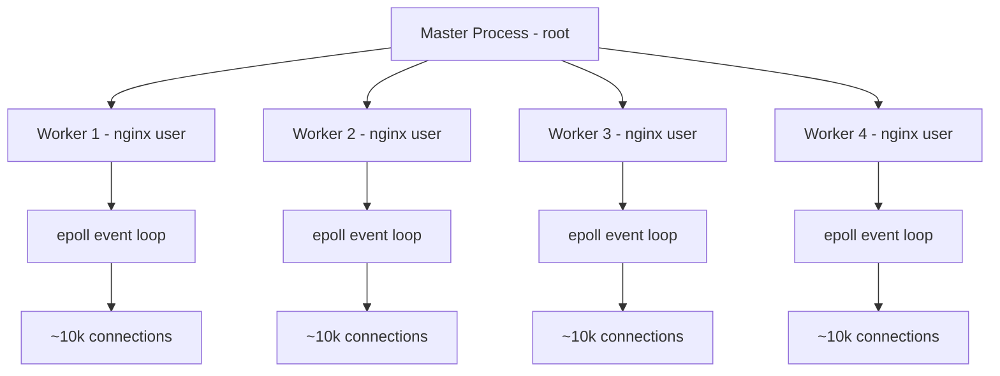
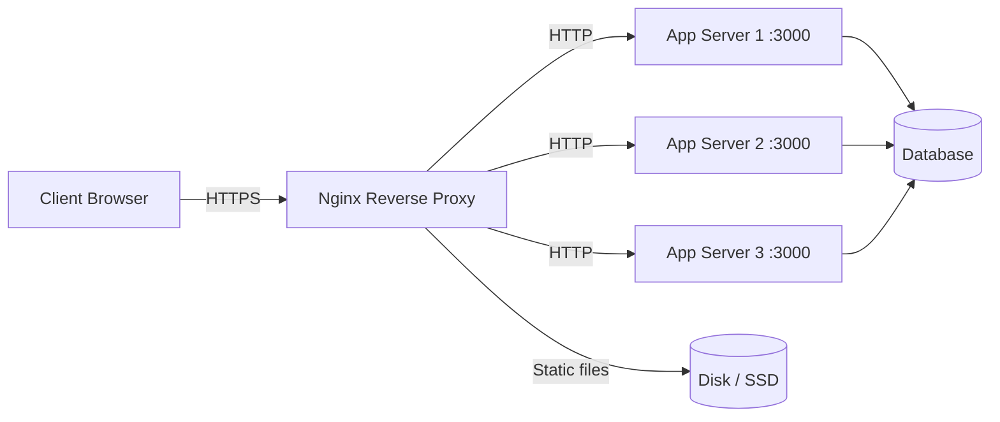

# 6.3. Nginx Reverse Proxy and Load Balancing

> [!info] Nginx is a high-performance HTTP server and reverse proxy built on an event-driven, non-blocking I/O model.
> This note covers the architecture that lets Nginx handle tens of thousands of concurrent connections per worker, the configuration hierarchy (http / server / location), the reverse-proxy and load-balancing directives, TLS termination, caching, rate limiting, and the reload-vs-restart distinction.

---

## 1. Nginx's Architecture: Event-Driven, Non-Blocking

Nginx's performance advantage over classic Apache comes from its process model and its I/O model. Where Apache's pre-fork MPM allocates a process or thread per connection — each thread blocked while waiting for I/O — Nginx uses a single master process that supervises a small number of worker processes, each running an event loop that handles thousands of connections concurrently.



The **master process** runs as root, reads the configuration, binds to privileged ports (80, 443), and forks the worker processes. It supervises the workers: if a worker crashes, the master restarts it; if the configuration is reloaded, the master gracefully hands off connections from old workers to new ones. The master does not serve requests directly.

Each **worker process** runs as an unprivileged user (`nginx`, `www-data`). The number of workers is set by `worker_processes auto;` (one per CPU core by default) or an explicit number. Each worker runs an event loop built on the Linux `epoll` system call (or `kqueue` on BSD/macOS) — a single OS call that returns "this set of file descriptors has activity." When a connection has data ready to read, the worker reads it, processes it (parses the HTTP request, looks up the location, runs the handler), and writes the response — all without blocking. While one connection waits for an upstream response, the worker handles other connections.

The result is that a single Nginx worker can handle tens of thousands of concurrent connections on modest hardware. The bottleneck is not process count or thread count (as it is with Apache pre-fork); it is file descriptor limits, RAM for connection buffers, and CPU for SSL handshakes. The `worker_connections` directive (default 512, commonly raised to 10240 or higher) caps the number of connections per worker; the practical maximum is roughly `worker_processes × worker_connections`.

---

## 2. Why Nginx as a Reverse Proxy

A reverse proxy sits in front of one or more application servers and forwards client requests to them. The pattern is universal in production because it solves several problems at once.



**TLS termination.** The client speaks HTTPS to Nginx; Nginx decrypts, forwards plain HTTP to the backend, encrypts the response. The backend does not need to know about TLS — no certificate management, no SSL libraries, no CPU spent on crypto. This is the dominant pattern because TLS at the load balancer is simpler and cheaper than TLS at every application instance.

**Load balancing.** With multiple backend servers, Nginx distributes requests across them using a pluggable algorithm (round-robin, least connections, IP hash). If one server fails health checks, Nginx stops sending it traffic. This is the foundation of horizontal scaling.

**Caching.** Nginx can cache the responses of upstream servers, serving subsequent requests for the same resource from disk or RAM without hitting the backend. For an API with cacheable endpoints or a static-asset-heavy site, this can reduce backend load by an order of magnitude.

**Static file serving.** Nginx serves static files (images, CSS, JavaScript, fonts) directly from disk, dramatically faster than Node.js, Python, or PHP. Every framework's "production mode" offloads static files to Nginx (or a CDN) — letting the application process handle static requests wastes its capacity on I/O that the OS can do better.

**URL rewriting and routing.** Nginx can rewrite URLs, redirect old paths to new ones, route by hostname (virtual hosting), and split traffic between versions (canary deployments, A/B tests). The application sees a clean, normalized request.

**Rate limiting and authentication.** Nginx can throttle requests per IP, require HTTP Basic Auth, validate JWTs (via `auth_request`), and apply IP allow/deny lists — all before the request reaches the application. This is defense in depth: even if the application has a bug, the proxy provides a layer of protection.

---

## 3. Configuration Hierarchy: http / server / location

Nginx's configuration is a tree of blocks. The top-level `/etc/nginx/nginx.conf` contains an `http` block; the `http` block contains `server` blocks (one per virtual host); each `server` contains `location` blocks (one per URL pattern).

```nginx
# /etc/nginx/nginx.conf
user nginx;
worker_processes auto;
events { worker_connections 10240; }

http {
    include       /etc/nginx/mime.types;
    default_type  application/octet-stream;
    sendfile      on;
    keepalive_timeout 65;

    # Server block — one per virtual host
    server {
        listen 80;
        server_name api.example.com;
        return 301 https://$host$request_uri;
    }

    server {
        listen 443 ssl http2;
        server_name api.example.com;

        ssl_certificate     /etc/letsencrypt/live/api.example.com/fullchain.pem;
        ssl_certificate_key /etc/letsencrypt/live/api.example.com/privkey.pem;

        # Location block — one per URL pattern
        location / {
            proxy_pass http://127.0.0.1:3000;
            proxy_set_header Host $host;
            proxy_set_header X-Real-IP $remote_addr;
        }

        location /static/ {
            root /var/www/app;
            expires 1y;
            add_header Cache-Control "public, immutable";
        }
    }
}
```

The `http` block sets directives that apply to all virtual hosts: MIME types, default content type, sendfile, keepalive. The `server` block sets directives for one virtual host: which port and address to listen on, which hostname to match, the TLS certificate. The `location` block sets directives for a URL pattern: which upstream to proxy to, which file to serve, which headers to add.

Location matching has a specific priority order. Nginx evaluates the patterns in this sequence: exact match (`location = /path`), prefix match with `^~` (`location ^~ /static/`), regex match (`location ~ \.php$`), and longest prefix match (`location /static`). The first matching location wins; understanding this order is critical when configuring complex routing.

---

## 4. Reverse Proxy Basics and Essential Headers

The core reverse-proxy directive is `proxy_pass`. It tells Nginx where to forward the request.

```nginx
location / {
    proxy_pass http://127.0.0.1:3000;
    proxy_http_version 1.1;
    proxy_set_header Host $host;
    proxy_set_header X-Real-IP $remote_addr;
    proxy_set_header X-Forwarded-For $proxy_add_x_forwarded_for;
    proxy_set_header X-Forwarded-Proto $scheme;
    proxy_set_header Connection "";
}
```

The four headers are not optional in production — each carries information the backend needs and would otherwise lose because the request now appears to come from Nginx, not from the original client.

`Host` preserves the original hostname. Without it, the backend sees `Host: 127.0.0.1:3000` and cannot distinguish which virtual host was requested. Frameworks that build absolute URLs (Rails' `_path` vs `_url` helpers, Django's `request.build_absolute_uri`) need the original Host.

`X-Real-IP` carries the client's IP address. Without it, the backend sees Nginx's IP (127.0.0.1 or the Docker network IP) and cannot do per-IP rate limiting, geolocation, or audit logging. Some frameworks read `X-Real-IP` automatically (Express with `app.set('trust proxy', 1)`); others need configuration.

`X-Forwarded-For` is the standard chain of client IPs, appended to at each proxy hop. If the request passed through Cloudflare, then Nginx, then the backend, `X-Forwarded-For` is `client_ip, cloudflare_ip, nginx_ip`. The backend should trust only the last hop (the most recent proxy) and parse the chain carefully to avoid spoofing.

`X-Forwarded-Proto` records whether the original request was HTTPS or HTTP. The backend needs this to know whether to redirect HTTP to HTTPS, to set the `Secure` flag on cookies, and to generate `https://` URLs. Without it, a backend behind an HTTPS-terminating proxy thinks all requests are HTTP and may loop on redirects.

`proxy_http_version 1.1` and `Connection ""` enable HTTP/1.1 keepalive between Nginx and the backend, which avoids a new TCP connection per request. The default (HTTP/1.0, Connection: close) opens and closes a connection for every proxied request, which is dramatically slower at scale.

---

## 5. Load Balancing: Upstream and Algorithms

The `upstream` block defines a pool of backend servers and the algorithm Nginx uses to distribute requests.

```nginx
upstream app_servers {
    least_conn;
    server 10.0.0.10:3000 max_fails=3 fail_timeout=10s;
    server 10.0.0.11:3000 max_fails=3 fail_timeout=10s;
    server 10.0.0.12:3000 max_fails=3 fail_timeout=10s backup;
}

server {
    listen 443 ssl http2;
    location / {
        proxy_pass http://app_servers;
    }
}
```

| Algorithm | Directive | Behavior |
| --------- | --------- | -------- |
| Round-robin | (default) | Each request goes to the next server in turn |
| Least connections | `least_conn;` | Request goes to the server with the fewest active connections |
| IP hash | `ip_hash;` | Same client IP always goes to the same server (sticky sessions) |
| Hash | `hash $request_uri;` | Same hash key always goes to the same server (consistent hashing) |
| Random | `random;` | Random server; `random two least_conn;` picks the less-loaded of two random servers |

**Round-robin** is the default and is fine for homogeneous backends where all requests have similar cost. **Least connections** is better when request costs vary widely (some are 10 ms, some are 10 s) — it prevents a slow-request server from accumulating a backlog while a fast-request server idles.

**IP hash** provides sticky sessions without an external session store: the same client always reaches the same server, so in-memory session state is preserved. The cost is uneven load if some clients generate more traffic than others, and stickiness survives server failures only with `ip_hash`'s built-in failover (which redistributes a failed server's clients across the remaining servers).

**Hash** with a key like `$request_uri` implements consistent hashing for cache partitioning — the same URL always hits the same server, so that server can cache the result. Adding or removing a server redistributes only a fraction of keys, preserving most of the cache.

Health checks are configured per-server. `max_fails=3 fail_timeout=10s` means: if Nginx fails to connect or receives an error response 3 times within 10 seconds, mark the server as down for 10 seconds and skip it. This is **passive** health checking — Nginx only marks a server down after seeing failures on real traffic. Active health checking (probing a `/health` endpoint on a schedule) requires Nginx Plus or the third-party `nginx_upstream_check_module`.

The `backup` parameter marks a server as a last-resort option — it only receives traffic when all non-backup servers are down. This is the right place for a smaller, cheaper "fallback" instance.

---

## 6. TLS Termination and Modern Cipher Configuration

Nginx handles TLS at the edge, terminating the HTTPS connection and forwarding plain HTTP to the backend. The configuration below is a production-grade baseline.

```nginx
server {
    listen 443 ssl http2;
    server_name api.example.com;

    ssl_certificate     /etc/letsencrypt/live/api.example.com/fullchain.pem;
    ssl_certificate_key /etc/letsencrypt/live/api.example.com/privkey.pem;

    ssl_protocols TLSv1.2 TLSv1.3;
    ssl_ciphers ECDHE-ECDSA-AES128-GCM-SHA256:ECDHE-RSA-AES128-GCM-SHA256:ECDHE-ECDSA-AES256-GCM-SHA384:ECDHE-RSA-AES256-GCM-SHA384;
    ssl_prefer_server_ciphers off;
    ssl_session_cache shared:SSL:10m;
    ssl_session_timeout 1d;
    ssl_session_tickets off;

    ssl_stapling on;
    ssl_stapling_verify on;
    resolver 1.1.1.1 8.8.8.8 valid=300s;
    resolver_timeout 5s;

    add_header Strict-Transport-Security "max-age=63072000; includeSubDomains; preload" always;
    add_header X-Frame-Options DENY always;
    add_header X-Content-Type-Options nosniff always;
}
```

`ssl_protocols TLSv1.2 TLSv1.3` disables the obsolete TLS 1.0 and 1.1, which are no longer considered secure. TLS 1.3 is preferred for its 1-RTT handshake and forward secrecy; TLS 1.2 remains for older clients. The cipher list explicitly enables only ECDHE cipher suites (forward secrecy) and GCM modes (authenticated encryption); anything else is excluded.

`ssl_session_cache shared:SSL:10m` caches TLS sessions across workers in a 10 MB shared memory zone, enough for about 40,000 sessions. Subsequent connections from the same client resume the session, skipping the expensive full handshake. `ssl_session_tickets off` disables session tickets because their encryption key, if rotated rarely, becomes a forward-secrecy weakness.

`ssl_stapling on` enables OCSP stapling — Nginx fetches the certificate's OCSP status from the CA and includes it in the handshake, saving the client a separate OCSP request. The `resolver` directive is required for Nginx to look up the OCSP responder URL.

`Strict-Transport-Security` (HSTS) tells the browser to use HTTPS for this site for the next 2 years, including subdomains. Once set, the browser will refuse plain HTTP connections, eliminating downgrade attacks. The `preload` directive opts the site into the HSTS preload list maintained by browser vendors, so even the first visit is HTTPS.

---

## 7. Static File Serving and Caching

Nginx serves static files dramatically faster than any application server because it uses the Linux `sendfile` system call (zero-copy transfer from disk to socket) and because its event loop is not blocked by the I/O. Every framework's production guide tells you to offload static files to Nginx or a CDN; the reason is not opinion, it is benchmark.

```nginx
location /static/ {
    root /var/www/app;
    expires 1y;
    add_header Cache-Control "public, immutable";
    access_log off;
    try_files $uri =404;
}
```

`root /var/www/app` means Nginx serves `/static/css/main.css` from `/var/www/app/static/css/main.css`. The `expires 1y` directive sets the `Expires` header one year in the future, and `Cache-Control: public, immutable` tells the browser and CDN that the file never changes — they can cache it indefinitely and skip revalidation. This is safe only if filenames are content-hashed (Webpack, Vite, Rails Asset Pipeline all do this); if filenames are not hashed, use `expires 1h` instead.

`access_log off` skips logging for static file requests, which can be the majority of requests and produce huge log files of no analytical value. `try_files $uri =404` returns a 404 if the file does not exist, rather than falling through to the application.

**Upstream caching** is the other caching pattern — Nginx caches the responses of dynamic endpoints.

```nginx
proxy_cache_path /var/cache/nginx levels=1:2 keys_zone=api_cache:10m max_size=1g
                 inactive=60m use_temp_path=off;

server {
    location /api/ {
        proxy_pass http://app_servers;
        proxy_cache api_cache;
        proxy_cache_valid 200 10m;
        proxy_cache_valid 404 1m;
        proxy_cache_key "$scheme$request_method$host$request_uri";
        add_header X-Cache-Status $upstream_cache_status;
    }
}
```

`proxy_cache_path` defines the cache: 1 GB max on disk, 10 MB of shared memory for the key index, cached entries expire after 60 minutes of inactivity. `proxy_cache api_cache` activates the cache for this location. `proxy_cache_valid 200 10m` caches successful responses for 10 minutes; `proxy_cache_valid 404 1m` caches 404s for 1 minute (to absorb scans for non-existent resources). The `X-Cache-Status` header exposes the cache state to the client (`HIT`, `MISS`, `BYPASS`, `EXPIRED`, `STALE`), which is invaluable for debugging.

---

## 8. Rate Limiting

`limit_req_zone` defines a rate limit; `limit_req` applies it to a location.

```nginx
limit_req_zone $binary_remote_addr zone=api_limit:10m rate=10r/s;

server {
    location /api/ {
        limit_req zone=api_limit burst=20 nodelay;
        proxy_pass http://app_servers;
    }
}
```

The zone keys on `$binary_remote_addr` (the client IP, in binary form for compact storage), with a 10 MB shared memory zone (about 160,000 unique IPs). The rate is 10 requests per second per IP. `burst=20` allows a burst of 20 requests above the rate without throttling; `nodelay` serves the burst immediately rather than queuing it at the rate limit. Requests beyond the burst receive a 503 Service Unavailable.

Rate limiting at the proxy protects the backend from abuse (scripted scrapers, credential stuffing, denial-of-service attempts) without consuming application resources. The application can implement its own per-user rate limiting for authenticated requests; the proxy's per-IP limiting is for unauthenticated traffic and for catching abuse before it reaches the application.

---

## 9. Reload vs Restart

The distinction matters in production.

```bash
sudo nginx -t              # test configuration syntax without applying
sudo nginx -s reload       # graceful reload — zero downtime
sudo systemctl restart nginx  # full restart — drops in-flight connections
```

`nginx -s reload` sends a SIGHUP to the master process. The master reads the new configuration, starts new worker processes with the new config, and signals the old workers to stop accepting new connections. The old workers finish their in-flight requests, then exit. The result is a configuration change with no dropped connections — the right command for 99% of changes.

`systemctl restart nginx` (or `service nginx restart`) stops the master and starts a new one. In-flight connections are dropped (the client sees a connection reset), TLS sessions are invalidated, and there is a brief window during which the server is unreachable. Use restart only when reload is insufficient (e.g., after upgrading the nginx binary itself, or when changing `worker_processes` requires a full restart).

`nginx -t` (test configuration) is mandatory before any reload. It parses the configuration, checks for syntax errors and invalid directives, and verifies that referenced files (certificates, log paths, upstreams) exist. Running `nginx -s reload` without `-t` first risks a configuration error that takes the server offline — Nginx will refuse to start the new workers, the old workers continue with the old config, but a subsequent restart will fail.

---

## Summary

Nginx is the production-grade reverse proxy and load balancer for HTTP applications, built on an event-driven, non-blocking I/O model that lets a single worker handle tens of thousands of concurrent connections. Its configuration is a tree of `http`, `server`, and `location` blocks; the core reverse-proxy directive is `proxy_pass`, and the four essential headers (`Host`, `X-Real-IP`, `X-Forwarded-For`, `X-Forwarded-Proto`) preserve client information that the proxy otherwise strips. The `upstream` block defines load-balanced backend pools with pluggable algorithms (round-robin, least connections, IP hash, consistent hash) and passive health checks via `max_fails` and `fail_timeout`. TLS termination at the proxy with modern cipher configuration (TLS 1.2 + 1.3, OCSP stapling, HSTS) offloads crypto from the backend. Static file serving via `sendfile` is dramatically faster than serving from an application server, and upstream caching with `proxy_cache` can reduce backend load by an order of magnitude for cacheable endpoints. Rate limiting at the proxy (`limit_req_zone`, `limit_req`) protects the backend from abuse before it reaches the application. Reload with `nginx -s reload` for zero-downtime configuration changes; reserve `systemctl restart` for binary upgrades.

---

## See Also

- [[6.1. Docker Containerization and Networking]]
- [[6.2. Docker vs Apache for PHP]]
- [[6.4. VPS Hardening and SSH Configuration]]
- [[3.6.2. Apache Server and PHP-FPM]]
- [[1.1. HTTP Protocol and Lifecycle]]

## References

- Nginx documentation, "NGINX Configuration Guide", "HTTP Load Balancing", "Configuring HTTPS servers".
- NGINX blog, "TLS 1.3 deployment," "Rate limiting in NGINX," "Caching guide".
- "The NGINX Handbook," FreeCodeCamp — practical configuration walkthrough.
