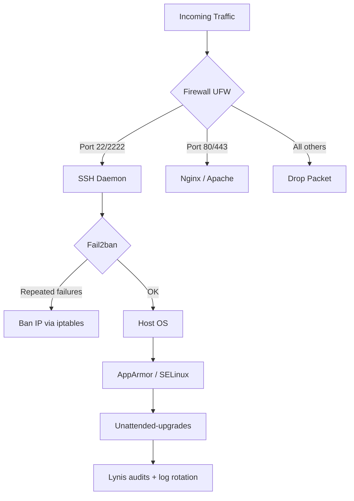

# 6.4. VPS Hardening and SSH Configuration

> [!info] A freshly provisioned VPS exposed to the internet is scanned by automated bots within minutes — looking for open SSH on port 22, weak passwords, default credentials, and known vulnerabilities.
> This note covers the layered defense model (firewall → SSH → fail2ban → maintenance → monitoring), with worked configurations for each layer.

---

## 1. Why Hardening Matters

The threat model for a public-facing VPS is not a targeted attacker who has chosen you specifically. It is the constant background radiation of automated scanners — botnets running Shodan queries, masscan sweeps, and credential-stuffing scripts that try `root` / `password` and `admin` / `admin` against every SSH server on the internet. A fresh VPS with default settings will see thousands of failed SSH login attempts within hours of going live, and one of those attempts will eventually succeed if the password is weak or the SSH daemon is misconfigured.

Hardening is the practice of reducing the attack surface and adding layers of defense so that the automated scripts fail and the targeted attacker's job becomes harder. The goal is not perfect security (impossible) but to make the VPS a harder target than the average, so the bots move on to softer targets. The layers, in order of how early they engage an attacker, are:



Each layer filters out a class of attack. The firewall stops connections to ports that should not be public. The hardened SSH daemon stops password-based and root login attempts. Fail2ban stops brute-force attempts by banning repeat offenders. AppArmor and SELinux contain the blast radius of a compromised process. Unattended-upgrades keep the OS patched against known vulnerabilities. Lynis audits and log rotation give you visibility into what is happening on the host.

---

## 2. SSH Hardening

SSH is the entry point for system administration. Hardening it is the single highest-value change you can make to a VPS. The configuration lives in `/etc/ssh/sshd_config`; edit it and restart the daemon with `sudo systemctl restart sshd`.

```text
# /etc/ssh/sshd_config

# Disable password authentication. Only SSH keys are accepted.
PasswordAuthentication no
ChallengeResponseAuthentication no
UsePAM no

# Disable root login. Administrators SSH as a normal user, then sudo.
PermitRootLogin no

# Move SSH off the default port to reduce automated scanning noise.
# Pick a port between 1024 and 65535; avoid 2222 (too common now).
Port 54321

# Limit the maximum authentication attempts per connection.
MaxAuthTries 3

# Reduce login grace period (time to authenticate after connecting).
LoginGraceTime 30

# Disconnect idle sessions after 10 minutes.
ClientAliveInterval 300
ClientAliveCountMax 0

# Allow SSH only for specific users.
AllowUsers alice bob

# Disable X11 forwarding and other features you don't need.
X11Forwarding no
AllowTcpForwarding no
AllowAgentForwarding no
PermitTunnel no

# Use modern key exchange and MACs (Debian/Ubuntu default in recent versions).
KexAlgorithms curve25519-sha256@libssh.org,diffie-hellman-group16-sha512
Ciphers chacha20-poly1305@openssh.com,aes256-gcm@openssh.com
MACs hmac-sha2-512-etm@openssh.com,hmac-sha2-256-etm@openssh.com
```

Each directive defends against a specific attack. **`PasswordAuthentication no`** is the single most important: it eliminates brute-force password attacks entirely. SSH keys are 2048+ bits of entropy; passwords are typically 30 bits. The cost is that every administrator must have a key pair, must add their public key to `~/.ssh/authorized_keys`, and must protect their private key with a passphrase. The benefit is that the constant stream of "Failed password for root" log entries simply stops.

**`PermitRootLogin no`** forces administrators to log in as a normal user and escalate with `sudo`. The benefit is twofold: every privileged action is logged with the username that performed it (audit trail), and a stolen SSH key does not immediately grant root. The `sudo` group membership is controlled separately, so adding or revoking admin access is a matter of editing `/etc/group`, not editing `sshd_config`.

**`Port 54321`** moves SSH off port 22. This is "security through obscurity" in the strict sense — it does not stop a targeted attacker who scans all 65535 ports — but it dramatically reduces log noise. A VPS on port 22 sees thousands of failed login attempts per day; the same VPS on port 54321 sees near-zero. The trade-off is that you must update every SSH client config (`~/.ssh/config` on developer machines, Ansible inventory, monitoring probes) to use the new port. Pick a port above 1024 (so a non-root user cannot bind to it on a compromised host) and below 65535.

**`MaxAuthTries 3`** limits the number of authentication attempts per TCP connection. Without it, an attacker can try many usernames or keys in a single connection; with it, they must open a new connection per 3 attempts, which is slower and more visible to Fail2ban.

**`ClientAliveInterval 300` and `ClientAliveCountMax 0`** disconnect idle SSH sessions after 5 minutes. An unattended laptop with an open SSH session is a common way for credentials to leak; this prevents it. The values can be tuned to taste — some teams prefer 15 minutes — but `ClientAliveCountMax 0` (which disables the "are you still there" retries and disconnects immediately on the first missed keepalive) is the strictest setting.

**`AllowUsers alice bob`** is a whitelist. Only the named users can log in over SSH, regardless of what other users exist on the system. This is useful when the system has service accounts (postgres, redis, www-data) that should never have shell access; the whitelist ensures that even if a service account has a `~/.ssh/authorized_keys` file, SSH will not let it in.

**`AllowTcpForwarding no` and `AllowAgentForwarding no`** disable SSH's tunneling features. These are useful for legitimate purposes (jump hosts, port forwarding through a bastion) but are also how a compromised account pivots to other internal services. Disable them unless you specifically need them.

---

## 3. Firewall (UFW)

A firewall is the first line of defense — every connection to a closed port is dropped before the application ever sees it. UFW (Uncomplicated Firewall) is the standard frontend to iptables on Debian and Ubuntu; it provides a simple syntax for the common cases.

```bash
# Set default policies: deny all incoming, allow all outgoing
sudo ufw default deny incoming
sudo ufw default allow outgoing

# Allow SSH on the hardened port (NOT 22 if you changed it)
sudo ufw allow 54321/tcp

# Allow HTTP and HTTPS
sudo ufw allow 80/tcp
sudo ufw allow 443/tcp

# Allow a specific IP to access a management port (e.g., monitoring)
sudo ufw allow from 203.0.113.10 to any port 9100 proto tcp

# Enable the firewall (will warn if SSH rules are not in place)
sudo ufw enable

# Verify the rule set
sudo ufw status verbose
```

```text
Status: active
Logging: on (low)
Default: deny (incoming), allow (outgoing), disabled (routed)
New profiles: skip

To                         Action      From
--                         ------      ----
54321/tcp                  ALLOW IN    Anywhere
80/tcp                     ALLOW IN    Anywhere
443/tcp                    ALLOW IN    Anywhere
9100/tcp                   ALLOW IN    203.0.113.10
54321/tcp (v6)             ALLOW IN    Anywhere (v6)
80/tcp (v6)                ALLOW IN    Anywhere (v6)
443/tcp (v6)               ALLOW IN    Anywhere (v6)
```

The order of operations matters. **Set the default policies first** (deny incoming, allow outgoing). **Add the SSH rule before enabling the firewall** — otherwise, enabling the firewall will lock you out of your own server. **Enable the firewall last**, and verify with `ufw status verbose` that the rules are correct.

The rule `ufw allow from 203.0.113.10 to any port 9100 proto tcp` is an example of IP-based restriction: the monitoring port (9100, the Node Exporter for Prometheus) is only reachable from a specific IP. This is the right pattern for any management interface — admin panels, database administration tools, metrics endpoints — that should not be public but must be reachable from specific hosts.

UFW is a frontend to iptables; under the hood, it generates iptables rules. For complex setups (multiple network interfaces, custom chains, IPv6-specific rules), iptables or nftables directly may be more appropriate. For a single-host VPS serving web traffic, UFW is sufficient and dramatically simpler.

---

## 4. Fail2ban: Brute-Force Protection

Fail2ban scans log files (SSH, web server, mail server) for repeated failures and dynamically updates the firewall to ban the offending IP. It is the second line of defense after the SSH daemon's own `MaxAuthTries`: where `MaxAuthTries` limits attempts per connection, Fail2ban limits attempts per source IP across connections.

```bash
sudo apt update
sudo apt install fail2ban -y

# Never edit jail.conf directly — create a local override
sudo cp /etc/fail2ban/jail.conf /etc/fail2ban/jail.local
sudo nano /etc/fail2ban/jail.local
```

```ini
# /etc/fail2ban/jail.local

[DEFAULT]
# Ban duration
bantime = 1h
# Window in which maxretry failures trigger a ban
findtime = 10m
# Number of failures before ban
maxretry = 3
# Action: ban via UFW (or iptables on non-UFW systems)
banaction = ufw

# SSH jail — enable it
[sshd]
enabled = true
port = 54321
filter = sshd
logpath = /var/log/auth.log
maxretry = 3
findtime = 10m
bantime = 1h
```

```bash
sudo systemctl enable fail2ban
sudo systemctl restart fail2ban
sudo fail2ban-client status sshd
```

The `[sshd]` jail watches `/var/log/auth.log` for SSH authentication failures. After 3 failures within 10 minutes from the same IP, Fail2ban adds a UFW rule to drop all traffic from that IP for 1 hour. After the ban expires, the rule is removed automatically.

The `bantime` should be long enough to deter a casual brute-force but short enough that a legitimate user who mistypes their password three times is not locked out all day. 1 hour is a reasonable default; some teams use `bantime = 1d` for repeat offenders (configurable with `bantime.increment = true`, which doubles the ban on each subsequent offense). The `findtime` window should be short enough that distributed brute-force across many connections is caught, but long enough that a slow legitimate login is not flagged.

Fail2ban can also jail other services. A `[nginx-limit-req]` jail watches Nginx's rate-limiting log entries and bans IPs that exceed the limit; a `[nginx-botsearch]` jail bans IPs that scan for non-existent admin pages. Each jail has its own filter (a regex that matches the relevant log line) and its own settings.

---

## 5. Automatic Security Updates

Keeping the OS patched against known vulnerabilities is the single most effective defense against automated attacks. The `unattended-upgrades` package on Debian and Ubuntu installs security updates automatically on a daily schedule.

```bash
sudo apt install unattended-upgrades apt-listchanges -y
sudo dpkg-reconfigure --priority=low unattended-upgrades
```

The reconfiguration step creates `/etc/apt/apt.conf.d/20auto-upgrades` with:

```text
APT::Periodic::Update-Package-Lists "1";
APT::Periodic::Unattended-Upgrade "1";
```

This enables daily `apt update` and daily `unattended-upgrade`. The default configuration (`/etc/apt/apt.conf.d/50unattended-upgrades`) installs only packages from the `security` origin; it does not install feature updates or major version bumps. This is the right default — security patches should be automatic, feature updates should be tested.

For critical infrastructure, the configuration should also include:

```text
Unattended-Upgrade::Automatic-Reboot "true";
Unattended-Upgrade::Automatic-Reboot-Time "04:00";
Unattended-Upgrade::Mail "ops@example.com";
Unattended-Upgrade::MailReport "on-change";
```

`Automatic-Reboot "true"` reboots the server at 04:00 if a security update requires it (kernel updates, glibc updates). Without this, the update is installed but not active until the next reboot, leaving the server vulnerable. The reboot window should be during low-traffic hours and should be coordinated with monitoring (the server will be briefly unavailable). `MailReport "on-change"` emails a report only when updates were applied, so you have a record without daily noise.

---

## 6. Layered Defense: AppArmor, SELinux, and Auditing

The firewall, SSH, and Fail2ban are the outer layers. Inside the host, additional layers contain the blast radius of a compromised process.

**AppArmor** (Debian, Ubuntu, SUSE) and **SELinux** (RHEL, CentOS, Fedora) are mandatory access control systems. They define profiles that restrict what a process can do — which files it can read, which files it can write, which system calls it can make — regardless of the UID of the process. A compromised Nginx worker running as `www-data` can normally read any file `www-data` can read; with AppArmor, the Nginx profile restricts it to the specific directories and files it needs, so a compromise cannot exfiltrate `/etc/shadow` or `/var/lib/mysql/`.

AppArmor is enabled by default on Ubuntu; the profiles are in `/etc/apparmor.d/`. The `aa-status` command shows loaded profiles and their enforcement mode (enforce vs complain). Most packages ship with profiles — `nginx`, `mysqld`, `tcpdump`, `ping` — but custom applications need custom profiles. The `aa-logprof` utility watches AppArmor's denial logs and helps generate a profile by suggesting permissions for the operations the application attempts.

**`systemctl disable`** for unused services. A fresh Ubuntu install may have `snapd`, `apport`, `rsync`, `nfs-common`, and other services running that the application does not need. Each is a potential attack surface. List running services with `systemctl list-unit-files --state=enabled`, audit each one, and disable what is not needed.

**Lynis** is a security auditing tool that scans the system for misconfiguration, weak permissions, missing patches, and known issues. Run it periodically and review the output.

```bash
sudo apt install lynis -y
sudo lynis audit system
```

The output is a list of warnings and suggestions, each with a description and a fix. No system scores 100/100 on a Lynis audit; the goal is to address the high-severity items and to track the score over time so that a regression is visible.

**Log rotation** (`logrotate`) is a maintenance concern that becomes a security concern when logs fill the disk. A full `/var/log` partition can cause services to crash, can prevent Fail2ban from writing its state, and can mask an attack by causing log writes to silently fail. The default `/etc/logrotate.conf` and `/etc/logrotate.d/*` configurations rotate logs weekly and keep 4 weeks; review them and adjust retention to match your log-analysis needs.

---

## 7. Backups and Disaster Recovery

Hardening reduces the probability of a compromise; backups reduce the impact when one happens. The two are complementary — a hardened server can still be compromised by a zero-day, and a misconfigured backup can lose all your data.

`restic` and `borg` are the standard open-source backup tools. Both support encrypted, deduplicated, incremental backups to local disk, remote SSH hosts, or S3-compatible object storage. The pattern is: a nightly job snapshots the application data and the database to a remote repository, and the repository's encryption key is stored separately (offline, in a password manager, or in a KMS).

```bash
# Initialize a restic repository on a remote SSH host
restic -r sftp:backup@example.com:/backups/myapp init

# Nightly backup job
restic -r sftp:backup@example.com:/backups/myapp backup /var/www /var/lib/mysql
restic -r sftp:backup@example.com:/backups/myapp forget --keep-daily 7 --keep-weekly 4 --keep-monthly 12
restic -r sftp:backup@example.com:/backups/myapp prune
```

The `forget --keep-daily 7 --keep-weekly 4 --keep-monthly 12` policy keeps 7 daily, 4 weekly, and 12 monthly snapshots, deleting the rest. `prune` removes the data of the deleted snapshots from the repository. This balances retention (you can restore from any of the last 7 days, 4 weeks, or 12 months) with storage cost.

The most important rule of backups is **test the restore**. An untested backup is a hope, not a backup. Schedule a quarterly restore drill: take the latest backup, restore it to a fresh VPS, verify the application works, and document the procedure. The drill surfaces the problems (missing config, wrong file permissions, database migration incompatibility) when they are still fixable, not during an actual incident.

Cloud-provider snapshots (DigitalOcean snapshots, AWS EBS snapshots, etc.) are a complementary layer. They are point-in-time images of the entire disk, easy to take and easy to restore, but coarse (you cannot restore a single file without booting the whole snapshot) and they include the OS state (which may include the compromise, if the snapshot was taken after the attack). Use them for disaster recovery; use file-level backups for granular restore.

---

## Summary

VPS hardening is a layered defense: a firewall (UFW) drops traffic to non-public ports; a hardened SSH daemon (`PasswordAuthentication no`, `PermitRootLogin no`, non-default port, `AllowUsers` whitelist) eliminates the most common attacks; Fail2ban bans repeat offenders at the firewall level; automatic security updates (`unattended-upgrades`) keep the OS patched; AppArmor or SELinux contain the blast radius of a compromised process; Lynis audits and log rotation maintain visibility. The configuration is a one-time investment that pays off every day the server is online — the constant stream of failed SSH login attempts that hits every public VPS is stopped at the firewall or the SSH daemon, never reaching the application. Backups (`restic`, `borg`) are the recovery layer; they must be tested regularly, because an untested backup is a hope, not a backup.

---

## See Also

- [[6.1. Docker Containerization and Networking]]
- [[6.3. Nginx Reverse Proxy and Load Balancing]]
- [[6.2. Docker vs Apache for PHP]]
- [[3.6.2. Apache Server and PHP-FPM]]

## References

- CIS Ubuntu Linux Benchmark — the canonical hardening checklist.
- Debian documentation, "Securing Debian Manual".
- fail2ban documentation, "Jails" and "Filters".
- Lynis documentation, "Control parameters" and "Tests performed".
- restic documentation, "Getting Started" and "Backup Examples".
