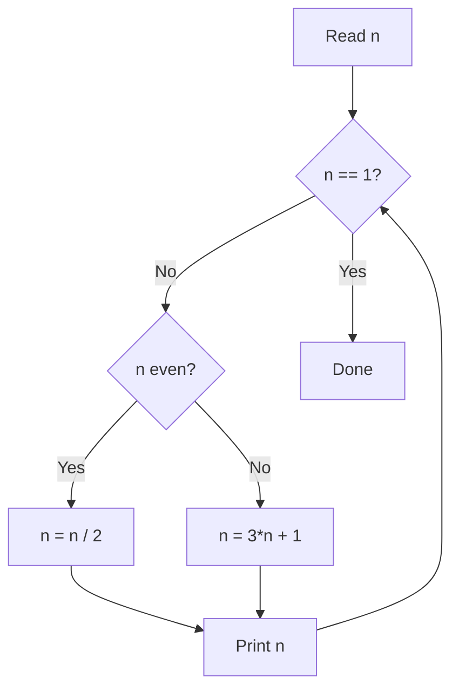

# 1. Weird Algorithm

## 1. Problem Description

Consider an algorithm that takes as input a positive integer `n`. If `n` is even, the algorithm divides it by two. If `n` is odd, the algorithm multiplies it by three and adds one. The algorithm repeats this until `n` becomes `1`.

For `n = 3`, the sequence is: `3 -> 10 -> 5 -> 16 -> 8 -> 4 -> 2 -> 1`.

Your task is to simulate the execution of the algorithm for a given value of `n` and print every value the algorithm visits.

## 2. Expected Input

A single line containing one positive integer `n`.

## 3. Expected Output

A single line containing every value of `n` during the algorithm, separated by spaces.

## 4. Constraints

- `1 <= n <= 10^6`
- Time limit: 1.00 s
- Memory limit: 512 MB

## 5. Examples

| Input | Output |
|---|---|
| `3` | `3 10 5 16 8 4 2 1` |

## 6. Intuition

This is the **Collatz conjecture** (also called the `3n + 1` problem). The conjecture states that for any positive starting value, the sequence always reaches `1`. No counterexample is known, although the conjecture has not been proven.

For the purposes of this problem, we simply simulate the rules:
- If `n` is even, halve it.
- If `n` is odd, apply `3n + 1`.
- Stop when `n == 1`.

## 7. Thought Process



## 8. Brute-Force Approach

The simulation **is** the brute force here. There is no smarter closed-form solution, because the Collatz sequence is famously irregular. The only "optimization" is making sure each step is `O(1)`, which it is.

## 9. Optimized Solution

```python
def solve(n: int) -> list[int]:
    """Simulate the 3n+1 algorithm and return the sequence."""
    seq = [n]
    while n != 1:
        if n % 2 == 0:
            n //= 2
        else:
            n = 3 * n + 1
        seq.append(n)
    return seq


if __name__ == "__main__":
    n = int(input())
    print(*solve(n))
```

## 10. Why the Optimized Solution Works

The loop invariant is: **at the start of every iteration, `n` is a positive integer that has not yet reached `1`.** Inside the loop, we apply the rule that exactly matches the problem statement. Because the Collatz conjecture holds for every value in the given range (`1 <= n <= 10^6`), the loop is guaranteed to terminate.

The sequence `3 -> 10 -> 5 -> 16 -> 8 -> 4 -> 2 -> 1` shows the rules in action:
- `3` is odd, so `3*3 + 1 = 10`.
- `10` is even, so `10 / 2 = 5`.
- `5` is odd, so `5*3 + 1 = 16`.
- `16` is even, so `16 / 2 = 8`, then `4`, `2`, `1`.

## 11. Algorithm Used

Direct simulation following the problem's recurrence.

## 12. Data Structures Used

- A Python `list` to collect the sequence for printing.
- An integer variable `n` to hold the current value.

## 13. Time Complexity Analysis

**`O(log n)`** in expectation. Each even step halves `n`, and odd steps are immediately followed by an even step (since `3n + 1` is even when `n` is odd). So in two steps we at least halve `n`. The number of steps is empirically bounded by a small multiple of `log2(n)` for the input range.

For `n = 10^6`, the sequence has fewer than `200` elements, well within the 1-second limit.

## 14. Space Complexity Analysis

**`O(log n)`** to store the sequence in the list. This is essentially constant for the given input range.

## 15. Step-by-Step Code Walkthrough

1. `def solve(n: int) -> list[int]` — typed function signature.
2. `seq = [n]` — initialize the sequence with the starting value. This is important because the problem expects the starting `n` to be printed too.
3. `while n != 1:` — keep simulating until we reach `1`.
4. `if n % 2 == 0:` — check parity using the modulo operator. This is `O(1)` and works for arbitrarily large integers in Python.
5. `n //= 2` — integer division. Using `//=` (not `/=`) keeps `n` as an integer rather than a float.
6. `n = 3 * n + 1` — apply the odd rule.
7. `seq.append(n)` — record the new value.
8. `print(*solve(n))` — Python's splat operator unpacks the list into space-separated arguments to `print`.

## 16. Dry Run with Example

| Step | n Before | Rule | n After |
|---|---|---|---|
| 0 | 3 | odd | 10 |
| 1 | 10 | even | 5 |
| 2 | 5 | odd | 16 |
| 3 | 16 | even | 8 |
| 4 | 8 | even | 4 |
| 5 | 4 | even | 2 |
| 6 | 2 | even | 1 |
| 7 | 1 | stop | — |

Output: `3 10 5 16 8 4 2 1`.

## 17. Common Pitfalls

- **Using `/` instead of `//`.** In Python, `5 / 2 == 2.5`, which is a float. The float eventually loses precision for very large values, and the algorithm breaks. Always use `//` for integer division.
- **Forgetting to print the initial value.** The problem expects the starting `n` to be in the output. Initialize `seq = [n]`, not `seq = []`.
- **Off-by-one in the loop.** Stop when `n == 1`, **after** appending `1` to the sequence. The example shows `1` is included.
- **Reading input incorrectly.** Use `int(input().strip())` if there is any risk of whitespace.

## 18. Edge Cases

| Case | Expected Behavior |
|---|---|
| `n = 1` | Output: `1` (the loop never executes, but `1` is in `seq`) |
| `n = 2` | Output: `2 1` |
| `n = 10^6` | Works; sequence has ~150 elements |
| Very large `n` (out of constraints) | Python handles big ints natively, but runtime may exceed 1 second |

## 19. Alternative Approaches

- **Recursive**: write `def collatz(n): print(n); if n != 1: collatz(n//2 if n%2==0 else 3*n+1)`. Same complexity, but Python's recursion limit (default `1000`) is not a concern here because the sequence length stays small. Iteration is preferred for clarity.
- **Generator**: `yield` each value. Cleaner for pipelines but overkill here.

## 20. Related Problems

- [[2. Repetitions]]
- [[6. Missing Number]]
- [[7. Two Sets]]

## 21. Key Takeaways

- **Simulation problems** usually have a brute-force solution that just follows the rules literally.
- **Parity check with `n % 2`** is `O(1)` and is the standard idiom in Python.
- **Integer division (`//`)** is mandatory when working with integers; never use `/` for integer arithmetic in Python.
- The Collatz conjecture is a famous open problem in mathematics. Even though it is unproven, it holds empirically for all values up to `2^68`, which is far beyond this problem's range.
