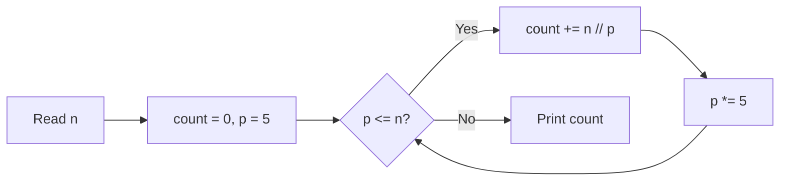

# 10. Trailing Zeros

## 1. Problem Description

Calculate the number of trailing zeros in `n!` (n factorial).

For example, `20! = 2432902008176640000`, which has `4` trailing zeros.

## 2. Expected Input

A single integer `n`.

## 3. Expected Output

The number of trailing zeros in `n!`.

## 4. Constraints

- `1 <= n <= 10^9`
- Time limit: 1.00 s
- Memory limit: 512 MB

## 5. Examples

| Input | Output |
|---|---|
| `20` | `4` |

## 6. Intuition

A trailing zero in `n!` corresponds to a factor of `10 = 2 * 5` in the prime factorization of `n!`. Since there are always more factors of `2` than `5` in `n!` (every second number contributes a `2`, every fifth number contributes a `5`), the number of trailing zeros is determined by the number of factors of `5`.

Count factors of `5` in `n!`: `floor(n/5) + floor(n/25) + floor(n/125) + ...` until the term becomes `0`.

## 7. Thought Process



## 8. Brute-Force Approach

Compute `n!` exactly, then count trailing zeros by repeatedly dividing by `10`. For `n = 10^9`, `n!` has ~`8.5 * 10^9` digits — completely infeasible.

## 9. Optimized Solution

```python
def solve(n: int) -> int:
    """Return the number of trailing zeros in n!."""
    count = 0
    p = 5
    while p <= n:
        count += n // p
        p *= 5
    return count


if __name__ == "__main__":
    n = int(input())
    print(solve(n))
```

## 10. Why the Optimized Solution Works

**Legendre's formula**: The exponent of prime `p` in `n!` is `sum_{k=1}^{infinity} floor(n / p^k)`.

**Why this works**: Among the integers `1, 2, ..., n`, exactly `floor(n/5)` are divisible by `5` (each contributes at least one factor of `5`). Among those, `floor(n/25)` are divisible by `25` (each contributes an *additional* factor of `5`). And so on. Summing these gives the total count of factors of `5` in `n!`.

**Why we count `5` and not `2`**: The exponent of `2` in `n!` is `floor(n/2) + floor(n/4) + ...`, which is always at least as large as the exponent of `5` (because `2 < 5`). Each trailing zero requires one `2` and one `5`, so the `5`s are the bottleneck.

**Example: `n = 20`**.
- `floor(20/5) = 4` (numbers `5, 10, 15, 20`).
- `floor(20/25) = 0`.
- Total: `4`. Correct.

**Example: `n = 100`**.
- `floor(100/5) = 20`.
- `floor(100/25) = 4`.
- `floor(100/125) = 0`.
- Total: `24`. (Indeed, `100!` has `24` trailing zeros.)

## 11. Algorithm Used

Legendre's formula for prime exponent in factorial.

## 12. Data Structures Used

- Scalar integers.

## 13. Time Complexity Analysis

**`O(log_5 n)`** — the loop runs once per power of `5` that is `<= n`. For `n = 10^9`, this is at most `log_5(10^9) ≈ 13` iterations.

## 14. Space Complexity Analysis

**`O(1)`**.

## 15. Step-by-Step Code Walkthrough

1. `count = 0; p = 5` — initialize counter and the first power of `5`.
2. While `p <= n`:
   - Add `n // p` to `count` (number of multiples of `p` in `[1, n]`).
   - Multiply `p` by `5` to get the next power.
3. Return `count`.

## 16. Dry Run with Example

Input: `n = 20`.

| Iteration | p | n // p | count |
|---|---|---|---|
| 1 | 5 | 4 | 4 |
| 2 | 25 | 0 | (loop exits because 25 > 20) |

Output: `4`. Correct.

## 17. Common Pitfalls

- **Overflow of `p`** in languages without big integers. For `n = 10^9`, `p` reaches `5^14 ≈ 6*10^9`, which fits in 64-bit but not 32-bit. Use 64-bit integers. Python is fine.
- **Infinite loop** if you forget `p *= 5`. The loop condition `p <= n` would never become false if `p` stays at `5`.
- **Counting factors of `2` instead of `5`.** The number of factors of `2` is always larger, so it doesn't determine the trailing zeros.

## 18. Edge Cases

| Case | Expected Behavior |
|---|---|
| `n = 1` | `0` (`1! = 1`, no trailing zeros) |
| `n = 5` | `1` (`5! = 120`) |
| `n = 10` | `2` (`10! = 3628800`) |
| `n = 10^9` | `~2.5*10^8` (sum of geometric series) |

## 19. Alternative Approaches

- **Recursive**: `def zeros(n): return 0 if n < 5 else n // 5 + zeros(n // 5)`. Same complexity, more elegant.
- **Compute `n!` exactly**: only works for tiny `n` (< 10000).

```python
def zeros_recursive(n: int) -> int:
    if n < 5:
        return 0
    return n // 5 + zeros_recursive(n // 5)
```

## 20. Related Problems

- [[9. Bit Strings]]
- [[4. Number Spiral]]
- [[20. Digit Queries]]

## 21. Key Takeaways

- **Trailing zeros in `n!`** = number of factors of `5` in `n!` = `sum floor(n / 5^k)`.
- **Legendre's formula** is the general tool for computing the exponent of any prime in `n!`.
- **Bottleneck reasoning**: when forming a composite like `10 = 2 * 5`, the rarer factor is the bottleneck. Always count the rarer prime.
- For `n` up to `10^9`, the algorithm runs in `O(log n)` — never compute the actual factorial.
