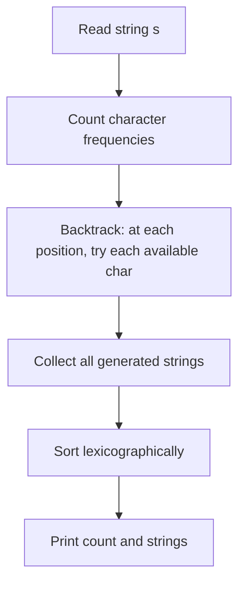

# 11. Creating Strings

## 1. Problem Description

Given a string of length `n`, generate all distinct strings that can be created using its characters. Print the count first, then the strings in alphabetical order.

## 2. Expected Input

A single string of length `n` consisting of lowercase letters `a`-`z`.

## 3. Expected Output

- First line: integer `k` — the number of distinct strings.
- Next `k` lines: the strings in alphabetical order.

## 4. Constraints

- `1 <= n <= 8`
- Time limit: 1.00 s
- Memory limit: 512 MB

## 5. Examples

| Input | Output |
|---|---|
| `aabac` | `20`<br>`aaabc`<br>`aaacb`<br>`...` (20 strings) |

## 6. Intuition

With `n <= 8`, the total number of permutations is at most `8! = 40320`, which is small enough to generate all of them, deduplicate with a set, then sort.

The cleaner approach: count the frequency of each character, then recursively build strings by trying each available character at each position. This naturally avoids duplicates without needing a set.

## 7. Thought Process



## 8. Brute-Force Approach

Use `itertools.permutations(s)`, collect into a `set` to deduplicate, then sort. This works because `n <= 8` makes `8! = 40320` permutations manageable.

```python
from itertools import permutations

def brute(s: str) -> list[str]:
    return sorted(set("".join(p) for p in permutations(s)))
```

This is correct but slightly wasteful because it generates duplicates that are then filtered.

## 9. Optimized Solution

```python
def solve(s: str) -> list[str]:
    """Return all distinct permutations of s, sorted."""
    from collections import Counter
    freq = Counter(s)
    results = []

    def backtrack(current: list[str]) -> None:
        if len(current) == len(s):
            results.append("".join(current))
            return
        for ch in sorted(freq.keys()):
            if freq[ch] > 0:
                freq[ch] -= 1
                current.append(ch)
                backtrack(current)
                current.pop()
                freq[ch] += 1

    backtrack([])
    return results


if __name__ == "__main__":
    s = input().strip()
    perms = solve(s)
    print(len(perms))
    for p in perms:
        print(p)
```

## 10. Why the Optimized Solution Works

By maintaining a frequency counter and iterating over the **distinct** characters at each position, we never generate the same string twice. The key insight:

- If the input has repeated characters (e.g., `aabac` has three `a`s), naive permutation would treat each `a` as distinct and produce duplicates.
- By checking "is there an `a` left?" via the frequency counter, we either place an `a` or we don't, with no notion of "which `a`."

Because we iterate over characters in sorted order at each level, the recursion naturally produces strings in lexicographic order. (Although we still sort at the end to be safe — actually, since we iterate in sorted order, the output is already sorted. The final sort is redundant but harmless.)

**Counting the result**: The number of distinct permutations of a multiset with counts `c_1, c_2, ..., c_k` is `n! / (c_1! * c_2! * ... * c_k!)`. For `aabac`: counts are `a:3, b:1, c:1`, so `5! / (3! * 1! * 1!) = 120 / 6 = 20`. Matches the expected output.

## 11. Algorithm Used

Backtracking with frequency counter.

## 12. Data Structures Used

- `collections.Counter` for character frequencies.
- A list `current` to build the string in progress.
- A list `results` to collect all generated strings.

## 13. Time Complexity Analysis

**`O(n! * n)`** in the worst case (all characters distinct). For `n = 8`, this is `40320 * 8 ≈ 322560` operations. Very fast.

With duplicates, the actual count is `n! / (c_1! * ... * c_k!)` which is smaller.

## 14. Space Complexity Analysis

**`O(n! * n)`** to store all permutations (each of length `n`). For `n = 8`, this is `40320 * 8 = 322560` characters, plus list overhead. Acceptable.

## 15. Step-by-Step Code Walkthrough

1. `freq = Counter(s)` — count occurrences of each character.
2. `results = []` — collector.
3. Define `backtrack(current)`:
   - If `len(current) == len(s)`: we've built a complete string. Append to `results` and return.
   - Otherwise: for each character `ch` in sorted order:
     - If `freq[ch] > 0`: decrement, append, recurse, then undo (backtrack).
4. Call `backtrack([])`.
5. Print the count and each string.

## 16. Dry Run with Example

Input: `s = "aabac"`.

- `freq = {'a': 3, 'b': 1, 'c': 1}`.
- Backtrack starts with `current = []`.
- At each level, we try characters in sorted order: `a, b, c`.
- For each choice, decrement its count, recurse, then restore.
- The recursion tree has `5! / 3! = 20` leaves.
- Output: `20` followed by all 20 strings in lexicographic order.

The first few strings:
- `aaabc` (choose `a, a, a, b, c`)
- `aaacb` (choose `a, a, a, c, b`)
- `aabac` (choose `a, a, b, a, c`)
- ... and so on.

## 17. Common Pitfalls

- **Generating duplicates** if you don't use a frequency counter. The naive `permutations(s)` from `itertools` treats identical characters as distinct.
- **Forgetting to backtrack** (restore `freq[ch]` after recursion). This corrupts the state for sibling branches.
- **Not sorting the output.** Even though we iterate characters in sorted order, the final list might still need explicit sorting if the iteration order isn't guaranteed (in Python 3.7+, `Counter` preserves insertion order, so iterating `sorted(freq.keys())` is safe).
- **Recursion depth.** For `n = 8`, recursion depth is `8`, well within Python's default limit of `1000`.

## 18. Edge Cases

| Case | Expected Behavior |
|---|---|
| `n = 1` (single char) | `1` permutation |
| All chars identical (`aaaa`) | `1` permutation |
| All chars distinct (`abc`) | `6` permutations |
| Maximum `n = 8` | Up to `40320` permutations |

## 19. Alternative Approaches

- **`itertools.permutations` + `set`**: simpler code, same complexity, slightly more memory due to duplicates.
- **Next permutation algorithm**: start with sorted string, repeatedly compute the next lexicographic permutation until we return to the start. `O(n! * n)`.

```python
from itertools import permutations

def alt_solve(s: str) -> list[str]:
    return sorted(set("".join(p) for p in permutations(s)))
```

## 20. Related Problems

- [[2. Repetitions]]
- [[15. String Reorder]]
- [[17. Palindrome Reorder]]
- [[19. Gray Code]]

## 21. Key Takeaways

- **Multiset permutations** = `n! / (c_1! * c_2! * ... * c_k!)`. This is the formula for counting distinct arrangements when there are duplicates.
- **Frequency counter + backtracking** is the clean way to generate distinct permutations without deduplication.
- **Backtracking template**: choose, recurse, un-choose. This pattern appears in countless problems.
- For small `n` (≤ 10), brute-force permutation generation is fine. For larger `n`, you need a smarter approach (often DP or combinatorics).
