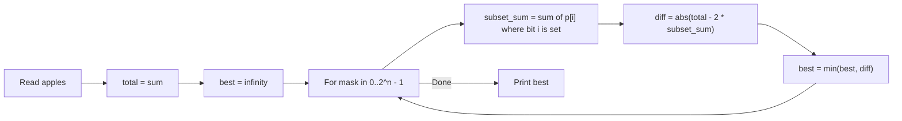

# 12. Apple Division

## 1. Problem Description

There are `n` apples with known weights. Divide the apples into two groups so that the difference between the total weights of the groups is minimized. Output that minimum difference.

## 2. Expected Input

- First line: integer `n`.
- Second line: `n` integers `p_1, p_2, ..., p_n` — the weights.

## 3. Expected Output

A single integer: the minimum possible difference between the sums of the two groups.

## 4. Constraints

- `1 <= n <= 20`
- `1 <= p_i <= 10^9`
- Time limit: 1.00 s
- Memory limit: 512 MB

## 5. Examples

| Input | Output | Explanation |
|---|---|---|
| `5`<br>`3 2 7 4 1` | `1` | Group 1: 2+3+4 = 9. Group 2: 1+7 = 8. Diff = 1. |

## 6. Intuition

With `n <= 20`, we can enumerate all `2^n` subsets. For each subset, compute its sum; the other group's sum is `total - subset_sum`. The difference is `|total - 2 * subset_sum|`. Track the minimum.

For `n = 20`, `2^20 = 1048576` subsets. Each subset's sum can be computed incrementally using bit tricks, so the total work is `O(2^n)`.

## 7. Thought Process



## 8. Brute-Force Approach

The bitmask enumeration **is** the brute force here, but it's optimal for `n <= 20`. For larger `n` we'd need meet-in-the-middle or DP (if weights were small).

## 9. Optimized Solution

```python
def solve(weights: list[int]) -> int:
    """Return minimum difference between two groups."""
    total = sum(weights)
    n = len(weights)
    best = float("inf")
    for mask in range(1 << n):
        subset_sum = 0
        for i in range(n):
            if mask & (1 << i):
                subset_sum += weights[i]
        diff = abs(total - 2 * subset_sum)
        best = min(best, diff)
    return best


if __name__ == "__main__":
    n = int(input())
    weights = list(map(int, input().split()))
    print(solve(weights))
```

## 10. Why the Optimized Solution Works

Every subset of apples corresponds to a bitmask from `0` to `2^n - 1`. Bit `i` of `mask` is `1` iff apple `i` is in group A. Group B is the complement.

- Group A sum: `subset_sum = sum(weights[i] for i in mask)`.
- Group B sum: `total - subset_sum`.
- Difference: `|total - 2 * subset_sum|`.

We try every mask and take the minimum difference. Since every partition (A, B) is considered (and the partition (B, A) is the same with a different mask, but it produces the same difference), we cover all possible partitions.

For `n = 20`, `2^20 = 1048576` iterations, each doing `O(n) = O(20)` work for summing, totaling `~2 * 10^7` operations. Acceptable in 1 second.

**Note**: We could optimize by computing `subset_sum` incrementally, but the constant-factor improvement isn't necessary for the given constraints.

## 11. Algorithm Used

Bitmask enumeration.

## 12. Data Structures Used

- The list `weights`.
- Scalar integers `total`, `best`, `subset_sum`.

## 13. Time Complexity Analysis

**`O(n * 2^n)`** — for each of `2^n` masks, we sum up to `n` weights.

For `n = 20`, this is `~2 * 10^7` operations, well within 1 second.

## 14. Space Complexity Analysis

**`O(1)`** extra space.

## 15. Step-by-Step Code Walkthrough

1. `total = sum(weights)` — total weight of all apples.
2. `best = float("inf")` — initialize best to infinity.
3. Loop `mask` from `0` to `2^n - 1`:
   - Compute `subset_sum` by iterating `i` from `0` to `n-1` and adding `weights[i]` if bit `i` is set in `mask`.
   - Compute `diff = abs(total - 2 * subset_sum)`.
   - Update `best = min(best, diff)`.
4. Return `best`.

## 16. Dry Run with Example

Input: `weights = [3, 2, 7, 4, 1]`, `total = 17`.

We try all `2^5 = 32` masks. A few interesting ones:

| mask (binary) | subset_sum | diff = |17 - 2*subset_sum| |
|---|---|---|
| `00000` | 0 | 17 |
| `11111` | 17 | 17 |
| `01001` (apples 0, 3) | 3 + 4 = 7 | 3 |
| `01011` (apples 0, 1, 3) | 3 + 2 + 4 = 9 | 1 |
| `00111` (apples 0, 1, 2) | 3 + 2 + 7 = 12 | 7 |

The minimum over all masks is `1`, achieved by the subset `{3, 2, 4}` (sum 9) and its complement `{7, 1}` (sum 8). Correct.

## 17. Common Pitfalls

- **Overflow in other languages.** `total` can be up to `20 * 10^9 = 2*10^10`, which overflows 32-bit `int`. Use 64-bit. Python handles this automatically.
- **Using `abs(total - subset_sum)`** instead of `abs(total - 2 * subset_sum)`. The difference between groups A and B is `|A - B| = |subset_sum - (total - subset_sum)| = |2*subset_sum - total|`.
- **Forgetting to start `mask` at 0** (the empty subset). The empty subset corresponds to "all apples in group B", which is a valid partition.
- **Off-by-one in the range**: `range(1 << n)` produces `0, 1, ..., 2^n - 1`, which is correct.

## 18. Edge Cases

| Case | Expected Behavior |
|---|---|
| `n = 1` (one apple) | The single apple's weight (one group is empty) |
| All weights equal | `0` if `n` is even, else one apple's weight |
| One very large weight | The large weight minus sum of the rest |
| Maximum `n = 20` | ~10^6 masks, each doing 20 ops — fast |

## 19. Alternative Approaches

- **Meet in the middle**: Split apples into two halves of size `n/2`. Enumerate all subset sums of each half (`2^(n/2)` each). For each sum `s` in the first half, binary search for the sum in the second half that brings the total closest to `total/2`. This is `O(2^(n/2) * n)` — useful for `n` up to 40.
- **DP (subset sum)**: If weights were small (say, up to `10^5`), we could use a boolean DP array to find all achievable sums. Then pick the achievable sum closest to `total/2`. Infeasible here because weights can be up to `10^9`.

## 20. Related Problems

- [[7. Two Sets]]
- [[60. Two Sets II]]
- [[74. Money Sums]]

## 21. Key Takeaways

- **Bitmask enumeration** is the standard approach for `n <= 20`. The pattern `for mask in range(1 << n)` is idiomatic.
- **`abs(total - 2 * subset_sum)`** is the formula for the difference between two groups with combined sum `total` and one group's sum `subset_sum`.
- **Meet in the middle** doubles the feasible `n` from 20 to 40. Worth knowing for harder problems.
- For partition problems with small `n`, always try bitmask first.
